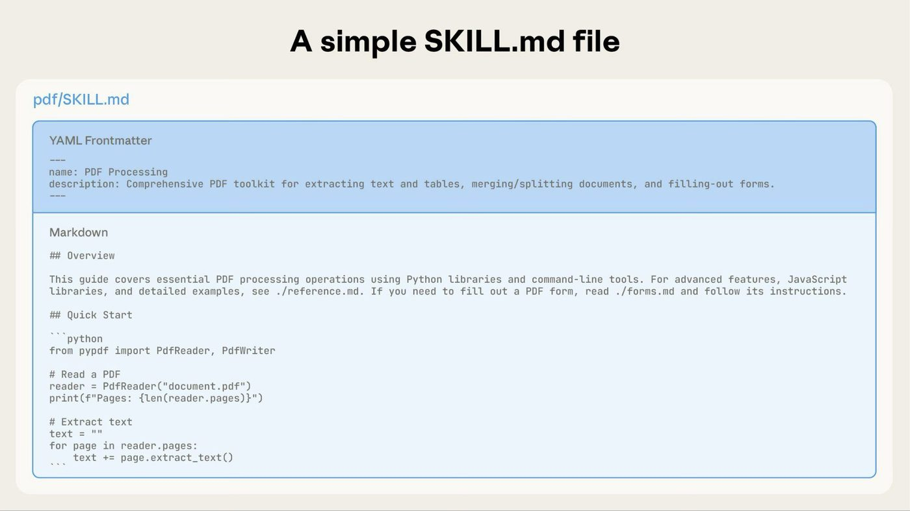
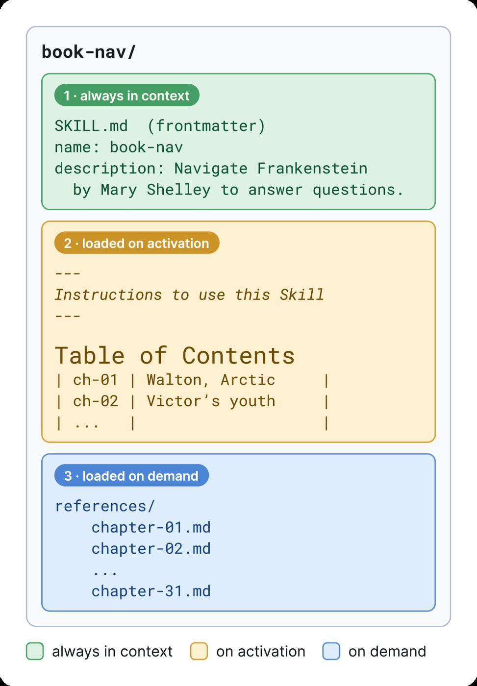
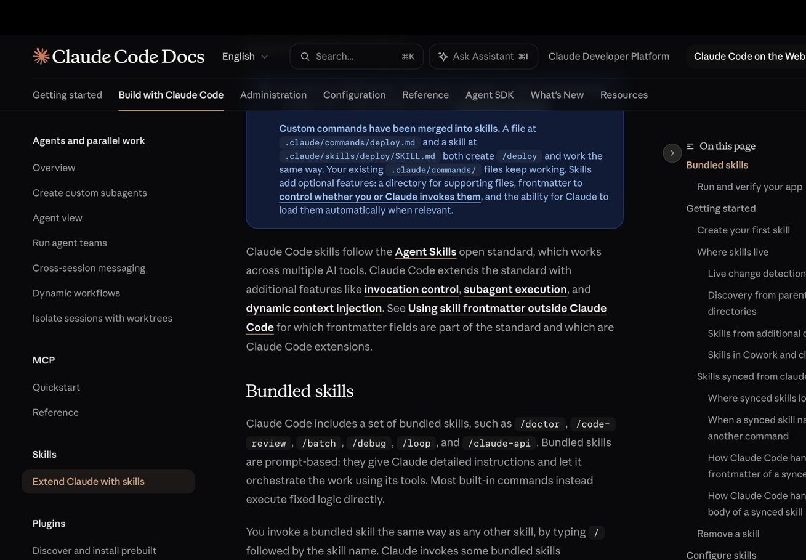

# Chapter 1 - How a Single Folder Gets Smart

> Mechanism first. Every question in this chapter answers "how does this actually work" — get these straight, and installing, writing, and reviewing skills later won't be reciting incantations.

## 001. Why does invoking a skill actually execute nothing?

When a skill triggers, the tool result is exactly one line: `Launching skill: <skill-name>`. The real skill content is expanded locally by the client, argument-substituted, and injected into the conversation as a user message flagged as internal — argument substitution, `${CLAUDE_SKILL_DIR}` path injection, and inline command execution all happen before the model ever sees anything. So a skill is not a program that runs; it is a preprocessed prompt template + optional host-side scripts. One exception does walk the full execution path: a skill with `context: fork` dispatches an independent subagent (runAgent, its own agentId) to do the work. This is also why skills can be portable across hosts — the lightweight part, "putting material into context," is universal, while everything that depends on the runtime (fork, inline Shell) remains each vendor's private extension.

1) Claude Code reverse-engineered source analysis https://github.com/liuup/claude-code-analysis

2) Claude Code official Skills documentation https://code.claude.com/docs/en/skills

## 002. What does Claude actually rely on to decide which skill to use?

The model reads descriptions and makes a semantic judgment. Nearly all implementations rely on the model's own judgment, not host-side trigger matching or keyword routing — "Most implementations rely on the model's own judgment…rather than implementing harness-side trigger matching". The flow: at startup, every skill's name and description enter the system prompt; when a task arrives, the model scans the candidates and calls the Skill tool on a hit. This design choice explains three things: description writing is the core of skill engineering, because it is the only trigger channel; triggering is always probabilistic, because the judge is a model, not a program; descriptions perform differently across languages, because semantic matching depends on the training distribution. Counterexamples exist: Codex stacks retrieval-style selection (rank fusion, task-context matching) on top of model judgment, and Gemini adds an activation confirmation gate to some modes — a host may add its own layer above "model judgment," but the foundation is still the model.

1) Adding skills support to a host https://agentskills.io/client-implementation/adding-skills-support

2) OpenAI Codex Skills documentation https://developers.openai.com/codex/skills

## 003. Why does a one-step task not trigger a skill even when it matches?

Triggering has a hidden precondition: the model must first decide "I can't do this on my own — I need the manual." "A simple, one-step request like 'read this PDF' may not trigger a PDF skill even if the description matches perfectly" — a one-step request like "read this PDF" may not fire even with a perfect description match, because the model believes it can just do it directly. Corollary: aim skills at tasks where the model on its own would crash or struggle, not at work it already knows how to do. On skills launch day, 2025-10-16, a good chunk of the first wave of "installed it, nothing happens" complaints on the 816-point HN thread traces back to this — the skills weren't broken; the tasks never crossed the "needs a manual" difficulty line. To trigger reliably, test with real task sentences run three times, not by chanting the skill name.

1) Optimizing trigger descriptions https://agentskills.io/skill-creation/optimizing-descriptions

2) Claude Skills launch-day HN discussion https://news.ycombinator.com/item?id=45607117

## 004. Why does startup load only the catalog, and the full text only when a skill is used?

Three layers of progressive disclosure, each with its own load moment and size: layer one, at startup every skill's name and description enters the system prompt, about 100 tokens each; layer two, once a task hits, the SKILL.md body is read in — the spec recommends keeping it under 500 lines and 5000 tokens; layer three, reference files and scripts cited by the body are read and executed on demand. For an agent with a filesystem and code execution, the context a skill can carry is "effectively unbounded" — no practical ceiling, because large files never have to enter context in full. The official PDF skill example is the standard specimen of this mechanism: SKILL.md references forms.md holding the form-filling instructions and ships a prewritten Python extraction script — run the script instead of loading the PDF, and deterministic code guarantees one result across a hundred runs. Catalog resident, body on demand, appendix lazy-loaded — the foundation of skill economics is these three lines.



1) Equipping agents for the real world with Agent Skills https://www.anthropic.com/engineering/equipping-agents-for-the-real-world-with-agent-skills

2) Agent Skills specification https://agentskills.io/specification

## 005. Where exactly in the system prompt do descriptions get injected?

Not spliced into the system prompt string — injected as a separate message instead. Claude Code wraps the skill listing in a system-reminder-type message sent along with the conversation; after a skill is invoked, the body is likewise injected as an internal-flagged message, and the tool result keeps only a one-line launch confirmation. The listing's character budget is governed by a group of constants — `SKILL_BUDGET_CONTEXT_PERCENT = 0.01` (1% of the window), `CHARS_PER_TOKEN = 4`, `DEFAULT_CHAR_BUDGET = 8_000` (the default for a 200,000-token window) — and the environment variable `SLASH_COMMAND_TOOL_CHAR_BUDGET` can hard-override it. Two consequences of the placement: the skill listing and the skill body are separable segments in context and can be handled separately during compaction; the listing rarely changes, so the front prompt-cache segment stays unpolluted. Compare Codex: its initial listing also lists each skill's file path, so its budget is 2% of the window (8000 characters when the window size is unknown) — the same job, yet the two vendors' listing shape and budget differ by a factor of two.

1) Claude Code reverse-engineered source analysis https://github.com/liuup/claude-code-analysis

2) OpenAI Codex Skills documentation https://developers.openai.com/codex/skills

## 006. Why can you install a hundred skills without blowing up the context, and where does the cost go?

Only the catalog stays resident. Do the math against the spec's limits: a description is at most 1024 characters, a name at most 64; Claude Code's listing budget is 1% of the window — about 8000 characters on a 200,000-token window — which fits a hundred descriptions with room to spare. But the budget mechanism is itself a list of costs: when you overshoot, the downgrade ladder kicks in — first it compresses every description evenly; if it is still over at the floor (20 characters), non-builtin skills get their entire description cut, leaving only the name. A name answers "what is it" but not "when to use me" — a cut skill is effectively nonexistent to the model. The second cost is selection noise: more candidates means similar descriptions competing for the same trigger, and the mismatch rate climbs. So between "it fits" and "it works well" sits a management problem — in community experience, triggers start interfering with each other around twenty to thirty skills, which is exactly the signal of this noise crossing the line.

1) Agent Skills specification https://agentskills.io/specification

2) Claude Code reverse-engineered source analysis https://github.com/liuup/claude-code-analysis

## 007. Why do some skills lose their memory the moment a long conversation gets compacted, and how do you save them?

Compaction discards detail, and skills live on detail. Claude Code's compensation mechanism: after compaction it backfills skill content under a budget of "5000 tokens per skill, 25000 tokens globally," backfilling from the most recently invoked skill backward ("starting from the most recently invoked skill"). Two direct corollaries: the earlier a skill was used, the more likely it is lost entirely; skills with oversized bodies come back as truncated versions. The spec recommends that hosts exempt skill content from pruning during compaction (exempt skill content from pruning), but the exemption has no cap, so in long sessions with many skills they still crowd each other out. User-side fixes: split long tasks into phases and explicitly re-invoke the needed skill at the start of each phase; put critical procedures into scripts (script output survives compaction more consistently than prose); drop a one-line result summary at milestones to leave signposts for the post-compaction model.

1) Claude Code official Skills documentation https://code.claude.com/docs/en/skills

2) Adding skills support to a host https://agentskills.io/client-implementation/adding-skills-support

## 008. How does the skill loader in the source code manage dozens of skills?

The full pipeline in loadSkillsDir.ts: the entry function `getSkillDirCommands(cwd)` scans five sources in parallel — the enterprise managed directory (managed), the user directory (~/.claude/skills), the project directory (.claude/skills), additional directories (--add-dir), and the legacy commands directory (commands_DEPRECATED). After each skill is parsed into a unified object, `deduplicateByRealpath` dedupes by real path — the source comments deliberately note realpath over inode, because inodes are unreliable on NFS/containers/ExFAT (issue #13893). Same-name conflicts resolve first-come-first-served by source priority, and managed wins. One mechanism the docs never mention: "conditional skills" carrying a paths field don't enter the regular listing — they go into the `conditionalSkills` map and only dynamically activate when a file path the model touches matches a pattern. A change detector (chokidar, degrading to 2-second polling under Bun) watches the directories and hot-reloads within a few hundred milliseconds of a file change.

1) Claude Code reverse-engineered source analysis https://github.com/liuup/claude-code-analysis

2) Claude Code official Skills documentation https://code.claude.com/docs/en/skills

## 009. Why do builtin skill descriptions never get truncated while yours gets cut to one line?

The downgrade ladder in the source has three steps: step one, full display within the total budget (1% of the window, 8000 characters by default); step two, once over budget, compress every description evenly by "(remaining budget − name overhead) / count," with the per-entry cap `MAX_LISTING_DESC_CHARS` widened from 250 characters (v2.1.86) to 1,536 (v2.1.105); step three, if it still doesn't fit compressed to `MIN_DESC_LENGTH = 20` characters, non-builtin skills degrade to names-only — the entire description cut, only the name left. Builtin (bundled) skills are exempt from truncation throughout; the source comments explain: the listing serves only "discovery," and verbose descriptions waste first-round cache_creation tokens without improving match rates. Measurement uses `stringWidth`, counting CJK characters at double width. What this means for you as a skill author: the first one or two sentences must state "when to use me" clearly, because you can't count on always being shown in the untruncated tier.

1) Claude Code reverse-engineered source analysis https://github.com/liuup/claude-code-analysis

2) Claude Code changelog https://github.com/anthropics/claude-code/blob/main/CHANGELOG.md

## 010. Why does progressive disclosure buy you context instead of intelligence?

In July 2026 the paper "Is Progressive Disclosure All You Need for Long-Context Agents?" ran the first controlled experiment: on InfiniteBench it compared raw document navigation, several skill-package designs, and a classic hybrid retriever, covering 3 agent frameworks × 3 model families. Three findings: in single-document settings, the gain is inversely proportional to the host's retrieval ability — when the host can do chunked retrieval itself, the gain is near zero; at multi-document scale, raw navigation collapses, while one layer of progressive disclosure degrades more slowly and overtakes; two-layer deeper routing "never helps and sometimes breaks accuracy outright" — it never helps, sometimes tanks accuracy directly, and one layer is enough.

> Progressive disclosure buys context, not intelligence.

The right expectation, then: skills let the agent see the right material at the right moment — they don't make the model smarter; the stronger the host's retrieval, the lower a skill's marginal value.



1) Is Progressive Disclosure All You Need for Long-Context Agents? https://arxiv.org/abs/2607.17598

2) Agent Skills specification https://agentskills.io/specification

## 011. How do you use the official script to measure your skill's trigger rate?

The official method has four steps (full script at agentskills.io/skill-creation/optimizing-descriptions): step one, build a test set of about 20 cases — 8–10 that should trigger and 8–10 that should not; the most valuable negatives are borderline sentences that "share keywords but want something different." Step two, run each case 3 times, because triggering is probabilistic and a single pass or fail means nothing. Step three, detect whether the Skill tool was invoked — the core check is one line:

```bash
claude -p "Turn this financial report into a table" --output-format json | grep -q '"name": "Skill"' && echo TRIGGERED
```

Step four, compute the trigger rate; the threshold is 0.5. Rules to keep the process from drifting: hold out 40% of cases as a validation set; only rewrite based on training-set failures; never copy keywords from failed queries into the description — that's overfitting. Pick the best version by validation-set pass rate, which isn't necessarily the last version. Iteration usually tops out at 5 rounds; if more does nothing, switch to a structurally different way of writing.

1) Optimizing trigger descriptions (with script) https://agentskills.io/skill-creation/optimizing-descriptions

## 012. How do you find out how much context each skill actually eats?

Two routes and one knob. Totals: Claude Code's built-in `/context` breaks the effective system prompt into named entries and counts tokens segment by segment — you can see directly which chunk the skill listing occupies. Details: the prompt-dump feature writes each turn's actual request to JSONL (`~/.claude/dump-prompts/<session-id>.jsonl`); dig through the raw records to see where skill descriptions appear and how many characters they take. The knob: the environment variable `SLASH_COMMAND_TOOL_CHAR_BUDGET` hard-overrides the listing budget — set it to 2000, open a new session, and you'll immediately see with your own eyes what descriptions look like as they get truncated level by level. For an intuitive grasp of the downgrade ladder in question 009, this is the fastest experiment. The typical conclusion after checking: the skill listing is roughly 1% of the window, the bulk sits in conversation history and tool output — don't spend all your optimization effort on skills.

1) Claude Code official Skills documentation https://code.claude.com/docs/en/skills

2) Claude Code reverse-engineered source analysis https://github.com/liuup/claude-code-analysis

## 013. How do you make a skill auto-activate only when it touches specific files?

Write a conditional skill using the paths field in the frontmatter. Full example:

```yaml
---
name: pipeline-handbook
description: Operations handbook for CI pipeline config failures, with retry and rollback steps. Use when reading or writing pipeline files under .github/workflows.
paths:
  - .github/workflows/**
  - deploy/**
  - Jenkinsfile
---
```

Skills with paths don't enter the regular skill listing (they consume no listing budget); the loader hangs them on a conditional map, and they dynamically activate and inject when a file path the model reads or writes matches a pattern. Three source-level rules: matching semantics follow gitignore (the `ignore` library underneath), so `!` negation and nested rules all work; the `/**` suffix in a declaration gets stripped during processing — writing a bare `**` makes it unconditional; only relative paths inside the working directory are matched, and `../` paths escaping the root are skipped outright. The right use case is "operating procedures tightly bound to specific files" — pipeline handbooks, report-processing steps. Don't force it onto pure knowledge content; let the description do the triggering, plain and simple.

1) Claude Code reverse-engineered source analysis https://github.com/liuup/claude-code-analysis

2) Agent Skills specification https://agentskills.io/specification

## 014. How do you confirm a skill edit has actually hot-reloaded?

Know the timing first, then verify. Timing parameters: file stability threshold 1000ms, polling interval 500ms, reload debounce 300ms; under the Bun runtime, event listening has a deadlock issue (bun#27469), so it degrades to 2-second interval polling — worst-case perceived latency is about 3.3 seconds, so wait a breath after editing before you test. One hidden interception point: if the session has a ConfigChange-type hook that returns a block, the reload is abandoned entirely — on enterprise-managed machines, check hooks first when "edits don't take effect." Verify in two steps: use a listing command like `/skills` to confirm the new description is attached; run a task sentence that should trigger and watch the behavior. Hot reload only re-announces what changed (changelog v2.1.174: "only changed skills are now re-announced"); it never resends the full listing — cache-friendly.

1) Claude Code reverse-engineered source analysis https://github.com/liuup/claude-code-analysis

2) Claude Code changelog https://github.com/anthropics/claude-code/blob/main/CHANGELOG.md

## 015. How do you tell at a glance whether a skill is installed in the right place?

Match it against three directory tiers and one priority chain. Personal `~/.claude/skills/` works across all your projects; project-level `.claude/skills/` goes into the repo and ships with the code; the cross-host common directory `.agents/skills/` is read by more than seventy hosts. Same-name resolution: enterprise managed > user > project, first match wins; a skill can override a same-named builtin skill but not its aliases; plugin skills live in the `plugin-name:skill-name` namespace and never collide by construction; nested-directory skills coexist under qualified names (e.g., `apps/web:deploy`), with an additional variants listing for unqualified invocations. One command to verify after installing: confirm the skill appears in the listing command and its source tier is what you expected. Two high-frequency misinstalls: a team skill that belongs in the project repo installed only in your home directory (teammates pull the repo and don't have it); a private script mistakenly placed in the project directory (discovered only at commit time).



1) Claude Code official Skills documentation https://code.claude.com/docs/en/skills

2) Vercel skills CLI https://github.com/vercel-labs/skills

## 016. If skills are just repackaged prompts, what's actually new about them?

The "repackaged" verdict has a factual basis: a top comment on launch-day HN read, "skills are just markdown + scripts unzipped into context at the right moment." But judging by mechanism alone misses three new things. First, an open standard: on 2025-12-18 the spec went independent at agentskills.io; frontmatter and directory structure are unified across hosts, and the official clients list names about 44 supporting products (as of mid-2026). Second, a distribution layer: marketplaces, installers (npx skills), and install-count leaderboards have grown into a complete chain. Third, methodology: the official docs ship two executable workflows — trigger evaluation (20 cases × 3 runs) and effect evaluation (with/without baselines) — upgrading "writing prompts" into "testing prompts." The analogy isn't rigorous but it works: HTML didn't add anything essential over plain text either; the spec plus the ecosystem is the value itself. The opposition's reservation stands too — if a host builds in equivalent knowledge management, this layer gets absorbed (question 092 does that math).

1) Claude Skills launch-day HN discussion https://news.ycombinator.com/item?id=45607117

2) Agent Skills client support list https://agentskills.io/clients

## 017. Why did people once say skills would matter more than MCP, and does that still hold?

That line was said on 2025-10-17; today it needs to be settled account by account. The core evidence back then was MCP's context cost: an instance cited in the HN discussion — the Supabase MCP eats about 8K tokens on tool descriptions alone, and a single call can return over 30K; skills' catalog-style loading sidesteps that class of cost by design. A year on, the settled position is division of labor: skills handle "how to do it" (procedural knowledge); MCP handles "whether you can connect at all" (live access, auth, auditable execution). One developer put it precisely: MCP's ideal form is an auth gateway — which is exactly skills' blind spot. The radicals persist (MCPJam: progressive disclosure may replace part of MCP tool discovery); the pragmatists have shipped hybrids (Strata: MCP for delivery, progressive disclosure for tool discovery). Verdict: "more important" is outdated; "another piece of the puzzle" keeps getting sturdier. What skills actually changed is MCP's role — demoted from do-everything protocol back to the connection layer.

1) Claude Skills are awesome, maybe a bigger deal than MCP (HN) https://news.ycombinator.com/item?id=45619537

2) Simon Willison's skills article index https://simonwillison.net/tags/skills/

3) Skills vs MCP, a false dichotomy https://speakeasy.com/blog/skills-vs-mcp

## 018. How does a single-skill repo pull in sixty thousand stars?

It hit the hardest demand there is: getting a ready-made capability. Measured against the GitHub API on 2026-08-31: the official skills repo anthropics/skills at 172,648★ (created 2025-09-22); the methodology framework superpowers at 279,680★; engineer mattpocock's personal collection mattpocock/skills at 241,871★; and last30days-skill, a single-skill repo that does exactly one thing — research the last 30 days of web-wide buzz on any topic — at 60,504★. What sixty thousand stars for a single skill means: users want outcomes, not frameworks — install it and the agent can do one thing it couldn't do before. The template it hands skill authors: one high-frequency pain point, one description that spells out "when to use," one script that runs out of the box, one example that proves its own effect. Set against superpowers' 270,000-star full methodology, you can read out another side: both ends of the skill ecosystem's consumption hold — those who want results install a single point, those who want a system install a framework.


1) last30days-skill https://github.com/mvanhorn/last30days-skill

2) anthropics/skills https://github.com/anthropics/skills

3) obra/superpowers https://github.com/obra/superpowers
