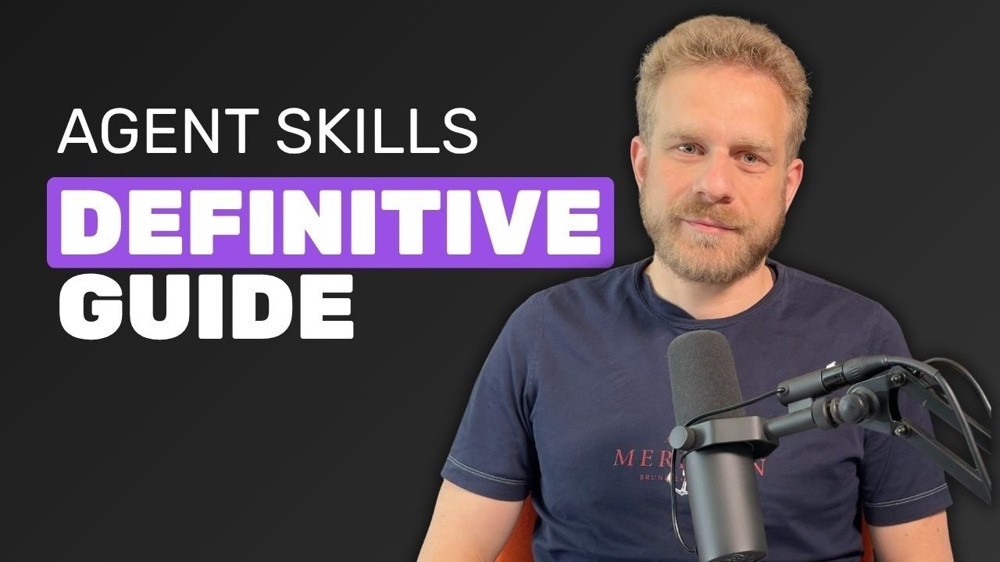

# Chapter 2 - Why Installed Skills Don't Work

> This chapter is all troubleshooting moves. Skills that won't trigger, skills fighting each other, installs that get slower the more you add, silent failures — every pit here has a matching check and a fix.

## 019. Why won't my skill trigger, and what do I check first?

Nine out of ten "won't trigger" failures die because the description never says "when to use me". The check order is a fixed three steps. Step one, check loading: run a list command like `/skills` and confirm the skill appears — malformed frontmatter or a missing description makes the host skip loading silently. Step two, check the description against three criteria: is there one "use when the user asks for X" trigger sentence; is it task intent or a feature ad (the official bad example: "generates reports" is written for humans, while "use when the user asks for a compliance report or a monthly filing" is written for the model); is it in third person (descriptions go into the system prompt, and the official warning says first-person "I can help you with" creates a discoverability problem). Step three, check matching: run a real task sentence 3 times instead of shouting the skill's name. Within the 1024-character description cap, the trigger sentence outranks every feature pitch.

1) Optimizing trigger descriptions https://agentskills.io/skill-creation/optimizing-descriptions

2) Official Claude Code Skills documentation https://code.claude.com/docs/en/skills

## 020. How do you debug two skills fighting over the same trigger?

Minimal reproduction plus a three-layer fix. Reproduce: send one task sentence, then ask the model directly "which skills are relevant, and why did you pick this one". The answer lists its candidates and trade-offs, and the point of hesitation becomes visible at once. The root cause is almost always overlapping intent domains in the descriptions. Fixes, from least to most invasive: one, draw intent boundaries — narrow each description to a mutually exclusive task domain and add one negative sentence to each ("use only when...; do not use when it merely discusses X without asking you to generate anything"); two, merge and branch — combine them into two flow branches inside one skill, so the model follows steps instead of picking one of two; three, go manual — a slash command invokes it explicitly, taking the choice back from the model. Past ten skills, add a routing front stage: pass a lightweight dispatcher skill first that hands out the work (the community calls it the dispatcher pattern). The cost is one extra hop; the gain is that conflicts get resolved in one place.

1) Official Claude Code Skills documentation https://code.claude.com/docs/en/skills

2) Agent Skills best practices for skill creators https://agentskills.io/skill-creation/best-practices

## 021. How many skills is too many, and how do you cut them down?

Two signals, and neither is an absolute count. Signal one: budget headroom. Claude Code's list budget is 1% of the context window (8000 characters by default). Use `/context` to see how much the skill section takes; getting close to the budget is your warning — past it, descriptions start getting truncated level by level and trigger quality falls with them. Signal two: interference symptoms. Similar descriptions steal triggers from each other and the skills you expect don't show up; community experience puts this past the twenty-to-thirty skill mark. How to cut, by priority: delete expired skills first (ones not re-tested after a host upgrade), then merge same-domain skills (three "write docs" skills become one); high-frequency skills stay global, low-frequency ones move into the project directory. A platform-side reference point: one product shipping 90+ built-in skills dropped the list's standing overhead from about 11,000 tokens to 2,300 after introducing retrieval-based on-demand matching. Individual players can't build platform-grade retrieval, but the three moves "cut, merge, move to project level" usually remove half the load.



1) Official Claude Code Skills documentation https://code.claude.com/docs/en/skills

2) Hermes Agent Skills That Make It 10x More Powerful https://www.youtube.com/watch?v=WJgxX0Eib6k

## 022. Why does a matching skill get ignored, and how do you force it to fire?

Model judgment is probabilistic behavior. You can push it on four levels, soft to hard. Level one: add thrust to the description. The official advice is to write descriptions "a bit more salesy than feels comfortable", with an explicit template — "use even when the user does not explicitly mention CSV export, whenever report cleanup is involved". Level two: anchor intent in the task sentence — open it with words strongly bound to the description. Level three: hybrid mode — auto-trigger normally, and name the skill explicitly in the task sentence on critical paths. Level four: turn off auto-triggering, add one line `disable-model-invocation: true` to the frontmatter, and keep only manual slash-command invocation — triggering stops being a bet on the model and becomes your call; the cost is that you have to remember it. Baseline for reference: a community test report across 650 trials found roughly half the scenarios failed to activate the relevant skill (community-report methodology, not a precise figure). Precisely because it's only probability, the higher the stakes of a skill, the further toward level four you should take it.

1) Optimizing trigger descriptions https://agentskills.io/skill-creation/optimizing-descriptions

2) Cross-host extensibility research notes (community report) https://gist.github.com/1qh/4ff117a7f940ec78237794a1e8cb81b3

## 023. How do you write a negative trigger note that doesn't over-exclude?

Write one short negative sentence at the end of the description, excluding one adjacent scenario at a time. A before-and-after contrast —

The over-triggering version:

```yaml
description: Help the user clean up financial data and generate compliance reports.
```

The version with a boundary added:

```yaml
description: Generate monthly compliance reports from the company template, with row-total validation and anomaly flags. Use when the user asks for a monthly report or compliance filing, or provides raw transaction data to turn into a report. Do not use when financials are only being discussed and no report was requested.
```

Three rules of thumb: put the negative sentence at the end so it doesn't wash out the trigger intent at the start; pick as the exclusion target "the adjacent scenario most likely to get caught by mistake", and skip the long disclaimer; after editing, rerun the positive and negative cases of your trigger eval to confirm the exclusion fixes the false positive without killing true positives. The "near-miss negative examples" set in the official trigger guide (sentences that share keywords but differ in need) is a ready-made regression suite.

1) Optimizing trigger descriptions https://agentskills.io/skill-creation/optimizing-descriptions

2) 官方构建指南中文解读（掘金） — Chinese-language walkthrough of the official skill authoring guide, on Juejin https://juejin.cn/post/7619250910054219802

## 024. Which same-named skill actually takes effect, and what is the precedence order?

The precedence chain has four layers, largest to smallest: enterprise managed directory > user home directory (~/.claude/skills) > project directory (.claude/skills) > built-in skills (which can be shadowed by same-named skills, aliases excepted). Two special cases stay out of conflicts: plugin skills live in the `plugin-name:skill-name` namespace; nested-directory skills coexist under qualified names (`apps/web:deploy`), and an unqualified call gets a variant list attached. How to check: run the list command and look at the source label on same-named entries — the effective one is the copy with the highest precedence. The most frequent accident: a colleague put the skill into the project repo, and your local home directory holds an older same-named copy — you think you're debugging the project version while the personal one is actually in effect, so nothing you change works. Check the source first, then touch anything.

1) Official Claude Code Skills documentation https://code.claude.com/docs/en/skills

## 025. Why do skills with Chinese descriptions fail to trigger more often?

It's a character-width arithmetic problem, not a semantics problem. The source code measures description width with the terminal-width function `stringWidth`: CJK characters are billed at double width, so the same 250-character display budget gives a Chinese description roughly half the effective capacity of English. Two direct consequences: a Chinese description hits the per-item truncation line sooner, and what gets cut off is exactly the "when to use" tail; and when the skill library skews heavily Chinese overall, the list's total budget fills up faster too. Two countermeasures: write Chinese descriptions shorter and sharper, with the trigger sentence first (truncation happens from the tail); and give critical skills bilingual Chinese-English descriptions — the English part matches semantics closer to the training distribution, and the same information takes less display width. How to verify: shrink the list budget (environment variable SLASH_COMMAND_TOOL_CHAR_BUDGET) and watch the Chinese description get truncated before the English one.

1) Claude Code 逆向源码分析 — Chinese-language reverse-engineering analysis of the Claude Code source https://github.com/liuup/claude-code-analysis

## 026. Is the unresponsive skill broken or just misused? How do you tell?

Three-way attribution, each with its confirmation sign and fix entry:

| Attribution | Confirmation sign | Root cause | Fix entry point |
|---|---|---|---|
| The skill is broken | It doesn't show up in the list at all | Wrong frontmatter type, missing description, referenced files that don't exist — most fail silently (a failed hook validation only writes a debug log; a missing description falls back to extracting the first line of the body) | Fix format and paths |
| Trigger failure | The skill is listed but the model never calls it | The description has no trigger sentence, or the task wording doesn't match | Fix the description; run 3 trigger evals to localize |
| Misuse | It triggers normally but the output misses expectations | Vague steps, no "don't do this", instructions where a script was called for | Fix the body and the pitfalls section |

Walk it in order and within two minutes you know which layer to fix.

1) Agent Skills specification https://agentskills.io/specification

2) Claude Code 逆向源码分析 — Chinese-language reverse-engineering analysis of the Claude Code source https://github.com/liuup/claude-code-analysis

## 027. Why do skills get amnesia after long conversations, and how do you recover them?

Compaction backfill keeps only the recent. The mechanism's parameters (official docs): after compaction, skill content is backfilled within a per-skill budget of 5000 tokens and a global budget of 25000 tokens, in order from the most recent call backwards — the earliest skills are dropped whole. Fixes by scenario: interactive settings — just re-trigger the skill you need once and the backfill restores it immediately; long-task design — split the task into stages and invoke the needed skill explicitly at the start of each stage, instead of relying on a load from dozens of turns ago; process consistency — write the critical steps as a script, because script calls and outputs survive compaction summaries with higher fidelity than body prose. One hidden trap: backfill caps each skill at 5000 tokens, so if your body is overlong, what comes back is the truncated version — long skills are born incomplete in long sessions. Keeping the body within 500 lines isn't just budget thrift; it also ensures the skill can come back whole after compaction.

1) Official Claude Code Skills documentation https://code.claude.com/docs/en/skills

## 028. How do you completely remove a skill you no longer need?

Check three sources, then run two verifications. Source one, file directories: go through `~/.claude/skills/`, `.claude/skills/`, and the cross-host `.agents/skills/` one by one; for symlink-installed skills delete the link, not the target (read `ls -l` carefully before deleting). Source two, plugins: a skill may have arrived with a plugin — uninstall the plugin rather than deleting files. Source three, sync channels: skills synced down from claude.ai use managed distribution; a local delete gets synced back, so turn it off in the web management page. Two verifications after deleting: the list command finds nothing; and a fresh session running a sentence that should have triggered it confirms the model no longer mentions it. The half-deleted state (directory already gone, the current session's list still shows it) clears the moment you reopen a session.

1) Official Claude Code Skills documentation https://code.claude.com/docs/en/skills

2) Vercel skills CLI https://github.com/vercel-labs/skills

## 029. Why is trigger failure an inherent cost of the architecture, not a bug?

It's the trade-off between two technical routes. Route A: deterministic matching on the host side — keywords, rule-based routing; triggering is 100% certain, but it can't handle natural-language variety. "Help me tidy up this pile of transactions" and "generate the monthly report" are two phrasings of one intent, and no rule set covers them all. Route B: the model reads descriptions and decides on its own — strong semantic generalization, one skill catches ten phrasings, and the cost is probability. Host-side guides reach the same conclusion: the overwhelming majority of implementations bet on B. This isn't lazy engineering; route A is simply unmaintainable at large skill-library scale — each skill's trigger rules would have to enumerate every phrasing, and rules would need deduplication across skills. The right engineering response is not "eliminate trigger failure" but to layer determinism by risk: exploratory tasks accept probabilistic triggering; production critical paths use manual invocation or scripts to take the "bet" out of the flow.

1) Adding Skills support to a client (host implementation guide) https://agentskills.io/client-implementation/adding-skills-support

## 030. When a description is truncated to a bare name, what exactly can't the model see?

It can't see "when to use it". The degradation ladder has three rungs: within the total budget (1% of the window) everything shows in full; past it, descriptions are compressed evenly per item down to the floor MIN_DESC_LENGTH = 20 characters; still over, and non-built-in skills lose the whole description — only the name hangs on the list. The name answers "what is it"; the description answers "when to use me". A skill reduced to its name is, to the model, a book with no blurb: unless a word from the skill's name happens to appear in the task sentence, it won't be retrieved. Self-check: open the context panel and look at the skill list section — entries that are bare names, or descriptions ending in an ellipsis, mean you've been hit. Fix it at the root: fewer skills, shorter descriptions. The budget is zero-sum; the stretch you take is exactly the slice cut from someone else.

1) Claude Code 逆向源码分析 — Chinese-language reverse-engineering analysis of the Claude Code source https://github.com/liuup/claude-code-analysis

## 031. Why can't half of the most popular skills say when they should be used?

A 2026 audit gives exact counts: of GitHub's 55 most popular skills, 27 (49%) describe only what they do and never when to trigger. These descriptions still load with every message, burning tokens while the correct trigger never comes. The same audit found: only 1 of the 55 (2%) uses a references directory — the most basic weight-reduction and organization measure in the official guide, and it ranks last in adoption; the median size of this batch is 1,665 tokens, but individual variance is huge, with the largest single skill approaching 19,000 tokens. Popular and qualified are two different axes: the charts reward features that hit demand; whether the trigger is written right depends on whether the author understands that "the description is a retrieval signal for the model". One action for users: read the description before installing and ask "do I know when it will fire?" If you can't answer, don't install it — or add that sentence yourself.


1) Build A Hermes Agent Skill In 15 Minutes https://www.youtube.com/watch?v=YgCUJgqoIcE

## 032. Why is skill activation more like a coin flip than a guaranteed call?

Two independent pieces of evidence point the same way. Evidence one (community large-scale testing): about half of 650 trials failed to activate the relevant skill — community-report methodology; the sample and judging criteria are not fully public, so don't cite it as a precise figure. Evidence two (individual reproduction): a developer tested a skill with an unambiguous description — "Use when creating or editing bash scripts" — and Claude still didn't trigger it, and published the reproduction record; the launch-week HN discussion holds more than one case of the same kind. The mechanism is question 029: triggering is model reasoning, probabilistic by nature. The engineering value of the coin-flip framing is expectation correction: a single success proves nothing about reliability — only counts and rates can speak. Layered responses: exploratory tasks accept probability; production critical paths get one of three deterministic substitutes — a manual invocation switch, scripting, or naming the skill explicitly in the task sentence.

1) Cross-host extensibility research notes (community report) https://gist.github.com/1qh/4ff117a7f940ec78237794a1e8cb81b3

2) Claude Skills are awesome, maybe a bigger deal than MCP (HN, includes reproduction) https://news.ycombinator.com/item?id=45619537
