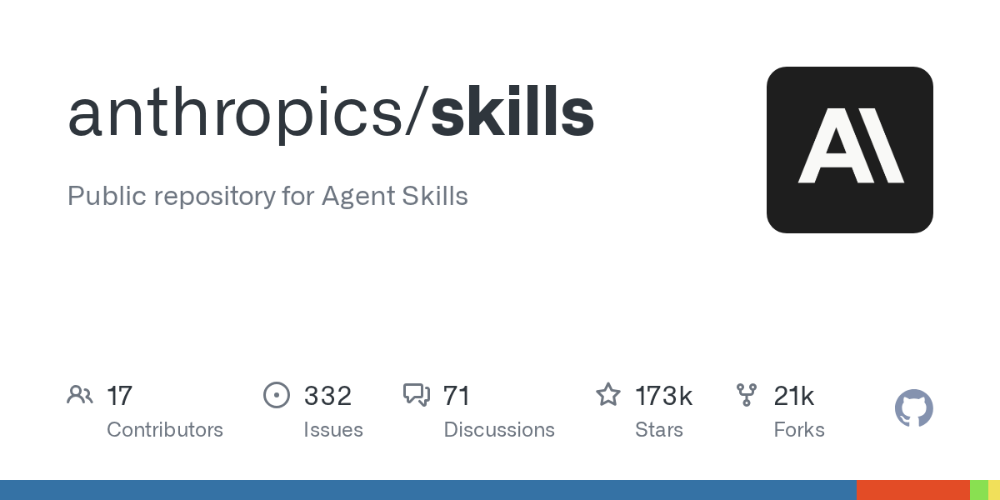
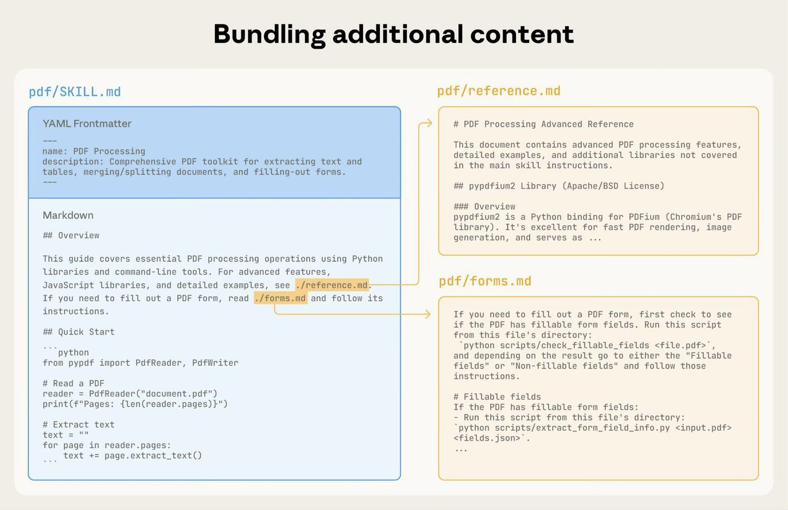
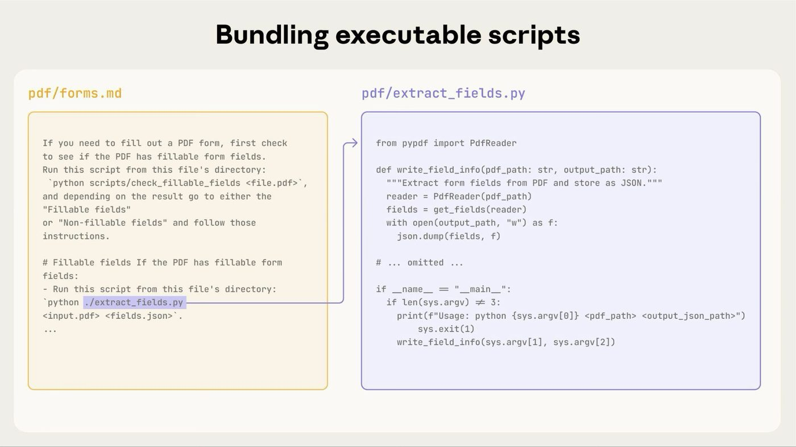
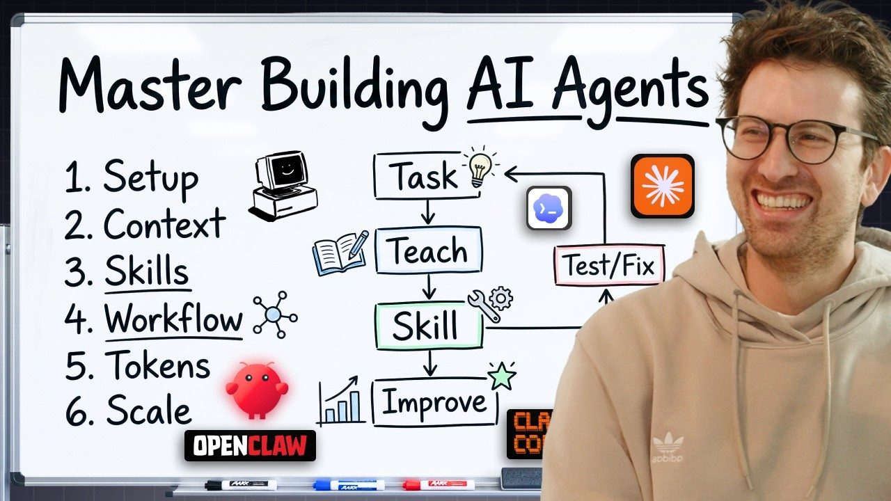

# Chapter 3 - Write Your Craft into Skills

> Writing skills turns personal craft into a distributable asset. This chapter runs from your first line to team library governance; every question comes with criteria and examples you can copy directly.

## 033. How do you write a first skill that triggers reliably?

A minimal, runnable, complete version (the directory name matching `name` is a hard requirement of the spec):

```markdown
# .claude/skills/monthly-report/SKILL.md
---
name: monthly-report
description: Generate the monthly compliance report on the company template, with row-total validation and anomaly flagging. Use when the user asks for a monthly report or a compliance filing, or provides raw transactions and wants a report. Do not use when the user only discusses financials without asking for one.
---

# Steps
1. Read the transaction file the user provided; confirm the fields: date / amount / account
2. Run `python scripts/validate.py` for row-total validation; fix the data first if validation fails
3. Generate the report from the template at `references/template.md`
4. Before output, verify: the totals match the validation script's output

# Don't do this
- Don't compute totals by hand (it will be wrong); always run the validation script
- If the template is missing, stop and ask for the file; don't invent a format
```

While writing, three actions map to three places: the description gets "one sentence of capability + two sentences of triggers + one negative sentence"; the body gets only numbered steps and taboos — no common sense the model already knows; after writing, test triggering with five real task phrasings, 3 runs each. Put the directory in the right place: personal use goes under `~/.claude/skills/`, team use under the project's `.claude/skills/`.




1) Agent Skills specification https://agentskills.io/specification

2) Trigger description optimization https://agentskills.io/skill-creation/optimizing-descriptions

## 034. How do you fit trigger words and capability text into 1024 characters?

Allocation formula: trigger sentences ≥50%, capability 30%, boundaries and negatives 20%. 1024 characters is the spec's cap, but the real constraint is truncation when the list budget runs tight — truncation happens from the tail, so the first 100 characters must complete the trigger. Breaking down a real structure by this formula:

| Character range | Content | Purpose |
|---|---|---|
| 1–100 | Trigger core: Use when the user asks for a monthly compliance report or provides transactions and wants a report | Truncation-safe zone; the trigger signal comes first |
| 100–350 | Capability boundary: row-total validation, anomaly flagging, company template applied | Explains the capability scope |
| 350–600 | Extended triggers: "monthly report / filing / financial statement cleanup" and similar phrasings also apply | Improves recall |
| 600–800 | Negative boundary: Do not use when the user only discusses financials without asking for a report | Prevents false triggering |
| 800–1024 | Supplement: Requires the raw transaction file; if missing, ask the user first | Precondition |

Truncation happens from the tail, so the earlier the range, the more it protects you.

Three layout principles: the fewer capability words the better — every capability adjective spends trigger budget; synonymous trigger phrases are worth writing ("monthly report / filing / financial statement cleanup") — the model doesn't recognize only one phrasing; the negative sentence always goes at the end, so when truncation strikes, it is sacrificed first, not the trigger.

1) Agent Skills specification https://agentskills.io/specification

2) Trigger description optimization https://agentskills.io/skill-creation/optimizing-descriptions

## 035. Which lines in a skill are pure token waste?

The deletion test is the only judge: cut the passage, rerun the task, and if the output doesn't change, it was filler. Three high-frequency kinds of waste — first, model default behavior: "write a clear summary," "follow best practices," "write detailed commit messages"; community tests show deleting these passages changes nothing in the output. Second, background written for humans: design philosophy, history, "this skill aims to" — the model wants steps, not stories. Third, repeated nagging: the same taboo appearing once in each of three sections; keep it once, in the spot most prone to error.
> Would the agent get this wrong without this instruction?

Would the agent get it wrong without this instruction? If the answer is no, delete — that is the criterion from the official creator's guide. Every bit of context you delete buys attention for the instructions that matter. This is not stinginess; it is the pricing unit of instruction engineering.

1) Agent Skills creator best practices https://agentskills.io/skill-creation/best-practices

2) Building Great Agent Skills: The Missing Manual https://www.youtube.com/watch?v=UNzCG3lw6O0

## 036. When the skill body is too long, how do you split it without breaking triggering?

Split rule: the trunk stays in the body, branches are externalized to references; the red line is 500 lines / about 5,000 tokens. Standard directory structure:

```text
monthly-report/
├── SKILL.md              # Main flow: the 4-6 steps every task walks through
├── scripts/
│   └── validate.py       # Validation script (deterministic step)
└── references/
    ├── template.md       # Report template (only needed at output time)
    └── edge-cases.md     # Edge case handling (only needed occasionally)
```

The precondition for splitting is "reference conditions written so they're obvious" — the official guide warns that with non-obvious reference conditions, the model may fail to recognize that it should read. Write the body's mounting sentence as cause-then-effect triggering: "When the input transactions include foreign-currency entries, read the exchange-rate section of references/edge-cases.md before doing anything."



Two taboos: keep reference depth to one level (the official position confirms the model may only partially read nested references, like a head -100 style preview); and don't split the main flow out — the test is to delete all the reference files and run the task once; if the trunk fails, you split the trunk, not a branch.

1) Agent Skills specification https://agentskills.io/specification

2) Agent Skills creator best practices https://agentskills.io/skill-creation/best-practices

## 037. Why is the gotchas section the most valuable part, and how do you accumulate it daily?

The gotchas section holds what the model's training data doesn't have: information only you have been burned by — that is the entire value a skill adds over the model's built-in abilities. The official tutorial's positioning: the highest-value section in the body; every time you manually correct the agent, that is one gotcha entry. Standard entry format, three lines — taboo, reason, fix:

```markdown
# Don't do this
- Don't pull reports through the v2 API (rate-limited after 50 calls per day); use the v3 batch endpoint
- Don't run full validation on the last day of the month (upstream data hasn't landed yet); wait until after the 2nd
- Don't use real-time exchange rates for conversion; use the month-end pricing in references/edge-cases.md
```

The accumulation mechanism lives inside your daily workflow: keep a correction log file, and append a line every time you manually correct the agent; once you have three to five entries, move them into the corresponding skill. One hard rule: gotchas must be written in the body — a non-obvious gotcha placed in a reference file is one the model can't recognize when to read, which amounts to never writing it.

1) 5 Best Practices for Building AI Agent Skills https://www.youtube.com/watch?v=qYNs80FKIVc

2) Agent Skills creator best practices https://agentskills.io/skill-creation/best-practices

## 038. What work should become a script instead of instructions, and what is the criterion?

The one-line criterion: if more than one correct answer exists, write instructions; if only one correct answer exists, write code. The official course gave the standard case: row totals in the compliance monthly report kept failing; after switching to a math script, "this whole class of bug disappeared" — a total has exactly one correct answer, so the model should never generate it. Three categories that must become scripts: numeric computation (totals, exchange rates, ratios), format conversion (CSV to a fixed template, encoding handling), and side-effecting flows that need consistency (deploy steps, bulk renames). Three categories that stay instructions: copy choices (wording, style), forks needing in-the-moment judgment (where is this data abnormal), and context-dependent organizing work. Write the scripts themselves to spec: no waiting for input in non-interactive environments, error messages say "what to try next," and output volume stays controllable (most hosts truncate tool output around 10–30K characters). Two side benefits: running a script consumes no generation tokens; deterministic code gives one result across a hundred runs.

1) Agent Skills specification (scripts guide) https://agentskills.io/skill-creation/using-scripts

2) Build A Hermes Agent Skill In 15 Minutes https://www.youtube.com/watch?v=YgCUJgqoIcE

## 039. How do you keep the model from reading a skill's scripts as documentation instead of running them?

In the body, hard-code a "run declaration" for every script, with three elements: the full command, inputs and outputs, and a one-line property statement. The popular-skills audit (the same one where 27 of 55 failed on trigger descriptions) named this failure: the author wrote a script but not how to run it, so the model pasted the script into the conversation and analyzed it line by line as reference material — paying for exactly the tokens you meant to save. Standard body wording:

```markdown
**Data validation (must execute)**
Run the validation script (this is a program to execute, not reference material):
    bash scripts/validate.py input-file.csv
Input: the transaction CSV the user provided; Output: the terminal prints PASS/FAIL and the differing rows.
If validation doesn't PASS, stop the subsequent steps and report the differing rows to the user first.
```

Three matching spec requirements: scripts must contain no wait-for-keyboard-input logic (it hangs forever in non-interactive environments); error messages state clearly "what broke, what was expected, what to try next"; keep output volume under control — write large results to a file instead of flooding the screen. After writing, have the model actually run it once, and watch it through that first pass.



1) Using scripts in skills (official guide) https://agentskills.io/skill-creation/using-scripts

2) Build A Hermes Agent Skill In 15 Minutes https://www.youtube.com/watch?v=YgCUJgqoIcE

## 040. How do you organize reference files so the model actually goes and reads them?

Every reference file needs a cause-then-effect mounting point in the body. Compare the two styles —

Weak mounting (the model often doesn't read it):

```markdown
For more information, see references/edge-cases.md
```

Strong mounting (gives the timing and the reason to read):

```markdown
When the input transactions include foreign-currency entries, or the date falls
within the last two days of the month, first read references/edge-cases.md
(exchange rates use month-end pricing; upstream data lags by two days),
then run the Step 2 validation.
```

Three rules for organizing the directory: name files by content (edge-cases.md, not doc2.md); keep reference depth to one level — the official docs confirm the model may only partially read nested references, so burying something deep equals burying it for good; match scale to purpose — if the references outweigh the body, the skill should be split. The underlying mechanism is the third layer of progressive disclosure: reference files are read on demand and take no resident budget, but only if the model knows "when this appendix exists" — the mounting point's job is to write that moment as a condition the model can recognize.

1) Agent Skills creator best practices https://agentskills.io/skill-creation/best-practices

2) Building Great Agent Skills: The Missing Manual https://www.youtube.com/watch?v=UNzCG3lw6O0

## 041. How do you build an eval with a baseline to prove a skill actually helps?

Copy the eval structure from the official framework: a case file, two-arm runs, and delta conclusions. Directory and data structure:

```text
evals/
├── evals.json            # Case array: prompt + expected_output + files
├── iteration-1/
│   ├── with_skill/       # Results with the skill installed
│   └── without_skill/    # Baseline with the skill removed
└── iteration-2/          # One directory per iteration; old versions serve as baselines
```

Three scoring rules: an assertion is recorded as PASS only when it cites concrete evidence; delete assertions that always pass on both sides; compare key differences blind (have an LLM judge score overall quality without knowing which version it is looking at). The official quantitative example: with the skill installed, the pass rate went 0.33→0.83, at the cost of about 1,700 extra tokens and 13 seconds per run — a positive delta with a clear magnitude; that is the proof format for "this skill helps." Iteration method: feed the failed assertions, your feedback, and the execution traces to the model for proposed changes, then rerun after each round; if it becomes over-constrained after changes, test for that by "deleting an instruction and seeing whether results stay flat."

1) Evaluating skills (official guide) https://agentskills.io/skill-creation/evaluating-skills

## 042. Why should assertions that pass on both sides be deleted?

Assertions exist to measure the differential; assertions that always pass on both sides measure no differential and merely inflate the scorecard. Contrast examples —

Invalid assertions (pass with or without the skill):

```text
Output contains a summary paragraph            # the model writes summaries by default
Output is in English                           # the task was asked in English
```

Valid assertions (pass only when the skill is in effect):

```text
Header uses the company template v3 letterhead format   # the template lives only in the skill's references
Row totals match the validate.py output                 # the validation script ships only with the skill
Anomalous rows are flagged "pending manual review"      # that rule is written only in the body's gotchas section
```

The official evaluation guide makes this an explicit rule: "Remove or replace assertions that always pass in both configurations." The value behind it deserves spelling out: a skill's value is defined as differential gain, not "being able to do the work" — if your skill cannot produce even one both-sides differential assertion, either you picked the wrong selling point or the job never needed a skill. When writing evals, write three to five valid assertions first, then start changing the skill.

1) Evaluating skills (official guide) https://agentskills.io/skill-creation/evaluating-skills

## 043. How do you make one skill behave consistently across hosts?

Consistency is designed in, not migrated in. Three actions: first, put core logic into scripts — scripts execute identically across hosts, while instructions leave interpretation to each vendor's model; second, treat extended fields as "host enhancement packs": the compatibility matrix (maintained by the community installer) shows `context: fork` is supported only by Claude Code, allowed-tools is missing in Kiro CLI and Zencoder, and hooks are supported by only three hosts — check the table before using them, and write the graceful fallback for missing support; third, lock a test set — three standard task sentences, run once on every host, comparing triggering and output, with differences recorded in the skill's compatibility notes. The format layer is safe: SKILL.md frontmatter and directory structure are unified by the open spec, and mainstream hosts all recognize it as of 2026. The behavior layer is yours to backstop: the spec explicitly covers format only — triggering mechanisms, permission models, and script sandboxes are each host's implementation.

1) Vercel skills CLI (compatibility matrix) https://github.com/vercel-labs/skills

2) Four-host comparison of Skills and Commands https://elguerre.com/2026/03/30/ai-agents-vs-skills-commands-in-claude-code-codex-copilot-cli-gemini-cli-stop-mixing-them-up/

## 044. How do you handle versioning, ownership, and retirement for a team skill library?

One registry card plus three policies. Every skill in the library gets a card:

```text
Skill: monthly-report
Owner: @zhangsan             # when it breaks, you look up a person, not a document
Source: internal / adapted from xxx   # traceable provenance
Audit date: 2026-08-10       # the date you check before installing
Evals: evals/ (3 cases, pass rate 0.83 vs baseline 0.33)
Status: production / trial / deprecated
```

The three policies: changes go through review — skill updates get the same treatment as production code changes, with focus on the referenced examples and context (the parts that expire fastest); periodic re-evaluation — some teams run one round per month, on the grounds that this field's half-life is short and any model or tool change forces a retest; explicit deprecation — whatever fails testing gets clearly marked deprecate and removed from the default list, leaving no duds. Teams further along in the community add one more: "if you still need to iterate after getting the output, the skill isn't good enough" as the production admission bar.

1) Agent Skills Masterclass (Nufar Gaspar) https://www.youtube.com/watch?v=fs_Y3gvj7lk

2) anthropics/skills (official repository and plugin marketplace) https://github.com/anthropics/skills

## 045. What are the risks of installing someone else's whole skill pack, and what do you check before installing?

The risks have real cases: the "obvious install command" of a 27,000-star memory tool was squatted and swapped, and users got a malicious replacement. Three layers of problems with whole-pack installs: the scripts and dependencies the skills carry all come in; the author's context and workflow assumptions may not mesh with yours; and after a pack update the content changes, so the version you reviewed is no longer the version running. The sane posture is "pick dishes, don't order the whole table," with four checks before installing: check the inventory — does every skill in the pack actually hit your needs? Skip what you won't use; check the scripts — read them one by one, focusing on outbound requests, environment variable reads, and fixed-URL downloads; check the permissions — do the tool permissions requested in frontmatter exceed what the function needs; check the source — repository history, the author's other output, community feedback. One developer's principle, verbatim: "Don't install someone else's skill pack wholesale, just like you wouldn't install someone else's node_modules."

1) My AGENTS.md & SKILLS.md Breakdown (Theo) https://www.youtube.com/watch?v=e1snsuY4lTI

2) Build A Hermes Agent Skill In 15 Minutes https://www.youtube.com/watch?v=YgCUJgqoIcE

## 046. Why do hand-written skills usually lose to coached ones?

The hand-written version records "the flow you assume"; the coached version distills "the verified success path." The community-validated process is "coach first, then codify," in four steps: have the agent do the real task with you once, correcting as you go; once it works, have it review the whole conversation and summarize the winning approach into a skill draft; you review the draft and write the correction points into a gotchas section; from then on, after every failure, have the agent append the cause of the error back into the skill, forming self-iteration. Two advantages only the coached version has: correction points from real execution traces — the first item on the official list of good source material; and a reference for "what success looks like" — the most common defect of purely hand-written skills is not knowing the standard for good output. One blogger's quantitative record: a data-source report skill, after five iterations, ran the whole flow in ten minutes with zero errors; his contrast was marketplace skills he installed and abandoned over and over. The bar for step one is low: next time the agent works for you, keep the log open — the moment it succeeds, the material is already complete.




1) How AI agents & Claude skills work (Clearly Explained) https://www.youtube.com/watch?v=S_oN3vlzpMw

## 047. Why can self-generated skills deliver negative measured gains?

Read the benchmark's numbers together with its boundaries. The 2026-02 SkillsBench study: curated skills raised task pass rates by 16.2 percentage points, while model self-generated skills came in at -1.3 percentage points; the domain spread is wider — healthcare +51.9, manufacturing +41.9, software engineering only +4.5 (frontier models' training data has the strongest SWE priors, leaving skills the smallest gap to fill). The community's key methodological critique also holds: the study measured tool-less, feedback-less, one-shot cold generation, and never measured the two real production paths, "human-AI collaborative iteration" and "post-execution distillation" — +16.2 may be a floor, not a ceiling. The actionable conclusion: having AI draft is fine, but it must pass three gates — runs on a real task, your hands-on corrections, and a gotchas section that lands; auto-generation that skips the gates writes -1.3 into your own workflow. The quick question for judging a skill source's quality: has it ever been executed against any real task?

1) SkillsBench benchmark discussion (HN) https://news.ycombinator.com/item?id=47040430

2) Evaluating skills (official guide) https://agentskills.io/skill-creation/evaluating-skills

## 048. Why is the description a trigger, not a feature introduction?

Because the description's retrieval audience is the model, not a human. A real rewrite case —

Before (feature-introduction style):

```yaml
description: Monitors the CI status, review comments, and change requests
  of GitHub PRs, automatically analyzes feedback and assists with fixes,
  helping developers merge code efficiently.
```

After (trigger style):

```yaml
description: Use when the user asks to monitor, watch, or babysit a PR.
```

The after effects, per the original report: more accurate triggering — with the retrieval signal concentrated, the noise shrank; it also drove a skill split — it originally lived in one skill with "file-PR", and once each description was written precisely, the intents separated cleanly and both skills' trigger rates rose after the split. The mechanism behind it: the description sits in context every turn, and its job is to let the model recognize "use me now" among countless candidates; feature introductions contribute nothing to recognition and are pure noise. The rewriting mantra: delete "this is a tool that can…", keep only "use when the user asks for X", and push all capability details back into the body.

1) My AGENTS.md & SKILLS.md Breakdown (Theo) https://www.youtube.com/watch?v=e1snsuY4lTI

2) Trigger description optimization https://agentskills.io/skill-creation/optimizing-descriptions

## 049. How can a single skill burn six million extra tokens?

The auditor's real bill: his own YouTube operations skill weighed 19,000 tokens (the median across 55 popular skills is 1,665), and within a coding agent's five-hour quota window it accumulated 6,190,000 extra input tokens — what burns is not money but the hourly quota. Three causes: every branch detail crammed into the body, reference material that should be external inlined instead, and common knowledge the model already has written up as a tutorial. The matching slimming list, ordered by payoff: move branch details into references for on-demand reading (only 1 of the 55 skills in the audit sample used this move), delete all common knowledge (deletion test: cut the passage, rerun, no change means waste), and break long flows into steps. Warning threshold: act once the body passes 500 lines. The general form is multiplication — a skill's resident cost = size × trigger count × session count; fat that looks harmless in a single view becomes six million under high frequency.

1) Build A Hermes Agent Skill In 15 Minutes https://www.youtube.com/watch?v=YgCUJgqoIcE

## 050. Why does a skill that worked perfectly suddenly go stale?

Three kinds of variables move while the skill text stays still. Variable one, model generations: behavioral drift has hard evidence — one code analysis recorded that a certain model version suddenly turned more aggressive and more verbose, and instructions tuned for the previous generation became interference. Variable two, host upgrades: the official changelog ships skill-related fixes and adjustments in almost every release (list budget from 250 to 1,536 characters, compaction backfill budget, hardening of synced skills) — the skill's runtime environment keeps changing. Variable three, the world changed: the API endpoints, field names, and file paths hard-coded in a skill have their own life cycles. One ecosystem analysis offered the painful analogy: this is like writing shell scripts for a system that re-skins itself every quarter — dotfiles don't break when Vim upgrades, skills do. The countermeasure is layered writing: put the durable into abstractions (judgment frameworks, flow structure, gotchas) and the perishable into specifics (commands, endpoints, examples), placed together and dated; then add a fixed re-evaluation cycle — community practice ranges from one month to one quarter.

1) Agent Skills Are Not the Endgame (OSSInsight) https://ossinsight.io/blog/agent-skills-explosion-2026

2) Agent Skills Masterclass (Nufar Gaspar) https://www.youtube.com/watch?v=fs_Y3gvj7lk

## 051. Why does explaining why control the model better than hard commands?

The mechanism sentence from the official creator's guide: "an agent that understands the purpose behind an instruction makes better context-dependent decisions" — an agent that understands an instruction's purpose makes better context-dependent decisions. Contrast examples —

Hard-command version:

```markdown
Always use the v3 batch endpoint.
```

Explanation version:

```markdown
Pull reports via the v3 batch endpoint: v2 gets rate-limited after 50 calls a day,
and batch mode doesn't time out on large files.
```

The difference shows in uncovered scenarios: the hard-command version, meeting "v3 batch is also down for maintenance," either clings to the rule and fails or detours against the rules; the explanation version knows the rule exists to dodge rate limiting, so it can reasonably choose "wait ten minutes and retry." The matching principle: instruction specificity matches task fragility — brittle steps (they break, have side effects, have a single right answer) get specifics plus reasons; flexible steps (creativity, trade-offs) get room through principles — over-railroading degrades quality instead. One placement principle: attitude reminders ("spend more time and do it carefully") work better in the user prompt than in the skill; a skill holds craft, not attitude slogans.

1) Agent Skills creator best practices https://agentskills.io/skill-creation/best-practices

## 052. Should the model trigger automatically, or should only the user invoke it manually?

Configure in tiers by the cost of error, not by preference. Auto-trigger (default): zero memory burden, at the price of being probabilistic — it may not fire, or it may meddle. Manual trigger: one line in the frontmatter:

```yaml
disable-model-invocation: true
```

After the setting, the skill responds only to slash commands; triggering is 100% deterministic, at the price of your having to remember it exists. The tiering criterion is "the cost of getting this step wrong": exploratory, low-risk, high-frequency — auto (a missed trigger costs little); anything with real-world consequences — force manual. A community line you can copy straight into your spec: "anything with consequences beyond the machine waits for my confirmation." Typical categories: sending messages, deploying, payments, deleting data. The middle path: hard-code a confirmation step in the skill body ("before executing, list what will be sent and wait for my reply to confirm") — auto-trigger stays, and a forced human gate sits in front of dangerous actions. The deciding mantra: the cost of repairing a triggering error sets the tier.

1) Claude Code official Skills docs (disable-model-invocation) https://code.claude.com/docs/en/skills

2) Building Great Agent Skills: The Missing Manual https://www.youtube.com/watch?v=UNzCG3lw6O0
