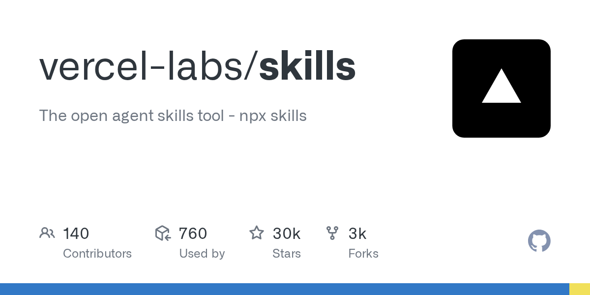
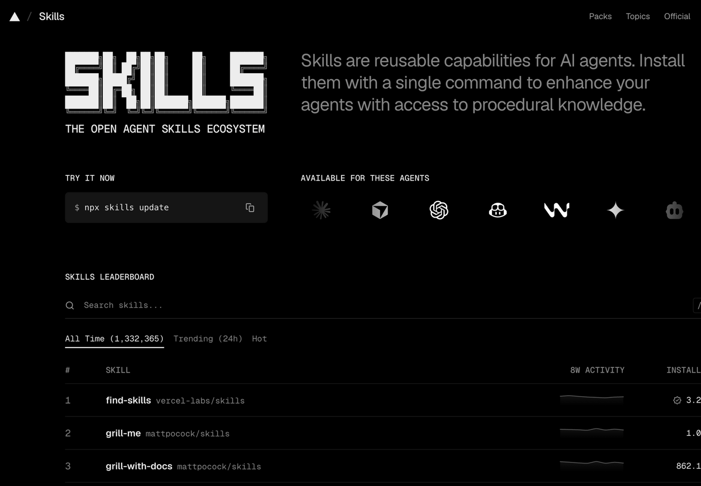
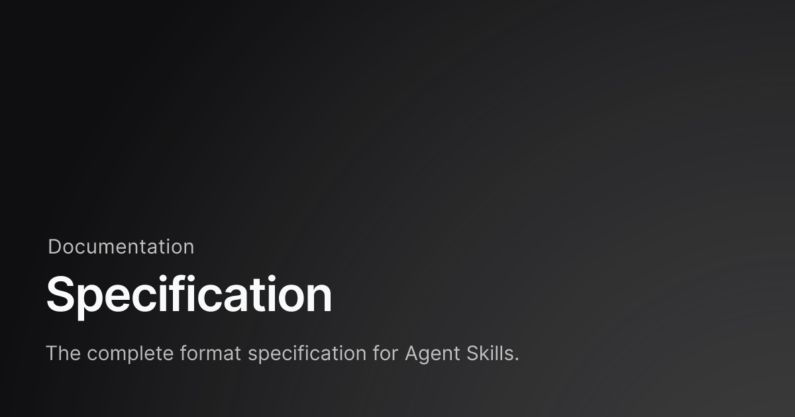

# Chapter 4 - Do Skills Survive a Host Swap?

> The spec promises "write once, run anywhere." Reality: the format is accepted everywhere, but each host computes the behavior its own way. This chapter pins down where the differences are, how to migrate, and whom to trust.

## 053. How do you move a skill to Codex safely?

Most skills work as-is; you verify three things by hand. Directories: both hosts accept `.agents/skills/`, so that path is the least effort. Codex has six load levels of its own — from the current directory up level by level to the repo root (REPO), user level (~/.agents/skills), admin level (/etc/codex/skills), and system built-ins (skill-creator and the like). Triggering: Codex lets you disable implicit invocation per skill (`policy.allow_implicit_invocation: false` in `agents/openai.yaml`); explicit invocation runs through `/skills` or a `$` mention — different habits from Claude Code. A frontmatter migration example —

```yaml
# Claude Code version
---
name: deploy-handbook
description: Runbook for handling deployment failures. Use when a deploy fails or a rollback is needed.
allowed-tools: Bash(gh:*), Bash(kubectl:*)   # ← no such field in Codex; delete
context: fork                                 # ← Claude Code only; delete or rewrite
---
# Codex version: remove the two extension-field lines, keep the rest as is;
# rewrite the original fork's isolated-execution requirement into the body ("work in a separate directory; do not touch the main repo")
```

After the move, run three standard task prompts and compare triggering and output. Keep one line of official positioning in mind: skills are the authoring format, plugins are the distribution unit — let plugins carry the heavy loads, and migrate single skills light.

1) OpenAI Codex Skills docs https://developers.openai.com/codex/skills

2) Four-host comparison of Skills and Commands https://elguerre.com/2026/03/30/ai-agents-vs-skills-commands-in-claude-code-codex-copilot-cli-gemini-cli-stop-mixing-them-up/

## 054. How do you place skill directories so the most hosts can read them?

First choice: `.agents/skills/` — the de facto convention of 2026. Quick placement reference:

```text
my-skills/
├── .agents/skills/     # first choice: read directly by Codex, Cursor, Gemini CLI, Copilot, Cline, and more
├── .claude/skills/     # Claude Code's native directory (mandatory when you use extension fields)
└── project-repo/.claude/skills/  # team-shared, travels with the code
```

Community installer docs maintain a table of read locations covering seventy-plus hosts: the shared directory has the widest adoption, while minorities like Claude Code keep their own directories but also run compatibility scans. Three placement rules: keep one copy of personal general-purpose skills in the shared directory; skills that use Claude Code extension fields (subagent execution, dynamic context) go in `.claude/skills/` — don't expect other hosts to read them; team skills go into the project repo's canonical directory so teammates get them the moment they pull the code. The spec recommends that hosts scan other vendors' directories for compatibility, but implementations vary — put critical skills in the target host's canonical location; don't bet on compatibility scans.

1) Vercel skills CLI (host directory table) https://github.com/vercel-labs/skills

2) Agent Skills client support list https://agentskills.io/clients

## 055. Which extension fields stop working when you switch hosts?

Check the compatibility matrix; don't trust the words "standards compatible." Support status of mainstream extension fields (community installer matrix, 2026-08):

| Field/capability | Claude Code | Codex | Gemini CLI | Cursor/Copilot |
|---|---|---|---|---|
| context: fork (subagent execution) | ✓ | ✗ | ✗ | ✗ |
| allowed-tools (tool pre-authorization) | ✓ | ✓ | partial | missing in Kiro/Zencoder |
| hooks (frontmatter hooks) | ✓ | ✗ | ✗ | partial in Cline/Kiro only |
| Dynamic context (!`command`) | ✓ | ✗ | ✗ | ✗ |

Three consequences to remember: security assumptions fail — host A's tool allowlist becomes decoration on host B, and the restriction you thought you had isn't there; the experience degrades — anything built on fork or dynamic context vanishes the moment you switch hosts; failure is silent — most hosts don't error on unknown fields, they just ignore them. The writing-side fix: keep core logic to the spec's standard fields (name, description, license), and wrap extension fields in a fallback path — a context: fork skill also states in its body the alternative flow "operate in a separate directory when subagent capability is unavailable."

1) Vercel skills CLI (compatibility matrix) https://github.com/vercel-labs/skills

2) Agent Skills specification https://agentskills.io/specification

## 056. How do you manage a cross-host skill library with one CLI?

Vercel's open-source skills CLI covers the full lifecycle in four commands:

```bash
npx skills add obra/superpowers     # install from a repo (pick target hosts)
npx skills list                     # what's installed
npx skills update                   # bulk update
npx skills find "report"            # search marketplaces by keyword
```

It solves "one skill, distributed to many hosts": you pick target hosts at install time, and the recommended symlink mode keeps one physical copy with links in each host's directory — change it once and every host picks it up. The tool was open-sourced on 2026-01-14 and had 30,000 stars by late August (verified against the GitHub API); behind it sits the knowledge-base directory skills.sh. Keep two boundaries clear: it handles distribution, not quality — the pre-install content review is not optional; update pulls the latest upstream with no version pinning, so treat auto-updates with caution in production — to pin versions, use GitHub CLI's skill install (it records repo + ref + content hash; see Question 059).



1) Vercel skills CLI https://github.com/vercel-labs/skills

2) skills.sh https://skills.sh/

## 057. Why does the same skill behave differently on a new host, and how do you pinpoint the difference?

The spec unifies the file format; execution mechanics remain every host's private turf. Concrete differences across the four hosts (2026-03 comparison): command mechanics — Claude Code has merged slash commands into skills (v2.1.3); Codex has deprecated its prompts directory; Gemini CLI has no standalone command concept; Copilot CLI uses /agent plus .agent.md. Subagent capability — Codex subagents don't inherit AGENTS.md by default (needs child_agents_md = true); Copilot subagents can't read in-repo skills; Gemini subagents are still experimental. Context files — CLAUDE.md, AGENTS.md, and GEMINI.md run as three parallel tracks. A three-step way to localize the difference: first isolate the variable — run the same task prompt on every host with a minimal skill (one line of body); if it triggers, loading is fine and the difference lives in the execution layer. Next, compare fields one by one against the compatibility matrix, deleting suspect extension fields and retrying. Finally, check permissions and sandboxing — the same script behaves differently under each host's permission model. Write the conclusion into the skill's compatibility notes so the next migration doesn't step on the same rake.

1) Four-host comparison of Skills and Commands https://elguerre.com/2026/03/30/ai-agents-vs-skills-commands-in-claude-code-codex-copilot-cli-gemini-cli-stop-mixing-them-up/

2) Research notes on cross-host extensibility https://gist.github.com/1qh/4ff117a7f940ec78237794a1e8cb81b3

## 058. Which skill marketplace is most reliable, and what is each one's approach?

Three approaches, eight mainstream players — learn the rules before you shop:

| Marketplace | Scale measure (mid-2026) | Approach | Best for |
|---|---|---|---|
| anthropics/skills (official) | about 20 | human vetting | production environments first |
| SkillsMP | 800K+ (another measure: 1.9M) | bulk GitHub scraping | aggregated search |
| skills.sh | 1,332,365 indexed | install-count leaderboard | gauging popularity |
| LobeHub | 169,000+ | community aggregation | Chinese-language search |
| Agensi | 200+ | 8-point security scan + revenue share | security-sensitive users |
| ClaudeSkills.info / MCP Market | 658 / about 500 | curated directories | quick picking |
| claudemarketplaces | 2,500+ plugin marketplaces | plugin directory | finding whole bundles |

How to read the table: the scale measures are mutually incomparable — scraped volume, human curation, and indexed entries are three different things; install counts ship with no dedup policy and can be inflated; one comparison piece says it outright: "catalog size is the most misleading metric." Pick by approach: for production, human vetting plus scanning; for trying things out, watch the leaderboards; for vertical niches, use aggregated search. No marketplace replaces reading the content yourself before installing (the three checks in Question 076).



1) skills.sh https://skills.sh/

2) Comparison of seven major skill marketplaces https://www.agensi.io/learn/best-ai-agent-skills-marketplaces-2026

3) anthropics/skills https://github.com/anthropics/skills

## 059. Why is installing skills with GitHub CLI more auditable?

The audit difference is supply-chain metadata. GitHub CLI's skill install (v2.90.0 and later, public preview) records a triple: the source repo, the ref, and the content tree hash (tree SHA), used alongside immutable Releases and secret scanning — when something breaks, you can trace exactly which version introduced it. Compare the community installers' usual mode: pull the latest upstream, with no local record of when upstream changed what; skills are plain text, so changes don't trip scanner alarms the way binary packages do. Be equally clear about the limits of the audit record: a hash proves only "did it change," not "was the change malicious" — post-release behavior review remains non-negotiable. The applicability call: for personal experiments, any installer will do; for teams and production, a traceable triple is a hard requirement — worth switching tools for.

1) awesome-agent-skills (Chinese-language guide; gh skill chapter) https://github.com/libukai/awesome-agent-skills

## 060. How do you use symlinks to sync one source across hosts without cross-contamination?

Keep the physical files in a neutral directory and links in each host's directory. Steps:

```bash
# keep the physical files in the shared directory (best managed with Git)
git clone https://github.com/you/your-skills ~/.agents/skills
# create links for hosts that keep their own directories
ln -s ~/.agents/skills/monthly-report ~/.claude/skills/monthly-report
ln -s ~/.agents/skills/monthly-report .codex/skills/monthly-report 2>/dev/null
```

Three benefits: a single source of truth — no more "Claude runs the old version while Codex runs the new one"; Git management — skill changes go through commit history, rollback-ready and auditable; one edit takes effect on every host. Two cautions: a few hosts place security limits on symlink following (Codex has hardened installation against unsafe symlinks), so verify once per host that it can actually read through the link; extension fields travel with the physical files, and links can't rescue compatibility — .claude-only fields stay dead elsewhere. Versioning strategy: links suit skills where "every host runs the same version"; skills that need per-host staged rollouts should keep an honest physical copy on each.

1) Vercel skills CLI (installation modes) https://github.com/vercel-labs/skills

## 061. Should you trust the official curated set or the marketplaces' massive catalogs?

Decide by "who pays the vetting cost," not by fame. Traits of the official repo (anthropics/skills): small — 19 skills in the directory tree; hard vetting — human review; two genuine value points: the document quartet (docx/pdf/pptx/xlsx) is a mature implementation that has run in production for a long time (note: those four are source-available, not open-source licensed), plus official authoring tools such as skill-creator and mcp-builder that are worth a copy on every machine; the maintainers themselves state it is "for demonstration and teaching only." The market's value is the long tail: niche vertical needs have most likely been written by someone already, and installing to adapt beats building from zero; the cost is huge quality variance — large-scale scans found more than half of skills carrying at least one defect, and the community has documented hollow content at the top of leaderboards (the 55-skill audit in Question 031). A rational trust model: official or self-written for high-frequency critical paths; take long-tail skills from marketplaces as drafts; run the three pre-install checks (Question 076); after install, retrofit them into your own through the apprenticeship method.


1) anthropics/skills https://github.com/anthropics/skills

2) Comparison of seven major skill marketplaces https://www.agensi.io/learn/best-ai-agent-skills-marketplaces-2026

## 062. Why did Claude Code merge slash commands into skills?

Two entry points doing the same job. In early 2026 the official changelog (v2.1.3) settled it in one line: "Merged slash commands and skills" — .claude/commands/deploy.md and .claude/skills/deploy/SKILL.md became equivalent from that point on, and old command files remain compatible. The logic of the merge has two layers. User layer: the line between "commands are shortcuts, skills are capability packs" grew ever harder to explain — two entry points, two sets of mental overhead. Model layer: a command is at its core also "inject a piece of instruction," isomorphic to a skill's triggered execution; the split was implementation history, not design necessity. Gains after the merge: commands gain a skill's full structure (reference files, scripts, authorization fields); skills gain explicit slash invocation; and new fields such as disable-model-invocation control how invocation happens. Other hosts have not followed this merge — in cross-host maintenance, treat "command-style usage" as a Claude Code-exclusive enhancement.

1) Claude Code official Skills docs https://code.claude.com/docs/en/skills

2) Claude Code changelog https://github.com/anthropics/claude-code/blob/main/CHANGELOG.md

## 063. Why have three hosts taken three different skill evolution paths?

Same starting point, three different calls on the bottleneck. Claude Code's "manifest engineering": across 94 releases it kept polishing the presentation layer — description cap moving from 250 to 1,536 characters, a percentage-based manifest budget window, budget backfill after compression, incremental hot-reload announcements, plus security hardening (sanitizing sync skills, excluding node_modules) — betting that once skills multiply, presentation and budget are the bottleneck. Codex's "retrieval engineering": skill discovery was rebuilt into a retrieval subsystem — reciprocal rank fusion, dynamic selection based on task context, a directory token budget, and a degradation order on overrun (drop descriptions first, then entries, with alerts) — five releases from 2026-07 to 08 completed the architecture migration, betting that selection efficiency is the bottleneck. Gemini CLI's "lifecycle governance": default-on about two weeks after launch (v0.23 preview on 2026-01-07, default in v0.25/26), plus a unique inbox review for session-produced skills and plan-mode activation confirmation — betting that trust governance is the bottleneck. Choosing a host is, at bottom, choosing a set of trade-offs.

1) Claude Code changelog https://github.com/anthropics/claude-code/blob/main/CHANGELOG.md

2) OpenAI Codex releases https://github.com/openai/codex/releases

3) Gemini CLI changelog https://github.com/google-gemini/gemini-cli/blob/main/docs/changelogs/index.md

## 064. When skills share a name, why does one host pick a winner while the other lays them all out?

Two philosophies for same-name collisions, each with its own trap. Claude Code uses priority override: managed > user > project, each level overriding the one below; with duplicate names only one takes effect — betting that "the user wants the copy closest to the current project." The trap: the override happens silently, and that is exactly where the "I installed it, why isn't it active" confusion comes from. Codex uses side-by-side presentation: same-name skills are not merged; both enter the skill selector for the model to choose — betting that "both may be useful, and the user should see the full picture." The trap: the model hesitates between similar skills and may even execute twice. Practical conclusions for cross-host maintenance: avoid identical names absolutely; prefix skills dedicated to specific hosts; if a collision happens anyway, run the list command on both hosts first to see how each presents it, then decide which copy to delete. Enterprise environments add one more layer: the managed directory has the highest override priority, and skills pushed out by IT will squash personal same-name versions — when troubleshooting, first ask whether the machine is managed.

1) Claude Code official Skills docs https://code.claude.com/docs/en/skills

2) OpenAI Codex Skills docs https://developers.openai.com/codex/skills

## 065. How does one company's skills get installed 15 million times?

Enterprise distribution is this ecosystem's real volume. The skills.sh leaderboard (2026-08-31 snapshot): the all-time install leader is neither a personal hit nor the official set — it is the Feishu open skill collection, 23 skills with 15.2M cumulative installs; Microsoft's Azure skill set follows with 13 skills and 7.7M installs. For contrast, the personal side: the top single skill, find-skills, sits at 3.2M, and popular, well-reviewed skills range from 800K to around a million. The structural reason for the gap: enterprise skills ride a platform's user base — every onboarded developer and every pipeline installs once, a platform-scale multiplier; and enterprise skills come with official docs and support, so installing one feels closer to "installing the official client" than "installing a community plugin." Lessons for both sides: for platform companies, the official skill set is the second business card after API docs; for individual developers, don't compete on install counts — compete on vertical depth and reputation rankings. A note on measures: the definition of an install and its dedup rules follow each site's published policy.

1) skills.sh leaderboard https://skills.sh/

## 066. The open standard has been out for over half a year — why can't skills still run everywhere?

The standard covered file format, not execution behavior. On 2025-12-18 the spec went independent at agentskills.io, and during 2026 dozens of hosts — Claude Code, Codex, Gemini CLI, Cursor, and more — adopted it in turn. That part is real. But the execution layer stayed outside the standard: triggering (model judgment vs. retrieval selection vs. confirmation gates), permission models (uneven support for tool authorization fields), script sandboxing (network-less API containers vs. full local permissions), manifest budgets (1% vs 2%) — all left to each host's discretion. One concrete inconsistency: the same skill with a tool allowlist is genuinely pre-authorized on host A, while on host B the field is ignored and every step pops a confirmation prompt — exactly opposite security behavior. "Runs everywhere" therefore splits into two claims: the file can be opened (the standard covers this; it holds), and behavior stays consistent (the standard does not cover this, and covering it soon will be hard — standardizing behavior means the spec grows execution tiers, and dozens of existing implementations would all have to change). For now, the dependable cross-host approach is still the three-step compatibility test in Question 043.

1) Agent Skills client support list https://agentskills.io/clients

2) Four-host comparison of Skills and Commands https://elguerre.com/2026/03/30/ai-agents-vs-skills-commands-in-claude-code-codex-copilot-cli-gemini-cli-stop-mixing-them-up/

## 067. Why does the spec deliberately govern format but not behavior?

Minimalism is the standard's survival strategy. The entire substance of the spec: directory structure (one SKILL.md required), six frontmatter fields (name, description, license, compatibility, metadata, allowed-tools — the last two marked experimental), and a few constraints (name must match the directory name, a 1024-character cap); the body has no formatting restrictions at all.

> Deliciously tiny… yet heavily under-specified.

"Deliciously tiny… yet heavily under-specified" — the community's most-quoted one-line summary of the spec. The ledger of this trade: standardizing behavior costs enormously — dozens of hosts with wildly different execution environments, so forcing unification would either stillbirth the standard or drive away existing implementations; minimal format drives adoption cost toward zero, which is the only reason dozens of hosts followed in 2026. The price is equally explicit: no guarantee of cross-host behavioral consistency, security capabilities (permission declarations, signing) stuck at experimental fields, and governance that leans on community self-discipline. Whether the spec should grow "behavior tiers" and "security tiers" is the biggest unsolved question in open governance — and it will decide whether this standard ends up a "format convention" or a "platform contract."



1) Agent Skills specification https://agentskills.io/specification

2) Simon Willison's skills article index https://simonwillison.net/tags/skills/

## 068. When distributing skills, why might a plugin fit better than a bare skill?

A plugin is a skill with packaging on top, a natural fit for distribution. In the Claude Code ecosystem, a plugin can bundle multiple skills plus commands, subagents, and connectors (MCP configurations), with a unified manifest and version numbers, installed and updated through marketplaces — one command, /plugin marketplace add anthropics/skills, installs the entire official set. Bare-skill distribution is loose files plus manual management, with updates done by hand. Three upgrade signals: you have more than three to five skills sharing reference files and scripts; you are shipping to a team or community (others need an updatable package, not a pile of files); update frequency has risen enough that you need unified pushes. The counter-signals are just as clear: one or two personal-use skills — packaging is self-inflicted complexity; loose files are fastest to change. You also have to pick a side on distribution philosophy: subscription (official marketplace, automatic updates, read-only) or ownership (file copies, user-modifiable). Community experience says mixing the two produces the embarrassment of the same skill installed twice — decide before you publish.

1) Claude Code official Skills docs (plugin marketplaces) https://code.claude.com/docs/en/skills

2) mattpocock/skills (subscription vs. ownership compared) https://github.com/mattpocock/skills
