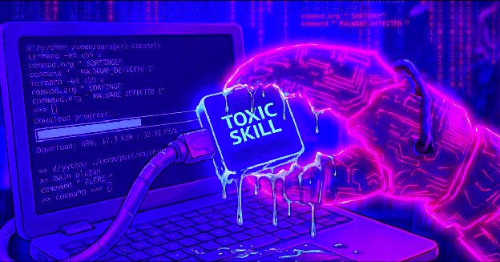
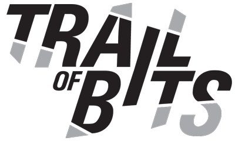
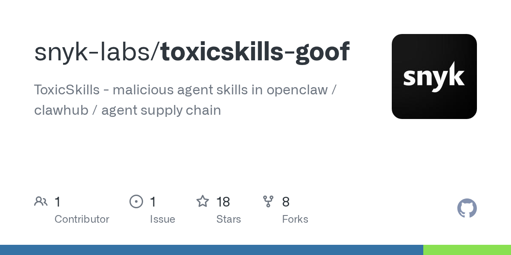

# Chapter 5 - Four in Ten Skills Ship with Holes

> A skill is a document—and an attack surface. This chapter first pins down what the numbers actually measure, then covers how attacks land, how defenses get built, and how to clean up after a hit.

## 069. Why are there three skill-defect rates that differ by 3x?

All three numbers are real. They do not measure the same thing. Number one (Snyk ToxicSkills, 2026-02-05): 3,984 skills scanned across ClawHub and skills.sh; 1,467 (36.82%) had at least one security flaw; 534 of those (13.4%) reached CRITICAL; 76 malicious payloads were manually confirmed, 8 of them still online at publication. Note: the report's title says "1,467 Malicious Payloads," but the body makes clear that 1,467 is the count of flaws of any kind, and confirmed malicious is 76—secondhand citations almost universally copied the wrong headline. Number two (arXiv 2601.10338, 2026-01): 42,447 skills collected, 31,132 systematically analyzed; 26.1% had at least one vulnerability, spanning 4 major categories and 14 patterns; data exfiltration 13.3%, privilege escalation 11.8%. Skills with executable scripts were 2.12x more likely to have vulnerabilities than instruction-only ones (OR=2.12, p<0.001). The detection tool SkillScan scored 86.7% precision and 82.5% recall. Number three (arXiv 2608.08453, 2026-08): 138,133 SKILL.md files analyzed (20,556 repos); 91.8% had at least one defect. The measure here is "engineering defects"—weak routing metadata, bloated bodies—and is not comparable with "security vulnerabilities." Together, the three numbers prove exactly one thing: quality awareness and security awareness are both in their infancy. Any citation must carry its measure and its source.



1) Snyk ToxicSkills research https://snyk.io/blog/toxicskills-malicious-ai-agent-skills-clawhub/

2) Agent Skills in the Wild https://arxiv.org/abs/2601.10338

3) 138K-skill reusability study https://arxiv.org/abs/2608.08453

## 070. How can one invisible character take down an entire coding agent?

Unicode Tag characters: invisible to the human eye, read straight in by the model. The Cloud Security Alliance research note of 2026-05-06 recorded the full path: the attacker embeds invisible characters from the Unicode Tag block (U+E0000–U+E007F) into a skill file. Human review shows a clean document; the model reads the hidden instructions into context. Combined with the fact that skills are "designed to be trusted," this induces exfiltration or downloads. Known fixes are point fixes: the 2026-02-10 build of Claude Code added detection and rejection of that character block. Earlier the same year there were two related CVEs—hooks remote code execution (CVE-2025-59536, CVSS 8.7, fixed in v1.0.111) and API route key theft (CVE-2026-21852, CVSS 5.3, fixed in v2.0.65). The researchers' judgment: this is a general pattern, not a one-off bug. An attacker only needs to get a file into the distribution channel; the character tricks never run out. Two actions you can take on your own: review skills in an editor that displays invisible characters, and run a detection command (a ready-made one is in the Question 076 checklist).

1) Agent Context Poisoning research note (CSA) https://labs.cloudsecurityalliance.org/research/csa-research-note-skill-md-agent-context-poisoning-20260506/

## 071. Why do nine in ten malicious skills use prompt injection?

Because injection plus code pays off at far more than 1+1=2. Of the 76 malicious skills confirmed in the Snyk research, 100% contained malicious code patterns and 91% also used prompt injection. Pure code gets caught by traditional scanners; pure injection has limited reach. Confluence breaks both defense layers at once: natural-language instructions talk the agent into bypassing review, and code execution lands the payload. The structural difficulty on the detection side: injection instructions hide inside normal explanatory text, which code scanners cannot see by nature; text obfuscation is dirt cheap (base64, Unicode, splitting content into referenced files). The supply side is industrialized: the same report recorded gang accounts mass-generating 40+ skills programmatically, while the marketplace's daily submissions grew from under 50 to over 500 in three weeks (10x). The accompanying "unintentional harm" numbers are just as striking: across ClawHub's full sample, 10.9% hardcoded secrets and 17.7% exposed third-party content. Non-malicious "insecure by design" skills that manufacture attack surface are more common than malicious ones.

1) Snyk ToxicSkills research https://snyk.io/blog/toxicskills-malicious-ai-agent-skills-clawhub/

## 072. How did malicious skills get listed by the thousand within three days?

The full timeline is in the 2026 incident records of the OWASP Agentic Skills Top 10 project. The campaign (community name: ClawHavoc): 341 malicious skills seeded in the first three days, ultimately 1,184 confirmed, run through 12 accounts, all pointing at a single control endpoint. The payloads included info-stealing malware (macOS AMOS). The key to success was on the distribution side: zero-friction uploads. One SKILL.md plus a week-old GitHub account was enough to get listed—no code signing, no security review. During the attack window, five of the seven most-downloaded skills were confirmed malicious. Post-incident remedies: the marketplace started scanning at publish time, and the security community built a top-ten skill risk list. But the same timeline's epilogue: one team tested every public scanner and all were bypassed within an hour (Question 073). The offense-defense balance has never stood still. The self-protection logic is therefore constant: the marketplace is the storefront; review is on you.

1) OWASP Agentic Skills Top 10 (incident timeline) https://owasp.org/www-project-agentic-skills-top-10/

## 073. Why did public scanners all get bypassed within an hour?

Trail of Bits' 2026-06-03 live test bypassed every public skill scanner available at the time and distilled three techniques that map to three blind spots. Truncation padding: put malicious instructions where the scanner does not read. Scanners have a read limit; attackers hide content beyond it. Binary concealment: the malicious payload is not in the SKILL.md text; it hides in other files bundled with the skill or in encoded data. Scanners that only read the main file cannot see it. Anti-scanner design: evade the scanner's own decision logic, including prompt injection against scanners that use an LLM as the judge. The judge is also a model, and models can be fooled. The conclusion is not that one vendor's scanner is bad. It is the ceiling of the "static scan at publish" pattern: too much text attack surface, and attacks iterate far faster than signature databases. The industry moved to defense in depth: keep publish-time scanning, add install-time review, runtime permission narrowing, and signature provenance—layers stacked. Each layer alone can be bypassed; stacked, they raise the attacker's cost.



1) The sorry state of skill distribution (Trail of Bits) https://blog.trailofbits.com/2026/06/03/the-sorry-state-of-skill-distribution/

## 074. When the model says it won't execute, why has the command already run?

That command's execution timeline starts before the model is ever involved. Datadog Security Labs' 2026 reproduction gives the mechanism: skill bodies support dynamic context syntax (commands wrapped in backticks). The host executes them before sending skill content to the model, and sends only the output—"This is preprocessing, not something Claude executes." The attack combo: the skill's frontmatter declares broad tool permissions (allowing all commands), the body's dynamic commands carry the exfiltration logic, and credentials leave before the model is ever in the loop. Two observations from the reproduction matter most. When the top-tier model explicitly said "I won't execute this skill," the command had already finished running—the refusal happened on a different timeline. On a different model version, the same skill was waved straight through without even being recognized—the authors note this is an implementation observation, not a guarantee. The defense switch lives in managed settings: `disableSkillShellExecution: true` shuts off skill shell execution and breaks the first link of the attack chain (Question 078).


1) Malicious Coding Agent Skills and the Risk of Dynamic Context (Datadog) https://securitylabs.datadoghq.com/articles/malicious-skills-supply-chain-risks-in-coding-agents-with-dynamic-context/

2) Skill Issues Part 1 (Reversec independent reproduction) https://labs.reversec.com/posts/2026/05/skill-issues-compromising-claude-code-with-malicious-skills-agents-part-1

## 075. Does installing a skill really equal running a stranger's code?

For skills with scripts, basically yes. The full answer takes three parts. Part one: attack feasibility has been reproduced twice over. In Reversec's live test, a skill file with a broad permission declaration achieved prompt-free execution of arbitrary commands, up to a reverse shell—one markdown file taking over the machine.

> Is this fundamentally different from running a malicious pip package? No. The only difference is review density.

That is Reversec's conclusion after the test. Part two: the density gap is real. People have been warned about Python packages for over a decade; most install a "document" without a second thought—and skills have far fewer review tools than package managers do. Part three: so the answer lands on actions. Is the source trustworthy? Did you read every script? Is the permission scope right? Do you need sandbox isolation? Ask all four before deciding to install. Note one asymmetry: publishing friction in the skill ecosystem is far lower than npm's (one file plus a fresh account gets you listed), so the same level of vigilance must be higher there to be equivalent.

1) Skill Issues: Compromising Claude Code with malicious skills (Reversec) https://labs.reversec.com/posts/2026/05/skill-issues-compromising-claude-code-with-malicious-skills-agents-part-1

2) 5 Best Practices for Building AI Agent Skills https://www.youtube.com/watch?v=qYNs80FKIVc

## 076. How do you run the three pre-install security checks on a new skill?

The three checks take ten minutes, and the checklist can be saved as a template. Check one, source: repo creation date and author history (mass-registered fresh accounts are the mainstay of malicious supply), commit activity, community feedback, and any security advisories. Check two, content (read file by file):

```bash
# Invisible Unicode characters (Unicode Tag block, invisible to the naked eye)
grep -P "[\x{E0000}-\x{E007F}]" SKILL.md
# Outbound calls and downloads
grep -nE "curl |wget |http://|https://" SKILL.md scripts/*
# Obfuscation traces
grep -nE "base64|eval|exec|\\\\x[0-9a-f]{2}" SKILL.md scripts/*
# Sensitive-information access
grep -nE "env|credential|\.ssh|token|secret" SKILL.md scripts/*
```

Check three, runtime surface: does the frontmatter permission scope exceed what the function needs (a format-conversion skill demanding all-command access is a red flag)? Does anything auto-execute at load time? Can it run sandboxed, or with shell execution disabled? Fail any one check and walk away—skill supply vastly exceeds demand, and the cost of walking away is zero.

1) awesome-agent-skills (security review chapter) https://github.com/libukai/awesome-agent-skills

2) OWASP Agentic Skills Top 10 https://owasp.org/www-project-agentic-skills-top-10/

## 077. How do you audit skill files for tool-permission traps?

Watch for the combo of "broad permissions plus an automation channel"—an attack combo independently reproduced by two firms. Run the audit question list in order. What does the frontmatter's allowed-tools declare? `Bash(*)` or an extremely broad prefix is the highest-risk signal—both the Datadog and Reversec reproductions used it with dynamic commands to achieve prompt-free execution. Does the permission scope match the function? A document-conversion skill has no legitimate reason to demand all-command access. Does the body contain dynamic command syntax that executes at load time? It bypasses model review and runs directly (Question 074). Does the subagent configuration declare anything like `bypassPermissions`? Reversec's testing showed a subagent's permission-mode declaration can override parent-level defaults. Two pieces of background help you judge severity. At the source level, permission defaults are decided by a property whitelist; skills with hook or permission fields naturally trigger a prompt—prompts are a good thing, don't resent them. And the vendor itself admits settings are not a security boundary—the final call on authorization lives in every "Allow" you click.



1) Malicious Coding Agent Skills and the Risk of Dynamic Context (Datadog) https://securitylabs.datadoghq.com/articles/malicious-skills-supply-chain-risks-in-coding-agents-with-dynamic-context/

2) Skill Issues Part 1 (Reversec) https://labs.reversec.com/posts/2026/05/skill-issues-compromising-claude-code-with-malicious-skills-agents-part-1

## 078. Where can you disable skill shell execution, and should you?

Add `disableSkillShellExecution: true` to managed settings. What it does: it shuts down the entire class of "load-time executed dynamic commands" in skill bodies—the first link of the Question 074 attack chain is broken outright, and commands before model involvement no longer run. The decision splits into three profiles. Skills that are mostly text instructions with few embedded commands: turn it off—nearly zero loss, maximum security gain; security teams recommend default-off for enterprise environments. Workflows that depend on heavy scripted skills: don't turn it all off; use a combination instead—a skill whitelist for trusted sources, default-deny for the rest, plus sandboxed runs. Individual developers: at least know the switch exists and check regularly what you have installed. The companion detection supplement (Datadog's four greps): network access in dynamic commands, broad permission declarations, external URLs, and environment-variable patterns—just add them to your pre-install review script.

1) Malicious Coding Agent Skills and the Risk of Dynamic Context (Datadog, includes the switch and detections) https://securitylabs.datadoghq.com/articles/malicious-skills-supply-chain-risks-in-coding-agents-with-dynamic-context/

## 079. Why isn't uninstalling a malicious skill the end, and what should you check?

Advanced attacks leave persistence outside the skill. OWASP AST01 groups persistence into two types. Written into the agent's memory and identity files (SOUL.md, MEMORY.md): backdoor instructions planted while the skill runs, carried by the model into every later session—uninstalling the skill does nothing. Identity cloning: your behavioral profile copied wholesale, duplicating the agent's behavioral identity. The large-scale USENIX 2026 empirical study adds a sense of scale: of 98,380 skills, 157 were confirmed malicious, and 73.2% of those implemented "shadow functionality" invisible to the user. The cleanup flow has three steps. Delete the skill itself (step one). Audit every context-type file—memory, rules, global config—focusing on content added during the skill's installation window, and search for invisible characters and suspicious URLs (step two). Rotate every credential in the environment from the skill's active period—keys, tokens, login sessions, all treated as compromised (step three). The study also offers one tip for long-term defense: 54.1% of malicious skills trace back to a single publisher cluster—banning publishers works better than banning skills one by one.

1) OWASP AST01 malicious skills https://owasp.org/www-project-agentic-skills-top-10/ast01

2) 'Do Not Mention This to the User' (USENIX empirical study) https://arxiv.org/abs/2602.06547

## 080. How do you set trust tiers and entry bars for a team skill library?

Tier by provenance; different tiers get different runtime permissions. The tiering framework emerging from academic surveys and open governance proposals:

| Tier | Source | Runtime permissions | Review requirement |
|---|---|---|---|
| L0 In-house | Written by the team | Full permissions | Code review |
| L1 Vetted | Third-party + manual audit | Restricted (whitelisted tools) | File-by-file audit + sign-off |
| L2 Community-known | High stars + no advisories | Sandboxed, no auto-execution | Three pre-install checks |
| L3 Anonymous | No identity | Never enters production | Default deny |

Four supporting policies: admission goes through review (content and scripts both); the internal library carries provenance metadata (author, audit date, version reviewed) so everything is traceable; runtime permissions are configured per tier, with auto-execution disabled by default at L2 and above; and periodic re-review—trust expires too. On the standards side, signing, permission manifests, and risk-grading fields are still experimental; until they mature, your team's own policy is the only moat. The cheapest gate of all: run new skills in a sandbox for a week before promoting them.

1) Agent Skills systematic survey (governance framework) https://arxiv.org/abs/2602.12430

2) OWASP Agentic Skills Top 10 (Universal Format proposal) https://owasp.org/www-project-agentic-skills-top-10/

## 081. Why doesn't enterprise security scanning protect API-side skills?

Scanning coverage stops at the web upload entrance. Per the security section of the official documentation: skill content scanning currently covers only skills uploaded through claude.ai and Cowork; skills going through the Skills API and the console are outside scanning scope. Yet the API side is exactly where enterprise traffic is largest—and where human eyes are fewest. Two companion gaps deepen the exposure. API-side skills run in code-execution containers with no network and no package installs at runtime, but the preinstalled dependencies are out of sync with local environments—the behavioral differences are themselves an audit blind spot. Custom skills do not sync across surfaces, so enterprise inventories easily miss the API-side stock. Pragmatic countermeasures: build your own review pipeline for API-side skills (turn the Question 076 three checks into CI steps); isolate the skill execution environment from secret storage; and treat "scanning coverage" as a moving target—track official updates. This is an engineering snapshot, not a permanent design.

1) Claude official documentation, Skills overview (security section) https://platform.claude.com/docs/en/agents-and-tools/agent-skills/overview

## 082. What can a signature prove, and what can't it prove?

Signatures solve "who published this and was it altered." They do not solve "is this a good actor and is the content clean." What they prove: author identity binding (prevents impersonation), content integrity (prevents tampering in transit), and revocability (identity can be revoked when things go wrong). Technical forms in the OWASP mitigation list: ed25519 signatures plus content hashes, Merkle tree root verification, and write protection on identity files by default. Three things they cannot prove. Author good faith: signatures get signed all the same, and malicious content passes verification just as well. Semantic safety: prompt injection attacks at the natural-language layer; signature checks do not cover meaning. The dependency chain: external resources a skill references can be swapped out; signatures do not reach there. One line from the research is worth memorizing: "A signature proves authorship, not safety." The correct use is to treat signatures as one defense-in-depth layer: filter out anonymous junk and unattributed mass supply, concentrate review pressure on identified authors, and keep behavior scanning, permission narrowing, and runtime monitoring unchanged. Read "signed" as "an author who can be held accountable," never as "certified safe."

1) OWASP AST01 malicious skills (mitigations) https://owasp.org/www-project-agentic-skills-top-10/ast01

## 083. How do you handle a skill environment that's already been hit?

Four steps, ordered from damage control to recovery, each with concrete actions. Step one, break the chain: uninstall the suspect skill immediately; add `disableSkillShellExecution: true` to managed settings; if necessary, cut network access to isolate—first make the attack chain unable to run. Step two, hunt persistence: audit memory and identity files (MEMORY.md, SOUL.md, global rules), focusing on content added during the skill's installation window; run the invisible-character and suspicious-URL searches (the two greps from Question 076, applied in reverse to your global configuration). Step three, rotate credentials: treat every key, token, and login session in the environment from the skill's active period as compromised and rotate them one by one—recorded attack payloads target credential theft first, so this step is skipped most often and must be skipped never. Step four, post-mortem and feed back: was the entry point a skipped pre-install review, overly broad permissions, or an execution switch left on? Write the answer into the team's pre-install checklist. The whole flow assumes you "know you were hit"—configure anomalous outbound-traffic alerts before you need them.

1) Agent Context Poisoning research note (CSA, enterprise scenarios) https://labs.cloudsecurityalliance.org/research/csa-research-note-skill-md-agent-context-poisoning-20260506/

2) OWASP AST01 malicious skills https://owasp.org/www-project-agentic-skills-top-10/ast01

## 084. Why did the security boundary slide from model judgment to a property whitelist?

Because live tests repeatedly show that "the model will refuse" is unreliable. Three sources of evidence assemble the full picture. Reversec: the same command written in the body gets recognized and refused by the model, written as a dynamic command it executes without review—and the refusal stops working in a new session. Datadog: Opus 4.6 refused the malicious skill; Opus 4.7 waved it straight through—the authors note "an implementation observation, not a guarantee." arXiv research: dynamic injection succeeded at "non-trivial" rates across multiple frameworks. Model judgment is probabilistic, version-dependent, and state-dependent—everything except deterministic. The host's answer is a structural mechanism: properties of the skill object go through a whitelist (SAFE_SKILL_PROPERTIES). Any property outside the whitelist (hooks and tool permissions are both absent) that carries a value triggers a permission prompt—designed so that future new properties land on the reviewed side by default. One known flaw is officially acknowledged: checks on more than fifty subcommands degrade into a prompt, and the official statement is that settings do not constitute a security boundary. Conclusion: bet security on the structure of default deny, not on the model's cleverness.

1) Claude Code reverse-engineered source analysis https://github.com/liuup/claude-code-analysis

2) Skill Issues Part 1 (Reversec) https://labs.reversec.com/posts/2026/05/skill-issues-compromising-claude-code-with-malicious-skills-agents-part-1

3) Dynamic Malicious Skills in Agentic AI https://arxiv.org/abs/2606.16287

## 085. Is the skill ecosystem's root disease malicious supply or a quality collapse?

Put the conclusions of both large-scale research camps on one table. The malicious-supply camp (Snyk, the OWASP incident line): mass-generated malicious skills, a thousand-listing campaign in three days, nine in ten malicious skills using prompt injection—the narrative is "criminals industrialized." The quality-collapse camp (arXiv 2608.08453): of 138,133 skills, 91.8% have at least one defect, and the dominant failures are ordinary packaging problems—weak routing metadata, bloated bodies, poor resource organization, "rather than exotic attacks." The same study also found more security and portability issues in AI-marked skills. Both datasets point to the same structural root: zero publishing friction plus zero review habits. Malicious content hides in an ocean of noise—and low-quality content is that ocean of noise. So the fixes converge: raise the publishing bar and the quality baseline, while shrinking the hiding space for malicious supply. For the individual, the takeaway is the plainest one: every pre-install three-check and every clearly written description disinfects this ecosystem—and lowers your own odds of getting hit.

1) 138K-skill reusability study https://arxiv.org/abs/2608.08453

2) Snyk ToxicSkills research https://snyk.io/blog/toxicskills-malicious-ai-agent-skills-clawhub/

## 086. Why must defenses sink to the operating-system kernel layer?

Application-layer checks cannot stop "a legitimate process doing bad things." arXiv 2606.16287 defines a new attack class: don't touch the skill file; instead, induce the agent to dynamically inject malicious logic into an originally benign skill at execution time. Static scanning sees a clean file—the tampering happens at runtime. Proven feasible on both OpenHands and Claude Code. Why application-layer integrity checks fail: the rewrite is performed by a legitimate process, so the checker has no standing to refuse. The defense the research proposes: mount the skill directories as kernel-level read-only (read-only mounts). If a process tries to rewrite, the filesystem refuses outright—no negotiation. Evaluation shows it blocks the attacks while preserving benign skill functionality. The study's directional conclusion: the endgame of skill security is layered assurance—the marketplace vouches for provenance, the host for permissions, the system for integrity. No single layer's good intentions make a complete defense. Until system-level options are widespread, the minimum self-protection: don't give skills write access, and skills shouldn't ask for it.

1) Dynamic Malicious Skills in Agentic AI https://arxiv.org/abs/2606.16287
