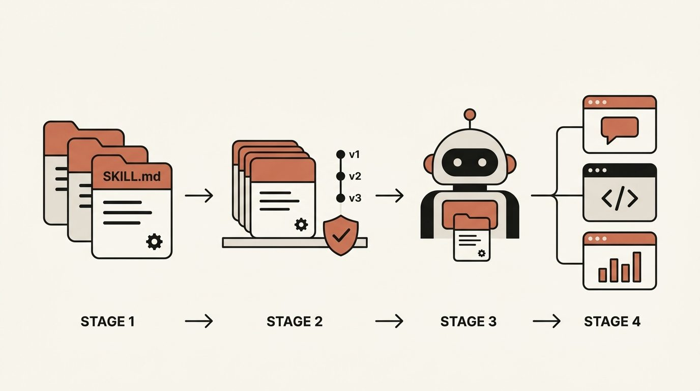
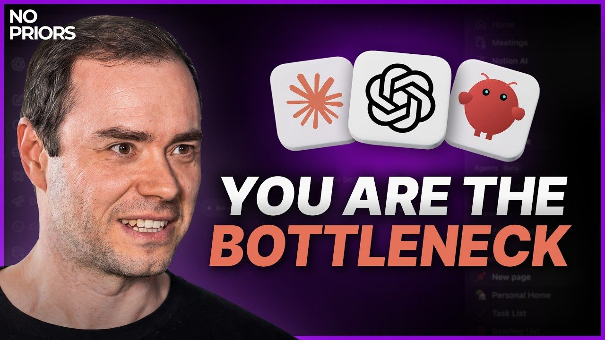
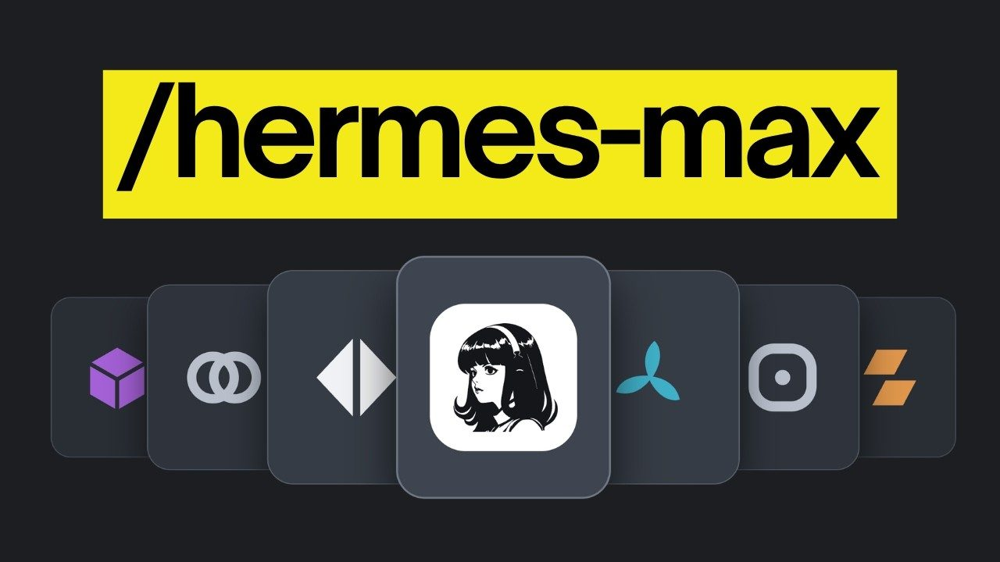
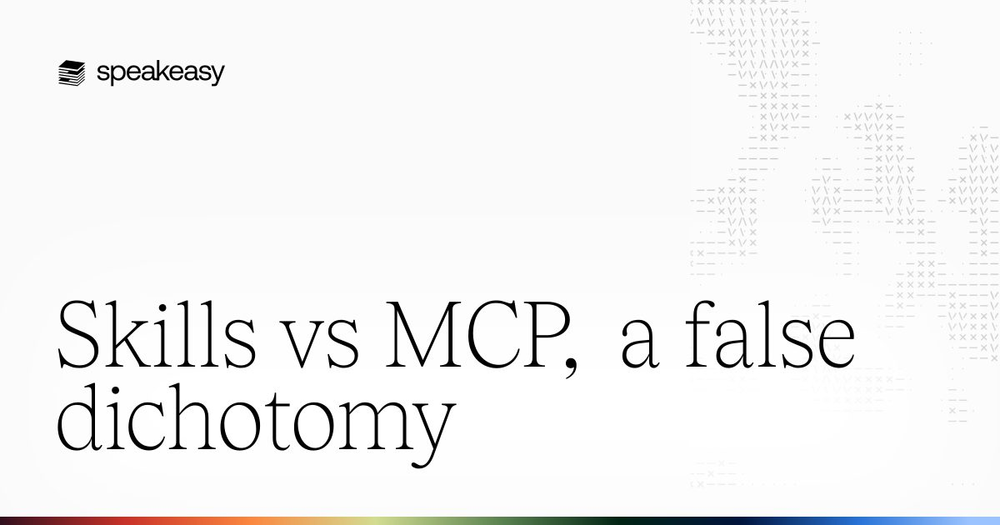
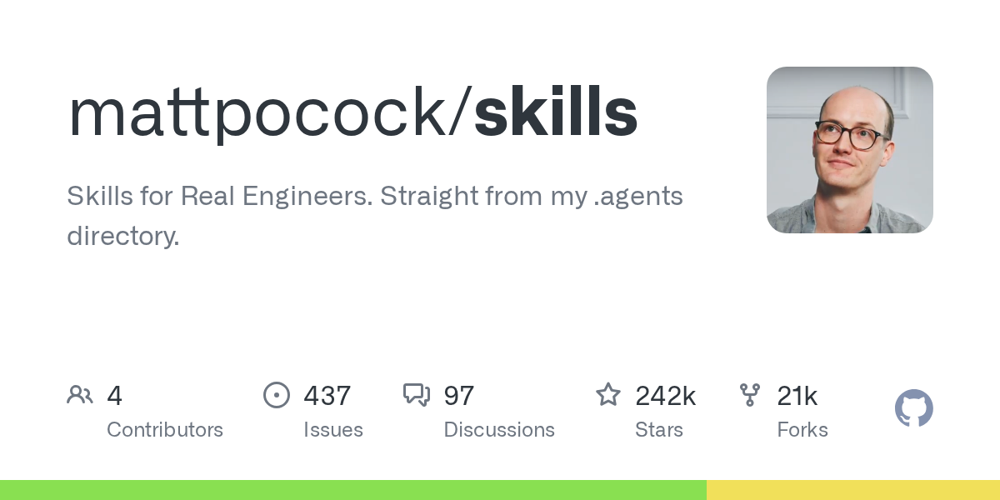

# Chapter 6 - Where Skills Go Next

> The final chapter looks forward: how the hosts are evolving, where the capability boundaries are moving, and how long this paradigm will last. Reading the trends clearly is not about chasing news — it is about making sure today's technical decisions don't go to waste.

## 087. What did the three hosts add to skills in the last six months?

Each of the three hosts used its summer 2026 updates to advance one main storyline. Claude Code advanced budget precision: the built-in claude-api skill shrank from 200,000+ tokens to about 25,000 (v2.1.234, courtesy of loading reference docs on demand), general workflow guidance moved out into a bundled skill to save about 4,700 tokens (v2.1.248), skill security was hardened in step (v2.1.228), and `/usage` now itemizes billing by skill (v2.1.149). Codex advanced choice and safety: a configurable token budget for the skill catalog (v0.149), a fixed degradation order when the catalog exceeds budget — drop descriptions first, then entries, with warnings throughout (v0.146), a hardened installer that guards against unsafe symlinks (v0.149), and skill loading moved wholesale into a standalone extension module (v0.148). Gemini CLI closed the governance loop: a `/memory` inbox that reviews skills extracted during sessions (v0.39), confirmation required to activate skills in plan mode (v0.39), and a patch contract for hot-swapping skills (v0.42). The judgment for users: skills are now a shared track in the three-way race, and every well-formed skill asset you write will not be wasted in the short term.

1) Claude Code changelog https://github.com/anthropics/claude-code/blob/main/CHANGELOG.md

2) OpenAI Codex Releases https://github.com/openai/codex/releases

3) Gemini CLI changelog https://github.com/google-gemini/gemini-cli/blob/main/docs/changelogs/index.md

## 088. Why did Codex turn skill discovery into a search engine?

Once a skill library grows large, "having the model scan the full catalog" hits a ceiling. Across five releases from July to August 2026 (v0.146–v0.150), Codex rebuilt skill discovery as a retrieval subsystem: candidate ranking uses reciprocal rank fusion plus lexical routing cards; "shadow selection" introduces an LRU baseline with weighting for recent use and task context — it can infer which skill to use from behavior even when the user never invokes one explicitly; the catalog token budget is configurable, with a fixed degradation order on overspend: drop descriptions first, then entries, with warnings throughout. The engineering moves were just as decisive: skill loading moved wholesale into a standalone extension module, the old core skill module was deleted, and the three kinds of skill roots — host, plugin, and executor — got a unified loading interface. It answers exactly the scaling pain: when an enterprise skill library passes a hundred skills, the full listing is both expensive and messy. What this means for choosing a host: with small libraries, hosts feel about the same; the bigger the library, the clearer the advantage of retrieval-based discovery — this is a new variable in picking a host.

1) OpenAI Codex Releases https://github.com/openai/codex/releases

## 089. Why does Gemini let skills self-generate and then review them through an inbox?

It turned "where do skills come from, and why should they be trusted" into a product mechanism. Two designs are unique to Gemini. First, in-session extraction: the procedures an agent distills while working automatically become skill drafts, which land in the `/memory` inbox awaiting your review — only the approved ones graduate. Second, activating a skill in plan mode requires human confirmation (v0.39): whether a skill gets used is your call. A patch contract (v0.42) rounds this out by standardizing how skills get modified. The pace says something too: preview launch on 2026-01-07, enabled by default in v0.25/v0.26 (January 20/27) — two weeks from preview to general availability, the fastest of the three. This design answers the dilemma from Q047 head-on: self-generated skills have real value (they capture real execution traces), but quality needs a human gate — banning them outright wastes value, accepting them wholesale is risky, and the inbox is the compromise. A playbook you can copy today: have the agent turn repetitive work into skill drafts, set aside a fixed half hour each week to review, and output speed and trust grow together.

1) Gemini CLI changelog https://github.com/google-gemini/gemini-cli/blob/main/docs/changelogs/index.md

## 090. When can agents build their own skills, and where does that stand today?

The three building blocks are at different stages of completion. The official October 2025 announcement sketched the direction: let agents autonomously create, edit, and evaluate skills. Here is the current state, piece by piece. Autonomous creation: most mature. Claude Code ships a built-in skill generator module (reverse-engineered source reveals skillify and a feature-flagged runSkillGenerator), the official skill-creator skill runs an "interview to extract expertise plus automated evaluation" flow, and Gemini's session extraction is already in production. Autonomous evaluation: half-mature. Trigger evaluation scripts and with/without evaluation frameworks already exist; what's missing is wiring them into an automatic loop. Autonomous editing with quality assurance: least mature — quality regressions from edits still need a human gate, which is exactly why Gemini's inbox exists. The timeline judgment (a judgment, not a promise): the human-agent collaboration model — agent drafts, human reviews — spreads first; the fully autonomous loop waits for evaluation capability to catch up. A compromise you can use right now: the apprenticeship-then-freeze workflow from Q046 is the human-in-the-loop version of self-produced skills.

1) Equipping agents for the real world with Agent Skills https://www.anthropic.com/engineering/equipping-agents-for-the-real-world-with-agent-skills

2) Claude Code reverse-engineered source analysis https://github.com/liuup/claude-code-analysis

## 091. How do you attach skills to API calls, and how does that differ from installing locally?

API-side skills run in a container without your file system. How it works: a request parameter specifies the skill, paired with the code execution tool — the skill takes effect in a server-side sandboxed container. Three differences directly affect the choice. Capability surface: local skills can touch your files and toolchain; API skills operate only within the container and its bundled dependencies. Network: API containers have no network by default and block runtime package installs; local environments are far more permissive. Management: the API side has dedicated version-management endpoints (/v1/skills), supporting centralized enterprise distribution. A third-party comparison: OpenAI's API route packages skills as an inline base64 archive sent with the request and runs them through a shell tool — different routes, same destination: skills are turning from "a local folder" into "a resource type inside the request." Rule of thumb: use local skills for interactive personal workflows (full capability); use API-side skills for at-scale delivery and customer-facing automation services (controllable, manageable, billable).

1) Claude official documentation, Skills overview https://platform.claude.com/docs/en/agents-and-tools/agent-skills/overview

2) Simon Willison's skills article index (a record of the API route) https://simonwillison.net/tags/skills/

## 092. Are skills just a transitional layer to throw away once models learn it all?

The evidence on both sides is hard; the answer depends on your holding period. The case for "yes": GitHub data — repos matching agent plus skill grew from 17 in 2023 to 23,900+ in Q1 2026, an explosion curve that looks like the adolescence of every transitional technology; the "dotfiles illusion" — config files don't break when Vim upgrades, but skills break when the model host upgrades; fragility is written into the genes; the top project's 638 open issues get read as "things the current format cannot express." The case for "no": putting procedural knowledge back into model weights means retraining on every process update — absurdly expensive for vendors and users alike; externalized knowledge takes effect the moment you edit it, and it is auditable, distributable, and composable — none of that disappears as models get stronger; in the four-layer architecture (reasoning/skills/tools/memory), the needs handled by the skills layer are permanent. The likelier endgame: high-frequency, stable processes get internalized by the model; long-tail, changeable processes stay in the skill layer. Your holding strategy follows: write the durable as abstraction (judgment frameworks) and the perishable as specifics (command examples) — whichever day the format is replaced, only the shell migrates.

1) Agent Skills Are Not the Endgame (OSSInsight) https://ossinsight.io/blog/agent-skills-explosion-2026

2) A survey of Agent Skills systems https://arxiv.org/abs/2602.12430

## 093. Why does Karpathy say everything is a skill issue?

This is an engineering philosophy about where to attribute failure, not a pep talk. His point: when an agent botches a task, it is often not that the capability is missing but that you failed to wire up what is already there — instruction files not written well enough, no handy memory tools — "this is, in principle, unbounded." The shift in attribution is the key: when something goes wrong, first audit your own context supply (instructions, materials, procedures), then question the capability boundary — it imports software engineering's model of responsibility into the agent era. He also demonstrated a new use: treat a skill as a syllabus, writing a "lecture course" skill for understanding a codebase — a prompt-style course script for the model; and he predicted that "explaining to agents will replace lecturing to humans." The supporting evidence is the automated research he showed: an agent ran parameter searches overnight and found omissions his two weeks of manual tuning had missed (weight decay on value embeddings, coupled Adam betas) — his concluding line: "I shouldn't be the bottleneck." Pieced together, the full methodology: give capability to machines, keep the methodology of organizing capability to yourself, and when something breaks, fix the skill first.

1) Skill Issue: Andrej Karpathy on Code Agents (No Priors) https://www.youtube.com/watch?v=kwSVtQ7dziU

## 094. Why can a retriever save 80% of the context, and is it the endgame?

The savings are real, and the math is public: a platform shipping 90+ skills keeps a full skill catalog of about 11,000 tokens resident; after switching to a retriever — chunk the user message, match it against all skill descriptions, send only the few most relevant ones — it dropped to 2,300 tokens, saving nine thousand-plus per turn. The payoff is doubled: cost savings plus noise reduction (fewer candidates, sharper selection).

Why it is not the endgame: retrievers miss things too — a skill the coarse match didn't pick simply does not exist for that turn; trigger uncertainty moved from the model layer to the retrieval layer, not gone, just reassigned; and running a retriever locally is unrealistic for individuals — for now it is a platform-level solution. The real significance is the direction: the next stop for skill scaling is tiered discovery — platforms do retrieval (Gemini's inbox and Codex's shadow selection are close relatives), individuals do pruning, and the spec may eventually absorb a standard mechanism of its own. Until then, the best personal move is still the three cuts from Q021: cut, merge, move.

1) Hermes Agent Skills That Make It 10x More Powerful https://www.youtube.com/watch?v=WJgxX0Eib6k

## 095. What belongs to skills, and what belongs to MCP, fine-tuning, and memory?

A four-way ledger, with a one-line criterion for each:

| Capability layer | Criterion | Typical cases | Counterexample (don't use) |
|---|---|---|---|
| Skills | Text-expressible procedural knowledge, effective the moment you edit it | Report workflows, coding standards, pitfall playbooks | Data access requiring real-time authentication |
| MCP | Needs to connect external systems, authenticate, and truly execute | Database queries, SaaS integrations, browser operations | Pure process guidance (no connection needed) |
| Fine-tuning | A behavioral baseline that must reproduce consistently across a hundred thousand runs and rarely changes | Fixed writing style, hard format constraints | Process knowledge that changes frequently |
| Memory | Facts and preferences across sessions | Who the user is, project history, the last decision | One-off operating steps |

The official metaphor is worth borrowing: skills are the recipe, MCP is the kitchen — "MCP connects Claude to data; Skills teach Claude what to do with that data." Where the boundary debate converges (Speakeasy puts it most completely): skills teach the agent how to do things; MCP gives the agent the ability to do them; credentials live on the server rather than in the agent's hands — that is the root reason MCP cannot be replaced by skills. The most common combo in practice is skills plus MCP: the skill spells out which tool to call and how to judge whether the result is right; MCP makes the real connection. One counterexample is worth remembering: in fast-moving domains (SDKs updated weekly), don't freeze details into skills — a doc-level MCP that ships updates along with the docs moves faster — one team tested it and chose MCP for exactly that reason.

1) Skills vs MCP, a false dichotomy https://speakeasy.com/blog/skills-vs-mcp

2) Skills vs MCP tools for agents https://www.llamaindex.ai/blog/skills-vs-mcp-tools-for-agents-when-to-use-what

3) Progressive Disclosure Might Replace MCP https://www.mcpjam.com/blog/claude-agent-skills

## 096. When should you upgrade skills into a plugin for distribution?

Package it when two of the three signals light up. Signal one, count: more than three to five skills sharing the same set of reference files and scripts — loose files start getting hard to manage, and a plugin bundles them with commands, subagents, and MCP configuration into one versioned package. Signal two, audience: you are shipping to a team or community — recipients want "one command to install, updates automatically," not a pile of files plus manual syncing. Signal three, cadence: once the update frequency climbs, marketplace pushes are more controllable than copying and can carry release notes. Counter-signal: one or two skills for personal use — packaging is complexity you asked for; loose files are fastest to edit. Before publishing, pick a side: subscription (official marketplace, auto-updates, read-only — the official repository works this way) or ownership (copied files, user-editable — much of the skills.sh ecosystem does), and community experience says mixing the two leads to the embarrassment of the same skill installed twice. Reference samples: the official plugin marketplace (about twenty human-vetted skills) and the personal plugin repository (mattpocock's complete set of engineering skills) are the templates for the two models.

1) Claude Code official Skills documentation (plugin marketplace) https://code.claude.com/docs/en/skills

2) mattpocock/skills https://github.com/mattpocock/skills

## 097. How do you plan your team's first year of skill library building?

Cadence matters more than speed; walk it in three phases. Month one: inventory and institution only — use the official signal lines (the same task done three-plus times, the same instruction pasted repeatedly, the need for consistent output) to sweep out a candidate list; set the basic rules: naming conventions, directory hierarchy (the global/project boundary), a pre-install checklist, and a registration-card template (owner/source/audit date/evaluation). Months two to three: grow five to ten polished skills — use the apprenticeship-then-freeze method, give each a minimal set of evaluation cases, and assign an owner; at this stage resist the urge to mass-produce; first establish the reputation that "skills are trusted assets." After six months, enter management mode: make re-evaluation periodic (one month to one quarter per cycle; always retest when you change models or tools), make deprecation explicit (anything that fails testing gets clearly flagged and removed from the default list), and start accumulating a team-specific pitfall knowledge base. Set expectations with community data: a good skill saves about two hours a week, and the savings stack — provided it is being maintained. A skill library isn't built; it's raised.

1) Agent Skills Masterclass (Nufar Gaspar) https://www.youtube.com/watch?v=fs_Y3gvj7lk

2) How I Use Skills + AI Agents to Run My Life https://www.youtube.com/watch?v=xHsftiyT9pQ

## 098. How do you turn skill engineering into your career moat?

The moat is not knowing how to write skills; it is what you have to write about. The hardest sample in the ecosystem has already proven it: engineer Matt Pocock open-sourced his personal skill catalog, measured at 241,871 stars on 2026-08-31 — the stars buy his years of engineering judgment, not SKILL.md syntax. Unpack the moat into three layers. The bottom layer: domain know-how — the pitfalls you have hit, your industry's unwritten rules — other people's raw material, impossible to copy. The middle layer: packaging craft — trigger engineering, structure design, evaluation iteration — learnable by anyone, moving from scarce to standard within two years. The top layer: distribution and reputation — consistent releases, responsive maintenance, real user adaptation stories. The strategy maps onto a timeline: short term, monetize the middle layer (helping enterprises build skill libraries; skill engineering consulting already exists); long term, sink accumulated practice back into the bottom layer. Two concrete moves: run your skill library as a public portfolio, and build the habit of "failure-mode audits" (logging where the agent blows up in your business) — that is a material mine only you own.

1) mattpocock/skills https://github.com/mattpocock/skills

2) From Getting Started to Mastering Agent Skills (Yize Eze) https://hub.baai.ac.cn/view/52082

## 099. How do you get started with skills, and what makes the first three months count?

The goal for the first three months is "a first batch of skills that actually get used," not quantity. Month one, subtraction plus infrastructure: use the three signal lines (the same task done three-plus times, the same instruction pasted repeatedly, the need for consistent output) to filter three to five candidates out of your daily work; set up the environment — directory conventions, a pre-install checklist, a minimal evaluation case set. Month two, go deep: take each skill through the full "apprenticeship-then-freeze, pitfall capture, trigger evaluation" flow; three polished pieces beat thirty drafts; the trigger, truncation, and compaction pitfalls you hit along the way are themselves your first batch of material to publish. Month three, connect: put the skills to work internally and collect feedback; pick the best one, polish it, and publish it (high-quality Chinese-language supply is still scarce); establish a monthly re-evaluation rhythm. The test in one line: three months in, does your daily workflow contain a few skills that hurt to work without? If yes, you are in. If not, the processes you picked in month one did not repeat enough — go back and reselect.

1) Agent Skills Masterclass (Nufar Gaspar) https://www.youtube.com/watch?v=fs_Y3gvj7lk

2) Agent Skills creator best practices https://agentskills.io/skill-creation/best-practices

## 100. What value stays behind after skills disappear?

Formats will be iterated; the four capabilities they forced into being will not. First, attribution: when something breaks, first ask "was the procedural knowledge fed in correctly," then debate capability boundaries — Karpathy's "everything is a skill issue" does not depend on any format. Second, the habit of turning knowledge into assets: writing tacit experience into machine-executable instructions — from Voyager's skill library in 2023 (executable code plus retrieval) to today's SKILL.md, the form has changed three times, and the move itself keeps appreciating. Third, trust engineering: pre-install review, permission containment, source tiering, defense in depth — the stronger the agent and the bigger its permissions, the more these disciplines are worth; every item in Chapter 5 stays valid. Fourth, the sense of boundaries: what to automate and what to leave to human judgment — the final arbiter of all skill engineering. Q092 said the format is a transitional layer; this is the second half of that sentence: capabilities that grow on a transitional layer compound. Skills will disappear. You — who can write skills, audit skills, and manage skills — will not have learned in vain.

1) Agent Skills Are Not the Endgame (OSSInsight) https://ossinsight.io/blog/agent-skills-explosion-2026

2) Voyager: An Open-Ended Embodied Agent with Large Language Models https://arxiv.org/abs/2305.16291
