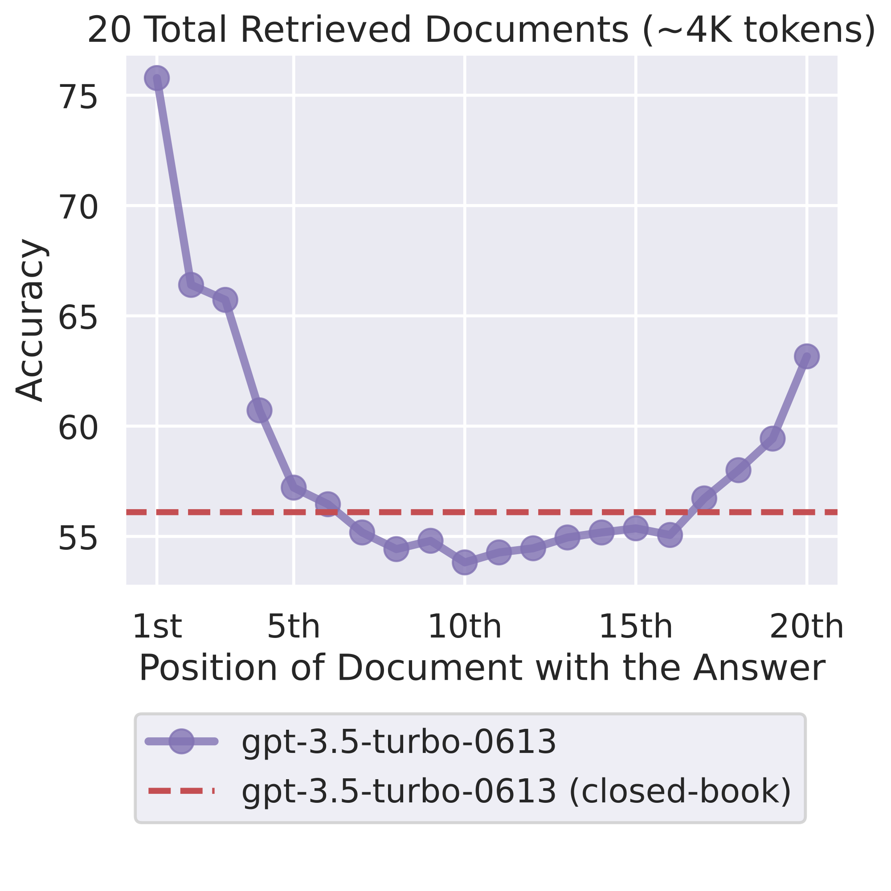
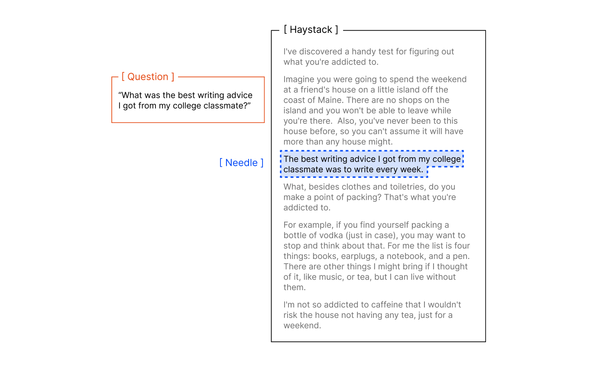
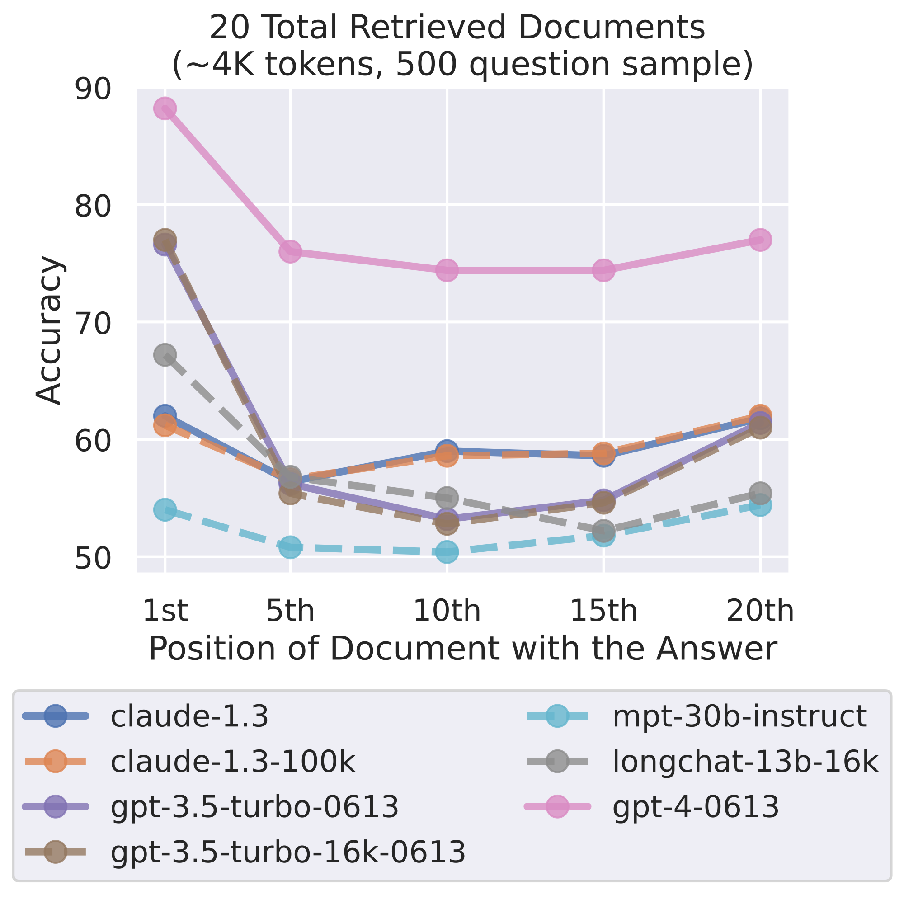

# Chapter 1 - Why Bigger Windows Make Models Dumber

> This chapter is the foundation of the whole book. The five chapters after it — how to fill the window, how to compact, how to save cache, how to verify — all rest on one fact: a window's attention gets diluted, and what you put in matters more than how much. Take the criteria from these 16 questions and you can derive every later technique yourself.

## 001. Why do models get dumber as the window fills up?

It isn't your imagination — models genuinely get dumber as the window fills. The phenomenon is called context rot: the more tokens in the window, the worse the model gets at retrieving information from it accurately. A controlled experiment across 18 models (GPT-4.1, Claude 4, Gemini 2.5, and the open-weights Qwen3 all included) reached one conclusion: no model holds its score as input grows; the only difference is how fast each one degrades.

The cause is architectural. A model spends an attention budget to parse context, and every incoming token takes a cut: a transformer builds pairwise relations between each token and every other token in the window, so n tokens mean n-squared pairs — the fuller the window, the thinner the budget spreads. The window behaves more like RAM here: everything inside is siphoning compute in real time. The good news is there's no cliff. Performance degrades on a gradient — the model still works in long context, but retrieval precision and long-range reasoning accuracy slide, and what you feel is "nothing is exactly wrong, it's just not as sharp as a short conversation."

Before adding anything, run three questions; if you can't answer them, don't add. One: does it help the current task? Two: does the model need it at this step — if it's only used three steps from now, put it in a file first. Three: does removing it make the task worse — if not, it's noise. Question 017 turns the three into an operating procedure. The tidy numbers circulating online — "model X gets dumb past N tokens" — have no first-hand experimental support; don't use them as conclusions.

1) Anthropic, Effective context engineering for AI agents https://www.anthropic.com/engineering/effective-context-engineering-for-ai-agents

2) Chroma, Context Rot https://research.trychroma.com/context-rot

## 002. Retrieval tests all pass — so why do real tasks still fail?

The perfect score is real and so is the failure, because the test never measured what you think it measured. The mainstream long-context benchmark, needle-in-a-haystack (NIAH), buries a known sentence in a long document and asks the model to find it verbatim — it tests lexical matching. Real agent work is semantic: question and answer often share no keywords, and the model has to discriminate against a pile of related-but-non-answering content.

Make NIAH harder and re-test. Lower the semantic similarity between needle and question (the question doesn't echo the needle's words) and scores drop visibly faster as input grows; add a few distractor sentences that are on-topic but don't answer, and it drops harder still. In LongMemEval, which is closer to real conversations, models fed only relevant snippets (about 300 tokens on average) mostly answer correctly; fed the full 113k-token chat log they degrade across the board, and the Claude family, facing ambiguity, tends to simply refuse to answer. That maps to the two failure postures you see most: answering wrongly with confidence, or waving its hands and claiming it can't find it.

When choosing a model, split "can find it" from "can use it" into three tests and run them on your own documents — that beats any leaderboard:

- Findable: single-needle retrieval where the answer's keywords sit verbatim in the long document;
- Usable: rephrase the question so the answer's original keywords are gone;
- Distractor-resistant: add two or three on-topic but non-answering passages to the document and watch how much the score drops.

The full hands-on procedure is in Question 011; the long-term practice of planting probes is in Question 090.

1) Chroma, Context Rot https://research.trychroma.com/context-rot

2) Chroma context-rot replication repository https://github.com/chroma-core/context-rot

## 003. Why does information sitting in the middle get forgotten the most?

Take the placement rules first: anything you want the model to use goes to the beginning or the end; past 20 documents, feed less — the extras mostly burn attention for nothing; and the placement guidance agrees across vendors — long documents up front, your question last.

2023 produced a very clean experimental curve: in multi-document QA the answer always sits in one document, and only its position moves. GPT-3.5-Turbo's scores trace a U shape: good at the start (primacy effect), good at the end (recency effect), collapsed in the middle. The most striking numbers: with 20 to 30 documents, key information lying in the middle scores below the closed-book condition (56.1%) where the model gets no documents at all. GPT-4 doesn't escape either — higher absolute scores, same curve shape. The marginal return on added documents decays fast too: past 20 documents, each addition buys GPT-3.5-Turbo only about 1.5% more — the reading side saturates first. Ordering rules expand in Question 022.

Humans reciting lists are also solid at the ends and shaky in the middle — the serial position effect, measured back in Ebbinghaus's era. Later models have flattened the curve, but the direction "position affects scores" has not been overturned by a single replication since publication.

1) Lost in the Middle (arXiv 2307.03172) https://arxiv.org/abs/2307.03172

2) Google, Long context (Gemini API docs) https://ai.google.dev/gemini-api/docs/long-context

## 004. Why does arrangement matter more than mere presence in the window?

Whether relevant information is in the window is just the baseline; what matters more is how it is presented. Same needle, same length, change only the arrangement (semantic similarity, distractors, haystack structure) and scores separate by a visible gap. Information present but buried and information absent are practically closer for the model than you'd think.

The operating principle follows: find the smallest possible set of high-signal tokens that maximizes the probability of achieving the goal. For arrangement that means three things: segment where it helps, with XML tags or Markdown headings — don't smear everything into one blob; give instructions, background, and tool documentation their own sections, one job per section; pick representative examples, don't dump an inventory of edge cases.

A self-check is ready-made: spread out what you plan to put in the window, pretend to hand it to a colleague with zero background, and ask whether they can tell what's the task, what's reference, what's noise. Arrangement a colleague can't parse, a model can't either. The origin and variants of this test are in Question 067; Question 006 holds an even more counterintuitive experimental result — scrambled context outperforms fluent context.

1) Chroma, Context Rot https://research.trychroma.com/context-rot

2) Anthropic, Effective context engineering for AI agents https://www.anthropic.com/engineering/effective-context-engineering-for-ai-agents

## 005. Why do long conversations get messier the longer they run, and why can't most be saved?

You've seen the back half of a long session: the model starts repeating mistakes, reverting things it just fixed, and stirring your instructions together with its own errors. Split a task that could be stated once into multi-turn dialogue and all tested models drop 39% on average; even o3 falls from 98.1 to 64.1 (secondhand figures).

The mechanism is worse than you'd guess. The model rushes to conclusions in early turns; by the time later information arrives, it is already orbiting that possibly-wrong early conclusion. Once a model takes a wrong step early, it gets lost and can't find its way back on its own. The composition of the decay has been broken out too: aptitude dips slightly while unreliability climbs sharply — the same question right this time, wrong the next, which in production is harder to handle than failing consistently. The measurements rest on over 200,000 simulated conversations and hold across models.

"Unsalvageable" has a line of consensus. Claude Code users have described the symptoms: unable to tell which instructions were the user's and which errors were its own, spinning in circles the longer the session runs, even dismissing a test it just broke as "it was always broken." A criterion you can copy: when any two of the three signals appear — "overturning itself," "repeating the same failed action," "ignoring new instructions" — stop patching. Write the confirmed conclusions into a file and restart in a fresh window carrying those conclusions. The restart-versus-compaction tradeoff is in Question 040.

1) LLMs Get Lost In Multi-Turn Conversation (arXiv 2505.06120) https://arxiv.org/abs/2505.06120

2) Context Rot report discussion (HN) https://news.ycombinator.com/item?id=44564248

3) dbreunig, How Long Contexts Fail https://www.dbreunig.com/2025/06/22/how-contexts-fail-and-how-to-fix-them.html

## 006. Why does scrambled context outperform coherent context?

Counterintuitive, but it shows up consistently across 18 models: shuffle the haystack's sentences at random and the model's needle-finding scores beat the logically coherent original — the fluent structure itself consistently hurts scores. The comparison was run individually across 8 input lengths and 11 needle positions. Fluent text has its own argumentative flow, so an inserted needle reads like an intruder breaking the rhythm; once everything is scrambled there's no coherence left to break, and the needle blends right in. Models are more sensitive to structure than anyone assumed.

Take three positive levers into production and leave shuffling to experiments: shrink volume, raise the similarity between needle and question, cut distractors — all three help unconditionally. Throw away the intuition "prettier formatting makes the model work better"; in long context, structure's effect is non-monotonic, and the three controllable things are the ones above.

1) Chroma, Context Rot https://research.trychroma.com/context-rot

2) Context Rot report discussion (HN) https://news.ycombinator.com/item?id=44564248

## 007. How do you tell apart the four ways context dies (poisoning, distraction, clash, staleness)?

Context failures come in four kinds; telling them apart is the first step of debugging:

| Failure | One-line signature | Typical case |
|---|---|---|
| Poisoning | A hallucination enters the window and gets cited repeatedly | Gemini playing Pokémon: a wrong game state written into the goals area, then chasing impossible goals ever after |
| Distraction | The window is so long the model stares at history and forgets its own skills | The agent starts echoing past actions and stops producing new plans; Llama 3.1 405B accuracy starts slipping around 32k |
| Confusion | Extra content drags the answer off course | 46 tool definitions stuffed in failed outright; cut to 19 it succeeded — the window was nowhere near full |
| Clash | Information inside the window fights itself | In multi-turn dialogue an early wrong answer stays in context and drags the final answer down with it |

Debug in this order, starting from the most confirmable: check poisoning first (is a hallucination being cited as fact — the signature is errors that breed and deepen as the chat continues); then clash (are two sources fighting — the signature is new and old instructions contradicting each other); then confusion (does cutting tools or material improve things — the signature is tool misuse and off-topic answers); finally distraction (simply too long — the signature is echoing history). The four often co-occur, and pure single cases are rare in production, so when you find one, apply its fix and look again. Staleness usually files under clash: old information wasn't cleared and now works against the new.

1) dbreunig, How Long Contexts Fail https://www.dbreunig.com/2025/06/22/how-contexts-fail-and-how-to-fix-them.html

2) LangChain, Context Engineering https://www.langchain.com/blog/context-engineering-for-agents

## 008. Why is attention a budget that shrinks with every token?

Context is a finite resource with diminishing marginal returns — that is the entire premise of the attention budget. A model spends an attention budget to parse context, and each new token consumes a slice. The budget has a mathematical shape: transformer self-attention computes a relation for every pair of tokens, so n tokens mean n-squared pairs — double the input and the pair count quadruples. One more layer: training data contains far more short sequences than long ones, so models have little experience with — and few dedicated parameters for — long-range dependencies spanning the whole window. Positional interpolation lets a model force down long sequences, at the cost of blurrier position understanding.

Two rules suffice for budget-minded window management. First, add one thing by deleting one thing: system prompt, tool definitions, history messages, and retrieval results all draw from the same pool; to add 5k tokens of retrieval results, first cut 5k from history or examples. Second, give resident items fixed caps: the system prompt and tool definitions occupy the window at full price every turn — set a cap for them in config before work starts (a rule of thumb says "no more than a fifth of the window"; individual variance is large, trust your own measurements) and trim when over. Every technique in the later chapters — tool slimming, example curation, compaction, externalized memory — is a specific way of spending under these two rules; the only difference is where you spend and where you save.

1) Anthropic, Effective context engineering for AI agents https://www.anthropic.com/engineering/effective-context-engineering-for-ai-agents

2) Anthropic, Context windows (official docs) https://platform.claude.com/docs/build-with-claude/context-windows

## 009. How do you tell whether a dumb agent is the model's fault or the context's?

The verdict first: most of the time it's the context. Split agent failures two ways: the model itself isn't good enough, or the model wasn't handed the right context — in engineering practice the second dominates. There's an experienced magnitude too: a tool calling loop that runs 10–20 consecutive turns slides into unrecoverable confusion — when long sessions go wrong, check context first.

Three steps, by elimination.

Step one: change the material, not the model. On the same task, hand-rearrange the context — key information to the head and tail, delete the mutually contradictory old conclusions, move the task description to the end — and rerun. Fixed? It was the context.

Step two: check the instruction channel. Rules written into CLAUDE.md that don't take effect is a high-frequency case: it is injected as a user message, and vague or mutually conflicting instructions carry no enforcement power to begin with. Instructions also go "missing" after compaction — the project-root CLAUDE.md gets re-injected, requirements stated only in the conversation don't. Run /doctor to get the health report.

Step three: match symptoms. Context's typical symptoms: can't tell its own errors from your instructions, falls into the same pit repeatedly, ignores the test you just wrote. On a match, don't start by doubting the model's IQ.

Only when all three steps come back clean and it still fails does "the model's fault" earn its verdict — that is when switching models means anything.

1) Tielei Zhang, From Prompt Engineering to Context Engineering https://zhangtielei.com/posts/blog-context-engineering.html

2) Claude Code, How Claude remembers your project (docs) https://code.claude.com/docs/en/memory

## 010. How do you get the model itself to report how much window it has left?

Nothing to install — the new generation of Claude's API already feeds it automatically, under the name context awareness. It works as two injections: in every request's system prompt the API inserts the total budget, looking like `<budget:token_budget>200000</budget:token_budget>`; after every tool call it injects a remaining-balance reminder, `<system_warning>Token usage: 35000/200000; 165000 remaining</system_warning>`. You never send these tags yourself and you can't turn them off; the point is that the model knows where it stands and paces work by the real remaining budget instead of wrapping up on vibes. Two usage notes: don't parse these tags downstream for automation — for quantitative data, read the usage field in the response; and if your harness has compaction or external archiving, say so explicitly to the model, otherwise it will finish early on its own as it nears the budget ceiling. The gist of the ready-made template: "context near the limit gets compacted automatically; don't stop early — save your progress first."

Coverage: Sonnet 5, Sonnet 4.6, Sonnet 4.5, and Haiku 4.5 ship with it; Opus 4.7 and later Opus, plus the Fable and Mythos series, don't have these injection tags — the alternative is task budgets (beta, subject to change at any time), where you explicitly hand the model a token budget.

1) Anthropic, Context windows (official docs) https://platform.claude.com/docs/build-with-claude/context-windows

2) Anthropic, Prompting best practices https://platform.claude.com/docs/build-with-claude/prompt-engineering/claude-prompting-best-practices

## 011. How do you measure the actual usable window of the model in your hands?

Public leaderboards can't help you here; this one you measure yourself, and the barrier is now low: the full 18-model experiment has open-source code — task design, input-length gradient, scoring all included — swap in your model and documents and run.

A minimal home-built version works too, with three design points. First, you need a length gradient: at least five tiers, from a few thousand tokens up to near the rated ceiling, varying length alone while task difficulty stays constant — that's the core of the method, otherwise you can't tell a "longer" problem from a "harder" one. Second, make the needles semantic: don't use lexically matchable needles like "the password is X"; use questions that require semantic association, otherwise what you measured is the retrieval ceiling. Third, use the multi-needle measure: single-needle reaches about 99%, multi-needle scores visibly diverge and swing widely — don't extrapolate multi-needle performance from single-needle results.

Before you start, read one first-hand lesson. Someone posted their full conversation with Gemini: the poster judged from experience that the rated 1M was really about 200k usable, and the model itself admitted in the conversation that the gap between the rated spec and user reality was huge. A practitioner self-report and a single anecdote — but it shows that the API layer, the subscription layer, either can carry hidden shrinkage — so the entrance you test must be the entrance you actually use.

1) Chroma, Context Rot https://research.trychroma.com/context-rot

2) Reddit, The "1 million token context window" is a lie. https://www.reddit.com/r/GeminiAI/comments/1qs4ht8/

3) Google, Long context (Gemini API docs) https://ai.google.dev/gemini-api/docs/long-context

## 012. Why does the same model become a different model when the host changes?

What goes into the window is assembled by the host before every inference — model capability is fixed, and the host's context engineering decides how much of it an inference can call up. A direct comparison: Cursor and Claude Code run the same underlying models with very different results — CC is more liberal about invoking system commands, and from requirement to plan breakdown to execution to build acceptance, every step re-processes the context.

Assembly deciding performance has hard evidence too: the lead agent writes the research plan into external memory before starting, because context past 200k gets truncated; each subagent gets its own window, its own tool list, and clear task boundaries, and tens of thousands of tokens of exploration come back to the lead compressed to 1,000–2,000 tokens. Same models, different assembly: in internal evals the multi-agent system outperformed by 90.2% (internal eval).

Action before complaining "the model is bad": pull the host's assembly checklist — how many tokens the system prompt takes, how many tools are attached, how history gets truncated, whether CLAUDE.md is loaded. Host-layer switches are far cheaper and far more adjustable than switching models. The cross-host comparison of skill loading lives in the Agent Skills book; this one is about assembly only.

1) CE101, Chapter 1: From Prompt Engineering to Context https://ce101.ifuryst.com/basics/from-prompt-engineering-to-context-engineering

2) Anthropic, How we built our multi-agent research system https://www.anthropic.com/engineering/built-multi-agent-research-system

3) Anthropic, Effective context engineering for AI agents https://www.anthropic.com/engineering/effective-context-engineering-for-ai-agents

## 013. How many layers separate the advertised 1M window from the usable one?

Four layers. You buy the first; task success usually rides on the third and fourth.

| Layer | Meaning | Decided by |
|---|---|---|
| Rated window | The number on the marketing page — if it says 1M, it says 1M | Model vendor |
| What fits | How much a request can actually hold: system prompt, tool definitions, history, and thinking tokens all occupy the window | Your assembly choices and product limits |
| What's retrievable | Of the information that fit in, how much can truly be pulled back out when needed | The model and how the information is arranged |
| What holds reasoning | On the retrieved information, how far reasoning quality can be sustained | The model and task difficulty |

From the second layer down, each is smaller than the one above it. A third-party comparison table from mid-2026 draws the line this way: rated capacity is capacity; effective context is the length where quality holds; every published long-context benchmark shows a gap between the two. Early measurements on the RULER benchmark: Gemini 1.5 Pro dropped just 2.3 points from 4K to 128K, Llama 3.1 70B dropped 29.9, Mixtral 8x22B dropped 63.9 — same curve, different steepness per model (comparison figures in this paragraph are the 2026-06 vendor snapshot). The user side has a counterpoint too: in a Reddit thread the poster judged from experience the rated 1M to be about 200k usable (single anecdote).

One action: ask the four layers separately. Capacity questions go to the window documentation; the token counting API can compute them ahead of time. Retrievable and reasoning questions don't go to the marketing page — test them by hand per Question 011. Once the four numbers line up, decide whether the long window is worth paying for. The four-layer framework is this book's synthesis, offered as a way to split the problem.

1) Reddit, The "1 million token context window" is a lie. https://www.reddit.com/r/GeminiAI/comments/1qs4ht8/

2) Morph, LLM context window comparison https://www.morphllm.com/llm-context-window-comparison

3) Anthropic, Context windows (official docs) https://platform.claude.com/docs/build-with-claude/context-windows

## 014. Is prompt engineering really dead, or is that manufactured anxiety?

It isn't dead. It got marketed. The claim comes in two versions: those saying it's dead want to sell a new concept; those calling it a scam want an easy out. Both sides have brandished loud numbers, and both sets of numbers crashed first.

The widest-circulating shell was "73% of AI startups are just prompt engineering," which hit the HN front page in November 2025 at 246 points. The comments later took it apart: judged by its technical details, the pipeline sequence diagram in the piece could not possibly have been observed by its author, and multiple highly-upvoted comments ruled it outright fabricated "LLM slop." A number deployed to argue "new engineering crushes old incantations" was itself a product of incantations — which makes it this book's template for handling percentages of unknown provenance: quotable, but only as a failure case, never as fact.

The opposition's strongest formulation: talking a bullshit generator into handing you correct data isn't engineering, it's con artistry. Harsh, but it aims at a real problem: plenty of so-called techniques have no measurement, no control group, only "we used it and it worked well." The other side holds a number of its own: one developer self-reports a pipeline with roughly a 75% first-pass rate, but one run in ten looks excellent while being fundamentally wrong — that 10% is exactly what context engineering exists to handle; no prompt, however well written, blocks it (practitioner self-report, no sample size). The plainest phrasing came from the Chinese-language community: prompts remain a subset of context engineering; the "it's dead" line is a conflict narrative manufactured to spread a new concept.

So the verdict: prompt engineering isn't dead; it was absorbed. The skill of writing good instructions for single-turn interaction stays useful forever; in multi-turn, multi-tool, long sessions, instructions alone aren't enough. Don't pick a side — run the Question 009 triage and patch whichever side the problem lands on.

1) HN, The new skill in AI is not prompting, it's context engineering https://news.ycombinator.com/item?id=44427757

2) HN, 73% of AI startups are just prompt engineering https://news.ycombinator.com/item?id=46024644

3) Juejin, Effective Context Engineering: a close reading and full survey https://juejin.cn/post/7563331686773047338

## 015. What makes context engineering engineering instead of rebranded incantation?

The test of whether a craft deserves "engineering" is whether it has real-world failure modes to fight. Most mature engineering disciplines deal with tolerances and uncertainty — the physical world is uncertain by nature; software engineering is actually the easy case, because computers always do exactly what you tell them. LLM failure modes and the techniques against them share more with the physical engineering disciplines than with software — context engineering is closer to civil engineering than to coding.

The other side has evidence too: experiments have long shown that different parts of the window are treated differently — which is like building bridges while nobody knows the strength of the steel. Traditional engineering dares to call itself engineering because mature materials theory sits underneath; the LLM layer doesn't have that yet. The honest verdict between the two sides: bridge-building did go through a "try it and see what collapses" phase before theory grew — and context engineering today is in that phase (this book's judgment).

On the most operational definition, context engineering is the set of strategies for curating and maintaining an optimal token set during inference. It has a defined object, constraints, and measurable output. The criterion goes like this: when does your context work deserve the name engineering? When you can state your current failure rate, the before-and-after numbers for a change, and why it works. If you can't, you're still tuning incantations. The minimal starting practice is in Question 093.

1) HN, Context engineering (chrisloy thread, with the simonw vs satisfice exchange) https://news.ycombinator.com/item?id=45788842

2) Anthropic, Effective context engineering for AI agents https://www.anthropic.com/engineering/effective-context-engineering-for-ai-agents

## 016. How did one tweet make context engineering go viral?

The archaeology is shorter than the legend: four steps. Step one, Shopify CEO Tobi Lütke tweeted that he prefers "context engineering" because it more accurately describes the core skill — the art of providing all the context a task needs to be probabilistically solvable. Then the detonation: on 2025-06-25 Karpathy retweeted with a +1, adding the phrasing that actually lit it up: in industrial-grade LLM applications, filling the window with just the right information is a fine art and science; he listed task descriptions, few-shot examples, RAG, tools, state, history, compaction. An HN thread opened the same day. On June 27 Simon Willison catalogued both definitions and issued a judgment: a term lives or dies by the public's presumed definition — prompt engineering died of its presumed definition, typing theatrics in a chat box, while context engineering's presumed definition "will likely remain close to the intended one," so it sticks.

The fuel behind the spread: before academics weighed in, the term had already been validated by a performance-review system. The earlier internal memo was published by Tobi himself on 2025-04-07; "learning to prompt and load context" was written into performance reviews, and you had to prove AI couldn't do the job before requesting headcount — when commenters pressed on which tasks truly saw hundredfold speedups, no answer came. A year later he posted a retrospective: what had been mildly controversial at the time was, looking back, consensus.

One line to close: the term is the container; the mechanism is the cargo. The seven items in Karpathy's tweet are exactly the list this book's six chapters unpack.

1) Simon Willison, Context engineering https://simonwillison.net/2025/Jun/27/context-engineering/

2) Tobi Lütke memo (full original X post) https://x.com/tobi/status/1909251946235437514
