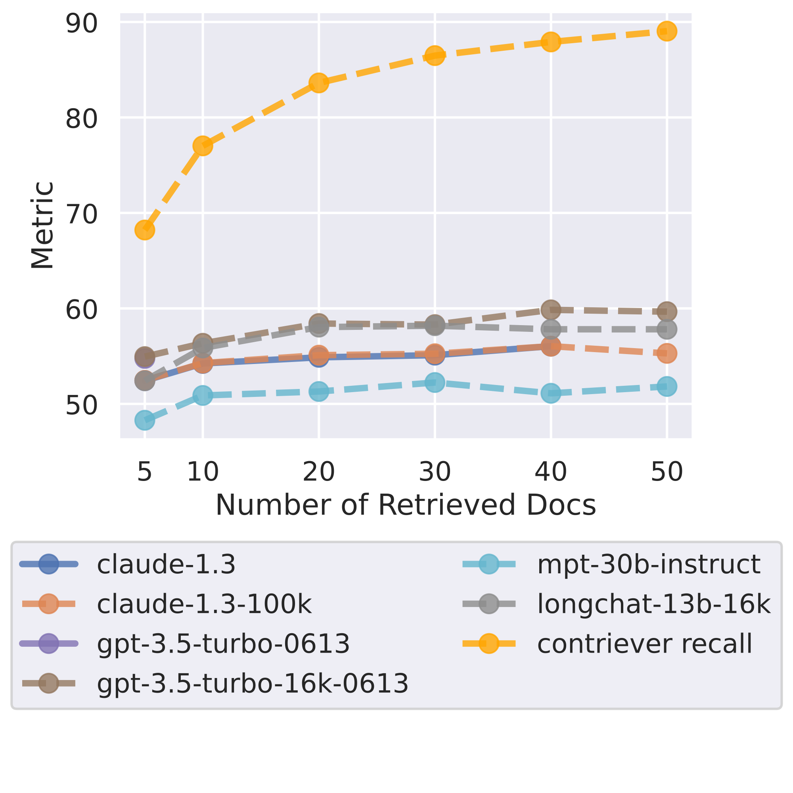
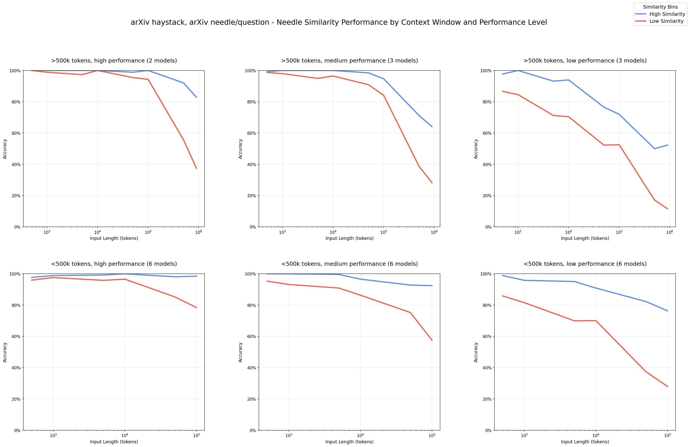

# Chapter 2 - What Deserves a Place in the Window

> Chapter 1 showed you the window's temperament; this chapter is where the assembly decisions happen: retrieved material, cross-session memory, tool definitions, few-shot examples — on what standard does each get a seat in the window? Assembly is a trade-off, and assembling wrong costs more than not assembling at all — dead tokens in the window don't just waste money, they compete for the same attention budget as the content that actually matters (Question 008).

## 017. Why is "the smallest set of high-signal tokens" the only universal principle?

Window tricks change every year; this one doesn't. The whole method compresses into one phrase — the smallest possible set of high-signal tokens: the smallest set of high-signal tokens that maximizes the likelihood of the desired behavior. Both qualifiers are non-negotiable. High-signal: every token must contribute to the inference. Smallest: contributing isn't enough — it has to be worth its seat.

Why is this the only universal principle? Every other technique has a scope: retrieval fits when knowledge lives outside the window, memory fits across sessions, compaction fits when sessions run long — only "less but better" holds in every scenario. The mechanism is the attention budget (Question 008): n tokens create n² attention relationships, and every dead token you add dilutes the computation of all of them. In context engineering's operational taxonomy, "retrieval and generation" ranks first-class, which corroborates the same principle. So "does it fit" was never the right test: a 200K window holding 190K of irrelevant material underperforms one holding 20K of relevant material.

In practice, run the sentence backwards: don't ask "what else could I add," ask "what happens if I remove this token." If nothing changes, leave it out. Run every category through this ruler — system prompt, examples, tool definitions, retrieval results. The remaining seventeen questions in this chapter are all this one rule applied to different parts.

1) Anthropic, Effective context engineering for AI agents https://www.anthropic.com/engineering/effective-context-engineering-for-ai-agents

2) A Survey of Context Engineering for LLMs (arXiv 2507.13334) https://arxiv.org/abs/2507.13334

## 018. Why does retrieving before answering beat stuffing everything in?

The counterexample comes first: preloading breeds laziness — dump the material into the window and wash your hands. Material enters the window on one of two schedules: pre-computed, retrieved ahead of time and stuffed into the prompt; or just-in-time, where the window holds only lightweight identifiers — file paths, stored queries, links — and the content is read when needed. Pre-fetch or just-in-time depends on the task, and teams increasingly bolt just-in-time strategies onto their retrieval systems. Claude Code is the worked example: it doesn't read the database or codebase into the window; it writes targeted queries and flips through with commands like head and tail, never loading the full data object.

One paired observation (practitioner-reported, not a controlled experiment): the same batch of long documents, fed in whole versus summarized into key points first and retrieved in full on demand — the latter wins.

Just-in-time has a price too: runtime exploration is slower, and the model needs good navigation tools and heuristics, or it gets lost, chases dead ends, and burns context for nothing. So the production posture is hybrid: preload stable static knowledge (which also eats the cache dividend — layout in Question 064), and let the agent fetch dynamic leads on demand. Claude Code does exactly this — CLAUDE.md enters the window at startup, specific files get found live with glob and grep.



1) Anthropic, Effective context engineering for AI agents https://www.anthropic.com/engineering/effective-context-engineering-for-ai-agents

2) Hacker News, Context Rot discussion https://news.ycombinator.com/item?id=44564248

## 019. Why doesn't RAG die — only lazy RAG does?

RAG's obituary gets published every year, and the 2026 round concluded: RAG isn't dead; most RAG is just bad. More precisely, what died is the shallowest version most teams built: chunk documents at random, dump them into a vector store, take top-5, stuff into the prompt, pray. That version deserves extinction. But RAG's core was never vector search — it is "don't expect the model to remember everything; give it the right information at the right moment." As long as that need exists, retrieval does.

Long context didn't kill it either. Enterprise knowledge scatters across manuals, tickets, chat logs, and permission-gated contracts — it expires, has versions, and contradicts itself. A long window only gives you more places to put information; it never answers "which information should go in." The real list of causes of death: PDF parsing wrecked the tables, chunking split the answer from its heading, retrieval matched the topic but not the answer, rerank was skipped, no eval set was built. One more cut from live testing (practitioner-measured): pure vector retrieval's recall collapses to zero at the far end of long corpora, while BM25 keyword retrieval scores full marks throughout — hybrid retrieval is not optional, it is a requirement.

One line to close: long context changes the workload of retrieval, not its right to exist. Ship by de-mining this list item by item: chunk along document structure, keep the BM25 keyword path, add rerank, build an eval set. Do all four and your RAG isn't in the batch that gets phased out.

1) RAG Isn't Dead. Most RAG Is Just Bad. https://medium.com/@mrschneider/rag-isnt-dead-most-rag-is-just-bad-a038b74fd572

2) Context Engineering in 2026 (louisbouchard.ai) https://www.louisbouchard.ai/context-engineering-2026/

## 020. How detailed should a system prompt be before it's "just right"?

Some people write system prompts as 800 lines of if-else; others write one line — "You are a helpful assistant." Both directions fail. The dial is called right altitude: too low, brittle hardcoded logic snaps on the first edge case; too high, the model gets no concrete signal and can only guess or bounce questions back at the user. Just right means specific enough to steer behavior, abstract enough to leave room for heuristics.

There is a ready-made skeleton. Split the developer message into four sections, usually in this order: Identity (who you are), Instructions (rules), Examples, Context (this turn's dynamic information, placed last). Copyable template (skeleton assembled by this book — swap the fields for your own domain):

```text
# Identity
You are a backend incident-triage assistant. Conclude only from monitoring and logs.
# Instructions
- Check monitoring metrics first, then logs in the matching time window
- On finding an abnormal call chain, trace upstream and downstream, then stop searching and output conclusions
# Examples
<user_query>How do I debug an API timeout?</user_query>
<assistant_response>Output per the flow: metrics → logs → call chain → report</assistant_response>
# Context
{{this turn's log digest}}
```

One more recommended move: baseline with a minimal prompt, then add one rule per failure case you discover and re-test. A system prompt is a continuously tuned parameter, not a document you write once and archive. Note that minimal does not mean short — give the necessary background in full, which doesn't contradict "less but better" (Question 017).

1) Anthropic, Effective context engineering for AI agents https://www.anthropic.com/engineering/effective-context-engineering-for-ai-agents

2) OpenAI, Prompt engineering guide https://developers.openai.com/api/docs/guides/prompt-engineering

## 021. How do you give few-shot examples without burning the window for nothing?

Examples are the window's luxury good: an example token costs the same as a body token, yet one good example is worth a thousand words of description to the model. One alternative deserves naming-and-shaming: stuffing a checklist of edge cases into the prompt, trying to enumerate every rule.

The dosage has a clear order of magnitude: 3 to 5, each a canonical example covering a standard scenario with a strategy different from the others. Two selection criteria — relevant (mirrors your real use case) and diverse (don't let the model learn a fake rule). Wrap them in `<example>` tags to keep them separate from the instructions.

Do more examples necessarily burn the window? Depends on structure. Prompts heavy with examples are among the highest-yield prompt-caching scenarios: examples are stable content — put them in the prefix, fix them in place, draw the cache breakpoint after them (breakpoint placement in Question 062), and every subsequent turn bills at cache prices, collapsing marginal cost. Conversely, examples scattered in the middle that change every turn mean paying full price every turn. Three criteria decide whether examples burn: start at 3 to 5, pick canonical ones, fix them into the prefix. Do all three and examples are an asset; miss one and they're an expense.

1) Anthropic, Prompting best practices https://platform.claude.com/docs/build-with-claude/prompt-engineering/claude-prompting-best-practices

2) Anthropic, Prompt caching https://platform.claude.com/docs/build-with-claude/prompt-caching

## 022. In what order do multiple documents go into the window?

The layout rule is one sentence: long documents on top, question last. Concretely — place long documents and inputs at the top of the prompt, above instructions, examples, and the query; putting the query last yields up to a 30% quality improvement on complex multi-document tasks (measured).

The reason was laid down in Question 003: the model is most sensitive to the beginning and end, the middle is a trough — that U-shaped curve. Cushion stable reference material at the top and press the task anchor at the tail, and you occupy the two highest-attention positions.

Multi-document scenes add two supporting rules. One, wrap each document in a `<document>` tag with a `<source>` and an index, so the model can tell which sentence came from which document. Two, for long-document tasks, quote first, answer second — have it pull relevant passages into a `<quotes>` tag before answering from them. Quoting first forces the model to actually open the material and leaves you an audit trail: when an answer looks fishy, compare it against the source. Layout template (documents on top, question closing):

```text
<documents>
  <document index="1">
    <source>warranty-terms-2024.md</source>
    (full long document, cushioned at the top of the prompt)
  </document>
  <document index="2">
    <source>ticket-8842.md</source>
    (second long document)
  </document>
</documents>
First extract the passages relevant to the question into <quotes>, then answer from those quotes.
Question: how long is the warranty on this battery?
```

A boundary note with our own Prompt Engineering volume: that book covers single-turn prompt writing technique; this section only covers layout and position in multi-document long-context scenes. Don't mix the two optimizations.

1) Anthropic, Prompting best practices https://platform.claude.com/docs/build-with-claude/prompt-engineering/claude-prompting-best-practices

2) Lost in the Middle (arXiv 2307.03172) https://arxiv.org/abs/2307.03172

## 023. What stays in the window, and what drops to files outside it?

The criterion is one sentence: if this turn's reasoning needs it, keep it in the window; if it "might be useful later," drop it to disk. Files are the persistence layer; the window is the workbench. Each does its own job.

This runs as a daily practice: write the research into a research doc and the plan into a plan file, keep them in the repo, and hold only the current phase's file in the window; the signature move is writing what's done so far, the goal, and the current blocker into progress.md. Structured notes share the same DNA: have the agent maintain NOTES.md and a todo list to preserve key dependencies across dozens of tool calls.

The other half of externalization is the handoff. The closing ritual is worth copying whole: before the session ends, have Claude write progress, todos, and key decisions into CLAUDE.md; confirm it landed with a git diff in the shell; then /clear; the next session opens by reading CLAUDE.md to resume.

What must never enter the window? The negative list is equally ready-made: full READMEs, API specs, and design documents do not go into CLAUDE.md — information you only occasionally need bills every turn, pure burn. Keep conventions, active state, and high-signal architectural decisions in the window.

1) HumanLayer, Advanced Context Engineering for Coding Agents https://www.humanlayer.dev/blog/advanced-context-engineering

2) SitePoint, Context Management for Long-Running Claude Code Sessions https://www.sitepoint.com/claude-code-context-management/

## 024. Memory systems are a jungle — what's the selection criterion?

The question everyone asks about agent memory is "which of the six schools is strongest," and the answer is: there is no leaderboard, only scenarios. The 2026 open-source ecosystem splits into six schools, each with flagship systems. Temporal knowledge graph (Graphiti, Zep) gives facts dual timestamps for when they took effect and expired — fits multi-session agents whose facts change and whose timing matters. OS-layered (Letta, MemOS) keeps core memory resident in the window, archives sunk to external storage, agent self-editing — fits long-running stateful agents. Self-linked notes (A-MEM) has the LLM write cards that auto-link and evolve. Typed multi-agent (MIRIX) splits episodic, semantic, and procedural memory into separate stores with their own managers. SQL profile (Memori) keeps facts in relational tables — cheap and auditable, fits compliance scenarios. The sixth school (Letta Filesystem) stores verbatim text with metadata filtering: no extraction, original text in, filtered by tags.

The sixth school is 2026's most important turn: the anti-extraction current. Multiple projects argue that LLM-extracted memory is over-engineering for many workloads: one model call per write burns money and injects extraction errors; verbatim-plus-filtering matches or beats it. To build your own, Letta's memory blocks are the ready-made bricks: label, value, character limit, description — plus permission for the agent to edit them.

Selection table (copy by scenario; project info as of 2026-09-07):

| Your scenario | School to check first | Flagships |
|---|---|---|
| Facts change, timing matters | Temporal knowledge graph | Zep, Graphiti |
| Long-running stateful, agent-managed memory | OS-layered | Letta |
| Tight budget, needs auditability | SQL profile | Memori |
| Personal scale, a few hundred documents | None of the above | One index.md plus retrieval |
| Frontier of abstraction layers | Activation & parametric memory | MemOS |

One rule of action: pick one flagship per school, read two thousand lines of its code, then decide.

1) Entropi, Context Engineering: AI Memory Survey 2026 https://entropi.ai/blog/context-engineering-ai-memory-landscape-2026

2) Letta, Memory Blocks https://www.letta.com/blog/memory-blocks

## 025. When is installing a memory system pure waste?

The best-value memory system is often the one you didn't install. Any one of three signals: hold off.

Signal one: the task doesn't cross sessions at all. The most telling line in the evals (vendor-reported): even this memory layer made scores drop 17.7% on gpt-4o single-session assistant questions — memory layers are built for cross-session work; forcing one onto a single-session task is a negative asset. Signal two: what needs remembering fits on one page. In the "plan lost after compaction" discussion, the top-voted fix was disarmingly simple — add one line to CLAUDE.md: "after compaction, re-read PLAN.md first" — and the problem vanished. A blunter summary also exists: every agent tool should just write things down instead of doing context acrobatics. Signal three: the built-in car hasn't been ridden. Claude Code's CLAUDE.md plus auto memory already covers the vast majority of personal and project-level memory needs; the humbler showcase is just having the agent maintain a NOTES.md.

Four questions, all yes before selection talk: does the task truly cross sessions? Does what needs remembering exceed one file? Have lightweight options been tried and proven insufficient? Has the write-path cost been counted — schemes that run an LLM call per write can burn €5-10 per active user per day in background writes alone under heavy load (unit-economics estimate).

1) Zep, State of the Art in Agent Memory https://blog.getzep.com/state-of-the-art-agent-memory/

2) Reddit, Claude Code does not review your active plan after compaction https://www.reddit.com/r/ClaudeCode/comments/1qzo3xj/

3) Entropi, Context Engineering: AI Memory Survey 2026 https://entropi.ai/blog/context-engineering-ai-memory-landscape-2026

## 026. Why do CLAUDE.md and auto memory run on two separate channels?

The division is one line: CLAUDE.md is what you write to the model; auto memory is what the model writes to itself. That line answers "who is accountable for the memory's correctness."

Your channel carries instructions and rules: build commands, code conventions, project architecture. You reviewed the content and you own its mistakes, so it enters the window unconditionally every session. The model's channel carries lessons and preferences it learned from corrections, noted in four types — user, feedback, project, reference — with restraint rules built in: don't record what can be derived from the code, don't record what CLAUDE.md already says, record only what will be useful later (Letta's human and persona memory blocks are an independent implementation of the same "model-edited memory" idea).

Loading differs too. CLAUDE.md enters the window in full, capped at 4MiB, recommended under 200 lines; auto memory sends only the first 200 lines or 25KB of the index file MEMORY.md, leaving details in topic files read on demand. Why two channels? One channel means mutual contamination: your rules get mangled by the model, or the model's guesses impersonate your decisions. Separated, each is auditable — /memory to inspect anytime, edit the file directly when unhappy.

This question covers Claude Code's two-channel design itself; how skills load on demand and divide context belongs to our Agent Skills volume. The config takeaway is one line: your rules go into CLAUDE.md in full; the model's lessons go to auto memory as index-only — two channels, separately audited.

1) Claude Code, How Claude remembers your project https://code.claude.com/docs/en/memory

2) Letta, Memory Blocks https://www.letta.com/blog/memory-blocks

## 027. How do you write tool definitions without bursting the window?

Tool definitions are resident items — they bill the window in full every turn and never get swept out by compaction — and they are the most overlooked item: conversation history gets compacted; the tool list doesn't vanish by itself. The most common failure mode is bloated tool sets — too many tools, overlapping duties, the model spoiled for choice. The test is sharp: if a human engineer can't say which tool fits the scenario, don't expect the model to pick right.

The first principle is consolidation. Don't ship list_users, list_events, and create_event — merge them into schedule_event; replace read_logs with search_logs that returns only relevant lines; fold get_customer_by_id, list_transactions, and list_notes into get_customer_context that packages customer context in one call. Consolidation's essence: keeping the intermediate outputs of multi-step operations out of the window.

The second principle is response slimming. Add a response_format parameter so the model picks detailed or concise. In one Slack tool example, the detailed response cost 206 tokens, concise 72 — about a third (example values, 2026-09-07; unchanged usability is this book's inference — the original comparison reports token counts only); choose detailed when the model needs IDs, concise for pure reading. Then four knobs: pagination, range selection, filtering, truncation — Claude Code truncates tool responses at 25,000 tokens by default.

An easily missed detail: return natural-language names over raw uuids — readable identifiers measurably cut hallucinations on retrieval tasks. And don't ship on vibes: run a tool evaluation after any change.

1) Anthropic, Writing effective tools for agents https://www.anthropic.com/engineering/writing-tools-for-agents

2) Anthropic, Effective context engineering for AI agents https://www.anthropic.com/engineering/effective-context-engineering-for-ai-agents

## 028. Too many MCP tools burst the window — how do you evict them from the main conversation?

Wire up three MCP servers and definitions alone can eat a fair chunk of the window — dozens of tool definitions riding along in every request. Three eviction routes, ordered by engineering effort.

Route one: whitelist isolation. Give subagents their own tool lists; the main conversation keeps only general-purpose tools. Claude Code's way is a tools field in the subagent definition: the built-in Explore agent gets read-only tools only, with Write and Edit refused outright. Hand retrieval and code-digging to a subagent and the dozens of tool definitions live only in its window, while the main conversation gets back a summary. Config example (skeleton — check current docs for fields):

```markdown
---
name: api-researcher
description: Query internal API docs and logs; use when research is needed outside the main conversation
tools: Read, Grep
model: haiku
---
You are a read-only researcher. Return findings as a summary of at most 10 lines.
Do not paste raw log dumps.
```

The description must say "when to use me" — the main agent uses it to decide whether to dispatch.

Route two: deferred loading. Another scheme rewrites tool definitions as files in a filesystem: the agent lists the directory and reads a tool only when needed, plus a search_tools tool to search by name, with an argument for name-only, description, or full schema. Case numbers (2026-09-07 snapshot): context usage dropped from 150,000 tokens to 2,000 — a 98.7% saving. Cloudflare's Code Mode corroborates the same idea in production.

Route three: consolidate before you relocate. Much of "too many tools" is really "too little consolidation" — run Question 027's merge principles first and you may never need to evict anything.

1) Anthropic, Code execution with MCP https://www.anthropic.com/engineering/code-execution-with-mcp

2) Claude Code, Create custom subagents https://code.claude.com/docs/en/sub-agents

## 029. Retrieval keeps returning irrelevant hits — how do you fix "on-topic, off-answer"?

Retrieval's most infuriating failure is returning a pile of "related but non-answering" fragments. These have a name: distractors — content topically related to the question that doesn't answer it. Two experimental findings land directly on this question: distractor harm is uneven and grows with input length; and the lower the needle-question similarity (semantic rather than literal matching), the faster performance decays as input grows. The experiments even quantified similarity: averaged over 5 embedding models, a same-source needle in a PG-corpus haystack averaged 0.529 similarity, a cross-source needle only 0.368 — and the cross-source needle was the one retrieved better. The more a needle "blends into" the haystack, the harder it is to pull out. On-topic-off-answer retrieval results are not neutral noise; they are active interference.

Remediation follows the causes-of-death list in three steps. Step one, check chunking: is the answer split apart — headings separated from body, tables separated from explanations are common accidents; chunk along document structure, never by fixed character count. Step two, hybrid retrieval: pure vector search is blind on model numbers, part codes, and error codes; the BM25 keyword path must stay. In tests, pure vector recall fell to zero at the far end of long corpora while BM25 held full marks. Step three, rerank: cast the initial net to top-30 and let the reranker pick the true top-5 — rerankers get treated as an optional accessory but are the most underrated link in the chain; then set a similarity threshold and keep below-threshold hits out of the window.

After treatment, split the attribution: did retrieval fail to find, or did it find and the model failed to use? The fixes are entirely different — the former means chunking and rerank, the latter prompting and grounding; for the eval set that tells them apart, see Question 093.



1) Chroma, Context Rot technical report https://research.trychroma.com/context-rot

2) RAG Isn't Dead. Most RAG Is Just Bad. https://medium.com/@mrschneider/rag-isnt-dead-most-rag-is-just-bad-a038b74fd572

## 030. How do you set window quotas so everything enters on a budget?

The budget can be written as code. A four-tier priority table doubles directly as quota rules: the fixed zone holds system constraints, the current task goal, and safety boundaries — share untouchable, position fixed; the compressible zone holds retrieval background and old tool results — trim again when over budget, keeping core passages plus lookable-up references; the collapsible zone holds early conversation history — compress to a summary when over budget; the staged zone holds tool descriptions, schemas, and key examples for the current phase — loaded and unloaded by phase, unloadable but re-discoverable.

One level deeper, Context Assembler pseudo-code runs eight steps before every call: load constraints, extract goals, retrieve evidence, recall memory, select tools, compress history, rank by importance, truncate to token budget. The two craftsman's steps: rank decides who sits in front, fit_token_budget decides who keeps original text, who gets summarized, who leaves only a reference. The classic symptom of skipping these two: whatever retrieval returns goes in, history accumulates however it likes, and half the window is noise. The eight steps as a skeleton:

```text
# Context Assembler: run in order before each request
1 Load constraints              # fixed zone, enters verbatim
2 Extract goals → 3 Retrieve evidence → 4 Recall memory → 5 Select tools
6 Compress history              # over budget: compress old dialogue to a summary
7 rank(candidates)              # sort by relevance to the current goal
8 fit_token_budget(items)       # per item: keep original / summarize / reference only
```

Setting memory quotas on the window is, in essence, replacing "show the model everything" with "serve by portion." There is no universal number for each tier — find the minimal sufficient set from real task traces and tune it with the minimal eval in Question 093.

1) JavaGuide, What is context engineering https://javaguide.cn/ai/agent/context-engineering.html

2) Anthropic, Effective context engineering for AI agents https://www.anthropic.com/engineering/effective-context-engineering-for-ai-agents

## 031. Given the right context, can an average model really win?

Both sides have hard evidence; don't listen to just one.

The affirmative case: without enough context, a stronger model can only guess; with the right context, a mid-tier model gets the job done. The after-sales example is vivid: to the same "my headphones have no sound," a context-starved agent can only ask for an order number; once the order, warranty window, and ticket history are pulled and an exchange tool attached, the agent states the model, confirms the return period is open, and gives shipping times. Data-side support comes from Zep's evals: with a memory layer attached, most task types rose, preference questions gaining the most (vendor-reported, interested party — discount accordingly).

The negative case carries weight too. One practitioner's account (numbers not rigorous measurement): running an email workflow on fed full context scored about 75% right on the first pass, but roughly one reply in ten looked excellent while being fundamentally wrong. Context solves "knowing"; it doesn't solve "verifying" — and that 10% of beautiful errors is exactly the most dangerous kind, because you can't see the wrongness.

Together they make the complete answer: the right context is the precondition for an average model to take the field, not a guarantee it wins every match. A context-balanced system still needs an eval and verification layer underneath — that's Chapter 6. The action: after balancing context, before shipping, run the minimal eval from Question 093 first. The insurance money is not where you save.

1) JavaGuide, What is context engineering https://javaguide.cn/ai/agent/context-engineering.html

2) Hacker News, The new skill in AI is not prompting https://news.ycombinator.com/item?id=44427757

3) Zep, State of the Art in Agent Memory https://blog.getzep.com/state-of-the-art-agent-memory/

## 032. Why do "RAG is dead" people give themselves away the moment they speak?

A widely circulated verdict: the easiest way to tell someone has never shipped an LLM project is to hear them declare RAG is dead.

Why does it hold? Look at each side's hidden premise. The RAG-is-dead argument usually goes: the window is a million tokens now — why retrieve? It assumes enterprise knowledge is one clean document you can stuff in whole. Anyone who has served production knows knowledge scatters across manuals, tickets, chat logs, and contracts, with expiry, permissions, versions, and contradictions — problems solved by filtering, not by capacity. Another observation closes the loop: models lose coherence well before hitting their context ceiling — one more vote for context engineering: RAG isn't dead.

Lay out the full timeline: in 2023 everyone learned the word RAG; in 2024 everyone built a chatbot over PDFs; in 2025 everyone discovered their chatbot was wrong; in 2026 people started saying RAG died. The core claim behind the timeline: what's wrong is the shallowest implementation, and bad RAG is worse than no RAG, because it manufactures the illusion of groundedness.

The verdict in one line: when you hear "X is dead," ask how big the corpus is, how messy the permissions are, and how often it updates. No answers — they've probably never been in production.

1) Hacker News, Context Rot discussion https://news.ycombinator.com/item?id=44564248

2) RAG Isn't Dead. Most RAG Is Just Bad. https://medium.com/@mrschneider/rag-isnt-dead-most-rag-is-just-bad-a038b74fd572

## 033. A whole library versus two thousand precise tokens — which wins?

A core judgment worth pinning above your desk: agents don't need 200K of capacity; they need the right 2K tokens at the right moment. It sounds like a slogan, but the direction has measured backing; it is an opinion piece and this book quotes none of its own numbers.

One concept runs through the three-strategy comparison experiments: the working set — the small slice of the window actually participating in the current inference. The finding: whether the model is 200K or 1M, the working set fills with stale tool results just as fast; the window cap only moved the wall further out — it didn't repeal "more clutter, more bluntness." Worse, degradation on a 1M window is silent: no hard stop, just overall quality quietly sliding as recall worsens, while prefill latency bills against the full window length. The bigger the window, the more you must learn to hold only the working set.

So the answer: the library always belongs outside the window (how to shelve it, Question 023); the window holds only this slice of the current task. "Two thousand" is no magic number — it expresses an order-of-magnitude collapse, the contraction from "possibly relevant" to "in use right now." The fitness ruler is still Question 017's: remove any token — does this turn's reasoning suffer?

One popular misconception to correct while we're here: stuffing the whole library into the window is not "making full use of the big window"; it is outsourcing your retrieval problem to the attention mechanism.

1) Claude Cookbook, Memory vs. Compaction vs. Tool Clearing https://platform.claude.com/cookbook/tool-use-context-engineering-context-engineering-tools

2) The Context Window Trap (Substack) https://www.rockcybermusings.com/p/the-context-window-trap-why-1m-tokens

## 034. Why is wrong context scarier than no context?

The measured data hides a counter-intuitive ranking: the wrong arrangement hurts more than no material at all. One classic chart: in a twenty-document window, scores at the opening position ran about 75%, facts buried in the middle fell past 40% — and that trough sits below the same model's closed-book score with no documents at all.

That's still the "harmless wrong way." The vicious ones follow. First, weak retrieval feeds confident prose: language models can write fluent, confident text from a terrible context — command of wording and command of facts are two different mechanisms — so users receive answers with the texture of citations and no actual grounding. Second, the correctness of pseudo-completion: in evals, replies that had already lost key facts were rated "good" by blind judges — fluent, on-topic, polite, just quietly ignoring what the user said ten turns ago. With no context, the model at least hesitates; with wrong context, it answers fast and sure. Third, errors self-reinforce — a wrong assumption enters the window and gets replayed every turn until someone explicitly clears the stage; disposal in Question 040.

The window's worst outcomes have a ranking, bad to worse: wrong information, missing information, too much noise — wrong beats missing, missing beats noise. The final assembly step is always the same question: has the cost of loading this batch wrong been evaluated? Without that step, every optimization before it may be crowning an error.

1) Context Engineering in 2026 (louisbouchard.ai) https://www.louisbouchard.ai/context-engineering-2026/

2) RAG Isn't Dead. Most RAG Is Just Bad. https://medium.com/@mrschneider/rag-isnt-dead-most-rag-is-just-bad-a038b74fd572
