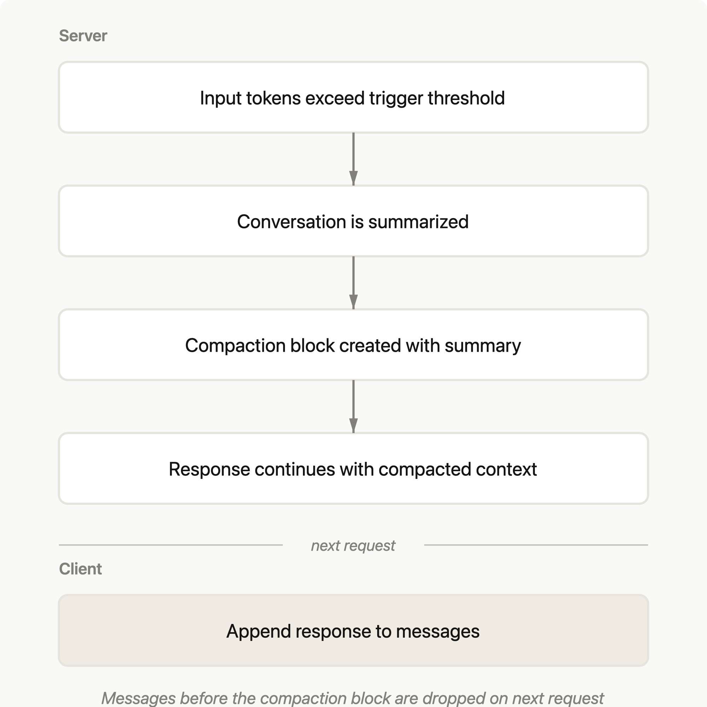
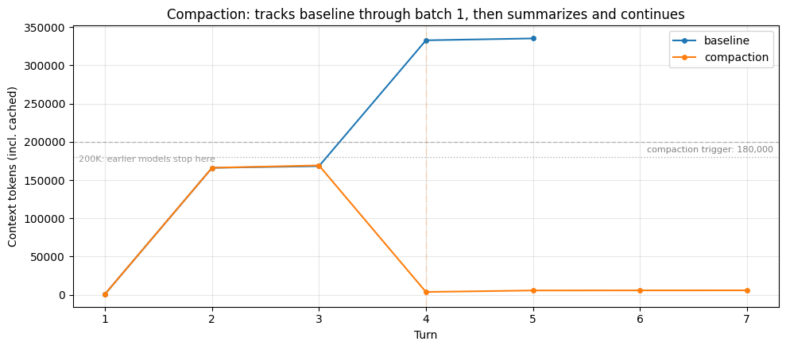
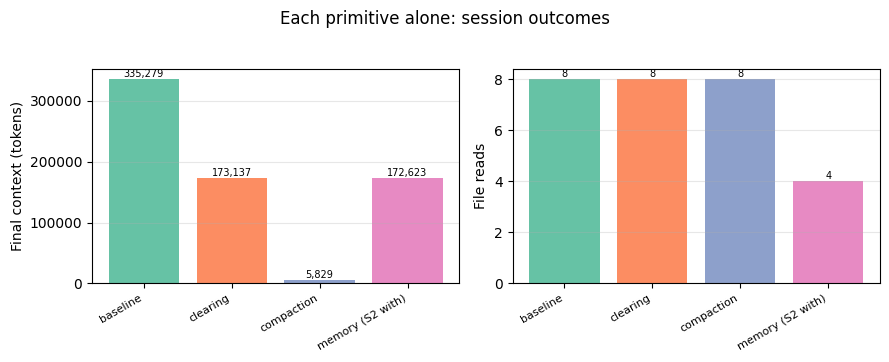
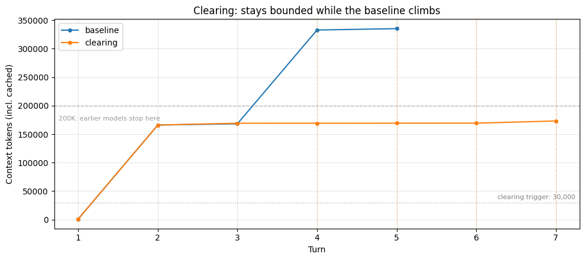
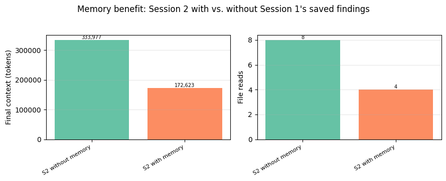

# Chapter 3 - Keep Long Sessions from Rotting

> The longest chapter in the book: 4 questions on the compaction mechanism, 12 questions with copy-ready thresholds, templates, and commands, and the last 4 go straight into real failure scenes. Compaction is the surgeon's knife for long sessions and the most common place things fall over — thousands of war stories in the issue threads trace back here. How to read it: first lock in when compaction triggers, then steal the thresholds and the handover template, and read the final questions as stories — asking the whole time whether your own sessions carry the same disease.

## 035. When does compaction actually trigger, and who decides?

This one has a definitive answer, and most versions circulating online are wrong. Plenty of tutorials say "auto-compact at ninety-something percent" — that was old-version behavior. The current rule: with no manual setting, Claude Code compacts only when the session reaches the model's context limit. Concretely for Sonnet 5, which runs a fixed 1M window on the API, the default is to act at about 967K tokens. A 1M window, compacted at about 967K — don't blur the two numbers together.

To compact earlier, three entry points: run `/autocompact 500k` in the session to move the auto-compact line to 500K; pass `--autocompact` at startup; or set the `CLAUDE_CODE_AUTO_COMPACT_WINDOW` environment variable in scripts and cloud environments. The command and the flag accept any value from 100K to 1M, and `/autocompact auto` returns to the model default. Exceptions exist: older models without extended context compact at the 200K boundary, and native million-window models with the 1M switch turned off also use 200K.

The API side runs a separate scheme: server-side compaction uses the `compact_20260112` beta parameter, triggering by default at 150K tokens with a floor of 50K, and parameters may change during the beta. One-line summary: Claude Code defaults to the model's ceiling, the API defaults to 150K — keep the two number sets from visiting each other.



1) Official compaction documentation https://platform.claude.com/docs/en/build-with-claude/compaction

2) Claude Code context window documentation (the auto-compact section) https://code.claude.com/docs/en/context-window

## 036. Why is compaction lossy by nature, and why does it drop what matters most first?

One set of experimental numbers makes the point: a research agent read 320K tokens of source material to trigger compaction, then six probe questions were checked against the summary — three were core task facts (species, lifespan figures, percentages), three were obscure numbers from appendix tables. The result was a blowout: core facts 3/3 present, obscure numbers 0/3 all gone. A 2,783-token summary replaced nearly 200K tokens of original text in the window at trigger time, and keep-the-big-drop-the-small was executed without mercy.

Why does what matters most go first? Because "matters most" is your vantage point; the summary is written from the full text's vantage point. The compactor keeps central ideas and main comparisons, and a rule like "never use cached files, always call the live API" looks no different from chit-chat to the summarizer. One nastier trap someone stepped in: after compaction, the plan file's name was still in context but its content was gone, and the model never thought to read it — metadata present, body lost. That is the most typical shape of a compaction wound.

So the discipline is one line: anything you cannot afford to lose does not sit in the conversation waiting for a summarizer. Persist it into CLAUDE.md (see question 42), or name it for preservation in the compaction instructions (see question 41). Keep-the-big-drop-the-small is the summarizer's nature; your job is to mark the exceptions for it.



1) Official cookbook: Memory vs. Compaction vs. Tool Clearing (the probe-check numbers) https://platform.claude.com/cookbook/tool-use-context-engineering-context-engineering-tools

2) Reddit: first-hand post on not re-checking the active plan after compaction https://www.reddit.com/r/ClaudeCode/comments/1qzo3xj/

## 037. Why does the session get sicker the more times you compact?

An observation many people share: Claude Code running Opus or Sonnet gets dumber the more it compacts. On the same batch of files, continuing after two rounds of compaction works worse than clearing context and having it re-read the relevant files — even when those files were mentioned and summarized in the compaction summary. The math works out: each compaction passes the whole text through a lossy pipeline, and details that survived the last summary lose another layer this round. Losses multiply, they don't add — a summary of a summary is far blurrier than a summary. The more diligently you compact, the higher the share of low-relevance content in the window, and the model writes the next summary standing on degraded corpus. A vicious cycle.

Measured data is on the same side. In one set of production-grade benchmarks, a compaction preset that seemed good enough scored only 38% on memory probes — more than twice as bad as doing nothing (92%) — at double the cost. Separately, a developer recorded in an issue that after 3 to 5 compactions in one session the model started making chained errors (full symptom list in question 53).

Using compaction as memory swapping is fine, provided the system is actually cleaner after the swap instead of shuffling dirty pages around. So compaction is a stopgap, not a cure: if the session is still a mess after two consecutive compactions, don't add a third — restart with a handover file. The criteria for rescue versus restart are in question 48.

1) HN: discussion of the Context Rot report (posnet's observation) https://news.ycombinator.com/item?id=44564248

2) louisbouchard.ai: Context Engineering in 2026 (hands-on measurements) https://www.louisbouchard.ai/context-engineering-2026/

## 038. When is "doing nothing beats compaction" actually true?

The statement is true, but the preconditions matter more than the conclusion. Someone ran the full accounting on their own AI tutor product: full history with nothing done — $0.11 per turn, 17s first response, 92% memory probe; the compaction preset running in production (clear old tool outputs plus summarize old dialogue) — $0.24 per turn, 21s, 38%. It lost on all three. Blind judging was the most telling: on the answers that had measurably lost planted facts, blind-review judges rated 100% "good". Compaction fails silently; the answers stay fluent and pretty.

Switch to pricing with bigger cache discounts like DeepSeek's, and doing nothing wins on cache billing: full history is resent verbatim each turn, and of roughly 296K tokens, 97% bills at the cached discount — actually the cheapest. Three preconditions follow; miss one and it collapses. One, pricing must carry a decent cache discount — under this arithmetic, summarization has to shrink context to below one-fiftieth of its size just to break even. Two, the window has to fit: a local 32K small window truncates outright, and every strategy falls into the 27%-40% memory band. Three, sessions cannot be infinitely long: recompute under the new pricing and keep-all wins within 22 turns but loses by 36.

The ecosystem is moving the same direction: Codex to this day has only manual /compact, no auto-compaction. So "do nothing" is a strategy, not laziness: check your cache pricing first, and if the conditions aren't met, follow the thresholds in question 39. Treat this as a judgment call, not a promise — vendor pricing can change at any time.

1) louisbouchard.ai: Context Engineering in 2026 (the full keep-all comparison table) https://www.louisbouchard.ai/context-engineering-2026/

2) Codex official Developer commands (the full /compact table) https://learn.chatgpt.com/docs/developer-commands

## 039. How do you keep a long session from ever reaching disaster-mode compaction?

The "disaster" in disaster compaction is the moment you're forced to compact at the ceiling: the summarizer is already jammed into a corner and cannot write anything decent. Set the trigger line too high and the model writes its summary with running-out-of-room anxiety, producing something short and mangled; leave headroom and compact early, and there is space to write something worth reading. The Devin platform documented the same disease and named it context anxiety: the model sees it is near the limit and starts acting up.

Three rules of thumb, all pointing the same way: stay far from the ceiling. Each has measurement behind it; worth pinning above your desk:

| Suggested point | Notes |
|---|---|
| 40%-60% of the window | Keep utilization at 40%-60% and design the whole workflow around it |
| Act at around 60% | Rule of thumb, not an official number |
| Set the threshold at 70%-75% | Don't copy the old 95%-98% figures |

One more sentence on the mechanism: the fuller the window when compaction triggers, the more cramped the summary call, and the sicker the compaction chain gets (question 37's arithmetic continues here). In Claude Code this lands as two moves: check usage casually with `/context`, and when you near your line, run one focused compaction — how to word the instructions is question 41; if manual is too annoying, `/autocompact 500k` moves the automatic line from 967K to 500K and lets the machine keep watch for you.

1) HumanLayer: Advanced Context Engineering https://www.humanlayer.dev/blog/advanced-context-engineering

2) SitePoint: Context management for long-running Claude Code sessions https://web.archive.org/web/20260315064537/https://www.sitepoint.com/claude-code-context-management/

3) Zylos: compaction head-to-head for long sessions https://zylos.ai/research/2026-04-21-agent-context-compaction-long-running-sessions/

## 040. /compact, /clear, or a fresh window — which one do you press?

Don't memorize commands; ask one question first: is this session salvageable? Salvageable, keep it and compact; not, clear and restart. The principle is crisp: continuity calls for /compact, a fresh start calls for /clear — the latter costs nearly nothing, the former has to read the entire session and summarize it, itself a large request. One more cut: switching to unrelated work means /clear — the old conversation squeezes out the next file you need, and every message keeps billing along the way.

The boundaries, drawn finer — copy the decision tree as-is:

```
# /compact vs /clear: how to choose
Session polluted by wrong assumptions, model keeps returning to wrong premises? → /clear
Task pivots completely (backend switches to an unrelated frontend)?             → /clear
Old decisions still in play, continuity needed?                                 → /compact
Middle state: half useful, half noise?                                          → /compact + targeted instructions
```

The third road is a new window: have the session write its state into a handover file first, then /clear, and the new session starts from the file. It differs from /clear by carrying one handover written to disk (template in question 43), and from /compact by not surviving on a lossy summary. A workable division of labor: slimming within one task uses /compact; switching between tasks uses handover plus a new window; a polluted session gets /clear without hesitation.

One final red line: /clear permanently deletes session history with no recovery option; the only things reloaded automatically are files like CLAUDE.md. Before your finger presses the key, confirm everything worth keeping has already left the window.

1) Claude Code official costs documentation https://code.claude.com/docs/en/costs

2) SitePoint: Context management for long-running Claude Code sessions https://web.archive.org/web/20260315064537/https://www.sitepoint.com/claude-code-context-management/

## 041. How do you write a targeted compaction instruction that keeps only what you need?

Type plain language right after /compact, say clearly what to keep and what to drop, and the compactor serves what you ordered. Example: `/compact Focus on code samples and API usage`; a harder-edged use: keep all API endpoint signatures and auth decisions, summarize the rest — you are rewriting the exam on the summarizer's behalf. Note in passing: running /compact in a fresh session tells you there aren't enough messages to compress; it isn't broken, there is just no history to compact.

Three templates, ready to copy:

```
/compact Focus on database schema changes and the migration plan; drop the UI discussion
/compact Keep all API endpoint signatures and auth-flow decisions; summarize the rest
/compact Entering the testing phase; keep only implementation details relevant to writing tests
```

One easy trap: on the API side the instructions parameter is a full replacement, not an append — provide custom instructions and the default summary prompt stops working entirely, including format conventions like wrapping the summary in `<summary>` tags, which you would have to rewrite yourself. The API side is full replacement; the Claude Code /compact docs don't say so explicitly, but most likely the same — don't write your instructions too thin.

The value of targeted compaction comes down to this: keep what you chose, not what auto-compact guessed. Auto-compact bets on generic importance; you cannot afford that bet, so name the items yourself. Name them down to nouns: "keep the bug-fix process" loses to "keep the fix steps and conclusion for the 401 error".

1) Claude Code official costs documentation (/compact custom instructions) https://code.claude.com/docs/en/costs

2) SitePoint: Context management for long-running Claude Code sessions https://web.archive.org/web/20260315064537/https://www.sitepoint.com/claude-code-context-management/

3) Official compaction documentation (the instructions parameter's full-replacement semantics) https://platform.claude.com/docs/en/build-with-claude/compaction

## 042. The plan survives compaction as a filename with no content — how do you prevent that?

One textbook casualty: he kept the 60% usage red line religiously and tracked all tasks in md plan files, believing compaction was foolproof — then after compaction Claude started ignoring the plan. He asked the model directly and got a straight answer: the plan file's name was still in context, the content hadn't come along, and the model never thought to read it. Name present, content lost — the most common shape of a compaction wound (mechanism in question 36).

There is a per-mechanism list of what survives compaction: project-root CLAUDE.md, auto memory, and plans written in plan mode get re-injected from disk; subdirectory CLAUDE.md files and rules with `paths:` reload only when the matching file is read; recently read or edited files get re-read, at most five, with anything over 5,000 tokens reduced to a path reference; invoked skills get re-injected, capped at 5,000 tokens each and 25,000 tokens total, oldest dropped first. Anything said in conversation and anything hooks injected goes into the summary and nothing more.

Three defenses: don't say critical constraints in conversation — write them into project-root CLAUDE.md; instructions that exist only in conversation die at compaction, in a file they live. Make the first sentence after compaction a request to re-read the plan file before continuing. For full automation, add a SessionStart hook that injects your specified content automatically when compaction occurs.

1) Reddit: first-hand post on not re-checking the active plan after compaction https://www.reddit.com/r/ClaudeCode/comments/1qzo3xj/

2) Claude Code context window documentation (the What survives compaction list) https://code.claude.com/docs/en/context-window

3) Claude Code memory documentation (troubleshooting lost instructions) https://code.claude.com/docs/en/memory

## 043. How do you write a session handover document that resumes seamlessly?

A good handover lets the new session resume in its first minute; a bad one hands the disease to your next self. Make the handover a closing ritual, four steps: have Claude write current progress, todos, and key decisions into CLAUDE.md; verify with git diff that the file really updated — empty diff, redo it; once confirmed, /clear; first sentence of the new session: "Read CLAUDE.md and summarize where we are." The file becomes a project log shared by human and model.

The cost needs an entry too: once session state is in CLAUDE.md it loads with every session, so every few sessions sweep out stale entries — don't let last month's blockers occupy every API call.

The ritual alone isn't enough; the content needs a skeleton. One compression benchmark makes the comparison: structured sections work like a forced checklist — each section either has content or says "none" explicitly — leaving far less room for silent loss. In the same 178-message debugging session, the free-form summary recorded "the auth endpoint returned 401", while the structured summary recorded "the /api/auth/login endpoint, Redis connection invalid"; only the latter can be worked from directly. One standard decides whether a handover qualifies: someone who wasn't in the session (including the next model instance) can start working from it without asking follow-up questions.

```
# Session handover template (five sections, none may be empty)
## Session Intent    What this was meant to do at the start, and where the scope boundaries sit
## Files Changed     Full paths, listed one by one
## Key Decisions     What was decided, and why
## Active Goals      What's in progress, three or fewer
## Next Steps        The first thing the person taking over should do
```

1) SitePoint: Context management for long-running Claude Code sessions https://web.archive.org/web/20260315064537/https://www.sitepoint.com/claude-code-context-management/

2) Zylos: compaction head-to-head for long sessions (source of the structured template) https://zylos.ai/research/2026-04-21-agent-context-compaction-long-running-sessions/

3) Factory.ai, "Evaluating Context Compression" https://factory.com/news/evaluating-compression

## 044. Can compaction, clearing, and memory all run at once?

Running all three is fine — a full experiment with the trio enabled has been run, and the division of labor resembles an operating system: clearing handles old tool results inside the window, compaction handles the whole window, memory handles across sessions; each layer treats one kind of growth. In the experiment, when the research agent hit 330K tokens read, clearing moved first, releasing about 82K tokens of old file reads in one pass; compaction followed with a squeeze on what remained; the memory tool wrote notes to /memories throughout. One window, three kinds of growth, three ways to plug them, none stepping on another's job.

Clearing and memory together carry one explicitly warned trap: the memory tool must go on clearing's exclusion list (`exclude_tools: ["memory"]`). Without it, clearing may wipe the read/write results the model just wrote to memory — it cannot find what it just stored, saving with the left hand and dropping with the right. This is the recommended configuration for the memory tool.

On whether it's worth enabling, internal benchmarks gave numbers (internal eval): in the agentic search eval, memory tool plus context editing scored 39% over baseline, editing alone 29%; in the 100-turn web search eval, token consumption dropped 84%. Note that all of these are beta capabilities (compact-2026-01-12, context-management-2025-06-27, memory_20250818); parameters can change at any time, so if you enable them in production, watch the changelog.

Configure the starter combo like this: set the clearing trigger low, keeping only the most recent tool results; set the compaction threshold high as a fuse; write memory from the first turn. Keep the three trigger lines spaced apart — don't let them all fire at the same moment.



1) Official cookbook: the three-primitives-together experiment and the exclude_tools trap https://platform.claude.com/cookbook/tool-use-context-engineering-context-engineering-tools

2) Anthropic: official context management announcement (the 39%/84% numbers) https://www.anthropic.com/news/context-management

## 045. Tool outputs are flooding the window — how do you cap them without hurting the cache?

The key is telling two kinds of "smaller" apart. Capping a tool output shortens the prefix but changes not one byte, so the next round's cache hits as usual; summarizing a tool output shortens the prefix but changes the content, invalidating the cache wholesale, and the saved tokens get re-billed at full price. One controlled experiment nailed the accounting: cap without summarizing and per-turn cost fell from $0.189 to $0.117, a 38% saving, with capping winning 14 of 15 paired trajectories; cache hit rates were 96.0% versus 95.9%, barely moved; memory probes were identical to no cap. The conclusion is one line: shrink context, don't rewrite context.

Claude Code caps tool responses at 25K tokens by default. On tool design, the recommended quartet is pagination, range selection, filtering, and truncation — don't let a single tool response eat through the window. Tool output bloat is predictable; strangle it at design time.

Actively clearing old tool results from the window carries its own accounting: clearing invalidates the cached prefix, and the API provides the `clear_at_least` parameter to guarantee each clearing pass removes at least a set amount, so the cost of rebuilding the cache is worth the fare. The moves reduce to three lines: set stable caps on outputs, don't summarize tool outputs, and when you clear, clear enough in one pass.



1) louisbouchard.ai: Context Engineering in 2026 (the capping comparison experiment) https://www.louisbouchard.ai/context-engineering-2026/

2) Anthropic: Writing effective tools for agents (the 25K truncation) https://www.anthropic.com/engineering/writing-tools-for-agents

3) Official cookbook: the clearing-versus-cached-prefix accounting https://platform.claude.com/cookbook/tool-use-context-engineering-context-engineering-tools

## 046. The long session got slow and expensive — how do you self-check whether the context has rotted?

Check the books first, then diagnose. Slowness and cost have two possible causes: one is accounting you haven't worked out, the other is genuinely rotten context. "Session idle yet usage climbing" has a known list of reasons: long context (every message resends full history), cache misses (the API defaults to a five-minute lifetime; come back after half an hour away and the first message re-bills at full price), scheduled tasks and cross-session messages burning window in the background, idle checks for background goals, and compaction itself — /compact reads the full history, so one compaction is one large request. /usage automatically flags any behavior taking more than 10% of usage.

One bonus worth noting: on subscription plans, come back after a long disconnect and Claude Code will proactively offer to resume a large session from the summary, so later requests stop carrying full history — the tool doing a handover for you.

```
# Three self-check commands, run in order
/context   # what's in the window, and what takes the biggest share
/usage     # where the money and limits went, biggest consumers flagged automatically
/cost      # cumulative spend for this session
```

Books normal but behavior getting dumber is the second disease. The symptom list from the issues: sessions of two to three hours compacted 3 to 5 times, each compaction stalling 30 to 60 seconds, and afterward the model makes chained errors (full symptoms in question 53). This disease resembles a memory leak — the window fills up with use, nobody can say which step leaked, only that it runs slower and slower. Numbers clean but behavior looping: treat it as rotted context and go to question 48 to choose rescue or restart.

1) Claude Code official costs documentation (the usage-climb reasons list) https://code.claude.com/docs/en/costs

2) GitHub issue #32691: compaction too frequent and too slow, with the symptom list https://github.com/anthropics/claude-code/issues/32691

## 047. Compaction errored out and froze — what's the first self-rescue move?

The error reads: `Error during compaction: Error: Conversation too long. Press esc twice to go up a few messages and try again.` — the command you ran to compact reports "conversation too long". All 134 comments in issue #7530 are stuck on this one message. The most infuriating part is its weirdness: one user's /context showed 12% headroom remaining, and compaction still errored; another resumed into a session and usage displayed 151%.

For the first move, don't grind it out with esc rollbacks. The verified sequence: Ctrl+C to exit the process, start claude again, /resume to restore the previous session, then /compact. This triple has been run about 30 times in a week, every time successful (self-reported). The principle: exiting and re-entering makes the client drop that ever-growing lump of bad state, and the compaction request comes out clean again.

The root cause is the compaction request itself — compaction has to stuff the whole session into one summary call, and when the session is too big for even the compaction request, you get an infinite loop. v2.1.85 was the first real fix; the fix details and the full back-and-forth are in question 51. If an upgraded version still has the bug, open a new issue with the version number attached — don't build additions onto the old thread.

1) GitHub issue #7530: Error during compaction (134 comments; source of the self-rescue triple) https://github.com/anthropics/claude-code/issues/7530

2) GitHub issue #2038: the error loop and the v2.1.85 fix record https://github.com/anthropics/claude-code/issues/2038

## 048. How do you decide between rescuing a session and restarting cold?

The good news is there are only two failure modes, and one check tells them apart. The hard failure recorded in issue #20696 (filed 2026-01-25) is the benign kind: a banner reads "Conversation compaction failed", the session stops responding from then on, and reload, logout, or a device switch won't save it — at least you know it's broken. The harmful one is degraded pseudo-success, with a one-line symptom: no error, window no thinner, session still jammed at the limit (mechanism and consequences in question 52). The thread even pins where it stalls — more than one user recorded compaction progress freezing at 95% with nothing after. For the record, this issue covers the claude.ai web and mobile clients, not the CLI.

The triage is three questions. One: was the error transient? Exit, re-enter, compact again — if it goes through, it was a hiccup; rescue. Two: did you get a summary but the /context number didn't drop? An unmoved number is pseudo-success — no saving it; stop feeding it messages. Three: are the decisions you want to keep written to a file? If yes, restart at zero loss; if no, have it write the state to a file first, then go (template in question 43).

One principle on restarting: a session polluted by wrong assumptions, where the model keeps returning to false premises, is cheaper to restart than to rescue — what you rescue is a model still carrying a pile of errors. Sessions are consumables; don't get sentimental.

1) GitHub issue #20696: compaction failure and deadlock, first-hand log https://github.com/anthropics/claude-code/issues/20696

2) SitePoint: Context management for long-running Claude Code sessions https://web.archive.org/web/20260315064537/https://www.sitepoint.com/claude-code-context-management/

## 049. External memory on the ground: SQLite files or a vector store?

Conclusion first: most people don't need a vector store. The choice has two layers: the built-in memory tool, and a self-built external rig.

The built-in memory tool's idea is charmingly plain: the model itself calls six commands (view, create, str_replace, insert, delete, rename) to read and write a storage backend you control. The demo sample is a pure file backend: session one writes notes to /memories, session two starts up by reading the notes and carrying on. Readable, diffable, version-controllable — for one person on one project this is enough, and beyond it you're just adding ops chores for yourself.

If you truly have massive cross-session history to retrieve, then look at how a self-built rig goes together. cc-memory's architecture: SQLite stores conversation turns, ChromaDB does vector recall, and old context is re-injected on demand by relevance — pinned decisions always get injected, everything else queues by score. Its compaction line is alive too: the agent watches context density and runs an adaptive threshold, raising it on decision-dense turns and lowering it on tool-output-dense turns, with a density check before acting; history even gets a free pre-compression pass through Cerebras before it bills. This is external memory done on disk — the window as RAM, files as the disk, paging in whichever page you need. The built-in memory tool's file backend looks like this:

```
/memories/
├── aging_model_organisms_comparison.md   # cross-source comparison conclusions written by session one (~2,999 tokens)
└── organism_notes.md                     # topic notes rewritten from scratch by session two, the control group
# usage protocol auto-injected by the memory tool: always view your memory
# directory before doing anything else
```

Others use the lighter beads, booking tasks as issues and retrieving by number — it, too, carries sessions across.

The fancy moves — layered injection, adaptive thresholds — can wait until you actually hit the file approach's ceiling. The systematic memory selection comparison is in question 24; go there to find your seat first.



1) The cc-memory solution from the GitHub issue #32691 thread https://github.com/anthropics/claude-code/issues/32691

2) Official cookbook: the memory tool's six commands and file backend https://platform.claude.com/cookbook/tool-use-context-engineering-context-engineering-tools

3) beads: issue tracking for agent tasks https://github.com/steveyegge/beads

## 050. With multiple agents running concurrently, how do you isolate context so they don't pollute each other?

Pollution's root is the shared main window: every agent's search results, logs, and errors crowd into one window, and whoever floods it first pollutes everyone else. The fix is closing the work inside a subagent's own window — each subagent carries independent context, its own system prompt, and its own tool allowlist; research-style large file reads stay in its window, and only the conclusions come back to the main one. Configuration is a few lines; give allowlists by least privilege: researchers get Read, Grep, Glob and never Write or Edit. Three guardrail numbers ship with it: when all subagents' (built-ins excepted) descriptions total over 15,000 tokens, a warning fires at startup; at 20 concurrent subagents, opening more reports Concurrent subagent limit reached (`CLAUDE_CODE_MAX_CONCURRENT_SUBAGENTS` adjustable); nesting goes at most three levels deep by default, and a subagent at the limit has the Agent tool taken away — it works alone.

Multi-agent practice supplies the other half: isolate the windows, and also isolate the task descriptions. The lesson: an orchestrator got lazy with "research the chip shortage", and two subagents did the same job while a third went the wrong direction. Every subagent must receive the full four-piece set: goal, output format, available tools, task boundary. This is the first wall against duplication and pollution, cheaper than any technical isolation.

One more for long sessions: at each stage's completion, have the subagent write its results to a file; when a window tops out, spin up a fresh agent with clean context — live by handover, not by compaction. Isolation only separates the pollution sources; how the bill for this craft adds up is question 76.


1) Claude Code subagents official documentation (independent windows and tool allowlists) https://code.claude.com/docs/en/sub-agents

2) Anthropic: how we built our multi-agent research system (the delegation four-piece set) https://www.anthropic.com/engineering/built-multi-agent-research-system

## 051. One compaction bug took eight months to officially fix — what happened along the way?

On June 13, 2025, #2038 was filed: the prompt banner shouted "Context low · Run /compact", and pressing it made compaction report "Conversation too long" — context full, told to compact; compacting, told you're too long. Infinite loop. Three months later #7530 took the baton: 134 comments and over a hundred upvotes, the hottest compaction-error thread there is.

Across those eight months, first self-rescue outran the fix: the exit, re-enter, /resume, compact triple ran about 30 times a week, every time successful (self-reported). Then the fix itself wobbled: the changelog said fixed, users found a relapse in 2.0.76 and returned to the thread asking where the promised fix went. Only v2.1.85 truly fixed it — when the compaction request is too large, drop the oldest messages and retry; the thread got its closing comment in April 2026. The story didn't end there: on v2.1.87 someone hit a new variant — context full, compaction rate-limited, subagents also full — all three roads blocked, leaving /clear as the only concession.

This case deserves three reads from everyone who runs agents. The first scene of an error is the issue tracker, and self-rescue always precedes fixes; anchor "fixed" to a version number — trust the closing comment, not the changelog; and after the fix come variants — failures are alive. When you hit a similar error: self-rescue per question 47 first, check version numbers second, complain last.

1) GitHub issue #2038: the original filing and the fix's full course https://github.com/anthropics/claude-code/issues/2038

2) GitHub issue #7530: the hottest compaction-error thread (134 comments) https://github.com/anthropics/claude-code/issues/7530

## 052. Why does compaction "pretending to succeed" hurt more than crashing?

A crash cries out in pain; pseudo-success doesn't. Of compaction's two failure modes, the hard failure is the benign one: a banner says "Conversation compaction failed" in plain words, you know it's broken, and you turn to self-rescue. The harmful one is degraded pseudo-success — no error surfaces, and the interface hands back a context too large / minimal handover summary as the compaction result. Continuity looks secured, but the window hasn't shrunk an inch and the session stays jammed at the limit. The issue put it bluntly: when compaction genuinely fails, it should fail gracefully — it should not be presented as a successful compaction.

Pseudo-success kills through the time lag. You believe you hold continuity, keep working off that summary, until one day you find the session long since too full to move and the recent work silently gone — no crash scene, no error log, and you never knew when the loss happened. It's also intermittent: some sessions compact, some deadlock; long sessions, many tool calls, and many attachments are more susceptible. This is a regression dating from after January 15, 2026, stably reproducible on January 25, with the same session breaking on web and mobile together. The pseudo-success output left a record in the issue; the OP's February 11 recheck says it best: same session, same session ID, web showing about 53 artifacts, mobile showing 1.

One defense: inspect the goods after compaction. Check /context — the number dropping is the only proof of a real compaction; if it didn't move, treat it as pseudo-success and immediately hand over and restart. Never bet important state on compaction; write it to a file before moving on.

1) GitHub issue #20696: first-hand record of degraded pseudo-success https://github.com/anthropics/claude-code/issues/20696

## 053. How did one failed compaction skew a real account by 12x?

The books said 1.79 million won; the real figure was 148,000 won — off by exactly 12x. That was the direct consequence of one compaction mistake. The OP of issue #32691 runs a trading system with the rule written plainly in memory/critical_rules.md: position data must come from the live API, never from cache. After compaction, Claude left the rule outside the window, took the shortcut, read a three-day-old cached file, and the reported BTC position went straight into the sky. The version at fault was v2.1.71.

The other symptoms in the same thread form the standard portrait of compaction sickness: two-to-three-hour sessions compacted 3 to 5 times, each freeze lasting 30 to 60 seconds with the human just waiting; after compaction, previously corrected errors get repeated all over again. The OP closed with the time ledger: more hours spent re-explaining than doing the work.

The most valuable lesson here isn't the 12x; it's why the rule didn't work — the rule was in a file, but after compaction it was neither re-read nor applied. "The file exists" is not "the rule is in the window"; question 42 took this apart. The defense is ready-made: hard constraints touching money or data go into project-root CLAUDE.md, which compaction re-injects from disk; make the first sentence after compaction a demand that it restate the critical constraints — no restatement, no touching the books.

1) GitHub issue #32691: the first-hand issue on the BTC position off by 12x https://github.com/anthropics/claude-code/issues/32691

## 054. When sessions won't hold, what bolt-on tool ecosystem grows around them?

Scroll the comments of that compaction-error issue and it reads like a grassroots tool incubator. A few representative ones, inventoried below — read it as ecosystem observation, not endorsement.

cozempic takes the debride-first-then-compact route: compaction failures correlate strongly with session bloat — repeated file reads, progress spam, and giant tool outputs give the summarizer indigestion. One cleaning pass typically cuts 40%-70% of the noise, and a compaction that wouldn't run starts running; a daemon came later, auto-trimming when tokens cross the line, with a PreCompact hook doing a pass ahead of built-in compaction. Vinix24, in the same thread, went further and skipped compaction entirely: a PreToolUse hook checks usage on every tool call, intercepts the agent at 65%, forces it to write a structured handover file, then a script injects a continuation prompt into a new session — swap the window outright, never bet on compaction. In the earlier #32691 thread, cc-memory moved the whole context into a proxy layer of SQLite plus a vector store, and beads books tasks as issues — variants on the same idea.

None of these carry certification, and update cadence and pitfalls depend on each author's mood. But three ideas are free to take: a usage warning line, a structured handover file, and window-swapping for survival — a dozen-odd lines of your own hook will build them, steadier than installing someone else's tool.

1) cozempic: the debride-before-compaction tool https://github.com/Ruya-AI/cozempic

2) GitHub issue #7530: the original thread with Vinix24's hook pipeline https://github.com/anthropics/claude-code/issues/7530

3) GitHub issue #32691: the thread with cc-memory's proxy-layer approach https://github.com/anthropics/claude-code/issues/32691
