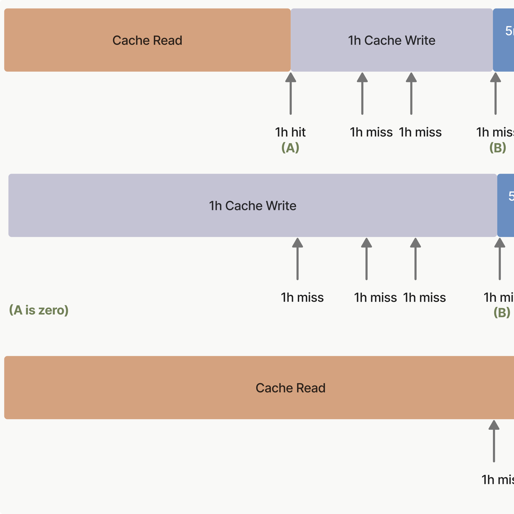
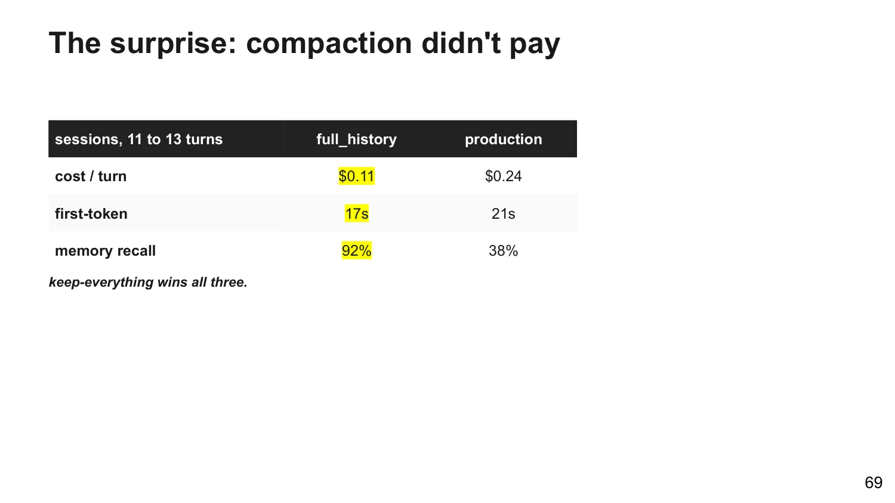

# Chapter 5 - What Context Actually Costs

> This chapter does the accounting: how caching knocks the bill down to a tenth, how multi-turn conversations roll it up turn by turn like compound interest, and why multi-agent dares to price itself at 7x and 15x. It is also the chapter with the book's most contested claims—"not compressing can actually be cheaper" and "the run that sends the most tokens costs the least" both come from here. Every key number in the chapter carries its measurement basis and date (pricing and window figures as of 2026-09-07; the Morph comparison table is a vendor snapshot from 2026-06). Check each number's shelf life before copying the move.

## 073. Why does caching change only the price, not the window footprint?

Treating the cache as extra capacity is the first misconception this chapter corrects: it changes only the price tag; the window footprint stays exactly as it is. A cached prefix still occupies the context window—prompt caching changes how much you pay for those tokens, not whether they count.

The mechanics are simple once broken apart: it works like a CPU cache line—it speeds up fetches and saves not a single byte of the memory the data occupies. Same on the model's side: tokens still queue up and take window space, attention still gets divided, the window still fills, and compaction still triggers near the limit (threshold rules in Question 035). Watch the chain reaction too: when compaction actually fires, the prefix gets rewritten and the cache is invalidated and rebuilt wholesale—that is where the expected rebuild in the Claude Code statistics line comes from, and those rebuild turns are billed at cache write pricing.

So keep two ledgers separate: to know how much you occupy, run /context; to know how much you spend, check the Session block of /usage—both commands ship built in. Cache reads are priced at the standard 0.1x of input price, but when you evaluate how much more you can fit, count the tokens at full price. Don't let the discount fool you—the discount lives on the bill, not in the window.

1) Anthropic docs: Context windows https://platform.claude.com/docs/build-with-claude/context-windows

2) Anthropic docs: Prompt caching https://platform.claude.com/docs/build-with-claude/prompt-caching

3) Claude Code docs: Manage costs effectively https://code.claude.com/docs/en/costs

## 074. Why does every message in a multi-turn conversation re-bill the entire history?

Set the scene first: the session has been open all day, you send the single word "continue," and this turn is still billed against the full history. Don't treat it as a bug; it is the price of a model with no memory: Claude Code carries the complete conversation in every request—in a day-long session, a one-line question still generates usage for the whole session.

Add a sense of scale (vendor snapshot 2026-06): every API call starts from zero, and the history must be resent every time—by the 50th tool call the history alone can exceed 150k tokens, and every call after that bills it again. The cost of long context comes mainly from this compounding resend, not from that one big request. Put the two together and you get the compound structure: turn k pays for k copies of the history, not one. I ran the numbers for you (this book's inference): a 50-turn conversation is equivalent to paying 1,275 single-turn inputs. Caching can knock the unit price of each copy down to a tenth; what it cannot change is this shape.

There are several hidden entrances for full resends: a scheduled task fires on its timer and sends the full payload even while idle; a cross-session message arrives from another session and this side sends the full payload too; the first message after a gap longer than the cache lifetime misses the cache and the full history is recomputed at full price. You burn money while doing nothing—right here.

Three actions: /clear on task switches (how to choose in Question 040); turn off scheduled tasks you don't use, and set crossSessionInbound to hold in settings so cross-session messages are held back instead of delivered; glance at /usage halfway through a long session—don't wait for the end-of-month reconciliation.

1) Claude Code docs: Manage costs effectively https://code.claude.com/docs/en/costs

2) Morph: LLM context window comparison https://www.morphllm.com/llm-context-window-comparison

3) SitePoint: Context Management for Long-Running Claude Code Sessions https://www.sitepoint.com/claude-code-context-management/

## 075. How do you estimate how much context money your task burns per month?

The bill can be estimated, provided you hold three ready-made anchors. Anchor one: enterprise deployments average about $13 per active day and $150-250 per month per person, with 90% of users under $30 a day (as of 2026-09-07). Anchor two: at Sonnet's input price of $3 per million tokens, a single-turn input costs about $0.45 at 150k context and about $0.09 at 30k—the same question, a fivefold price gap. Anchor three (2026-06 basis): filling a 1M window once runs anywhere from $0.14 to $10; the breakdown is in Question 084.

| Anchor | Number | Basis |
|---|---|---|
| Enterprise per person | ≈$13/active day, $150-250/month | As of 2026-09-07 |
| Single-turn input | 150k context ≈$0.45, 30k ≈$0.09 | (Sonnet $3/MTok) |
| Fill 1M once | $0.14-$10 | Vendor snapshot 2026-06 |

To estimate it yourself, use this formula: monthly bill ≈ active turns per day × input tokens per turn × input unit price × cache discount. When the hit rate is healthy, reads cost a tenth of full price—divide the effective unit price by ten. When the hit rate swings, keep headroom using an effective factor of 30-50% (that factor is an experience-based inference). Run the numbers once (Sonnet $3/MTok basis; worked example is an estimate, cache-write surcharge not included):

```
100 turns/day × 150k tokens/turn × $3/MTok = $45/day at full price ($0.45 per turn, the worked example in row two of the table above)
90% hit rate, read price 0.1x: effective factor = 0.9×0.1 + 0.1×1 = 0.19
$45 × 0.19 ≈ $8.6/day; times 22 active days ≈ $188/month — lands on the $150-250 band
```

Budget tokens the way you budget memory quotas: pin down up front how much the system prompt, tool definitions, and retrieved content each get; when you overspend, cut quotas first—don't reach for a bigger budget first.

1) Claude Code docs: Manage costs effectively https://code.claude.com/docs/en/costs

2) SitePoint: Context Management for Long-Running Claude Code Sessions https://www.sitepoint.com/claude-code-context-management/

3) Morph: LLM context window comparison https://www.morphllm.com/llm-context-window-comparison

## 076. How do you account for and control the multi-agent context bill?

The multipliers need no guessing: chat counts as 1x, a single agent about 4x, a multi-agent system about 15x. Claude Code's agent teams carry a list price too: teammates running in plan mode cost about 7x a standard session—each teammate brings its own independent window and burns its own tokens.

What does the 15x buy? The explanation is ready-made: token usage alone explains 80% of the variance in outcomes, and the essence of multi-agent is scaling token usage—the extra spend buys real productivity, priced openly; not a rip-off, but not cheap. This question covers the accounting and the controls; whether it's worth it is in Question 086, and how to do the isolation is in Question 050.

Control levers: first, tier the effort—write the scaling rules straight into the prompt: simple verification gets 1 agent with 3-10 tool calls, comparison questions get 2-4 subagents with 10-15 calls each, and only complex research gets more than 10 subagents, so simple questions never get over-invested. Second, rein in thinking tokens: thinking is billed at output prices; dial it down with /effort for simple tasks, and cap fixed-budget models with MAX_THINKING_TOKENS. Third, the agent teams playbook: teammates run on Sonnet, keep the team small, write only what's necessary into spawn prompts, and shut each one down the moment it finishes—every living teammate burns tokens continuously.


1) Anthropic: How we built our multi-agent research system https://www.anthropic.com/engineering/built-multi-agent-research-system

2) Claude Code docs: Manage costs effectively https://code.claude.com/docs/en/costs

## 077. Where do you check the KV-cache hit rate, and how do you raise it?

Manus ranks the KV-cache hit rate above every other metric: if you can pick only one, pick this one—latency and cost for an agent in production are both determined directly by this single number. The price spread is ready corroboration: Sonnet cache reads cost $0.3 per million tokens versus $3 uncached—ten times.

Where to check, three routes ordered by convenience. Route one, the Claude Code statistics line (since v2.1.251): after the session's first response a `Prompt cache (main)` line appears—request count, what share of input tokens came from cache, how many misses, whether the cache is currently warm—all in one glance. The definition of a miss is fully specified too: recomputing more than 5% and at least 2,000 tokens of cacheable content counts as a miss; since v2.1.260 the line also flags the likely cause, such as tool definitions changed. Route two, the API's three usage fields: cache_read_input_tokens is cache reads, cache_creation_input_tokens is cache writes, input_tokens is new tokens after the last breakpoint—the hit rate is reads ÷ the sum of all three (that normalization is a definition I added for you).

```
"usage": {
  "cache_read_input_tokens":     100000,   ← hit: cached before the breakpoint, billed at 0.1x
  "cache_creation_input_tokens":      0,   ← newly written to cache this turn, billed at 1.25x
  "input_tokens":                    50    ← new tokens after the last breakpoint
}
# hit rate = 100000 / 100050 ≈ 99.95%
```

Route three: aggregate through a gateway or OpenTelemetry into your own monitoring—the near-real-time channel.

How to raise it, ordered by kill power: a timestamp precise to the second at the top of the system prompt is the most common crash—a one-token difference invalidates everything from that point on; changing one tool definition kills the whole chain (full invalidation table in Question 063); a breakpoint pressed on a block that changes every time misses forever (breakpoint design in Question 062); languages like Swift and Go, whose serializers shuffle JSON key order, also smash the cache—they are named in the troubleshooting checklist. Rebuilds caused by compaction and tool-result clearing count as expected—don't panic, but do put them on the cost ledger.

1) Manus: Context Engineering for AI Agents https://manus.im/blog/Context-Engineering-for-AI-Agents-Lessons-from-Building-Manus

2) Claude Code docs: Manage costs effectively https://code.claude.com/docs/en/costs

3) Anthropic docs: Prompt caching https://platform.claude.com/docs/build-with-claude/prompt-caching

## 078. When is a one-hour cache TTL worth paying for?

If the default five minutes covers you, don't upgrade; the 1-hour cache TTL only starts paying for itself when your rhythm becomes "the next request always lands after five minutes but within the hour." The decision framework has three layers.

Get the timing rule right first: the TTL starts at the moment you send the request that writes to or reads that cache entry, not when the response ends—the time spent generating the response counts against the lifetime too. A streaming response that takes four minutes to generate leaves only one minute of window for the next turn. And every hit extends the lifetime for free, so for a conversation whose rhythm stays under five minutes, the 5-minute tier is unlimited free refills—the surcharge buys nothing.

Prices (price list as of 2026-09-07): on the 5-minute tier, cache writes cost 1.25x the input price; on the 1-hour tier, 2x; reads are 0.1x on both (a few newer models lower)—the surcharge is only on the write side, and frequent hits amortize it fast.

Three scenarios where it pays: call rhythm lands between five minutes and an hour—a subagent that runs five-plus minutes, or a chat where the user may not reply within five minutes; latency-sensitive workloads where the next request may come more than five minutes later; conserving rate quota—cache hits don't count against the rate limit.

Claude Code users get one more line: subscription sessions carry a one-hour cache lifetime, which drops to five minutes the moment usage credits start burning—to keep the hour, choose the cache TTL explicitly yourself; API keys default to five minutes. When mixing the two tiers, the longer TTL must come before the shorter one (1h first, 5m after). The move is one line: add "ttl": "1h" to cache_control.



1) Anthropic docs: Prompt caching https://platform.claude.com/docs/build-with-claude/prompt-caching

2) Claude Code docs: Manage costs effectively https://code.claude.com/docs/en/costs

## 079. How do you pre-warm the cache at startup to speed up the first response?

Before the user clicks on the first question, your system prompt should already be sitting in the cache. The move is called cache pre-warming.

The method is cheap: send a request with max_tokens set to 0—the API reads the prompt into the model, writes the cache at the breakpoints, and returns immediately without generating a single output token. The response looks like this: empty content, stop_reason of max_tokens, usage fields fully populated. You pay for one cache write and buy out the miss latency of the first real request.

Four cautions, none optional. The breakpoint must sit on the last block shared with the real request (usually the system prompt or tool definitions), never on the placeholder message—cache entries are keyed by the content up to the breakpoint; if the key lands on the placeholder block, the real request never hits. The thinking configuration and effort must match the real request—these parameters get rendered into the prompt; with a different configuration at warmup, the written cache entry never gets hit by real traffic. Use explicit breakpoints, not automatic caching—the automatic breakpoint lands on the last block, which here is exactly that placeholder. Finally, the warmup itself may incur one cache-write charge; check cache_creation_input_tokens in the response to confirm the write actually happened; re-warming when the prefix is already cached isn't billed again.

Fill the placeholder user message with anything non-empty—"warmup" does fine. A habit worth keeping for latency-sensitive apps: pre-warm the system prompt and tool definitions once at service startup—far more dignified than letting users warm your cache for you.

```
{
  "model": "claude-opus-5",
  "max_tokens": 0,
  "system": [{ "type": "text", "text": "your system prompt...",
    "cache_control": { "type": "ephemeral" } }],
  "messages": [{ "role": "user", "content": "warmup" }]
}
```

1) Anthropic docs: Prompt caching https://platform.claude.com/docs/build-with-claude/prompt-caching

2) Claude Code docs: Manage costs effectively https://code.claude.com/docs/en/costs

## 080. When is a million-token window affordable, and when is it a trap?

Stuffing a 600-page PDF into the window in one go—is that expensive? The answer may be cheaper than you think, or two orders of magnitude more expensive—the difference is whether you ask once or ask for a year.

The affordable case is clear-cut: one-shot large-document feeding. Up to 600 images or PDF pages per request, 100 pages on models with a 200k window. Fill once, ask, walk away—the bill is just that one fill; for this kind of work the million-token window is genuine productivity.

Three traps. First, time-to-first-token: measured median TTFT is about 22 seconds under 100k tokens and about 76 seconds above 800k—users feel every second of it; past a million, DeepSeek rejects the request outright, without even silent compression (same study's measurements). Second, the headroom trap: the Morph comparison table (vendor snapshot 2026-06) points out that a 100k-line repository can fill a 1M window—before counting the system prompt, history, and tool outputs; once actual usage passes half the window, your only options left are retrieval or compaction. Third, making 1M the standing default—every turn lugs the full-window history around, and first response and bill compound per turn (the structure in Question 074); the price gap for one fill across models spans two orders of magnitude (Question 084 covers it in full).

One more thing to remember: effective context below the nominal rating is common to every model tested in that table—don't budget headroom against the full 1M. To close (this book's inference): occasional window-fills are affordable; high-frequency sessions running 1M as the everyday default are, more likely than not, a trap.

1) Anthropic docs: Context windows https://platform.claude.com/docs/build-with-claude/context-windows

2) louisbouchard.ai: Context Engineering in 2026 https://www.louisbouchard.ai/context-engineering-2026/

3) Morph: LLM context window comparison https://www.morphllm.com/llm-context-window-comparison

## 081. How does code execution turn a 150k-token job into a 2k one?

150,000 becomes 2,000—a 98.7% saving.

The traditional wiring is expensive in two places. Tool definitions enter the window in full: with a thousand MCP tools connected, the model burns hundreds of thousands of tokens of tool manuals before it ever reads your request. Intermediate results pass through the model at every hop: each step's output must flow through the model to feed the next step; passing a 2-hour meeting transcript through twice costs an extra 50k tokens—and a slightly bigger document blows the window outright.

Code execution flips both at once. Tool definitions become files in a filesystem: the agent lists the directory and reads only the few it needs right now—that is how 150k of tool catalog becomes 2k, the 98.7%. Data flows script-to-script inside the sandbox; intermediate results never enter the model, which reads only the final piece it needs.

Cloudflare's Code Mode is the same idea productized: it auto-converts MCP tools into a TypeScript API and lets the LLM call them by writing code; intermediate outputs of multi-step calls stay in the sandbox, only the final result comes back, and API keys hide inside a managed binding—kept out of context.

The move to copy: give the agent a code sandbox and write chaining work like "step N's output feeds step N+1" as a script that runs in one go; filter data before it reaches the model. The cost is plain too: sandboxes need security isolation, resource limits, and monitoring—part of the token money you save turns into an infrastructure bill.

1) Anthropic: Code execution with MCP https://www.anthropic.com/engineering/code-execution-with-mcp

2) Cloudflare: Code Mode https://blog.cloudflare.com/code-mode/

## 082. Why is the cheapest way to run an agent also the one that sends the most tokens?

In the same batch of measurements, one configuration sent nearly 300k tokens per turn with 97% of it hitting cache and posted the lowest bill of the entire field—$0.0063 per turn. It ran as a real comparison on DeepSeek V4 Flash, with code and data fully open source.

| Approach | Cost per turn | Notes |
|---|---|---|
| Full history | $0.0063 | ≈296k tokens/turn, 97% cache hit |
| Aggressive trimming preset | $0.0133 | Sends less, pays more |
| Summarizing production preset | $0.0196 | Same |
| Profile memory | $0.0235 | Same |

The other three cost two to four times the first, and the tokens they saved saved not a cent. The mechanism is in the cache read pricing: DeepSeek's cache read price is $0.0028 per million tokens, roughly one-fiftieth of full price—tokens that hit the cache are practically free; any token-saving rewrite smashes that discount and recomputes the discounted portion at full price. So what saving move actually works? The measured answer is capping: give every tool output a fixed length cap; the prefix gets shorter but stays byte-identical, so the cache still hits—per-turn cost drops 38%, the hit rate barely moves (96.0% to 95.9%), and memory probes come out identical to the uncapped group.

The boundary must be stated plainly: this is a measurement on a low-cache-price model with this workload, not a universal law. Raise the cache read price and the conclusion flips—the flip point is the $0.55 threshold in Question 088.



1) louisbouchard.ai: Context Engineering in 2026 https://www.louisbouchard.ai/context-engineering-2026/

2) ai-tutor-app evaluation harness, open-source repo https://github.com/towardsai/ai-tutor-app

## 083. Why is summarizing history 50% more expensive than not summarizing?

The tokens summarizing saves can't cover the cache discount it kills.

Measured head-to-head on the same sessions: the summarizing preset costs about 50% more than raw full history and 32% more than "cap plus full history"; the direct duel is uglier still—full history at $0.11 a turn versus summarizing at $0.24, more than double, with memory recall at 92% versus 38%. Rerun on a cheaper model: full history passes 95% of memory probes, summarize-then-answer only 32%—more expensive and more forgetful.

The mechanism in one line: a cache hit requires the previous turn's context resent byte-for-byte; a summary rewrites the prefix, which amounts to recomputing the entire discounted portion at full price (pricing rules in Question 073). Against a one-fiftieth cache discount, a summary has to compress the context more than fiftyfold just to break even—and that still assumes everything it cut happens to be details the next question never touches.

The patch was tried too: Codex-style, keep the history intact and only append an instruction to generate a checkpoint summary so the summarization call itself gets cache coverage—the summary call's hit rate went from near 0 to 94% and summary cost fell 87%. The total still came out 14% more expensive than "cap plus full history." Squeezed to the limit, it still loses to leaving things alone.

The action stands: to shrink context, shrink it—don't rewrite it. Reach first for model-free means like capping, truncation, and sliding windows (capping in Question 045); if you truly must compress, first confirm the constraints hold (Question 038 covers when compression claims are actually true).

1) louisbouchard.ai: Context Engineering in 2026 https://www.louisbouchard.ai/context-engineering-2026/

2) Anthropic docs: Prompt caching https://platform.claude.com/docs/build-with-claude/prompt-caching

## 084. Filling a million-token window: how big is the gap between cheapest and priciest?

Basis first: the numbers in this section are a vendor snapshot from 2026-06; they reflect list prices at that time only—defer to each vendor's pricing page before you buy.

The answer: 71x. The same 1M-token input request costs $0.14 at the cheapest and $10.00 at the priciest.

| Model | One full 1M input |
|---|---|
| DeepSeek V4 Flash | $0.14 |
| DeepSeek V4 Pro | $0.44 |
| Qwen3.5-Plus | $0.50 |
| MiniMax M3 | $0.60 |
| GPT-5.4 | $2.50 |
| Claude Sonnet 4.6 | $3.00 |
| Gemini 3.1 Pro | $4.00 |
| GPT-5.5 / Claude Opus 4.8 | $5.00 |
| Claude Fable 5 | $10.00 |

Two supplementary notes from the same table: repeated sends with a cached prefix drop to a tenth of full price or lower, and Anthropic charges separately for cache writes—Fable 5's 5-minute-tier write price, for instance, is $12.50 per million. In that snapshot, Fable 5 was flagged suspended (supply paused).

How to use this table (this book's inference): it measures the price of one fill, which is not the bill for a month—the monthly bill also multiplies in the hit rate and the turn count (the formula in Question 075). What it really tells you is that the cost gap between models lies less in capability tiers than in unit-price structure; when selecting, compare this column first, then talk about everything else.

1) Morph: LLM context window comparison https://www.morphllm.com/llm-context-window-comparison

2) Anthropic docs: Prompt caching https://platform.claude.com/docs/build-with-claude/prompt-caching

## 085. Why does one press of the compaction button burn thousands of tokens and ten-plus seconds?

The /compact you press actually triggers a full inference request: compaction must read the entire conversation it is about to summarize—compressing a large context is itself a large request.

The magnitude has measured numbers: for a 150k-token window, the compaction call itself generates 3,000-5,000 output tokens plus 5-15 seconds of real wall-clock latency—in a streaming session, a stall you can see with your own eyes. Why it can get so expensive: output is billed at output prices, several times the input price (at Sonnet 5's current $2 input / $10 output, five times, as of 2026-09-07); compaction is billed as a separate iteration, not folded into the main response bill. There is a hidden charge too: compaction rewrites the prefix, so the cache rebuilds wholesale, and the rebuild turns are billed at write prices (Question 073 covered the footprint; this is the price-side entry of the same ledger).

Three ways to pay less. Don't wait for auto-compact to hit the ceiling—compact proactively in the gaps between tasks; threshold strategy in Question 039. For sessions you know won't need continuity afterward, just /clear—restarting costs nothing. The framework side has precedents for digesting those ten-plus seconds gracefully: Google ADK runs compaction asynchronously after the turn ends, and Anthropic provides pause_after_compaction so integrators can surface the pause to the user.

1) Zylos: Agent Context Compaction for Long-Running Sessions https://zylos.ai/research/2026-04-21-agent-context-compaction-long-running-sessions/

2) Claude Code docs: Manage costs effectively https://code.claude.com/docs/en/costs

## 086. Why does twice the work cost seven times as much—and is it worth it?

The premium is real; both ledgers are on the table—judge the worth after reading them.

The pro ledger: chat 1x, single agent about 4x, multi-agent 15x—but token usage alone explains 80% of the variance in outcomes, so the essence of multi-agent is buying compute for success rate, priced openly. The fit test is ready-made: task value high enough to afford it, heavily parallelizable, information volume exceeding a single window, or many complex tools to wire up. On the Claude Code side, agent teams in plan mode carry a list price of about 7x tokens.

The con ledger. Two principles: share context; actions carry implicit decisions. Parallel subagents each act on unaligned assumptions, and conflicting decisions produce bad outcomes—the example is vivid: one subagent painted the background as Super Mario, another drew a bird that looked nothing like a bird, and someone still had to clean up. The conclusion: today's multi-agent collaboration yields brittle systems, and nobody is genuinely solving cross-agent context transfer. Even training a dedicated model to compress action history is extremely hard to get right—someone actually tried the small-model fine-tune; the verdict was an engineering investment, not a switch. Claude Code gets named too: preferring serial subtask dispatch and never letting subagents write code in parallel is simplicity by design.

The verdict framework (this book's inference, not fence-sitting): first ask whether the work's output can be independently accepted—research questions, naturally yes; code changes where everything moves together, maybe not. Then ask whether the parallel branches need to share decisions. If they do, stay single-threaded and feed the context well (isolation tactics in Question 050); if outputs can be independently accepted and the work truly parallelizes, the 15x is worth paying. This is a judgment, not a promise—both original positions are in the resource block; fit the worth test to your own task.

1) Anthropic: How we built our multi-agent research system https://www.anthropic.com/engineering/built-multi-agent-research-system

2) Cognition: Don't Build Multi-Agents https://cognition.ai/blog/dont-build-multi-agents

3) Claude Code docs: Manage costs effectively https://code.claude.com/docs/en/costs

## 087. Why does your window quietly shrink when the model upgrades?

The window is still 1M on paper, yet your text counts for more: from Opus 4.7 on, there is a new tokenizer. Basis first (vendor snapshot 2026-06): for Opus 4.7 and later models (including Fable 5), the same text can count up to 35% more tokens than on pre-4.7 models; the same repository eats more window and more budget.

That 35% lands on three spots. The window effectively shrinks: the size didn't move, the counter did—CLAUDE.md, code, and history all get recounted on the new basis, and less fits. Old baselines are void: pre-upgrade figures like "my repo takes 200k tokens" can no longer be used to project budgets. Monitoring baselines break: token curves and cost curves jump a step overnight—the first reaction shouldn't be "usage anomaly," it should be "model change."

Two knock-ons, flagged as inference up front: single turns get more expensive (more tokens, same unit price), and budget conversions need headroom—reserve at the 35% upper bound. The comparison table has no Chinese-language data; the expansion ratio for Chinese text must be measured separately, but the move "recount your tokens after an upgrade" holds for Chinese codebases just the same—don't apply English conclusions directly to Chinese bills.

The action list: run /context once on switchover day and note the new footprint; count the same history on old and new models to get your own expansion coefficient; re-file budgets and rate quotas against the new numbers. Half an hour for all three beats a month-end reconciliation that won't add up.

1) Morph: LLM context window comparison https://www.morphllm.com/llm-context-window-comparison

2) Morph: Claude context window https://www.morphllm.com/claude-context-window

## 088. To save money, cut context first or switch models first?

This question reads the bill's structure first, then decides where to cut. Three pieces of evidence on the table. One: some targets aren't worth grinding out with prompt engineering—switch the model and latency and cost improve faster. Two: in Zep's memory-layer comparison, higher recall arrived on under 2% of the baseline tokens (self-reported: LongMemEval aggregate +18.5%, latency down an order of magnitude)—so the cut-context knife has a high ceiling too. Three: recompute the same batch of trajectories at different price points and the biggest lever is the model switch—the same 10,000 turns a day run about $34,000 a month on one tier and about $1,900 on another; the breaking point is computable too: when the cached input price sits below roughly $0.55 per million tokens, keeping everything is the better deal overall.

Walk this order (rule of thumb, not iron law). Step one: check the cache hit rate (Question 077); if it's low, fix the layout and the breakpoints first—that part is free. Step two: hit rate healthy and the cache price below the $0.55 line—cut context first: cap tool outputs (Question 045), /clear between tasks (Question 040); shrink the prefix, never rewrite it. Step three: the unit price itself is too high, or the cache price above that line—switch the model first; compare prices with the Question 084 table, minding the snapshot date. Step four: the model can't move (compliance, quality pinned)—then bring in externalized memory (the Zep numbers, self-reported) or code execution (Question 081).

Test after every single variable change (the Question 093 rule). No absolute verdicts—your bill's structure has the final say.

1) Anthropic docs: Prompt engineering overview https://platform.claude.com/docs/build-with-claude/prompt-engineering/overview

2) louisbouchard.ai: Context Engineering in 2026 https://www.louisbouchard.ai/context-engineering-2026/

3) Zep: State of the Art in Agent Memory https://blog.getzep.com/state-of-the-art-agent-memory/
