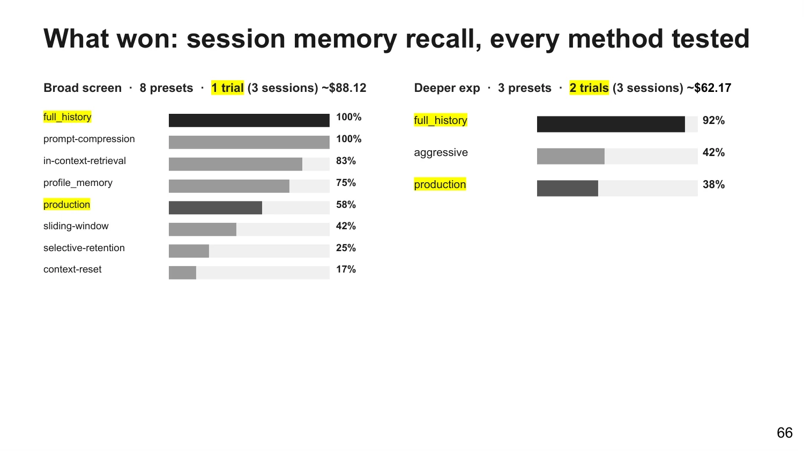

# Chapter 6 - How Do You Know Context Works

> The first five chapters taught you how to load, how to compress, how to save; this chapter teaches you how to prove—prove it actually got better, not that it merely looks better. First, build the minimal evaluation and monitoring setup so you can see when context starts to fail; then debunk the metrics and numbers most likely to fool you; finally, the boundaries of this craft—which parts will age out and which won't.

## 089. Why does context quality still have no accepted evaluation standard?

You tune the compression prompt, the boss asks "how much better?", and you have no number to show. That embarrassment isn't yours alone: as of September 2026, there is no accepted evaluation standard for context quality—the field is still blank.

Judgment: "good" has never been defined in this craft, so a shared standard has nothing to stand on. Three things jam it.

First, failure is silent. What compaction drops is usually not a visible error on the spot but details whose importance only shows up later. One probe experiment produced a striking reading: after compaction, all three high-level fact questions passed while all three specific figures from the appendix were lost—overall, everything looks fine, and you can't tell it broke.

Second, probes measure retention, not use. The popular probe method has a ceiling: plant questions to test recall and you measure "retention," never "use"—that piece of information may still be sitting in the window yet never used at reasoning time. No tool today measures that layer.

Third, benchmarks trail real workloads. Existing benchmarks (LoCoMo, LongBench, RULER) measure single-session long-range recall, and none of them keeps up with the cumulative loss of a compaction chain—the kind production agents form over days, dozens of lossy compressions strung together. Chained degradation has no solution, and not even a reliable way to measure it yet. One level deeper: the contributions of retrieval, compression, tools, and model cannot be separated at all—component-level attribution is nearly unsolvable, and the "living benchmark" direction remains on paper.

So what do you do? Don't wait for a standard—become your own standard: plant probes to watch memory (Question 090), watch six dimensions instead of the compression ratio (Question 091), start with twenty-odd real trajectories (Question 093). The state of this craft: no shared answer exists, so yours must.

1) Zylos: Agent Context Compaction for Long-Running Sessions https://zylos.ai/research/2026-04-21-agent-context-compaction-long-running-sessions/

2) A Survey of Context Engineering for LLMs (arXiv 2507.13334) https://arxiv.org/abs/2507.13334

3) Juejin: Context Engineering, a deep teardown https://juejin.cn/post/7621878684524019775

## 090. How do you plant probes to catch the moment an agent starts forgetting?

In turn 1 you tell the agent: I'm a Unity developer, my weak spot is RAG evaluation, and responses must start streaming within 300 milliseconds. It agrees nicely. Ten turns of real questions push the conversation past the compaction trigger; in turn 11 you ask: which topic should I practice tonight? Name the two metrics—the source's expected answers are hit rate and MRR. If it can't, it forgot.

Judgment: forgetting can't be caught by staring; you have to plant probes—like setting watchpoints on memory: write a known value in, run the program a while, read it back, check the answer.

The full flow is five steps; copy as-is. Step one, plant: in turn 0 of the session, insert a fact specific enough to judge right or wrong—not a vague preference like "the user likes brevity," but a point like "300 milliseconds." Step two, grow: push the conversation past your compaction or summarization trigger with real questions—real questions reproduce retrieval and tool behavior better than invented ones. Step three, probe: ask a question that can only be answered correctly using the planted fact; don't ask "what did we just talk about." Step four, gate: if compaction never fired during that run, discard the run—you didn't measure memory, you measured something else. Step five, blind-grade: the grading judge sees only the question, the answer, and the rubric—never which configuration the answer came from.

Don't write the reference answers yourself—the most counterintuitive rule of probe evaluation: their approach was to break human (staff) replies into atomic, right-or-wrong points and use those as the standard.

The measured readings are a warning: zero compactions, all correct; two or three, still all correct; after five or six, three out of ten left. Window size was ruled out by the same readings: the compacted group's windows sat at 95k-195k tokens when probes failed, while the full-history group stayed all-correct from 363k to 879k—the damage tracks the number of lossy rewrites, not window size (measurement basis: several hundred dollars of evaluation fees). One criterion to keep: when a probe fails, count compactions first; five or six compactions dropping you to 30% is the red line—window size is the first thing to rule out.



1) louisbouchard: Context Engineering in 2026 https://www.louisbouchard.ai/context-engineering-2026/

2) ai-tutor-app evaluation harness, open-source repo https://github.com/towardsai/ai-tutor-app

## 091. Which metric tells you whether compaction works without fooling you?

Conclusion first: the compression ratio lies. A comparison across 36,000-plus production messages: three vendors' compression rates all packed into the 98-99% band, impossible to tell apart, while quality scores spread from 3.35 to 3.70—and the most aggressive compressor (99.3%) scored dead last. The compression ratio answers "how much was deleted"; what you need answered is "can the work still get done after the deletion." That comparison retargets the optimization metric: watch tokens per task, not tokens per request.

The unfooled view settles on six dimensions, each scored 0 to 5 by an LLM-as-judge that doesn't know which configuration produced the answer, following a rubric:

| Dimension | What it measures | What 0 looks like |
|---|---|---|
| Accuracy | Are file paths, function names, and error texts correct | Details are invented |
| Context awareness | Does it know where the task stands | Only recites what happened |
| Footprint | Does it remember which files it read and edited | Re-reads, conflicting edits |
| Completeness | Did it take on every part of the question | Answers only half |
| Continuity | Can it continue without re-fetching material | Starts over at every step |
| Instruction adherence | Are formats and constraints kept | User requirements lost after compaction |

The row to watch in that table is footprint: all three methods scored only 2.19 to 2.45, the weakest in the field. So hang the alarm on this dimension (it was the weakest in the raw data)—a falling footprint score tracks real incidents better than a falling total. There is a mechanical reason it is hardest to keep: summarization trades off by information entropy, and low-entropy content like file paths looks most deletable to a compressor—while the agent's continued life depends on exactly that. For setting compression thresholds, flip back to Question 039.

1) Factory: Evaluating Context Compression for AI Agents https://factory.com/news/evaluating-compression

2) Zylos: Agent Context Compaction for Long-Running Sessions (the metric-traps section) https://zylos.ai/research/2026-04-21-agent-context-compaction-long-running-sessions/

## 092. How do you build context monitoring for your own workload?

The session you have had open since this afternoon—what is in its window right now, and where has the burn reached? If you can't answer, you can't manage it. Building your own monitoring doesn't require a platform; start the three-piece kit by copying what already exists.

Piece one, the token trace. Record one "total context tokens" per turn and plot it as a curve. The harness code has ready-made fields, one cell per turn, but watch a pitfall: the API's input_tokens excludes cache hits—using it directly as window size understates badly; sum uncached, cache-read, and cache-write to get the real total.

Piece two, the event log. Record every compaction and clearing as it happens: timestamp, the threshold at the time, how long the summary ran. When you later hunt for "which turn did it get dumber," the reconciliation runs entirely off this timetable.

Piece three, the cache-and-cost line. Claude Code's /usage prints a prompt caching statistics line right in the session block (supported since v2.1.251); for your own stack, copying these fields is enough:

```
Prompt cache (main): 14 requests · 91% of input tokens from cache
· 2 misses (last 6m 10s ago, 310.2k tokens re-cached)
· 1 expected rebuild (compaction or tool-result clearing) · warm (1h TTL)
```

The line even names who to blame for the last miss, such as an invalidation caused by changed tool definitions (supported since v2.1.260). The judgment rule is public too: only recomputing more than 5% and at least 2,000 tokens of cacheable content counts as a miss. Once the three pieces are in place, add one more move: pipe the trace and the events into your own observability stack via OpenTelemetry, and tally failure cases by layer—with all three tables assembled, the health of your context can barely hide from you.

1) Claude Cookbook: Memory vs. Compaction vs. Tool Clearing https://platform.claude.com/cookbook/tool-use-context-engineering-context-engineering-tools

2) Claude Code official cost documentation https://code.claude.com/docs/en/costs

3) HN: Anthropic ECE blog discussion https://news.ycombinator.com/item?id=45418251

## 093. How do you start a minimal eval with twenty-odd real trajectories?

How many trajectories do you need before it counts as an eval? The answer is looser than you think: about 20 real queries is enough to start. The reason is that early changes have large effect sizes—one prompt change lifting success rate from 30% to 80% shows up clearly in a handful of cases; waiting for a few hundred before building evals is the most common procrastination excuse.

The flow is five steps. Step one, collect trajectories: pick 20-50 real task trajectories that real users actually produced, not armchair inventions. Step two, set grading: give each case a verifiable outcome—string comparison where possible, otherwise an LLM judge; measured experience says single-call scoring of 0 to 1 plus pass/fail is the most stable and aligns best with human judgment. Don't write reference answers yourself; break them out of real human handling records as atomic points. Step three, save the baseline: persist the actual messages sent on every call, the tool definitions, token usage, and retrieval results into a replayable baseline—without it, every later comparison is vibes. Step four, change one variable: retrieval, compaction, tool descriptions, prompt—touch one at a time, or a score rise tells you nothing about whose credit it is. Step five, hold something back: carve out a small holdout test set to guard against overfitting—with this trick you can still squeeze out headroom beyond the "expert implementation."

The five steps copy straight into a checklist; tick as you go:

```
□ Collect trajectories: 20-50 task trajectories actually produced by real users, none invented
□ Set grading: a verifiable outcome per case; string comparison first, otherwise LLM judge with 0-1 scoring plus pass/fail
□ Save the baseline: messages, tool definitions, token usage, and retrieval results from every call persisted to disk, replayable
□ Change one thing: one variable at a time among retrieval, compaction, tool descriptions, prompt; rerun on the same set and compare
□ Hold something back: carve out a small holdout test set to guard against overfitting
```

Small-sample legitimacy in one line: an eval first seeks to detect big changes, not to publish precise numbers; while effect sizes are large, small samples have sensitivity enough—expand the sample when changes enter the fine-tuning zone, not before. Don't stop manual testing either: the corners an eval set can't catch, a human breaks in one poke—an agent habitually picking low-quality sources was caught exactly this way by manual testing.

1) JavaGuide: What is context engineering https://javaguide.cn/ai/agent/context-engineering.html

2) Anthropic: How we built our multi-agent research system https://www.anthropic.com/engineering/built-multi-agent-research-system

3) Anthropic: Writing effective tools for agents https://www.anthropic.com/engineering/writing-tools-for-agents

## 094. How do you quickly score a context assembly?

Scoring doesn't require running an eval first; ask the right four questions and you have a verdict in five minutes. The ranking, up front: a context window should be optimized around four goals—correctness, completeness, size, trajectory—the four rows of the table below. "The worst things" are ranked too: wrong information is worse than missing information, and missing information is worse than noise.

| Priority | What to check | The veto question |
|---|---|---|
| 1 Correctness | Wrong version numbers, wrong paths, stale state in the window | If this piece of information is wrong, what will the agent do? |
| 2 Completeness | Are the premises the task needs all in the window | Missing this one item and the job cannot be done |
| 3 Size | How much is noise, how much irrelevant material | Would removing it make the result worse? If not, it's noise |
| 4 Trajectory | Can a half-done task be picked up | Starting a fresh turn with only this assembly, could you continue? |

Using the ranking matters more than the checklist itself: when two assemblies conflict, correctness overrides everything—the model is a stateless function, and the ceiling of output quality is input quality; feed it one wrong version number and every later reasoning step works for that error. A bigger context laced with stale version numbers loses to a small, correct one. Note that "size" ranks only third—the place the whole list departs most from intuition: noise ranks below wrong and missing, so don't cut correctness to save tokens.

For the quantitative version, add five metric classes and the kit is complete: task success rate, tool-call quality, context cost (including cache hit rate), latency, and result quality (hallucination rate, missed-key-field rate). The checklist ranks, the metrics measure—a matched pair.

1) HumanLayer: Advanced Context Engineering for Coding Agents https://www.humanlayer.dev/blog/advanced-context-engineering

2) JavaGuide: What is context engineering https://javaguide.cn/ai/agent/context-engineering.html

## 095. Why do 97% say it matters while only 4% actually pull it off?

97 versus 4. The most striking pair of numbers in a 2026 industry report: 97% of respondents say context matters to their AI goals—79% chose "very important," 18% "somewhat important"—added up, almost no one called it unimportant; yet only 4% reached the "compounding stage," the maturity tier where accumulated knowledge gets more valuable the more you use it. More tangled still: 94% simultaneously agree compounding intelligence is a prerequisite for production-grade. Everyone endorses the destination; four percent arrive. (Survey, self-reported; the report's publisher sells context infrastructure—fine to read as industry sentiment, not as precise statistics.)

This is also the book's standing rule for citing industry numbers: first ask who ran the survey, who was surveyed, and how the surveyor makes a living.

Beyond the headline pair, three more usable scraps: 81% of organizations remain in the two earliest tiers, "every team for itself" and "figuring it out"; 67% call themselves still at prototype stage, even as executives push for scale; and the line that best explains the 97-versus-4 gap—only 42% say they can accurately measure production readiness, with 39% neutral or unsure. Unable even to answer "are we ready"—that itself is the answer.

Judgment: the gap isn't agreement, it's infrastructure. Where everyone agrees, there is no edge; the work lives where infrastructure is missing: the evals-monitoring-governance layer is exactly what Questions 090 through 093 build—planting probes, defining the six dimensions, wiring monitoring, running minimal evals. Whoever finishes those steps first turns 97 into their own 4.

1) Redis: The State of Context Engineering 2026 https://redis.io/resources/state-of-context-engineering-2026/

2) Redis: State of Context Engineering 2026 (direct PDF link) https://redis.io/resources/Redis_ePub_Report_StateOfContextEngineering_260818.pdf

## 096. Why does a 97 overall score still silently forget?

A reply reads beautifully: on-topic, fluent, polite—and then it steps all over a constraint you stated ten turns ago. The overall quality score gives that answer 97: in the same measurements, the compacted configuration's blind-graded quality score held steady at 97-99% while memory probes scored only 58%; in the turns where the planted fact could be proven lost, the judge rated "good" 100% of the time. Good every time, forgetting every time.

Why can't the overall score see this failure? Because it measures "does this reply resemble a good reply": prose, relevance, formatting all present—only the forgotten thing isn't on the rubric. That is exactly what makes silent forgetting terrifying: no crash, no nonsense, just a respectable reply quietly ignoring a constraint the user set in their own words. The user's experience runs the same way: no error message to screenshot, only answers that get steadily more off.

So there is exactly one rule: acceptance must score the planted facts only. The overall score works as a dashboard, not as an acceptance gate; acceptance asks one killing question with no waffle: "the fact planted in turn 0—can it still be retrieved in turn 11?" To keep the judge covering this blind spot, apply two measures together: narrow the rubric to atomic facts judgeable right-or-wrong, and hide the configuration source from the judge at grading time. For how to plant and how to gate, follow the Question 090 five steps; with every turn fully archived, re-grading later against a new rubric costs not another cent.

1) louisbouchard: Context Engineering in 2026 (source of the 97%-versus-58% figures) https://www.louisbouchard.ai/context-engineering-2026/

2) ai-tutor-app evaluation harness, open-source repo https://github.com/towardsai/ai-tutor-app

## 097. Why is observability context engineering's biggest gap?

Vendors all proclaim context matters, yet none gives you a window into the window. The sharpest critique goes for the throat: no vendor has shipped a decent window-visualization tool that lets you watch the window grow and shrink—Claude Code, at most, warns once when it's full. Someone suggested /context and got shot down immediately: a very crude tool where you see nothing in the message dynamic area, the part that matters most—how much the static section takes, you know; the dynamic part is precisely what you can't govern.

The measurement layer itself distorts too. In one Claude Code bug issue, a user's /context output showed the messages section at 3,107.9k tokens—amounting to 1553.9%, an impossible reading (February 2026, around v2.1.37). How do you navigate when the instrument itself is broken? That is the full meaning of "observability is the biggest gap": not just too few tools—even the readings you do have can't be fully trusted.

Two countermeasures worth copying: one, pipe agent trajectories into your own observability stack via OpenTelemetry, tally failure cases by layer, and have the agent emit hypotheses and evidence in structured format—natural-language soliloquy is a disaster for observability. Two, use what shipping products have caught up with: since v2.1.251, Claude Code's /usage includes the cache-hit statistics line, and misses even get their likely cause labeled (copied in Question 092). Vendors are catching up, but spreading the window open in front of you remains, as of September 2026, mostly your own job—the OpenTelemetry wiring and the structured output are two things you can start today.

1) HN: Anthropic ECE blog discussion (the original observability gripe thread) https://news.ycombinator.com/item?id=45418251

2) GH issue #7530: Error during compaction https://github.com/anthropics/claude-code/issues/7530

3) Claude Code official cost documentation https://code.claude.com/docs/en/costs

## 098. "Fewer than 5% of teams have evals"—can you trust that number?

The answer up front: the number itself is not trustworthy; the phenomenon it describes is very likely real. The expansion—because the real test in this question is how to cite a number with murky provenance.

It is the self-account of one anonymous practitioner (single anecdote, no sample size): across the many AI projects seen inside their own employer (a FAANG), fewer than 5% had evals. Grade the purity first: single source, anonymous, the sample being the internal projects he personally touched, with even the definition of "evals" resting in his mouth—strictly, the basis is "internal AI projects," not "teams." It carries no verifiable survey methodology, and it belongs to the same family as the more widely circulated "73% of AI startups are just prompt engineering" from the same period: that one was later judged AI slop, its number impossible to trace to any original source, and this book's red line forbids citing it as fact.

Can such numbers still be used? Yes—after a three-step vetting. Ask provenance: who said it, when, how it was measured; miss any one of the three and it downgrades to "someone's self-account." Ask corroboration: the industry report's 97-versus-4 points at exactly the same phenomenon—in the same survey, only 42% say they can accurately measure production readiness (Question 095). Ask that the basis travel with it: when citing, write "anonymous practitioner's self-account" beside the number—never let it put on a census costume.

Three steps done, the 5% has its correct posture: not statistics, testimony. Testimony's value is in the direction, not the decimal point.

1) HN: 73% of AI startups are just prompt engineering (the thread carrying that self-account) https://news.ycombinator.com/item?id=46024644

2) Redis: The State of Context Engineering 2026 https://redis.io/resources/state-of-context-engineering-2026/

## 099. You've learned a pile of tricks—how do you know which one actually works in your scenario?

You scroll past another miracle technique, drop it into the system prompt, and feel like things "maybe got a bit better." That "maybe" is the problem: tricks have no universal ground truth—only "did the score rise on your eval set."

The least merciful response says one thing: don't vibe, use evals—don't tune prompts by feel; make the evaluation speak. The full flow is worth copying: build the eval set from historical failure tickets and existing tests, list hypotheses across different context assembly options, and run an eval matrix to see which version truly gains and which merely spins; hand the prompt-optimization step to DSPy; and trajectory attribution is one line—wire the agent to OpenTelemetry and break failures down by layer.

The eval-driven loop has a sample taken to the extreme: stand up a prototype first, forge dozens of eval tasks from real usage, give each a verifiable outcome, run them programmatically in batch, read the model's reasoning traces for rough spots, revise a version, run again. That advice set is its own proof: it was mostly optimized by running evals repeatedly with internal tooling and feeding the results to Claude Code. Even whether a tool returns XML or JSON—the answer follows your own eval; there is no universal balm.

Someone else's trick fails in your hands because the optimum depends on the model-and-task combination—whether tool names take a prefix or a suffix, a detail this small, lands differently on different models. So other people's conclusions are hypotheses only, and your eval set is the referee. The move is one: for a new trick, run baseline then run changed, compare on the same eval set—keep it if the score rises, delete it if it doesn't. Two-thirds of the tricks in your bookmarks deserve exactly this purge.

1) HN: Anthropic ECE blog discussion (the original "don't vibe" thread) https://news.ycombinator.com/item?id=45418251

2) Anthropic: Writing effective tools for agents https://www.anthropic.com/engineering/writing-tools-for-agents

## 100. Will context engineering age out the way prompt engineering did?

Half of it will age out. Which half matters.

There is an observation you could call the scaffolding cycle: a single model goes first; gaps appear; you break out subagents and build scaffolding to patch them, and it all works well. A new model ships and absorbs 80% of your scaffolding straight into model capability, so you tear down the scaffolding, return to the single model, and build a new layer on the new capabilities. Stated as a law: model plus scaffolding always beats the bare model, but six months later the next model absorbs 80% of your scaffolding into its capabilities while opening new capabilities that demand a new layer of scaffolding. Run the cycle to its end and the model that no longer needs scaffolding would have to be the theoretical "ASI"—until then, this trade's work is forever three things: build evals for your task, patch the model's current weaknesses, and bank the domain knowledge the training set doesn't contain.

This means many specific techniques in this book have shelf lives. Where to place cache breakpoints, what threshold to set, which instructions to bold—these assets start depreciating the day they are written into a book, and they depreciate again with every model upgrade.

But the other half doesn't age out—and it is exactly the half this chapter is about. First, evals don't age out: every layer of scaffolding in the cycle depends on them for acceptance, and the stronger models get, the scarcer the ability to know good from bad. Second, the hard problem doesn't age out: an academic survey combed through 1,400 papers, and the number-one unsolved problem is still the asymmetry of model capability—understanding complex context already works well, while generating equally complex long outputs remains poor. Input-side engineering, taken to its extreme, cannot fill the output-side hole.

So my verdict stays an open question: prompt engineering didn't die—it was absorbed as a subproblem of context engineering; context engineering most likely won't die either—it will be absorbed into some bigger name. This is a judgment, not a promise. The assets that truly endure were never the list of tricks; they are the eval set and the trajectory archive in your hands. Look back at this chapter three years from now and the tricks half will probably be dated; the "how do you know good from bad" half, I'd bet, still stands. The action doesn't need three years of validation: return to Question 093, start the minimal eval from twenty-odd real trajectories, and bank your first non-aging asset today.

1) HN: 73% of AI startups are just prompt engineering (the scaffolding-cycle discussion thread) https://news.ycombinator.com/item?id=46024644

2) A Survey of Context Engineering for LLMs (arXiv 2507.13334) https://arxiv.org/abs/2507.13334
