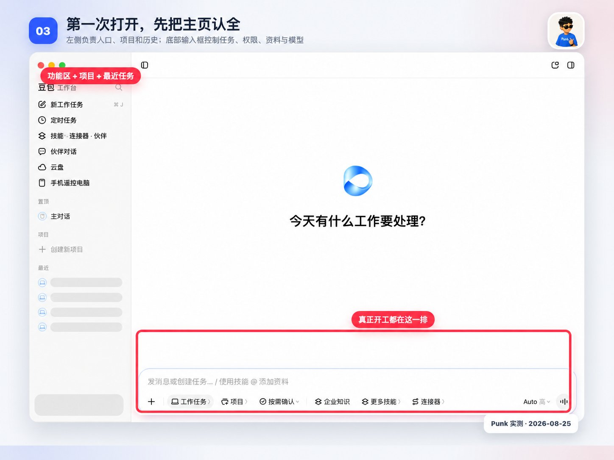

# Chapter 1 - Can It Really Do My Work?

> Before you pay, grant access, or hand over a single task, this chapter answers the most basic question about Doubao Work: can it really do your work — and where does it stop?

## 001. Are Doubao Work and the Doubao app on my phone actually the same thing?

Doubao Work is the agent work platform under the Doubao brand, built for individuals, teams, and enterprises. It helps you complete complex tasks of all kinds — documents, spreadsheets, PPTs, web pages, building whole systems — and turns ideas into deliverable work outcomes. It connects to Feishu natively, understands team and enterprise work context better, and within its permission boundaries can comprehend organizational knowledge, business information, and collaboration relationships, taking part in team collaboration and workflows. It is not another AI window that only chats. You state what work needs to be done, what materials you can provide, and what result you expect; Doubao Work understands the need around the goal, breaks it into steps, searches and reads information, calls the tools required, and delivers the result as an outcome you can keep using.

Spent a whole morning researching and still couldn't tell the difference. It's a mess — no idea which one to use.

Doubao Workmates is just the old Smart Companion with a new name. They didn't even change the internal icon.

## 002. You get a free 30-day membership at launch. When it expires, should you renew at 68 yuan or uninstall?

On June 24, the Doubao professional subscription system officially launched. The Standard plan costs 68 yuan per month on continuous billing (38 yuan per month after student verification), with a quota more than 5 times the free version's; the Enhanced plan is 200 yuan and the Premium plan is 500 yuan, with 4 times and 10 times the Standard plan's quota respectively.

The launch pitch: "From making PPTs and handling documents and spreadsheets, to scheduled tasks and automatically organizing files — hand it all to Doubao Work. Download now and claim 30 days of subscription benefits for free."

The quota control both the Doubao app and Doubao Work use is a rolling reset: quotas automatically recover every 5 hours or every week. In other words, Doubao Work is not dead once your quota runs out — while your membership is valid you can use it every day, continuously; there is only a cap on how hard you can push it in a short window. Hit the cap, wait for the timer, and the quota automatically refills to full.

## 003. 380 million people use it for chat. Why does delegating work require a separate standalone app?

Doubao Work is not out to replace Doubao; it is an office-dedicated entry point extended from Doubao. Heavy execution, desktop control, and Feishu context go to Doubao Work; everyday questions and creation stay with the Doubao app. Inside Doubao, the default expectation is "quick questions, quick answers, interrupt anytime, lightweight creation." An office agent's expectation is "hand over a goal, leave for a while, come back and inspect the results" — a task may run for ten minutes or half an hour, needs to operate local files, cross multiple apps, and read and write Feishu data within the team's permission boundaries.

- **High discovery cost** — a user who wants "AI to operate my computer" has to dig for the "Work Tasks" mode inside a chat app's feature tree.
- **Blurry brand identity** — it is hard to explain in one sentence whether "Doubao" is a chat tool or an office agent.
- **Hard-to-split monetization** — office tasks consume far more compute than ordinary conversation and need their own subscription tiers, team seats, and enterprise governance; they do not share a ledger with a consumer chat membership.

Spinning it off as "Doubao Work" is, at its core, a message to the market: **this is for getting work done — judge it by a dedicated client, a dedicated website, and dedicated pricing.** Once the model evolves from "writes well" to "finishes the job," the product organization has to evolve from "one app does everything" to "a chat entry, an office entry, and a coding entry" — Doubao Work is the flag of the office line.

Now the numbers behind the anecdotes: QuestMobile data shows Doubao's monthly active users reached 172 million in Q3 2025 and climbed further to 226 million in Q4, doubling for the full year. In December 2025, Doubao's daily active users broke 100 million, making it China's first AI-native app to cross that mark. On usage rate, Doubao hit 72.2%, far ahead of DeepSeek's 62.0% and Tencent Yuanbao's 16.5%. These numbers say Doubao stopped being a geek toy or a tech-circle fad long ago; it is a national-scale AI app in the true sense. Clearly, its spread rests not just on model capability but on the combined result of product strategy, growth engines, and ecosystem coordination. As of now, Doubao Work is served through three entries: the standalone PC client, the work entry inside Doubao, and the entry inside Feishu. The standalone app is PC-only for now; mobile scenarios are mainly carried by Doubao and Feishu.

## 004. My company doesn't use Feishu. Can I still use Doubao Work — and what would I miss?

Yes, your company can skip Feishu and you can still use Doubao Work: with a Doubao account you get the relevant work capabilities in the standalone PC client. But if you want enterprise knowledge, a Feishu identity, and Feishu collaboration capabilities, you need to sign in with a Feishu enterprise tenant account — and that depends on whether your company has activated it and how the administrators configured it.

Not necessarily, though. A Doubao account corresponds to personal identity and personal space; a Feishu account corresponds to enterprise identity, enterprise permissions, and enterprise entitlements. With a different login identity, the materials you can reach, the entitlements you can use, and the task space you work in may all differ.

- When Doubao Work draws on internal enterprise knowledge, it only uses messages, cloud documents, knowledge base content, and similar material that the asker already has permission to access in Feishu — it never exceeds existing permissions. And the more enterprise knowledge it can reach, the better its answers.

## 005. It claims it can operate my computer. How much permission should I actually give it?

**Operate the computer, complete complex tasks.** Doubao Work can read, create, and modify local files on your computer, and it can automatically open web pages, fill in information, and complete operations that span multiple pages. Even when you are not at the computer, you can dispatch tasks remotely from your phone.

**3. Permission modes: decides at which step Doubao must stop and ask you.** The "Always ask / Confirm as needed / Allow all" switch below the input box controls how often work tasks ask for confirmation. It does not change what the model can do; it changes whether Doubao must obtain your consent before going online and before modifying files.

- **Always ask:** asks both when editing external files and when using the internet. Use this when you are handling company materials for the first time, connecting a new service, or still unfamiliar with the execution flow — the safest setting.
- **Confirm as needed:** the system asks only when it judges an operation risky. Recommended for practice runs and everyday office work — fewer repeated confirmations while keeping the critical pauses.
- **Allow all:** unrestricted internet access, plus the ability to edit files on your computer. It fits tasks you have already run through repeatedly with a very clear scope; it does not fit as a long-term default.

You also need to separate three layers of permission. The task permission mode governs "does it ask you during execution"; connector authorization decides whether it can enter external services such as email and cloud drives; macOS system permissions decide whether the app can access certain local folders, the screen, or the microphone. Even with tasks switched to "Allow all," it does not automatically gain access to an email account that has not been logged in.

For first use, stay on "Confirm as needed" and keep your materials in a separate practice folder. Whenever you see delete, overwrite, batch modification, send, publish, or a login authorization, read exactly what it targets and how far it reaches before continuing; for anything involving clients, finances, or unpublished material, temporarily switch to "Always ask."

## 006. ByteDance has folded Feishu right in. Will my data be used for training?

Doubao Work's team/enterprise editions keep data isolated from the personal edition, and private enterprise data is not used for model training. When employees access enterprise knowledge and tools, they strictly inherit the permissions they already have — AI cannot be used to slip past the organization's authorization boundaries.

Administrators can provision members centrally, allocate quotas, and manage usage by individual, user group, or department. With capabilities such as watermarks and behavior auditing, the enterprise can track how AI is being used and expand adoption within its security boundaries.

Reporters learned that under the restructuring plan, the Feishu product team and the Doubao product team will merge into a new Doubao product team, led by Doubao head Zhao Qi, with Feishu head Xie Xin reporting to Zhao Qi. Once the reorganization is complete, beyond keeping the existing Feishu products and services unchanged, Feishu will also collaborate more deeply with Doubao in productivity scenarios. On the surface this is a handshake between Feishu and Doubao — in reality it goes further than that.

## 007. Doubao shut its agents down overnight. Will this new product die too?

On July 3, 2026, Doubao announced the [removal of all user-created agents](https://www.ithome.com/0/972/448.htm). The next day, Qwen [followed suit](https://www.ithome.com/0/972/525.htm). Tencent's Yuanbao had already [completed its takedown](https://wap.eastmoney.com/a/202607043794207023.html) on June 30. News headlines said the agent function was taken down, leading many to believe that AI chat in the apps would no longer work.

What was actually taken down: the user-created agent plaza. The chat functions of all three apps continue to work as usual. Open Doubao, Qwen, or Yuanbao, ask questions, have them write something, get work done — none of that is affected. The only thing that disappeared is the user-built agents in the plaza. In one sentence: what was shut down is user-generated AI, not AI chat itself.

On September 2, Doubao Work shipped a product update launching two new features at once: multiple agents running in parallel, and "operate the computer" on Mac. After introducing the brand-new productivity product and brand "Doubao Work" on August 25, Doubao's iteration around productivity has not paused — it has accelerated. From remotely controlling your computer from your phone and the cloud computer, to skills, connectors, and workmates, to cross-platform control and multi-agent collaboration, Doubao is step by step reshaping "a large model that can chat" into "an office agent that can break down tasks, do the work, and deliver." Round after round of feature launches point in the same direction: letting AI take on more and more responsibility in ever more complex work. The AI agent competition is now shifting from "what can it do" to "how well it knows the user," and enterprise-grade scenarios plus context understanding are becoming the key variables of the new round. For Doubao, the dense release cadence is only the surface; whether this "AI that gets work done" actually runs inside users' daily office workflows is what decides whether its productivity narrative holds up.

## 008. The rival is Tencent's WorkBuddy. Which should I try first so I don't lose out?

With Doubao absorbing Feishu and TRAE, China's "big three" of office agents have essentially taken shape — Doubao Work, Qwen Office, and WorkBuddy (listed in no particular order, just typed off the cuff; and shouldn't WorkBuddy consider picking a Chinese name?)

At the speed ByteDance, Alibaba, and Tencent grind out products, capabilities will soon catch up to Codex and the feature sets will gradually converge. So how do you choose for office work? You go back to the "ecosystem" game Chinese tech giants love to play: each office agent supports its own ecosystem most directly. If your office runs on Feishu, pick Doubao Work; on DingTalk, pick Qwen Office; on WeCom, pick WorkBuddy.

If you're trying to figure out what Doubao Work is, how it stacks up against ChatGPT Work, Claude Cowork, Tencent's WorkBuddy, and Alibaba's Qwen Office — and which one (if any) your team should adopt — this is the map. The short version: the products look nearly identical on stage, and the real differences hide in what work context each one can reach. The lesson for buyers: the underlying model matters less than it seems. Model A leads today, Model B in a few months. What you _can't_ migrate cheaply is hundreds of thousands of documents, years of meeting records, and a whole permission system. That's the moat.

- Heavy on Tencent tools → **WorkBuddy** fits most smoothly.
- Deep in DingTalk → **Qwen Office** integrates easiest.
- Already on Feishu → **Doubao Work** has natural context advantages.

## 009. When a message AI sent on my behalf causes trouble, whose responsibility is it really?

Doubao Work can read organizational information, so it quickly learns who my manager is, how the message should be edited, and who it should go to. Right after that, we can hand the AI-organized page to my manager to review whether it is accurate. Doubao Work automatically polishes the chat copy and adds a "Sent by Doubao" label to distinguish it from messages written by a human.

On enterprise-grade security, Doubao Work has built a strict end-to-end agent security protection system covering device access, permission configuration, quota control, data encryption, and operation auditing. It also strictly inherits Feishu's existing permission system: users can only read data and use tools within their own permissions, and personal data stays isolated from enterprise data. Doubao Work is now among the first office agents in China to pass dual certification for office agent capability and cloud-based benchmark testing.

## 010. The official site says it knows valuation modeling and clinical evidence. Is it really that good?

**A rich set of skills covering many work scenarios** — professional capabilities across investment, healthcare, creative work, and other fields.

**Clinical diagnosis and evidence-based medicine:** a patient 28 weeks pregnant with a suspected pulmonary embolism, and the family worries about CT radiation — how should testing and anticoagulation be handled?

**Valuation modeling:** build a 5-year LBO model for Shuanghui Development and back out the highest acquisition price that a 20% IRR allows.

Skills are capability extensions that package domain-specific knowledge, workflows, or tool integrations — 106 in total so far, in two groups:

- Built-in platform skills (38): provided natively at runtime, no installation needed. Office collaboration 26 (Feishu docs / sheets / Feishu Base / calendar / approvals / IM / email / cloud space / tasks / projects / OKR / slides / video conferencing / Minutes / knowledge base / whiteboard / contacts / attendance, plus enterprise knowledge retrieval, scheduled tasks, and more), programming 6, internet 2 (browser control, visualization), new media creation 4 (video generation, audio generation, video content extraction, and more).
- Doubao-recommended skills (68): finance 12, legal 6, new media creation 8, internet 8, programming 8, academic 8, e-commerce 7, healthcare 6, office collaboration 3, travel and daily life 2.

## 011. The free version costs nothing. Is it enough for real work, or just for a taste?

The most fundamental difference is the model. The free plan runs on 2.1 Turbo; the paid edition runs on 2.1 Pro, which is clearly stronger at complex logical reasoning, code generation, and long task execution. For ordinary Q&A, writing, and simple image generation, the gap between paid and free is hard to perceive. Only in heavy scenarios — long-document processing, complex code, multi-step agent tasks — does the Pro model's advantage show.

Free users can of course still experience Doubao Work on the Turbo model. In our hands-on use, the Pro edition's window quota was enough to get through a large volume of everyday office work; the free Turbo quota is limited, but for getting started and simple tasks it is entirely sufficient.

There is no standard answer here; it depends entirely on what you need. For casual users who just chat, look things up, and write simple copy, the free version is completely enough, the paid plan's value for money is extremely low, and there is no reason to buy. For professionals and power users who lean on AI daily at high frequency for office tasks, code, and data analysis, as long as the Pro model's capability genuinely raises your efficiency, 68 yuan a month is not expensive — it averages out to about 3 yuan a day.

## 012. Same membership budget: is 68 yuan better spent on Doubao or on Kimi?

On June 24, the Doubao professional subscription system officially launched. The Standard plan costs 68 yuan per month on continuous billing (38 yuan per month after student verification), with a quota more than 5 times the free version's; the Enhanced plan is 200 yuan and the Premium plan is 500 yuan, with 4 times and 10 times the Standard plan's quota respectively.

First, put the domestic rivals on the same table. Among Chinese products that have clearly rolled out personal tiered subscriptions, Kimi has four tiers: Entry at 49 yuan/month, Efficiency at 99 yuan/month, Professional at 199 yuan/month, and Exclusive at 699 yuan/month. Doubao's 68-yuan Standard tier sits right between Entry and Efficiency — about 40% above Kimi's cheapest tier, but nearly 30% below the 99-yuan Efficiency tier. The other camp — Tongyi Qianwen and Tencent Yuanbao — still keeps consumer-facing basic features mostly free; their monetization focus is on enterprise services and developer API calls, and both their personal-payment momentum and product maturity remain relatively limited.

Globally, the value equation changes shape again. ChatGPT Plus costs about 135 RMB a month, Claude Pro sits in the same price band, and Doubao Standard is only about half that. Top overseas professional tiers often run to several hundred dollars a month; Doubao's highest tier at 500 yuan is priced at roughly one-third of that.

## 013. Before you switch it on, which five things should you check first?

The entry point decides "where you use it from"; the account identity decides "as whom you use it." This is the single most confusing point in Doubao Work's product structure. To judge which capabilities you can use, look at your current login identity, the entry you are in, your personal entitlements, your enterprise entitlements, and the administrator's configuration — not just at whether you bought a particular membership.

Beta status: the feature is in beta. For questions, [contact customer service](https://applink.feishu.cn/client/web_url/open?width=400&height=600&mode=window&url=https%3A%2F%2Fwww.feishu.cn%2Focic%3Fsource%3D1%26channel_id%3D44). Version requirement: Feishu V7.75 or above. Answer: check the following requirements — all must be met before the "Ask Doubao" entry appears:

- A knowledge base administrator has [enabled the Doubao Work features](https://www.feishu.cn/hc/zh-CN/articles/455965510166) in the current knowledge base's settings.
- You are within this feature's beta scope.

Doubao team subscription, starting from 1 seat: **¥166** / seat / month. Billed annually, ¥1,988 / seat / year in total; billed monthly, ¥198 / seat / month.

- Includes all free-edition entitlements.

## 014. Which tasks should you hand over — and which should you never hand over?

A good task goal contains four elements:

1. Task background: why this needs to be done
2. Input materials: which files, web pages, or data sources it must read
3. Output requirements: format, word count, page count, style
4. Quality standards: what information must be included, what problems to avoid

When you send a task instruction and enable local computer or browser automation permissions, Doubao independently understands the instruction, plans the steps, and executes — file reads and writes, web page operations, software automation, batch processing, and more. Instructions like these count as authorization from you personally; anything involving property, identity, or high-risk system permissions still needs you as the gatekeeper.

- This is not hands-off full automation — authorization and high-risk steps still require human sign-off.

After trying several scenarios, my overall takeaway: Doubao's paid edition performs well on "thinking" tasks such as information gathering and summary analysis, but its execution ability still needs work. More critically, **the Standard tier's quota is simply not enough — configuring tasks alone burned through the vast majority of it**. The tasks I had planned to test — PPT generation and automatically scraping bidding data into a spreadsheet — never got to run before the quota hit bottom, and I had to wait for the next cycle, a week later, for new quota to unlock. Take auto-publishing: I wrestled with it a whole afternoon before discovering it simply could not log into my Xiaohongshu account — the anti-bot defenses are right there, and it can hardly solve the CAPTCHA for me, can it? The most exasperating part: **when it cannot do something, it does not proactively say so — it just pretends to be executing**. Only after I noticed nothing had been published and asked did it tell me it couldn't. After a dozen rounds of back and forth, I gave up: rather than argue with it about how to log in, wouldn't I just click publish myself?
