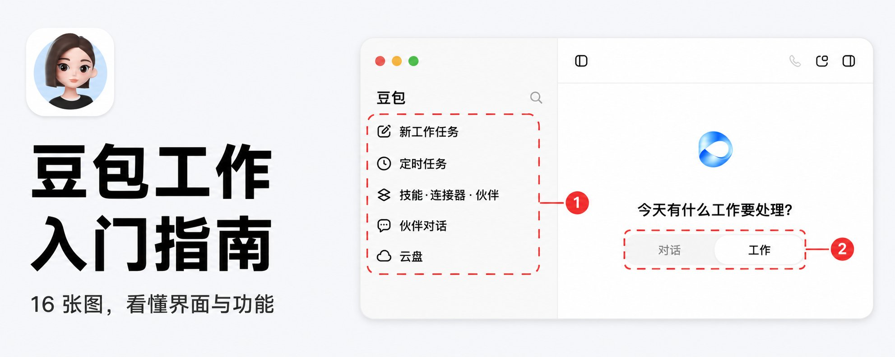

# Chapter 2 - Don't Rush to Delegate on Day One

> Before you hand Doubao Work its first real job, this chapter lines up the basics in order: where to download it, which account to log in with, how to set the three permission tiers, what the first executable task looks like, and which things it should never touch on day one.

## 015. Is the "free membership with download" deal real? Where do I get the official version?

At present, the desktop version of Doubao Work can be downloaded from the official website, and users can also use it directly inside the latest desktop version of the Doubao app. From now on, simply downloading, logging in, or upgrading gets you a free 30-day subscription.

Hand everything over to Doubao Work — download it and claim it for free.

## 016. Should I log in with a Doubao account or a Feishu account? How much difference does the choice make?

The entry point decides "where you use it from"; the account identity decides "whose identity you use it as". This is the single most confusing point when trying to understand how the pieces of Doubao Work relate.

One person owning both a Doubao account and a Feishu account does not mean the data, benefits, and permissions of the two identities automatically blend together. Which identity you choose at login affects the materials you can access, the enterprise capabilities you can use, and the space your tasks live in. Logging in with a Feishu account does not mean access to everything in the company: which documents, spreadsheets, and knowledge Doubao Work can read is still based on the permissions you personally already have, and the enterprise administrator may also configure the scope within which Doubao Work can be used.

Under both login methods, identity determines the boundary of capability: which documents, spreadsheets, and knowledge bases can be read still depends on your own existing permissions, and the enterprise administrator can also configure the usage scope.

## 017. The three-column interface is a lot to take in — where should I look first?

Yes — Doubao Work has a brand-new Logo and is a standalone app, but the interface keeps the classic three-column layout: manage tasks on the left, watch the execution process in the middle, preview and edit the results on the right.

In Work mode, the toolbar runs left to right like this. Plus (+): add files, images, cloud-drive materials, screen content, or screenshots. Local computer: choose where the task runs; from this entry you can switch among Chat, local Work Tasks, or cloud computer Work Tasks. Projects: put the task into a long-term project, and you can also add local folders. Confirm as needed: controls whether Doubao must ask you first before performing sensitive operations — on first use, keep this option on. Skills: load a ready-made way of doing things onto the task. Connectors: let the task use data or functions from external services. Whenever you are unsure about a setting, keep the current one and only open it up when a task actually needs it.

## 018. The three permission tiers — how do I set them on day one without causing trouble?

Always ask: it asks you both when editing external files and when using the internet. When handling company materials for the first time, connecting a new service, or still being unfamiliar with the execution flow, this tier is the safest. Confirm as needed: the system only asks when it judges an operation to be risky. Ordinary practice and daily office work should use this tier — it cuts down the repeated click-to-confirm while keeping the critical pauses. Allow all: it can access the internet without restrictions and edit files on the computer. This tier suits tasks that have already been run through repeatedly and whose scope is very clear; it is not suitable as a long-term default.

For the first run, keep "Confirm as needed" and put the materials in a separate practice folder. Whenever you see delete, overwrite, batch modification, send, publish, or login authorization, read the target and scope of the operation clearly before continuing; when customer, financial, or undisclosed materials are involved, temporarily switch to "Always ask".

Before starting, create a new practice folder on your computer and, inside it, two small folders: input holds copies of your materials, output holds what Doubao generates. The original files stay where they are, so even if the first operation goes wrong, you lose nothing.

## 019. What is the safest first task to delegate? And why is it never deleting files?

Do not deliver a pile of files at once the first time. Pick one de-sensitized material and let Doubao produce only one kind of result; once you can open it and check it, move on to the next kind.

Create a practice folder, put in a single material with no sensitive information, then send the first task: "Read this file and only organize its content. First tell me your execution plan; when done, list the files you added and modified."

A scheduled task repeats its mistakes too. Write the prompt wrong once and a manual task errs once; an automated task may err every single day. So the first automation should only do queries and reminders — do not let it automatically send emails, delete files, modify data, or publish content. Turn on the schedule switch only after one fully correct manual run.

## 020. How do I write an executable task covering all four elements?

An executable task states at least four things clearly: materials, task, constraints, acceptance. A good task goal should include: task background — why this needs to be done; input materials — which files, web pages, and data sources need to be read; output requirements — format, word count, page count, style; quality standards — which information must be included and which problems to avoid.

For example: "Read [the raw spreadsheet] and copy it into a new file to process. Clean out empty rows and duplicate records, and keep the raw data sheet; add a new 'Summary' sheet that tallies counts and amounts by month and category, and generate two charts. Do not modify the original file, do not delete records you cannot judge, and list anomalies separately. Save it as [output folder]/data_summary_v1.xlsx. Acceptance: the raw row count, the deduplicated row count, the anomaly row count, and the summary amounts must all be written in the reply."

The safest approach is to split it into two passes: first have it write the page outline, review it, and only then have it generate the file. A page outline is like an essay outline — if the direction is wrong, changing eight lines of text is easy; waiting until all 8 PPT slides are finished to make changes wastes far more time.

## 021. Where do I put materials so it can find them? The input/output folder method

Before starting, create a new practice folder on your computer and, inside it, two small folders: input holds copies of your materials, output holds what Doubao generates. The original files stay where they are, so even if the first operation goes wrong, you lose nothing.

After the project is created successfully, its name appears under "Projects" on the left. Enter the project and start the task from there, and Doubao should be able to see the folder you added; if it cannot, first check that the right project is selected and the files really are in that folder — do not rush to widen permissions.

If it is about to write to some other folder, or about to upload, send, or overwrite the original file, do not click confirm. Restate the save location and the forbidden actions.

## 022. The official site's 24 example prompts — how do I borrow them without copying them wholesale?

While digging through the official website (doubao.com/work), I noticed a detail that is easy to scroll straight past: under every skill card in the skills section hangs an **officially written example prompt**, with a "Copy" button right beside it.

Note the restraint in the customer-service plan prompt: "no spoilers, no deception, yet still keep the customer" — three constraints, the kind of wording only someone who has been burned in real business could write. The wealth-planning one is a textbook-quality prompt: principal, goal, and risk tolerance are all given. **The more specific the numbers, the more usable the deliverable.**

Read them together and you will see that the official team is actually teaching one formula: "at least 10,000 words", "cite 5 references", "tolerate at most a 15% loss" — all verifiable deliverable standards. Rewriting your own prompts with this formula is worth more than copying the 24 homework answers themselves.

## 023. Connecting the company knowledge base — the entry is grayed out. What now?

Beta information: the feature is in beta testing. Version requirement: the Feishu client needs to be upgraded to version ... or above; the web version has no version requirement. Who can configure it: knowledge base administrators. You can configure Doubao Work-related features within the knowledge base. The feature is on by default and can be turned off manually. When enabled, knowledge base members can use it to ask questions, summarize, follow up, and generate documents based on the content within the knowledge base that they have permission to access, acquiring and accumulating the knowledge in the base more efficiently.

Q: I am a knowledge base administrator — why don't I see the "Doubao Settings" entry in the knowledge base settings? A: All of the following requirements must be met at the same time before the "Doubao Settings" entry appears. Note: if you only see the "Knowledge Q&A" feature setting entry in the knowledge base settings instead of "Doubao Settings", it means you are not yet within the beta scope of the Doubao Work feature. For specifics on configuring the Knowledge Q&A feature, see [Configure the Knowledge Q&A feature for a knowledge base](https://www.feishu.cn/hc/zh-CN/articles/138181848717).

You can use this feature in a Feishu knowledge base to ask questions, summarize, follow up, and generate documents based on the content within the knowledge base that you have permission to access, acquiring and accumulating the knowledge in the base more efficiently. Note: if the entry you see in the knowledge base directory is "Ask the knowledge base" rather than "Ask Doubao", it means you are not yet within the beta scope of the Doubao Work feature. For specifics on "Ask the knowledge base", see [Use Knowledge Q&A in a knowledge base](https://www.feishu.cn/hc/zh-CN/articles/143241168260).

## 024. How do I install a skill? How does marketplace install differ from having the AI build one?

"Skills · Connectors · Workmates" is a unified entry in the Doubao Work sidebar. The three capabilities have distinct roles; each can be used independently, or in combination. One sentence captures their relationship: skills are the "craft", connectors are the "pass", and Workmates are the "people".

Skills: giving Doubao professional capabilities.

The three creation paths differ as follows. Creating a new skill by chatting with Doubao opens a new Work Task with a "new skill" task entry attached automatically — suited to people who cannot hand-write skill files and prefer to describe their needs through conversation. Uploading a skill imports a skill archive, folder, or file you have already prepared. Creating a new custom connector means manually filling in the server information to hook one of your own connectors into the local Doubao.

## 025. First-time connector authorization — why give it read-only only?

When connecting a service, check in this order: first confirm it is genuinely needed for the current task; read the authorization page to see whether it wants to read, create, modify, or send anything; for the first connection, prefer read-only or the smallest possible scope; back in the task, state explicitly which actions it is allowed to perform.

If the task reports "no permission", "account not found", or "login required", go back to the connector page and check the authorization status first — do not keep tweaking the prompt. Successful authorization only means Doubao has an access channel; every actual read and write is still limited by the account's own permissions.

## 026. Task permissions, connector authorization, system permissions — why must you think of them separately?

Here you also need to keep three layers of permissions distinct. The task permission mode governs "whether it asks you during execution"; connector authorization decides whether it can enter external services such as email or cloud drives; macOS system permissions decide whether the app can access certain local folders, the screen, or the microphone.

Even if you switch the task to "Allow all", Doubao will not automatically gain access to an email account that has never been logged in.

## 027. When you are out, can your phone command the computer at home to work?

Recently, ByteDance's Doubao rolled out a series of upgrades to its "Work Tasks" mode, adding practical features such as remotely controlling the computer from a phone, dual-mode running on the local machine and the cloud computer, collaborative editing in the interface, and modular skill combinations — meaning Doubao's AI capability has fully advanced from basic Q&A interaction to autonomously carrying out work tasks. In June this year, Doubao launched the "Work Tasks" mode, in which the AI can directly operate the local computer and browser after authorization. This update extends task control to the phone side, supports linking multiple computers, and allows fetching files across devices. For example: while out, remotely have the computer find a file on the desktop, convert it to PDF, and send it back; during a commute, have the computer continue an unfinished data analysis and send the generated charts to the phone; when the files you need are split across a work computer and a home computer, fetch them separately and merge the edits.

My wife recently went back to China, where she couldn't use ... some of these services, so day to day I use Doubao to help her look things up and plan trips. These past two days she needed to find a document on her own computer — she was in China while the computer was in the United States. Using Doubao on her phone, she commanded the computer over in the US, had it locate the document and send it to Feishu, and could access it right from the phone. Extremely convenient. This has already become a feature I use a lot every day. When you are out, you can check ... task execution progress from your phone at any time, or if something comes up on the spur of the moment, command the Agent on your home/office computer from the phone to go execute it, then just look at the results when you get home — the commute is not wasted either.

## 028. Cloud computer or local mode — which should you pick on day one without agonizing?

The newly added dual mode — local machine and cloud computer — can be chosen as needed. In local mode, data stays on the user's own machine, which suits local-data tasks such as file organization and document operations. Cloud computer mode has persistent online capability and can run large tasks without dragging down the local machine's performance, which suits long-running, resource-heavy work — for example, in data collection and research scenarios, it can be used for organizing industry information, literature reviews, and analyzing recruitment listings. On top of that, when you are without your computer, you can remotely control the cloud computer from your phone to finish PPT creation, editing, and other work tasks.

Privacy and local-software work go local; long-running and compute-intensive work goes cloud.

The difficulty is usually in exception handling: expired logins, CAPTCHAs, software version differences. It is wise to do a trial run with non-sensitive files first and, once familiar with the authorization boundaries, move on to important data. Local mode can **reuse the browser's login state**, which suits scenarios like intranet OA systems that pure APIs struggle to cover.

## 029. When is it worth creating a "Project" for the work?

An ordinary task mainly saves the record of that one task. A project is for centrally managing tasks under the same long-term theme and for binding the local folders that need to be used. For example, "Client A", "official account operations", and "Q3 product launch" can each become their own project, keeping the related tasks and materials within the same scope.

When do you need a project? When the same batch of materials has been put to use for the third time, or when the work will continue week after week, create a project. When there is only one temporary spreadsheet, keep using a new work task.

Creating one requires filling in a project name and selecting a local folder. Write the project name so the object and the goal are clear; for the local folder, choose only the directory this work needs — do not hand over the entire desktop, the Downloads folder, or a whole cloud drive just to save effort. Which local materials Doubao can reach inside a project depends, first of all, on which folder you selected.

## 030. How do I configure a scheduled task safely the first time?

The page already comes with templates: weekly work report, daily schedule briefing, news push, competitor activity research, stock price monitoring, and product price monitoring. A template is just a pre-written task framework; after opening one, you still need to check and fill in three things: what exactly it does each time, when it runs, and which materials it may read or which tools it may call.

For example, suppose you want industry news every morning. First send it once manually in "New Work Task": "Search these 3 websites for updates from the past 24 hours; give me titles, two-sentence summaries, and links to the originals." Once you have confirmed the sources have not drifted and the format is readable, put the same sentence into a scheduled task and set it to run at 9 a.m. on workdays. Use only original sources that actually open; output in the format "title, date, two-sentence summary, link"; if there are no updates, write "No new items today". This run only generates results — no sending, no publishing, no modifying any files.

After the results come back, open two of the links to confirm the pages load and the titles and summaries match. Then go to "Scheduled Tasks" on the left, click "New", paste in the same instruction, and set the run time to 9 a.m. on workdays. Run it manually once with fully correct results before turning on the schedule switch.

## 031. After delegating, must I keep watching it, or wait for it to hand in the work?

In other words, the phone can directly remote-control the computer's operations, and I can watch the entire production process in real time from the phone:

Another fairly noticeable difference is that this release of Doubao Work also pushed quota consumption down. On the same enhanced plan of the personal subscription, you can now run more complex tasks back to back, and you no longer need to start staring at the remaining quota every few heavy tasks the way you used to.

## 032. The slogan "A new work habit" — what is it actually saying?

A new work habit: let Doubao do it first.

The change looks small, but behind it is a migration of the entry point. In the past, the app was the entry point, and people did their work inside the app; now, the Agent is the entry point, and apps retreat to the background, becoming tools the Agent calls. Once this migration hardens into a habit, it is very hard to reverse. Just as people once started their browsing from a search engine's homepage and later started from WeChat and short videos — wherever the entry point is, that is where the attention is, and that is where the ecosystem is.

## 033. How different are Mac and Windows? Which machine should run it?

On September 2, Doubao Work released a product feature update, launching two new features at the same time: "multiple Agents (intelligent agents) in parallel" and "operate the computer" on macOS. Following the August 25 launch of the brand-new productivity product and brand "Doubao Work", Doubao's iteration around productivity scenarios has not paused — it has sped up: from remotely controlling the computer from a phone and the cloud computer, to skills, connectors, and Workmates, to cross-platform control and multi-agent collaboration, Doubao is turning "a large model that can chat" into an office agent that "can break down tasks, do the work, and deliver", step by step. This round after round of feature releases points in the same direction: letting AI shoulder more and more responsibility in increasingly complex work.

Launching alongside "multiple Agents in parallel" is "operate the computer" on macOS. This capability lets Doubao perform local GUI (graphical user interface) operations on a Mac — with no reliance on MCP, API, plugins, or CLI; simply by "understanding the screen" it can simulate the mouse and keyboard to complete operations. Concretely: after the user creates a new work task and selects "operate the computer" in the skills bar, once authorized, Doubao can recognize the screen and simulate keyboard and mouse to complete long-tail tasks such as operating software, looking up information, and entering content, and the user can take over or stop the execution at any time. This capability had previously landed on Windows; with Mac users joining, the last piece of the cross-platform control puzzle is in place.

Buttons and available features may change with version and account — what you see on your own interface prevails.

## 034. Build a day-one safety checklist — which five things should it never touch?

For the first run, keep "Confirm as needed" and put the materials in a separate practice folder. Whenever you see delete, overwrite, batch modification, send, publish, or login authorization, read the target and scope of the operation clearly before continuing; when customer, financial, or undisclosed materials are involved, temporarily switch to "Always ask".

A scheduled task repeats its mistakes too. Write the prompt wrong once and a manual task errs once; an automated task may err every single day. So the first automation should only do queries and reminders — do not let it automatically send emails, delete files, modify data, or publish content. Turn off remote control and continuous wake as soon as you are done using them. On public computers, shared company computers, and computers that hold customer or financial data, do not leave this switch on long term.

Finally, the most important thing is security. While using the Doubao Agent, I ran into tasks it could not complete; rather than flagging a security risk, it came up with a plan that required me to hand over a cookie. And most ordinary users, most of the time, cannot judge whether what it is asking for should actually be given.
