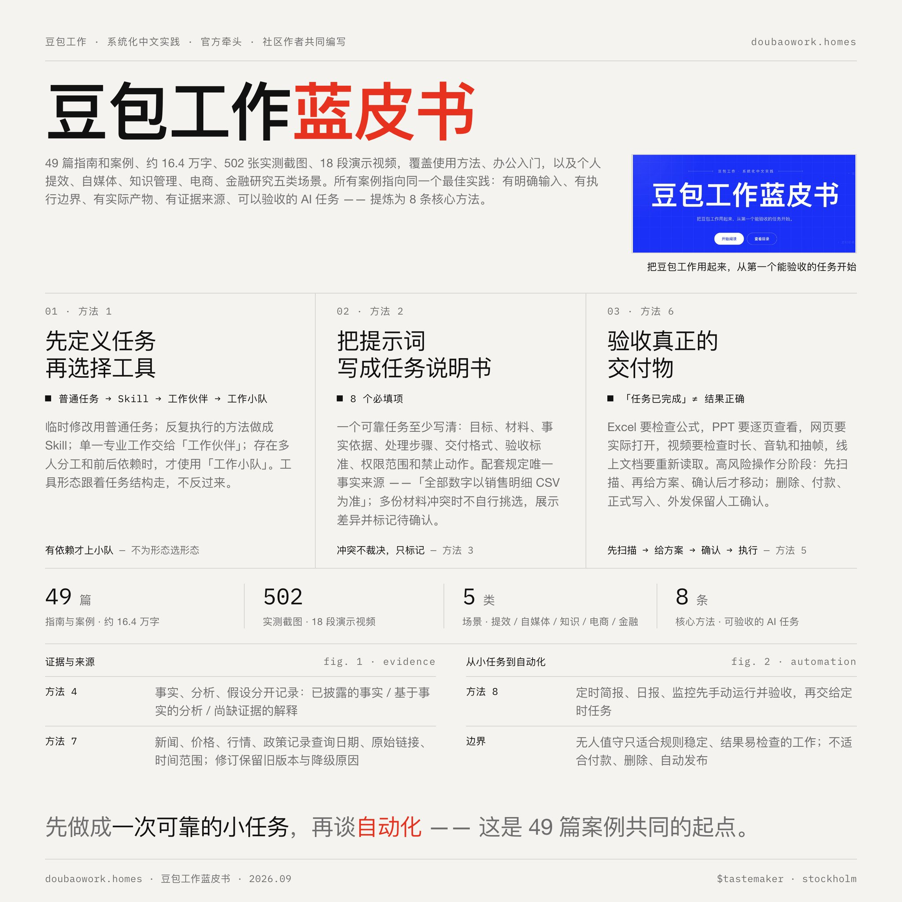
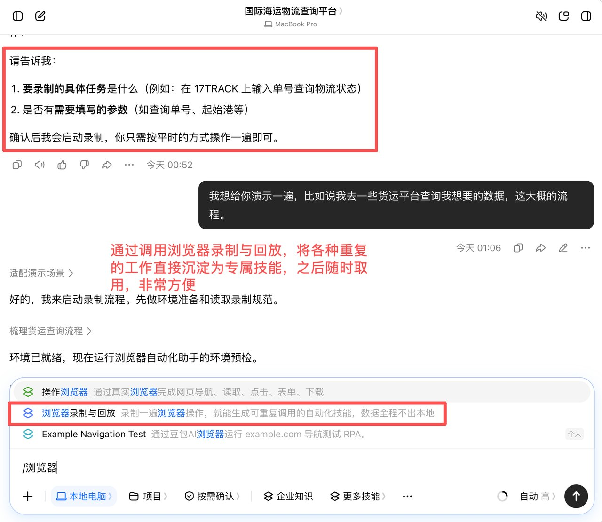

# Chapter 3 - When It Fails, Whose Fault Is It?

> Hands-on tests that put Doubao's office agent to real work, then chase every failure down to its rightful owner: the model, the product, or the person using it.

## 035. Three of four hands-on tasks failed — is it the product, or is it me?

Whether a model is good is not decided by benchmarks; whether it can genuinely help people get work done is the only test that counts. So [World Model Factory] got hands-on immediately and put the June professional edition (predecessor) of Doubao to work in office scenarios. One caveat: this round of testing was mainly based on the currently available Doubao large model 2.1 Turbo office-task mode, and does not fully represent the ceiling of 2.1 Pro's capabilities — but it does represent the experience most ordinary users encounter the first time they touch the June professional edition (predecessor).

Four scenarios tested, and the conclusion is not complicated. The C drive shrank the more it was cleaned, the Feishu client could not be found, the code tool could not run — in exactly the places that demanded hands-on action, Doubao dropped the ball again and again. Compared with tools like Codex, Doubao's agent capability in real office scenarios is indeed a full step behind. If you want AI to truly take over the computer and become your hands and feet, the answer Doubao gives today is not solid enough.

Take the screen-recording episode as an example: by comparison, Doubao was faster, and the tool interface appeared quickly. But clicking Screen Recording produced no response. After troubleshooting, Doubao offered an explanation: the app runs embedded in an iframe on the Miaoda platform, and the browser's screen-recording interface getDisplayMedia requires special permissions in an iframe environment, which the platform does not enable by default, so the feature failed. Doubao immediately gave a solution: copy the app link out and open it on its own in a new browser tab, bypassing the iframe restriction, and screen recording would work normally. I did as instructed. The link opened, redirected to Feishu, and demanded a login; after the login it demanded authorization; halfway through the authorization flow, it got stuck — the authorization failed. And that was that: the tool Doubao handed me looked the part but was completely unusable.

## 036. Cleaning the C drive made the space smaller — what on earth was it doing?

I decided to start by optimizing the computer's disk space. After all, a full C drive has troubled almost every Windows user. I had Codex and the June professional edition (predecessor) each do the same job: clean the C drive. In the Codex test, the C drive had only 0.46GB free — already at the red-flag edge. After cleaning, free space jumped to 7.47GB, a net gain of more than 7GB, with results visible to the naked eye. In the Doubao test, the starting conditions were far better than Codex's: the C drive still had 3GB free. But once the cleanup finished, the remaining space had become 2.82GB. That's right — the more the C drive was cleaned, the less free space it had.

Stranger still, at that point the C drive's space did not grow but shrank, from a bit over 3GB remaining to only a bit over 2GB. It suggested restarting the computer. **After much back-and-forth, in the end the space was only freed by cleaning it manually myself**. While handling installer packages that could be deleted, another bug appeared — it told me they had been deleted, yet the space in use showed no change. When I showed it a screenshot, it even mistook "red" for "blue" and told me the red-flag problem was already solved.

In this local-operation scenario, which tests hands-on ability, the gap between Doubao and Codex is obvious.

## 037. Why can't it take over the Feishu client, and only tells me to go through the API?

I designed a test with the difficulty deliberately set low: the Feishu client was already logged in on the computer; find an Excel file and copy the content of one sheet to another sheet. No creating files, no writing formulas, no web searching — just copy-and-paste work even a middle schooler could do offhand. On Doubao's side, I ran it twice, and both times it got stuck at the same place: it could not find the Feishu file. The reason: Doubao cannot take over the Feishu client on the computer; it can only get things done through the Feishu API.

To lower the difficulty further, I opened the Feishu file's page in the browser, so the AI only needed to take over the browser and perform the copy-paste. The result was still the same: Codex completed the task smoothly, while Doubao still failed to reliably read and operate the Feishu page in the browser, and instead suggested over and over that I go through the Feishu API.

Both are ByteDance products, yet Doubao cannot take over Feishu in a variety of situations. So of the "local computer" capability the Doubao large model advertises, how much can it actually take over in a real desktop environment?

## 038. It says "task completed" — how do you verify it truly finished?

Whether it is writing an industry-research document or a PPT, Doubao Work does not generate everything in one shot; it verifies its own work along the way, ruling out problems such as text overflow and garbled characters, and finally delivers a version that, in its own judgment, is nearly error-free. I only need to adjust a few details before it is basically ready to ship.

```
6. Accept the real deliverable
"Task completed" does not mean the result is correct. After generating an Excel file, check the formulas; go through a PPT page by page; actually open the web page; for video, check the duration, the audio track, and sampled frames; and re-read online documents too.
```

## 039. Checking formulas, leafing through the PPT, sampling video frames — what exactly are the acceptance steps?

```
2. Write the prompt as a task specification
A reliable task states at least: the goal, the materials, the factual basis, the processing steps, the delivery format, the acceptance criteria, the scope of permissions, and forbidden actions.
```

Here is a very practical trick: first check whether the row counts in the cleaning report add up, then spot-check a few groups of merged synonym fields, and finally check the formulas and the summary ranges. Do not assume the data logic is also correct just because the table's colors have become tidy.

```
7. Keep the source, the time, and the version
For information that changes easily — news, prices, market quotes, policies, transport — record the query date, the original link, and the time range; when revising, keep the old version along with the reason for deleting or downgrading a conclusion.
```



## 040. It apologizes eagerly but never actually changes — how do you force real rework?

First came auto-publishing. After a whole afternoon of fiddling, I discovered it simply could not log into my Xiaohongshu account — the anti-scraping mechanism was right there, and it could hardly pass the CAPTCHA for me. What left me most speechless: **when it could not do something, it never said so proactively; it just pretended to execute**. Only after I noticed nothing had gone out and went to ask did it tell me it could not. After roughly ten rounds of back-and-forth, I gave up: rather than argue with it about how to log in, wouldn't clicking publish myself finish the job?

Yet just when I thought everything was done, I suddenly found it had not updated the book's notes automatically; after I pointed it out, it solemnly swore again that a web page would pop up automatically after the update. In the end, it failed once more, and when I asked again, it showed the quota was used up and the next use would have to wait until July 4. **At that point, only two and a half days had passed since I first tried the enhanced Doubao**.

## 041. Quota deductions feel like opening blind boxes — can I check the bill?

Under Doubao's audio-transcription quota rules, the free plan caps cumulative daily duration at 90 minutes, with 30 minutes at most per session — enough for light users. Heavy users are better served by the June professional edition (predecessor): the total quota for advanced features such as recording summaries is 5 times the free plan's (equivalent to 450 usable minutes per day). In actual use, though, it is not "1 minute of audio = 1 minute of quota deducted": every stage consumes quota — real-time transcription, vocal separation, timestamp annotation, full-text semantic understanding... each step invokes large-model inference, so the effective duration never reaches 450 minutes.

After trying several scenarios, my overall impression is that the June professional edition (predecessor) performs well on "thinking-type" tasks such as information gathering and summary analysis, but its execution ability still needs work. More critically, **the Standard plan's quota is really not enough — merely configuring tasks had already burned the vast majority of it**. The tasks I had planned to test, such as PPT generation and automatically scraping tender data into a spreadsheet, never got to run before the quota hit bottom; all I could do was wait for the next cycle — a week — for the new quota to unlock.

## 042. How exactly are the 5-hour/7-day rolling quotas calculated — will heavy use hit the ceiling?

Now, about quota: **Doubao Work currently manages usage on rolling 5-hour and 7-day cycles, and thanks to the efficiency of the underlying model and the entire Harness — plus Doubao's own built-in multimodal image and video generation — the quota wears fairly well.**

The quota control Doubao and Doubao Work use today is a rolling reset: usage recovers automatically on 5-hour or weekly cycles. In other words, Doubao Work does not become unusable once the credits run out; within the membership period we can use it every day, continuously — there is simply a cap on usage intensity within a short window, and once the cap is reached, it automatically refills when the time comes.

This project ran start to finish, and adding in the earlier web project, overall it still never touched Doubao Work's quota ceiling. For heavy jobs of this kind — continuous Deep Research, generating web pages, then delivering multiple Office files — the quota is basically ample. Two heavy cases finished, and the quota still had not maxed out.

## 043. Scheduled tasks fail on the 68-yuan plan but run on the 500-yuan plan — tiering or bug?

The third must-have scenario was the AI morning report. Could I have Doubao automatically gather global AI hot topics from the past 12 hours every morning at 9 and save them as a Word document on the desktop? After receiving the instruction, Doubao really did create an "AI Morning Report" folder on my desktop. But the next morning, it pushed no report to me at all; only when I asked did I find it had a problem with time alignment — it believed the time was still the previous day's afternoon, and the task sat waiting to be triggered. About seven or eight minutes after I corrected it, Doubao produced an AI daily report of decent quality, and after verification the information was basically accurate. Doubao also told me that from the next day on, the task would run daily. Yet the next day, the scheduled push again failed to trigger automatically — the problem, once again, was time alignment.

To solve this, I switched directly to the "Create Skill" feature in Doubao's "Skills" section and had it build me a "daily auto-running AI morning-report Skill," double- and triple-confirming the "scheduled push." It still did not trigger. Could it be that it simply cannot support scheduled tasks? I turned to a friend on the 500-yuan plan and found that he was indeed receiving the pushes on time.

Interestingly, on July 1 — the day after I had temporarily given up debugging — the AI morning report, rarely, triggered automatically again. After several more rounds of back-and-forth, this scheduled task now runs successfully.

## 044. It fails halfway through — can it resume from where it stopped, or does everything start over?

On frequency, it supports one-off, daily, weekly, monthly, and other cycles, with specific times specifiable; tasks run in the cloud backend and trigger automatically on schedule, and failed executions are retried automatically up to 3 times. On completion, a result notification is pushed automatically, and the deliverables (documents, spreadsheets, reports, and so on) are saved automatically to the cloud drive or Feishu cloud docs, ready to view, download, reuse, and share with the team at any time.

Delivery of the three deliverables went fairly smoothly overall. I also noticed a detail: if the local computer environment's connection is not smooth, it can switch straight to a virtual environment to finish the project setup, so the whole process essentially never gets stuck on local-environment problems.

## 045. How do you quickly verify citations and numbers, and catch hallucinations in three steps?

In the end, Doubao Work produced **a Feishu document of roughly 25,000 words citing 47 traceable sources**; the report is structurally complete and logically clear, backed by plenty of third-party data and material as corroboration, and carries real reference value.

```
3. Designate a single source of truth
For example, stipulate that "all numbers defer to the sales-detail CSV." When multiple materials conflict, do not pick a conclusion yourself; show the differences and mark them as pending confirmation.
4. Separate facts, analysis, and hypotheses
Especially in research, news, and finance scenarios, record separately:
  · facts explicitly disclosed by the original material;
  · analysis formed from those facts;
  · explanations or hypotheses that still lack evidence.
```

## 046. It says "done" but the result is wrong — how do you split the blame?

Doubao handled "obviously safe to delete" files reasonably well. But when the task reached deleting four screen-recording files, it reported that the files were held by a program and could not be deleted; the remaining cleanup tasks were interrupted right there, and it went ahead and delivered the final cleanup summary early.

To sum up: Doubao's office mode really can operate the computer, but in actually getting work done it still has plenty of bugs — doing it manually myself would have been faster.

The product side describes the boundary of responsibility this way: on enterprise-grade security, Doubao Work has built a strict full-chain agent security-protection system covering device access, permission settings, quota control, data encryption, and operation auditing. At the same time, Doubao Work strictly inherits Feishu's existing permission system: users can read data and use tools only within their own permissions, and personal data and enterprise data are isolated from each other. To date, Doubao Work has become one of the first office agents in China to pass dual certification for office-agent capability and cloud-based benchmarks.

## 047. Why does browser recording sometimes work and sometimes appear grayed out?

The browser-recording feature is currently in gray-scale beta: although its newly introduced ability to "record web operations and distill them directly into a Skill" is eye-catching, for now it mainly supports recording web behavior inside Doubao's built-in browser, while cross-computer, system-wide desktop-software operations are still being adapted. It should still be in gray-scale testing — unusable for the moment, and there is nothing I can show you; once it officially launches I will put out a dedicated tutorial to make up for it. If you want complex cross-application operations, at this stage the honest advice is to write them up as a structured Skill SOP.

4. Doubao Work's browser record-and-replay, I think, is especially suited to solving repetitive operations inside companies. I once served a logistics company. Operations staff had to open several shipping-line and port websites every day to look up sailing schedules, cut-off times, and port-arrival status, then consolidate the results into a spreadsheet and check them item by item. The process is not hard, but it is extremely fragmented, repeated day after day, and each new person had to be taught all over again. Now you only need someone who knows the business to run through the whole flow once in the Doubao browser: which sites to open, where to type, which fields to look up, how to consolidate, and what to check at the end. And its browser record-and-replay can distill the repeated workflow into a dedicated skill, ready to be called on at any time.



## 048. Generated videos ship with a watermark you can't remove — what are the legitimate fixes?

To carry this through to the end: Doubao Work has the Seedance 2.5 video-generation model built in, so producing a corporate product promo is a small case. I continued in the conversation: "Based on the content above, produce a 15-second corporate promo video to send to a Japanese client for display."

At this point Doubao Work generated 10 storyboard shots and asked me to confirm the narration, the tone, and the aspect ratio. Note: by default the generated videos carry a Doubao AI watermark (I could not find anywhere to turn it off). I had Doubao Work crop out the watermark; the finished piece is below:

## 049. An installed skill does nothing — how do you discover it silently failed?

A very distinctive capability: reading directly what this computer already has

Clicking "More Skills" beneath the input box, I saw 211 skills right away on this Mac. The entries in the list — Agently Mail, Lark Approval, Lark Base, Punkadrian Writing, Tutorial SOP, and the rest — were exactly the local Skills I had originally kept in my Codex and general-agent skill directories; I had not uploaded them into Doubao Work one by one first.

However, "visible in the list" and "fully executable by another Agent" are two different things. A Skill containing only writing rules, steps, and templates usually crosses products more easily; a Skill that depends on Codex-specific tools, MCP, environment variables, commands, or fixed paths still needs a real run after moving to Doubao Work. In my own logs, one Skill failed to load properly because its YAML failed to parse. Merely adding a skill to the available list does not start execution. Go back to a new work task, select the skill beneath the input box, and send a concrete instruction; only when "loading such-and-such skill" appears during execution, or the plan starts unfolding along the corresponding procedure, has this task actually invoked it. You can first pick a low-risk text-type Skill, send a small task, and watch whether the execution plan shows the Skill as loaded. Once you have confirmed the rules take effect and no tools are missing, then go test the complex Skills that need to send email, modify cloud documents, or run scripts.

## 050. The pitch says it can generate video — why can't it understand a link you throw at it?

From creative concept to final cut, use Seedream 5.0 Pro to generate images, posters, and comics, use Seedance 2.5 to create video storyboards and the final cut, and keep revising based on feedback.

In daily use, many people treat "can generate video" as "can understand video." The two differ in architecture and in the jobs they actually do: That is the moat of a dedicated audio-video understanding tool, and the missing pre-input step for a general office Agent. Putting "make video" in the pitch makes people think it understands video. At work you more often need the other face: watch this class, this keynote, this customer demo for me. The entry looks like this — a link in, not a prompt that generates a cut:

**Practical rule:** An office Agent that lists "make video" as a selling point is not the same as one that can watch someone else's video for you.

## 051. How do you write "mark it pending confirmation if unsure" to keep it from mangling your data?

```
Please perform a complete data cleaning and organizing of the "sales-raw-data.xlsx" I uploaded. Do not overwrite the original worksheet; create a new worksheet named "cleaned data".
Please automatically identify and handle the following problems:
1. Duplicate orders, empty values, and obvious outliers;
2. Wrong dates, and messy date formats;
3. Inconsistent formats for amounts, quantities, currencies, and tax rates;
4. Inconsistent formats for customer types and salesperson names;
5. Inconsistent spellings of country, region, state/province, and city;
6. Synonymous or variant spellings across sales channels, acquisition sources, and SKUs;
7. Order statuses mixing Chinese and English;
8. Malformed phone numbers and email addresses.
Data that can be clearly judged from context may be standardized or corrected; for data you cannot confirm, do not invent anything — mark it as "pending confirmation".
Please add to the cleaning results:
- Data quality status
- Outlier flags
- Whether duplicated
After cleaning, generate a "cleaning report" that counts the original data volume, the cleaned data volume, duplicates, outliers, corrected items, and items pending manual confirmation.
```

In this prompt, I consider the three most important points to be: do not overwrite the original table, mark anything that cannot be confirmed, and deliver cleaning and analysis separately. AI can help us process in bulk, but the original data and the entry point for human review must be preserved — this avoids errors and lets us cross-check manually later on.

## 052. Launch day brings wall-to-wall praise and zero failures — can you trust hands-on tests like that?

Today, Doubao Work officially launched as an agent product aimed at productivity scenarios. The perks were arranged too: download the Doubao Work desktop app now and claim 30 days of subscription benefits for free, with existing subscribers simply extended by 30 days.

After two rounds of hands-on testing, the conclusion is actually quite clear: whatever mainstream office agents can do, Doubao Work can take on.

But other hands-on tests did record failure scenes — and once that gap meets the fact of a price tag, it becomes even harder to justify. Yet writing Doubao off as doomed on those failure scenes alone would not be fair, I think. Merely assembling the prerequisites already shuts a majority of ordinary people out.

## 053. Do the mistakes early versions made still happen in the current official release?

On June 24, Doubao officially launched the June professional edition (predecessor), centered on a brand-new "Office Task" mode and carrying the latest Doubao large-model 2.1 capabilities. By that point, at 68 or 200 yuan a month, I was willing to renew.

Barely a week after the "Doubao Work" brand launch, Doubao fitted two more parts into this productivity system. On September 2, Doubao Work shipped a product feature update, launching two new features at the same time: "multiple Agents (intelligent agents) in parallel" and "computer use" on Mac. Following the August 25 launch of the new productivity product and brand "Doubao Work," Doubao's iteration around productivity has not paused — it has sped up: from remote phone-to-computer control and the cloud computer, to skills, connectors, and work companions, and on to cross-platform control and multi-agent collaboration, Doubao is steadily refashioning "a large model that can chat" into "an office agent that can break down tasks, do the work, and deliver." Wave after wave of new features points in the same direction: letting AI take on more and more responsibility in ever more complex work.

## 054. You ask right after editing the knowledge base — why does it answer with stale data?

- Note: if the knowledge base content has been updated, wait about 10-15 minutes before answers can be generated based on the new content.

The "Doubao Work feature for setting up a knowledge base" gives the same notice: if the knowledge base content has been updated, wait about 10-15 minutes before answers can be generated based on the new content.

## 056. A task is frozen and not moving — which of the three self-rescue steps do you check first?

Doubao Work's scheduled-task module is the automation entry point for handing periodic, repetitive work to AI to complete automatically. It has been fully GUI-fied: no configs or commands to write. You can create, edit, pause, and delete tasks in a visual interface, setting the execution cycle, the input content, and the delivery method — or create them directly by describing them in natural language (for example, "Every Monday at 9 a.m., compile last week's industry news and generate a briefing for me").

For management, the "Scheduled Tasks" page in the left-side navigation lets you see all tasks' execution status, history, and next run time in one place; you can enable/disable, run immediately, or delete at any time, and modify scheduling rules visually without recreating the task.

Delivery of the three deliverables went fairly smoothly overall. I also noticed a detail: if the local computer environment's connection is not smooth, it can switch straight to a virtual environment to finish the project setup, so the whole process essentially never gets stuck on local-environment problems.

## 057. When something goes wrong, is it its fault or mine? Where do you draw the responsibility boundary?

Though I was an ignorant user, Doubao at that moment also failed to fulfill its duty to warn and inform.

Second, the paid edition actually has a threshold and a learning cost. It is not as if you open the dialog box, say a couple of sentences, and it obediently does the job well. You have to know how to write prompts, how to design workflows, and what it can and cannot do. My burning through the quota so fast was also related to not knowing how to use it. After these few days of use I even felt a little anxious: I would search "what else can the June professional edition (predecessor) of Doubao do" at every idle moment, and whenever it did something poorly, my first reaction was not "this feature is no good" but "did I write the prompt wrong? Is it that I don't know how to use it?"

The product side describes the boundary of responsibility this way: on enterprise-grade security, Doubao Work has built a strict full-chain agent security-protection system covering device access, permission settings, quota control, data encryption, and operation auditing. At the same time, Doubao Work strictly inherits Feishu's existing permission system: users can read data and use tools only within their own permissions, and personal data and enterprise data are isolated from each other. To date, Doubao Work has become one of the first office agents in China to pass dual certification for office-agent capability and cloud-based benchmarks.
