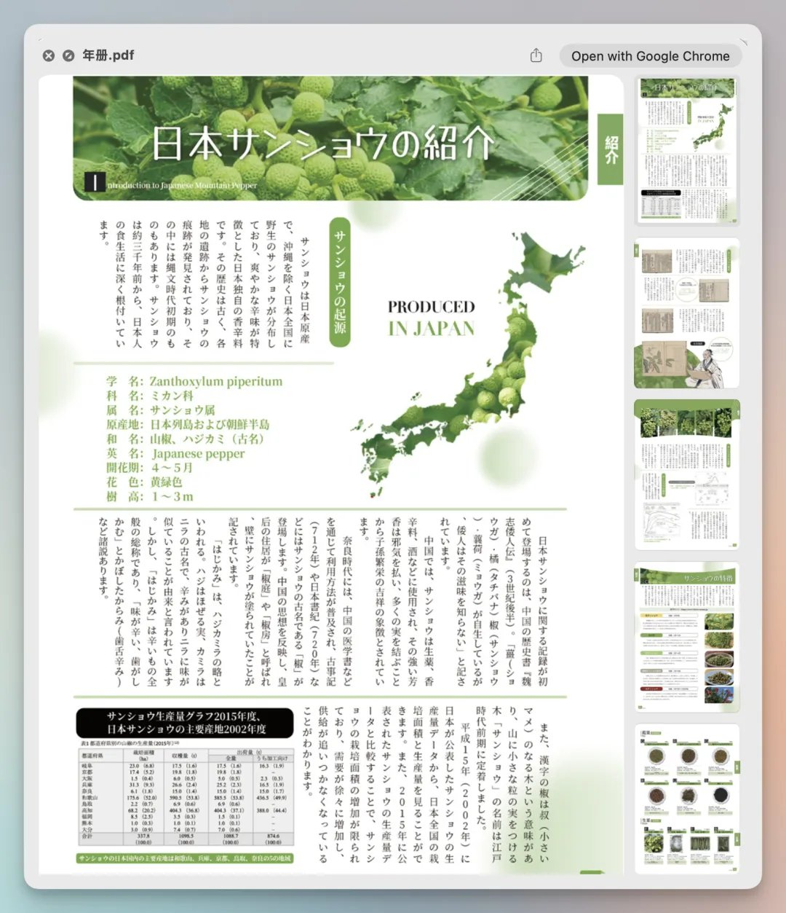
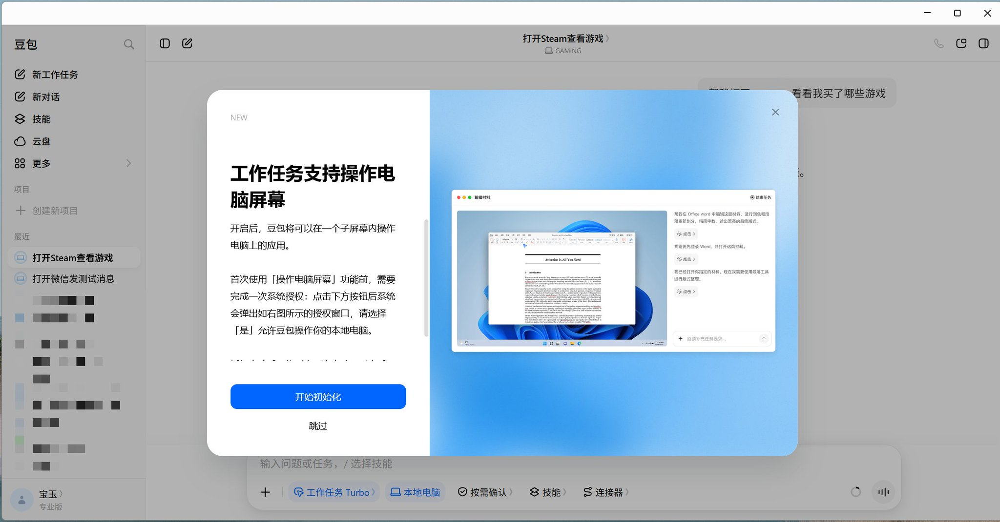

# Chapter 4 - The Work You Can Actually Hand Over

> This chapter is about the work Doubao Work can genuinely take off your plate: which tasks to hand over, how to hand them over, and where to keep your own hands on the wheel.

## 058. One event brief becomes a three-file set: why does it cost only 1% of the quota?

Another noticeable difference is how much Doubao Work has pushed down quota consumption this time. On the same enhanced plan for personal subscriptions, you can now run more complex tasks back to back, without having to watch your remaining quota every few heavy jobs the way you used to.

For example, we had it take an existing event brief, a registration detail sheet, and supplier quotes, and produce three natively editable files: an event execution plan in Word, a registration and budget analysis in Excel, and an internal proposal deck. It used just 1% of the 5-hour quota.

The quota control currently used by Doubao and Doubao Work is a rolling reset: quota automatically recovers on a 5-hour or weekly cycle. In other words, Doubao Work doesn't become unusable once your credits run out. Within the membership period you can use it every day, continuously — there is just a cap on how intense your usage can be over a short window. Once you hit that cap, the quota refills automatically as soon as the time is up.

## 059. How do I apply the official formula "background + constraints + delivery standards" to my own work?

I copied down all 24 prompts shown on the official website, **without changing a single word**, and grouped them into five sets by scenario. Whichever one you like, swap in your own information and it is ready to use.

| Wealth planning | Annual surplus of 400,000 RMB, needs to balance a home upgrade, education, and retirement, can tolerate at most a 15% loss — how should the money be arranged? |

The wealth-planning entry is a textbook-grade prompt: principal, goals, and risk tolerance are all provided. **The more specific the numbers, the more usable the output.** Read the entries together and you'll see the official site is really teaching one formula: **give background + give constraints + give delivery standards**.

"At least 10,000 characters," "cite 5 references," "tolerate at most a 15% loss" — all of these are acceptance-testable standards for the deliverable. Rewriting your own prompts with this formula is worth more than copying the 24 homework answers themselves.

Please prepare a "Q3 2026 EV industry competitive analysis" report for me. The input materials are 3 PDF research reports in the `/Users/reports/` folder on my computer, plus news from July–August 2026 on the public web. Requirements:
- Output a 12–15 page deck
- Focus on comparing five companies: BYD, Tesla, NIO, XPeng, and Li Auto
- Cover sales data, key new products, pricing strategy, and channel changes
- Clean business style, suitable for presenting to executives

**Honest disclaimer**: the above is an example prompt from the official website. Actual results depend on your materials and your scenario — don't expect a single prompt to win every fight.

## 060. Meeting minutes into a weekly report: how do document tasks come out right in one pass?

You can use Doubao Work inside Feishu Docs: in the sidebar, chat with Doubao based on the current document's content to quickly handle document Q&A, content summarization, AI rewriting, document generation, and other work tasks. You can also select a passage of text in a document and invoke Doubao through the selection toolbar to explain, rewrite, or otherwise work on the selected content.

Common use cases:
- Summarize the full document and extract key conclusions, risks, and to-dos.
- Answer questions about the document (follow-up questions supported).
- Rewrite and polish selected text or paragraphs (e.g., more formal, more concise).
- Generate new documents based on the document's content (e.g., weekly reports, proposals, briefing points).

Enter your question in the dialog box (e.g., "Summarize the core content of this document"), or enter the task you want Doubao to complete (e.g., "Based on these weekly meeting minutes, generate this week's project weekly report for me" or "Polish the wording of this document").

Seeing that result, I followed up by asking it to "organize the statistics into a project weekly report and save it to a Feishu doc." Doubao Work reused the structured data it had already gathered, entered the document-creation workflow, generated the body under the structure of "overall overview, progress details, owner workload, risks and suggestions," wrote it into Feishu, and returned a shareable document link.

## 061. Summarizing spreadsheet data and spotting anomalies: how should the instruction be phrased?

You can use Doubao Work inside Feishu Sheets: in the sidebar, chat with Doubao based on the table data to quickly handle data summarization, metric analysis, anomaly identification, analysis dashboard generation, and other work tasks.

Common use cases:
- Summarize sales, operations, project, and other data to quickly grasp the overall picture.
- Identify metric changes and anomalies, and locate the causes of fluctuations.
- Distill briefing points from the table content to support report preparation.
- Help build business-review dashboards, turning table data into visualized analysis dashboards.

Enter your question in the dialog box (e.g., "Summarize each person's completion progress this week"), or enter the task you want Doubao to complete (e.g., "Based on this data sheet, generate a combo chart for me").

## 062. Generating slides outline-first, draft-second: why is the two-step approach steadier?

You can use Doubao Work inside Feishu Slides: in the sidebar, ask questions based on cloud docs, project materials, and meeting minutes in Feishu, the current slide content, and your input — or generate, edit, and refine slide content. You can also select different elements on a slide and invoke Doubao through the floating toolbar to explain or edit the selection. Common use cases:
- Generate client proposals or product-introduction decks from your materials.
- Organize project retrospectives, internal reports, and other presentation content.
- Summarize the current slides and extract key information or briefing points.
- After generating a first draft, keep adding per-page scripts or speaker notes.

First time? Walk it like this: go to the Workmates market and summon a "PPT-making expert"; go back to "Workmates chat" on the left; click that workmate's card; upload one piece of de-identified material; ask for a page outline only — not the final deck; once the outline's direction is right, continue on to the full PPT.

When it comes to slides, Doubao Work's completeness is high: it automatically picks a fitting deck style based on the content and generates 14 slides page by page, each with an assertion-style title, native data tables, source attributions, and speaker notes.

Select the text on a slide, click AI Edit in the pop-up toolbar, type your change request, and send. Select an image on the slide, click AI Edit in the pop-up toolbar and type your change request; or click Replace Image and choose Smart Image Generation, Doubao Photo Edit, or Web-wide Image Search from the menu, then enter your request and send. Yuqiao, a product manager for Doubao Work, put it this way: Doubao Work generates slides based mostly on content understanding, not on simply applying templates.

## 063. 80+ web page styles swapped in one click: how do you pick without looking cheap?

For web page generation, Doubao Work also ships with more than 80 built-in design styles; if you don't like the style of the generated page, one click swaps it.

With most office agents' "web page generation," once the HTML is produced, the data doesn't follow updates to the source document. What Doubao Work can do instead is give the page a database built in — what you generate is already a service you could put online.

For the first task, we had it read the brand materials on the desktop and produce three promo images, a 15-second video, and an interactive web page.

Judging from the results, the images, video, and web page were all generated around the same set of brand messaging, and the visual style stayed consistent. The page can also be edited and published further — circle anything to change it — which is quite convenient.

## 064. The three rules of data cleaning: how do they translate into an instruction?

This step matters, because the most common problem when AI handles spreadsheets is not that it can't compute — it is that it takes it upon itself to "fix things for you." If a field can't be verified and the model guesses a plausible-looking value, the downstream totals become even harder to check.

After uploading the raw spreadsheet into the project conversation, don't just say something vague like "help me clean this up" — that request is too loose. The AI will wander: it may overwrite the original sheet outright, or it may fix only the formatting while ignoring duplicates and anomalous records.

The instruction I actually used can be condensed into this version:

Please perform a complete data cleaning and tidying of the "raw sales data.xlsx" I uploaded. Do not overwrite the original worksheet; create a new worksheet called "Cleaned Data."
Please automatically identify and handle the following issues:
1. Duplicate orders, empty values, and obvious outliers;
2. Wrong dates, and messy date formats;
3. Inconsistent formats for amounts, quantities, currencies, and tax rates;
4. Inconsistent formats for customer types and salesperson names;
5. Inconsistent spellings of country, region, state/province, and city;
6. Synonyms or different spellings across sales channel, acquisition source, and SKU;
7. Order status values mixing English and Chinese;
8. Abnormal phone and email formats.
Data that can be clearly judged from context may be standardized or corrected; for data you cannot confirm, do not fabricate values — mark it as "Pending confirmation."
Please add the following to the cleaned result:
- Data quality status
- Anomaly flag
- Duplicate or not
After cleaning, generate a "Cleaning Report" counting the original data volume, cleaned data volume, duplicate records, anomalous records, corrected records, and records pending manual confirmation.
Finally, based on the cleaned data, produce a "Sales Analysis" covering total order count, total sales amount, total amount paid, total refund amount, net sales, and average order value, aggregated by month, sales region, sales owner, product, sales channel, and acquisition source, with 3–5 key findings or recommendations.

The three things I consider most important in this prompt: don't overwrite the original sheet, mark anything you can't confirm, and deliver cleaning and analysis separately. AI can batch-process for us, but the raw data and a manual-review entry point must be preserved. That both prevents errors and leaves room for human verification later on.

## 065. A weekly report with fixed definitions: how do you write the prompt so only the data changes?

To keep the weekly output consistent going forward, I added a fixed set of definitions, which also makes it easier to reuse:

From now on I will upload an up-to-date sales data sheet every week; please treat this task as a fixed weekly data-monitoring job.
You are responsible only for reading, counting, and analyzing the data. You are forbidden from modifying, cleaning, overwriting, deleting, or adding any data in the original sheet, and you must not change any cell, field, or worksheet structure.
Each time you receive a new sheet, extract the following using fixed definitions:
This week's order count, total sales amount, amount paid, refund amount, net sales, average order value, units sold, and refund rate;
Main performance by sales region, sales owner, product, sales channel, and acquisition source;
Top 5 products by sales, top 5 salespeople, and the best-performing regions and channels;
Changes such as clearly elevated refunds, sudden drops or jumps in sales, abnormal orders, and over-reliance on a single product or channel.
Output only one concise, clearly structured "Weekly Sales Data Monitoring Brief," organized into five sections — "this week's core numbers, key performance, major changes, anomalies and risks, and items worth watching" — without reciting every data point.
If last week's or historical data is readable, compare week over week using the same definitions; if no comparable historical data exists, report only this week's actuals and do not invent comparison data. All conclusions must come from the uploaded sheet; state directly anything you cannot confirm, and do not fill gaps or guess on your own.

Once the definitions are fixed, what changes each week is the data; what stays constant is the statistical method and the brief's structure. Strictly speaking, this reduces repeated explanation but cannot replace checking: if the field structure or business definitions change, the rules in the project need to be updated in sync.

## 066. A 25,000-character industry study with 47 citations: how do you push it to deliver?

Our first group of tests started from the most common office need and designed a chained task closer to real work: first run a round of deep research on the AI office-productivity industry covering the latest 2026 developments, then write the findings up as a document, and finally generate a deck that can be presented as-is.

In the industry-research phase, Doubao Work loaded its built-in **industry research skill**, designed the research framework on its own, and covered everything from industry size and profit pools along the value chain to the global and China competitive landscape, technology, the policy environment, and trend calls.

In the end, Doubao Work produced **a Feishu document of roughly 25,000 characters citing 47 traceable sources**. The report was structurally complete and logically clear, backed by plenty of third-party data and materials, and genuinely useful as a reference.

Whether it was writing the research document or the deck, Doubao Work did not generate in one shot; it self-checks along the way, screening out text overflow, garbled characters, and similar problems, and finally delivers a version that is, by its own judgment, nearly error-free. I only needed to adjust a few details before it was essentially ready to hand over.

## 067. Screening 966 GitHub projects in half an hour: how do you phrase the instruction?

And in the process of searching, filtering, and organizing large numbers of GitHub projects, I noticed that Doubao Work's quota actually holds up remarkably well. So **I had it go straight to GitHub and run a Deep Research pass, collecting 100 open-source tools that genuinely boost efficiency and organizing them into one big collection.**

I gave it essentially one very direct requirement:

Go find 100 efficiency-tool projects like TopIt on GitHub, focusing on small utilities practical enough to genuinely improve daily workflows.

The deliverables were set at three files up front: a DOC document giving complete introductions to the 100 projects and organizing them by category; an Excel sheet that structures project name, function, GitHub URL, star count, and other details; and a PPT that picks out the most recommendable projects as a collection better suited for browsing and sharing.

It didn't take long overall: in roughly half an hour it completed 3 rounds of GitHub search, having crawled and deduplicated more than 966 candidate repositories.

## 068. The knowledge base's "Ask Doubao": how do you get more value out of it than search?

If [the knowledge base administrator has enabled the Doubao Work features](https://www.feishu.cn/hc/zh-CN/articles/455965510166), you can use them in a Feishu knowledge base to ask questions, summarize, follow up, and generate documents based on the content you have permission to see — a more efficient way to retrieve and accumulate the information in the knowledge base.

Common use cases:
- Quickly get up to speed on the policies, processes, project background, or historical information in a knowledge base.
- Keep asking questions around the knowledge base's content; Doubao understands follow-ups in context and helps you dig into the related information.
- Locate relevant information from the knowledge base and check the reference sources cited in the answer.
- Generate documents from knowledge base content, for example writing up process guides, drafting proposal documents, or preparing briefing materials.

Enter your question in the dialog box (e.g., "Summarize the new-hire onboarding process in this knowledge base"), or enter the task you want Doubao to complete (e.g., "Based on this knowledge base's content, generate a new-hire onboarding process guide document").

## 069. Spreadsheet to online system in one click: how far is it from genuinely usable?

From a business-process description or an existing spreadsheet, Doubao Work can generate a lightweight online app with data display, entry, editing, filtering, and similar capabilities. For example, merging several livestream-operations sheets into one operations system covering the data overview, creator management, product management, and paid-traffic analysis, or turning a project ledger into a searchable, updatable online tool.

PROMPT: Based on the workshop production data, build me a full-stack daily production reporting system with real-time data updates.

It really did build a dashboard-equipped system that updates in real time.

Commentary. For documents and spreadsheets, the gap between the major models has narrowed to not much — that's no longer a distinctive skill. Building web pages and systems is **worth rating a cut above**, because it jumps from "giving you a piece of content" to "giving you a usable tool." How stable it is in practice awaits hands-on testing.

Generated apps suit rapid prototyping, validating processes, and lightweight business needs. Before formally carrying critical business, you should still check that the data is accurate, the permissions are sensible, and the process is complete, and run the necessary small-scale trial and stability validation. The specific supported components and capabilities are subject to the current product.

## 070. Which jobs are worth setting up to run automatically every day?

You can create automation tasks manually or through conversation, automating repetitive work or tasks that need to fire on a schedule, on an event, or via a webhook.
- Trigger configuration supports scheduled triggers (e.g., fire at 5 p.m. every day), event triggers (e.g., fire when you receive a Feishu chat message), and webhook triggers (e.g., fire when an Outlook email arrives).
- Delivery configuration supports choosing the recipient and the delivery condition. For example, when an Outlook email arrives, automatically send yourself a reminder message.

An ordinary task waits for you to click send every time. A scheduled task saves the task instruction, the run frequency, and the execution time, then automatically runs again when the time comes. It suits work whose content and steps are fairly fixed and that must repeat daily or weekly.

The page already ships templates for a weekly work report, a daily schedule briefing, news pushes, competitor-tracking research, stock price monitoring, and product price monitoring. A template is just a pre-written task frame; once you open one, you still need to check and fill in three things: what exactly it does each run, when it runs, and which materials it may read or which tools it may call.

Say you want industry news every morning. First send it once manually in "New Task": "Search these 3 websites for updates from the past 24 hours and give me headlines, two-sentence summaries, and links to the originals." Once you've confirmed the sources aren't drifting and the format is readable, put the same sentence into a scheduled task set to run at 9 a.m. on workdays.

A scheduled task repeats your mistakes too. Get the prompt wrong once and a manual task is wrong once; an automated task can be wrong every single day. So make your first automation do queries and reminders only — don't let it automatically send email, delete files, change data, or publish content.
Run it manually once, completely correctly, then flip on the schedule switch.

## 071. Letting AI watch group chats and summarize automatically: where do you set the boundary?

- Create via conversation: the system jumps to the task page automatically; you just send your request to your Workmate and the corresponding automation task is generated in one click. Tasks support switching the executing Workmate and model, associating a project, and invoking a cloud browser to run.
- Trigger configuration supports scheduled triggers (e.g., fire at 5 p.m. every day), event triggers (e.g., fire when you receive a Feishu chat message), and webhook triggers (e.g., fire when an Outlook email arrives).

I first had Doubao Work send the weekly brief it had just generated to my own Agent Mail. Sending counts as an external action: the system shows the sender, recipient, subject, and a body summary, and asks you to confirm again; check that everything is correct, then click "Confirm."

Two boundaries need to be spelled out in advance. If the latest spreadsheet still depends on manual uploads, a scheduled task won't conjure new data out of thin air — either place the file into the workspace ahead of time, or provide a stable data source through a connector. Meanwhile, whether email can be sent fully unattended also depends on the current version's permissions and the "confirm on demand" setting; when external recipients are involved, I'd rather keep the confirmation step.

## 072. Eight work squad templates: does red-vs-blue really raise quality?

A work squad is made up of several Workmates collaborating on complex tasks. Every work squad has at least 2 members, one of whom serves as the captain. The captain is responsible for receiving the task, breaking down the work, dispatching members, and ultimately delivering the result.

- Currently 8 collaboration templates are supported:

| Collaboration template | Description |
| --- | --- |
| Routing | The captain first classifies the task, then assigns it to the single best-suited member to execute. At least 2 members recommended. |
| Expert consultation | The captain consults several experts separately on the same question, then integrates their views into a conclusion. At least 3 members recommended. |
| Round-table discussion | Several members speak over multiple rounds on the same topic, visible to one another, gradually converging on consensus. At least 3 members recommended. |
| Parallel | The captain splits the task and dispatches the pieces in parallel, then consolidates each member's output. At least 3 members recommended. |
| Voting | Several members handle the same question independently; the final result is settled by vote or by picking the best. At least 3 members recommended. |
| Relay | Members pass the baton in a preset order; each member's output becomes the next member's input. At least 3 members recommended. |
| Production review | One member produces the content; another reviews and quality-checks it. At least 2 members recommended. |
| Red-vs-blue | Two sides holding opposing positions challenge each other, with a third party serving as judge. At least 2 members recommended. |

## 073. Workmates that "understand you better the more you use them" — is that the same memory as a chat AI's?

On the home page, you can find your dedicated Workmate right in the "Workmates · Squads" area. A dedicated Workmate supports a custom name and persona, remembers your preferences and work background, grows proactively, and understands you better the more you use it.

- Personalized service: You can customize your Workmate's name, avatar, and tone of voice with one sentence. It automatically extracts work memories daily, turning them into long-term knowledge assets and gradually learning how you work.

## 074. Can the skills I stockpiled in Codex be carried over and used directly?

One very special capability: reading the Codex skills already on this computer directly.

Clicking "More skills" under the input box, I immediately saw 211 skills on this Mac. Names in the list like Agently Mail, Lark Approval, Lark Base, Punkadrian Writing, and Tutorial SOP were exactly the local skills I had originally placed in my Codex and general-agent skill directories — I had not uploaded them into Doubao Work one by one beforehand.

I also checked the client's local log for that day. Doubao Work reads .agents/skills and also checks .codex/skills, deduplicating skills with the same name. So the more accurate description is automatic discovery and aggregation of on-device skills: open "More skills" and they are selectable, skipping the step of reinstalling everything.

That said, "visible in the list" and "fully executable by another agent" are two different things. A skill containing only writing rules, steps, and templates usually travels across products more easily; a skill that depends on Codex-specific tools, MCP, environment variables, commands, or fixed paths still needs a real run after moving to Doubao Work. In my own log, one skill failed to load properly because its YAML format failed to parse.

Start by picking a low-risk text-only skill, send it a small task, and check whether the execution plan shows the skill as loaded. Once you've confirmed the rules took effect and no tools are missing, go on to test complex skills that send email, modify cloud docs, or run scripts.

## 075. A veteran's repetitive operations: can you record them and turn them into a company skill?

Doubao Work's browser recording and playback is, I think, especially well suited to eliminating repetitive operations inside companies.

I once worked with a logistics company. Every day, operations staff had to open several shipping-line and port websites to look up sailing schedules, cut-off times, and arrival status, then compile the results into a spreadsheet and check them item by item.

The process wasn't hard, but it was extremely fragmented, repeated day after day — and when someone new took over, it all had to be taught again.

Now all it takes is having the person who knows the business walk through the entire flow once in the Doubao browser: which sites to open, where to type, which fields to look up, how to compile, and what to check at the end.

Doubao records along and organizes it into a custom skill. Next time, hand it a date, a route, or a container number and it re-executes the same steps; humans only need to review the anomalies and the final result.

## 076. Batch-producing Douyin transcripts: how does the math work at only 6% of the monthly quota?

Doubao Work can now run this entire pipeline automatically. Give it a Douyin creator's profile page and it can batch-fetch the videos' public information and transcripts, then write them straight into a Feishu Base. That is a huge efficiency jump.

In my own testing, collecting transcripts for 10 videos took about 5 minutes. I also tried collecting dozens of videos from a single creator in one go, and that ran through fine.

Please collect the public data and full transcripts of this Douyin creator's latest 10 videos and write them into the Feishu Base below.
Douyin profile: <Douyin creator profile link>
Feishu sheet: <Feishu Base link>
Also generate topic directions and theme summaries based on the titles, descriptions, and transcripts.

I also roughly measured the quota burn. I have pulled transcripts for more than 100 videos so far, which used about 6% of the monthly quota — pretty sweet. New users currently get one month of Standard-plan quota on login.

At this burn rate, even if I later pay for the Standard plan normally, an individual pulling data on the creators they follow would find a month's quota basically sufficient — pulling 1,000-plus video transcripts a month, no sweat.

## 077. A book-recap video pipeline in motion: how many can the free 30 days produce?

Playing with something new again: I used Doubao Work to generate book-recap short videos directly, no watermark 🧐 It burned roughly 5% of the hourly limit — over the free 30-day Doubao Work membership, I'd guess you could make hundreds of these...

I'll publish the skill later so everyone can copy my homework.

## 078. Ten minutes from Japanese materials to a company website: is this how foreign-trade orders get taken now?

It started with him complaining that his company website had been stuck for over six months. I asked whether he had any company materials.

He sent over, on WeChat, the PDF brochure for their Japanese sansho (Japanese pepper) products, shown below.

All in Japanese, and all images... good grief.

But knowing how strong the Doubao app's multimodal capabilities are, I didn't see that as an obstacle. Uploaded the PDF directly and said to Doubao Work:

"Read the PDF content and build a polished corporate website where users can browse and view the products and submit inquiries."

In under 10 minutes, the website was done — inquiries supported.

Then he said, "Bro, can you do a pure Japanese version too?" I said no problem, consider it done!

Just translation and mobile adaptation this time — about 3 minutes and it was finished.

In the old days, you either paid an outsourcing shop, or let the thing drag until it quietly died. Now you just talk to an agent tool like Doubao Work — no complicated prompting needed — and it all gets done in half a day.

## 079. A WeChat official account pipeline earning 10k+ RMB a month? How creators actually use it

I've run a WeChat official account for three years, with 30,000 followers, and for the past six months it has steadily earned me 10,000–20,000 RMB a month.

Not a lot, but it wins on stability. At the same follower count, official-account rates generally run higher than Xiaohongshu or Douyin.

I turned these practices into skills, combined three years and 400-plus original articles of experience, organized them, and open-sourced them — 10 in total.

Core principle: the human sets the skeleton, AI fills in the flesh.

The article's viewpoints, structure, and narrative arc must be yours; AI's only job is to finish saying the things you left unsaid.

50% is topic selection, 30% is title and cover, and the remaining 20% is smoothing out the words. Don't spend your time in the wrong place.

## 080. Earning 2,100 RMB from two sponsored AI animation deals: is this side gig for real?

Lao Wang previously made AI animation videos with Codex, and the results were excellent: he took 2 sponsored deals worth 2,100 RMB, and was steadily adding 20-plus new contacts a day.

But the cost was genuinely high. He had to generate the frames with another video model first, then merge them piece by piece in Codex — a real hassle.

Then the Doubao Work edition launched, with a free 30-day membership, and this job suddenly got simple. Give the Doubao Work agent a piece of copy and, without switching between clients, it automatically generates the complete video, with just a few confirmation steps in between — the workload drops massively.

The whole pipeline is five steps; let me break them down.

Lock the content first. Write the voiceover script, record the narration, and extract the timecode for every sentence. The script must be revised until it can be recorded as-is: proper nouns, numbers, and calls to action all corrected to exactly right, so the visuals later won't start making things up on their own. This timeline is the baseline — not one step may drift from it.

Break down the shots, lock the art style. Feed the script and timecodes to the Doubao Work agent and get back a shot list ordered by playback sequence. Then define the IP character and the art style: Doubao Work outputs a style description, and every later prompt references that one document, so the style never falls apart.

Produce the frames. The Doubao Work agent writes an end-frame prompt for every shot, then generates images from those prompts. In-frame text gets written at this stage; only one IP character per shot; cards, screens, and labels must not be left blank. Review each shot's first and last frames against its prompts, and only move on once confirmed.

Generate video, produce the edit plan. Give the first/last frames, prompts, and true durations to the Doubao Work agent, and it produces silent video clips. Then give all the clips plus the voiceover back to the Doubao Work agent to generate an edit plan — check the subtitles are right and the BGM isn't drowning the voice — review once more, then produce the final cut.

Assemble in CapCut. Lay the tracks per the plan, add titles, subtitles, voiceover, and BGM, and generate a CapCut draft for easy manual tweaks, then export the MP4 — and finally produce two covers, one horizontal and one vertical.

## 081. Three ways to swap a slide image: how do you choose between Smart Image Generation and Web-wide Image Search?

Select an image on the slide, click AI Edit in the pop-up toolbar, and enter your change request; or click Replace Image and choose Smart Image Generation, Doubao Photo Edit, or Web-wide Image Search from the menu, then enter your request and send.

- When you choose Smart Image Generation or Doubao Photo Edit, Doubao recommends 3 image generation or optimization options; clicking the corresponding description inserts it into the request box, where you can further edit your request.
- When you click Replace Image > Local replacement, a folder on your local device opens where you can choose the image to swap in; this feature does not use Doubao's AI capabilities.

## 085. Documents, spreadsheets, slides, websites, video: which should you tackle first for the biggest payoff?

| Type | Best-fit scenarios |
| --- | --- |
| 📄 Documents | Proposals, reports, meeting minutes, research summaries |
| 📈 Spreadsheets | Data analysis, field cleanup, visualized charts |
| 🎬 Slides | From outline to finished deck, templated output supported |
| 🖼️ Images / video / web pages / apps | More complex creative tasks |

As the battle over AI office tools deepens, the yardstick for judging whether a productivity agent is mature enough is quietly shifting: whether it can understand context, call tools, collaborate across systems, and keep delivering results you can actually act on is becoming a more important measure than one-shot generation quality. Measured with that yardstick, Doubao Work's performance is already quite complete.

Running this project end to end, on top of the earlier web project, still never touched Doubao Work's quota ceiling. For heavy tasks of this shape — continuous Deep Research runs, web page generation, and multiple Office files delivered — this quota is basically ample. Two heavy cases finished, and the quota still hadn't hit the ceiling.

## 087. Which tasks suit phone dispatching best? How do you divide work across devices?

Directing agents from my phone is now a feature I use a lot day to day. When I'm out, I can check an agent task's execution progress from my phone at any time, or if something occurs to me on the go, I can use the phone to dispatch the agent on my home or office computer to execute it — then just look at the results when I'm home, and the commute stops being wasted time.

The reason to drive the computer from the phone is that the computer's resources are usually the fullest: all the documents and codebases on its drives, all kinds of configured skills — and a computer can't be carried with you at all times. Picture this: it's nearly end of day, a task isn't finished, and you don't want to sit around waiting. Let the agent keep running, connect to the computer from your phone to check progress anytime, and chime in mid-run to adjust if something's off. You talk, you don't type — all the repetitive work gets thrown to it.

This update extends task control to the phone, supports linking multiple computers, and can pull files across devices. For example: when out, remotely have the computer locate a desktop file, convert it to PDF, and send it back; during the commute, have the computer continue an unfinished data analysis and send the generated chart to your phone; when the files you need are split between a work computer and a home computer, fetch from each and then merge the edits.

Also, when you didn't bring a computer, you can remotely control a cloud computer from your phone to finish slide creation, edits, and other work tasks.

