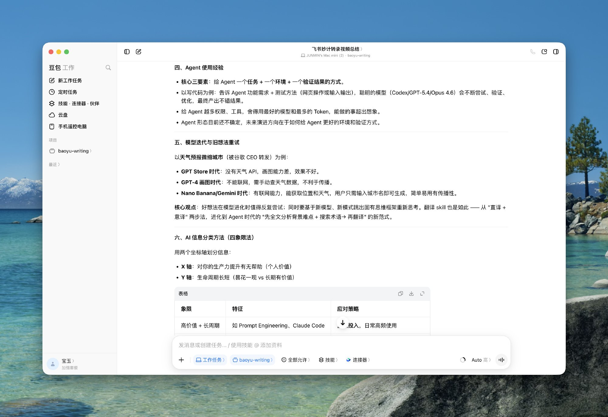

# Chapter 5 - How Far Dare You Open It to Your Team

> Eighteen questions on opening Doubao Work up to a whole team: what a seat costs, how administrators roll it out, where the quota and security lines sit, and what the Doubao-Feishu merger means for the people who use it every day.

## 088. Is a team seat at ¥166 worth the premium over the personal plan at ¥68?

A team subscription seat costs ¥166/seat/month; paid annually, that comes to ¥1,988/seat/year, and paid monthly it is ¥198/seat/month. The quota line reads 2,000 points/seat/month, with a limited-time bonus of another 2,000 points/seat/month (details in the official help documentation).

The team subscription includes every benefit of the free version: priority access during peak hours; more scheduled tasks you can configure; more image and video generation runs; enterprise data never used for model training; the Standard plan of agent management and risk discovery; member behavior auditing; centralized management of seats with visibility into each member's usage; and enterprise storage space that supports capacity expansion.

The team subscription is aimed at small and mid-sized businesses and teams. It bundles AI quota; once an administrator assigns seats to members, those members can use AI features in Feishu and the Doubao app. The enterprise subscription is aimed at mid-sized and large enterprises. It does not bundle AI quota — the enterprise must purchase AI quota alongside it.

## 089. You have decided to open it up for the team — what does the administrator do first?

Beta status: the feature is in beta testing. Who can do it: a super administrator, or an administrator with Billing Center permissions. Depending on actual needs, an enterprise can buy the Doubao team subscription or the enterprise subscription and assign seats to members.

Note that only the Doubao team subscription supports online purchase; the enterprise subscription does not. To buy the enterprise subscription, contact sales through the [Doubao Work official website](https://www.doubao.com/work/pricing). On that site, click "Buy Now" on the Doubao team subscription card. On the purchase page, choose the billing period (monthly or annual), the quantity, and the service start date; you can review the itemized benefits of the team subscription right on the page. Once you pick a service start date, the system automatically calculates the service end date from the billing period. Confirm the order details, tick the purchase agreement, click "Submit Order," and complete payment as prompted. Note: after a successful purchase, you can request invoices and contracts through self-service.

## 090. In the five-level quota consumption order, why does the personal quota always come last?

The quota consumption order is: Doubao team subscription quota → enterprise AI general quota → Doubao free quota → [Doubao personal subscription quota](https://www.feishu.cn/hc/zh-CN/articles/157905526291-%E5%9C%A8%E9%A3%9E%E4%B9%A6%E4%B8%AD%E8%B4%AD%E4%B9%B0%E8%B1%86%E5%8C%85%E4%B8%93%E4%B8%9A%E7%89%88) → Feishu AI member quota.

No. When a new member joins the enterprise, the administrator must manually assign them a seat from the Doubao team subscription before the member can use the corresponding benefits.

## 091. The enterprise subscription ships without quota — why is it cut this way?

The enterprise subscription targets mid-sized and large enterprises. It does not include AI quota; the enterprise must purchase AI quota at the same time. The enterprise subscription also provides more advanced security-compliance and enterprise-governance capabilities; seats exclude usage, which has to be bought as a separate usage package.

The enterprise subscription includes every capability of the team subscription: administrator risk controls and sensitive-permission isolation; dynamic user groups; the advanced edition of watermarking plus data leak prevention; comprehensive auditing of content, behavior, and permissions; agent logs; custom data retention; and unified usage allocation and control.

Both the Doubao team subscription and the Doubao enterprise subscription support purchasing AI usage packages, bought centrally by the enterprise and shared by members. Note: only the Doubao team subscription supports online purchase; the Doubao enterprise subscription does not. To buy the enterprise subscription, contact sales via the [Doubao Work official website](https://www.doubao.com/work/pricing).

## 092. Before enabling the whole company, which two things do you check first: data isolation or auditing?

Doubao Work team/enterprise editions are data-isolated from the personal edition, and enterprise private data is not used for model training. When employees access enterprise knowledge and tools, they strictly inherit existing permissions and cannot use AI to bypass the organization's authorization boundaries. On the enterprise-security side, Doubao Work has built a strict full-link agent security protection system covering device access, permission settings, quota control, data encryption, and operation auditing. Doubao Work also strictly inherits Feishu's existing permission system: users can only read data and use tools within their own permissions, and personal data and enterprise data are isolated from each other.

Administrators can enable members in bulk, allocate quotas, and manage usage by individual, user group, or department. Through watermarking, behavior auditing, and similar capabilities, an enterprise can track how AI is actually being used and widen AI adoption while staying inside its security boundaries.

## 093. What does "based only on content the asker is authorized to see" actually guard against?

When Doubao Work draws on internal enterprise knowledge, it relies only on the messages, cloud documents, knowledge bases, and other content the asker already has permission to access in Feishu, and never goes beyond those existing permissions. The more enterprise knowledge it is allowed to reach, the better its answers get. Built on Feishu's enterprise-grade permission management, Doubao Work only accesses content you are allowed to see.

The deep integration with Feishu unlocks team knowledge, so there is no need to spell out the background — work gets delivered right away. Enterprise-grade permission management and security are what make Doubao Work comfortable to trust.

## 094. Turning on Doubao Work in the Feishu admin console: a three-step checklist

Administrators can assign seats from the Doubao team or enterprise subscription to members. Go to the [Feishu admin console](https://feishu.cn/admin) and click Billing Center > My Products. Click "Seat Assignment" to the right of the Doubao team or enterprise subscription. Click "Assign Seats" at the top right of the page and choose an assignment method from the dropdown. Doubao team subscription: manual assignment by the administrator only, either by specifying people or importing from a local file. Specify people: select the members who need seats in the dialog; the number selected cannot exceed the remaining assignable seats. Import from local: click "Download Template" in the dialog, fill it in as instructed, and upload; the number imported cannot exceed the remaining assignable seats. Note: after seats are assigned, you can also view each member's monthly Doubao team subscription quota usage on this page.

In the Feishu desktop client, click "Doubao Work" from the left navigation bar or from a pinned message. The availability of the in-Feishu entry is controlled by the enterprise administrator, and the related features may still be in the middle of a gradual rollout. If you cannot see the entry, first confirm your client version and enterprise configuration, then contact your enterprise administrator.

(Optional) Click "Remove" to the right of a member's name and confirm a second time in the dialog to remove that member's seat. Once removed, the seat is automatically released, and the administrator can assign it to another member. (Optional) Click "Export List"; after verifying the administrator's identity, you can export the list of members with assigned seats to view locally.

## 095. Why are longtime Feishu users afraid of being "swallowed by Doubao"?

> Two sidebars plus two chat boxes — you can't delete them and you can't hide them. An office suite you already pay for every year: is this their way of seeing customers out the door? It has been squatting in prime positions for days now. Feishu has been possessed by Doubao. In truth, this is Doubao annexing Feishu. It isn't that Feishu crammed itself full of Doubao — think of it as Doubao acquiring Feishu and it all makes sense: Feishu never had as much say as Doubao. Feishu has been swallowed, and there may be no "Feishu" brand in the future. Doubao is consolidating capabilities — Trae, which had been pushed for over half a year, has been reeled back home, and so has Coze, which I had used for ages. Now we watch how Doubao stitches the pieces together. Most likely the future is "buy tokens, get Feishu thrown in free," because seats alone won't sell for much money. The Feishu lead now reports to the Doubao lead — infighting is coming, and it feels like Doubao is faltering too. Layoffs again, then.

> I spent a whole morning studying it and still couldn't tell the difference. It's a mess — I don't know which one to use. "Doubao Workmates" is just the old AI companion with a new name; they didn't even change the internal icon. Enterprise Feishu has already been bewildered by agents and AI companions. Everything is chaotic right now — bouncing back and forth between infrastructure and solutions, not knowing what it wants to do, so it does a bit of everything. Alibaba Cloud is the same.

> This really is a huge reorganization. Is Doubao Office actually any good? Any heavy users out there willing to share? If it's genuinely good, it's an advance for the history books; if it's just faction theater inside a big company, may it roll as far away as possible. Feishu never managed to break into the top tier, and this time it is thoroughly gone. I've already migrated from Feishu to WeCom...

## 096. Reorganized in its best-performing year — what does that mean for Feishu users?

Reporters learned that under the restructuring plan, the Feishu product team and the Doubao product team will be consolidated into a new Doubao product team, led by Doubao head Zhao Qi, with Feishu head Xie Xin reporting to Zhao Qi. The move is, on one hand, meant to strengthen the synergy among the major products and services of Doubao, Feishu, and Volcano Engine; on the other, the organizational consolidation also reflects ByteDance raising the priority of its AI-to-B strategy. Some analysts view this as ByteDance's largest restructuring of its To-B business since it adopted its business-group structure in 2021 — and the core word of the restructuring is "AI."

On the eve of this structural adjustment, Feishu had just delivered its best report card since founding. According to earlier media reports, by the end of Q2 2026, Feishu's ARR and its single-quarter revenue had both grown more than 100% year over year, the fastest commercialization pace in its history; among new customers, more than 90% directly paid for Feishu AI products. In the first half of this year, Feishu not only doubled revenue and ARR year over year, it also embedded AI deeply into the business. The share of new customers buying AI products has exceeded 90%, fully proving out the To-B AI monetization path. As of June this year, the Doubao model's average daily token consumption had surpassed 180 trillion, and QuestMobile data put Doubao's monthly active users at 382 million — more than second-place Tongyi Qianwen and third-place DeepSeek combined. On Feishu's side, more than 90% of new customers in Q2 2026 purchased Feishu AI products as well.

Once the reorganization is complete, aside from existing Feishu products and services remaining unchanged, Feishu will also pursue deeper product collaboration with Doubao in productivity scenarios. On the surface this looks like a handshake between Feishu and Doubao, but it goes further than that. ByteDance has not given up on Feishu — it simply no longer allows Feishu to be a lone hero.

## 097. With Qwen Office and WorkBuddy closing in, can Doubao Work hold its ground?

On July 20, Tencent issued an internal organizational adjustment notice, moving the businesses of its QClaw product center, along with part of their teams, into Cloud Products Division Six — the parent department of WorkBuddy, Tencent's other AI office agent. On July 21, Alibaba was reported to be consolidating three agent products — QoderWork, Wukong, and MuleRun — into "Qwen Office," with the product led by DingTalk's new CEO Chen Yusen. On July 30, ByteDance kicked off the integration of Feishu, Doubao, and Volcano Engine.

The "2026 Q2 China Office Agent Platform Market Insight Report" published by Analysys shows that in June 2026, the combined visits of China's 17 mainstream desktop AI-native office agents exceeded 60 million. By Analysys's figures, Tencent's WorkBuddy led with 20.97 million monthly desktop visits, Alibaba-family products totaled 9.19 million, and ByteDance's domestic version of Trae reached 12.79 million. The industry has entered a critical phase in which "tool competition" is giving way to a fight over the "entry point of work."

The fight for the "work entry point" is becoming contested ground the giants cannot afford to cede. The AI office contest has shifted from a race over model parameters to a race over "who can actually get AI to finish work for an enterprise." Which player gets to define the next-generation productivity platform remains to be seen.

## 098. Team pilot: who gets access first, which process runs first, and how do you design it?

No. When a new member joins the enterprise, the administrator must manually assign them a Doubao team subscription seat before they can use the corresponding benefits. The Doubao team subscription supports manual assignment by the administrator only, either by specifying people or importing from a local file. Specify people: select the members who need seats in the dialog; the number selected cannot exceed the remaining assignable seats.

Start with read-only scenarios to build trust. It is best to begin with "read, analyze, generate": read — read local files and summarize them; analyze — analyze Feishu documents and produce reports; generate — search the web and organize the information.

Only after rules and boundaries are confirmed should you gradually open up higher permissions such as writing and operating software.

## 099. The team's quota is running out — how do you pair top-up packages with usage limits?

Q: After buying a team or enterprise subscription, what do you do when the AI quota runs short? A: The administrator can go to the [Feishu admin console](https://feishu.cn/admin), and under Billing Center > Benefits Data, click "Top Up" on the AI general quota top-up package card to purchase more quota.

One extra detail worth knowing: once usage exceeds each person's free monthly allowance, additional AI quota has to be purchased separately. Doubao Work bills on a floating, usage-based model keyed to task complexity; the actual cost is affected by the models and tools involved, the task content, and running costs.

## 100. Which jobs should never be handed to any AI colleague?

When you send a task-execution command and enable local computer or browser automation permission, Doubao autonomously understands the instruction, plans the steps, and carries out the operations — reading and writing files, operating web pages, automating software, batch processing, and more. Commands like these count as authorized by you personally; anything touching property, identity, or high-risk system permissions still requires you to be the gatekeeper. This is not hands-off full automation — authorization and high-risk steps still need a human in the loop. Run trial passes on non-sensitive files first, and get familiar with the authorization boundary before you let it near important data.

One user's story: after subscribing to Doubao Pro while between jobs, I wanted it to run my Xiaohongshu account. First came auto-publishing. It took me an entire afternoon of wrestling to discover that it simply could not log into my Xiaohongshu account — the anti-bot mechanisms were right there, and it could hardly solve captchas for me. What left me most speechless was that **it couldn't do it, never volunteered that fact, and just pretended to be executing**; only when I noticed nothing had been posted and asked did it finally admit it couldn't. Then there is the most important issue of all: security. When using the Doubao Agent, tasks it cannot complete come with no security warning either — instead, it came up with a plan that required handing over my cookie. Most ordinary users, most of the time, cannot judge whether they should give it what it asks for.

Read these together and you'll see the official material is really teaching one formula: **background + constraints + a deliverable standard**. "At least 10,000 words," "cite 5 references," "tolerate at most a 15% loss" — all of these are verifiable deliverable standards. Rewriting your own prompts around that formula is worth more than copying the 24 worked examples.

## 101. How does finished work get consolidated into team assets?

Generated documents, spreadsheets, and other outputs can go straight into Feishu collaboration, where they continue to be shared, commented on, and edited under existing organizational permissions — turning the results of one person's AI use into team assets. When a task completes, result notifications are pushed automatically, and the artifacts (documents, spreadsheets, reports, and so on) are stored automatically in the cloud drive or Feishu cloud docs, ready to view, download, reuse, and share with the team at any time.

Going a step further, the content and knowledge a user creates together with Doubao Work also keeps settling back into Feishu, becoming enterprise knowledge that can be edited again, shared, and reused. The next time a task runs, Doubao Work can do the job better on the strength of that continuously enriching context. Good experience gets shared across the team, and everyone on the team gets more out of Doubao Work.

## 102. Context is the real moat — how should this judgment change the way I use it?

First, user habits are changing: the agent is becoming the entry point of work. I notice that when I start handling work these days, the thing I open instinctively is the agent, not some app. Once the agent is open, I have it operate the apps while I review or adjust what it did. The shift looks small, but behind it is a migration of the entry point. In the past, the app was the entry and people did their work inside apps; now the agent is the entry, and apps have receded into the background, becoming tools the agent calls. Once this migration becomes a habit, it is very hard to reverse — just as people once started their time online from a search engine's homepage and later started from WeChat and short video. Where the entry point is, attention is, and where attention is, the ecosystem is. Models can be swapped and tools can be connected; feature gaps get erased quickly.

The best context makes the best enterprise-grade agent. And the context an organization accumulates over long-term use — meeting notes, document assets, project threads, working relationships — is exactly what competitors cannot copy. Whoever holds the most complete organizational context, their agent delivers the most precise service. Viewed this way, a product like Feishu, already the place where organizational information converges, is naturally closer to this moat.

Data an employee cannot see, the agent cannot see either; operations that have not been authorized, the agent cannot perform. The point is not to limit what an agent can do, but to let the organization dare to hand capability over to the agent. Picture an employee who, to get AI's help drafting a proposal, casually uploads client lists, contract contents, and operating data to some personal-account AI tool: the company cannot see what was uploaded, does not know whom the AI's output was then forwarded to, and the data stays in his personal space after he leaves. On this point, collaboration platforms with permissions and identity systems built in from the start have an innate advantage — once the agent plugs in, there is no need to erect a new security architecture; you simply carry over the organization's existing permission rules. The deeper issue is that organizational processes are still built around the pre-agent org chart. Those processes were designed around people, and many permissions and approvals cannot happen without a human, which is grossly inefficient for an agent: the agent can only improve efficiency locally, while end to end it remains hostage to human confirmation and approval. That does not mean those checkpoints can simply be removed — many were created after painful lessons and still depend on human judgment. But whether some processes could be merged, or accelerated, is genuinely worth careful thought.

Many people quietly worry about replacement, but flip the angle: the agent takes over the execution layer — writing documents, filling in data, organizing materials, following up on progress. That does not mean people are replaced; it means people move up: more of their energy goes into thinking, deciding, and reviewing the results. Understanding context, respecting permissions, fitting into collaboration, pushing processes forward — in the end, this frees people from execution to do more valuable work. As a Feishu user of many years, I have always loved the restraint in its product design, that sense of having thought things through before building. After the Doubao-Feishu merger, this is the first product where the two have genuinely fused: "Doubao Work." As expected, the hands-on experience did not disappoint.

## 103. Courses teaching Doubao sell from ¥9.9 to ¥999 — spend the money or save it?

Everyone uses Doubao, and the courses that teach it sell at every price point from ¥9.9 to ¥999.

On Douyin and Xiaohongshu, Doubao has become a reliable traffic magnet.

## 104. What might Doubao Work look like a year from now?

In June this year, Doubao launched its "work tasks" mode, in which the AI can directly operate the local computer and browser after being authorized. It initially supported scheduled tasks, zero-code web page generation, one-click PPT creation, and data-visualization analysis; in late June, with the release of the new Seed 2.1 model, the mode gained local computer operation, browser automation, and more. From August 17 to 21, Doubao shipped, within a single week, phone remote control of the computer, a Windows virtual desktop, dual local and cloud computer modes, a side workbench, plus multiple features such as skills, connectors, and Workmates — "the work carries on while you're away from your desk," heavy tasks move to the cloud, and mature workflows settle into reusable skills. High-frequency work scenarios were being covered one after another.

On September 2, Doubao Work shipped a product update, launching "multiple agents in parallel" and "operate the computer" on Mac at the same time. After introducing the new productivity product and brand "Doubao Work" on August 25, iteration around productivity scenarios has not slowed — it has accelerated. From phone remote control and the cloud computer, to skills, connectors, and Workmates, to cross-platform control and multi-agent collaboration, Doubao is step by step turning a "chat-capable large model" into an office agent that "can break down tasks, do the work, and deliver the result." Feature release after feature release points at the same direction: letting AI take on more and more responsibility in ever more complex work.

These two new features are just one slice of Doubao's recent burst of dense iteration. Stretch the timeline out, and Doubao's push into productivity scenarios is visibly speeding up.

## 105. Changing jobs or leaving the company — who owns your data in Doubao Work, and how do you take it with you?

The entry decides "where you use it from," and the account identity decides "as whom you use it." This is the single most confusing point in understanding Doubao Work's product relationships. Users can sign in with either a Doubao account or a Feishu account. With a Doubao account, you are mainly working as an individual, in a personal space. With a Feishu account, you enter the corresponding enterprise identity, and which enterprise knowledge and benefits you can use depends on your company's activation scope, your personal permissions, and administrator configuration.

One person holding both a Doubao account and a Feishu account does not mean the data, benefits, and permissions of the two identities automatically blend together. The identity you pick at login shapes which materials you can reach, which enterprise capabilities you can use, and which space your tasks live in. Signing in with a Feishu account does not mean access to everything the enterprise has. Which documents, spreadsheets, and knowledge Doubao Work can read still rests on the permissions you personally already hold, and enterprise administrators can also configure the scope within which Doubao Work may be used.
