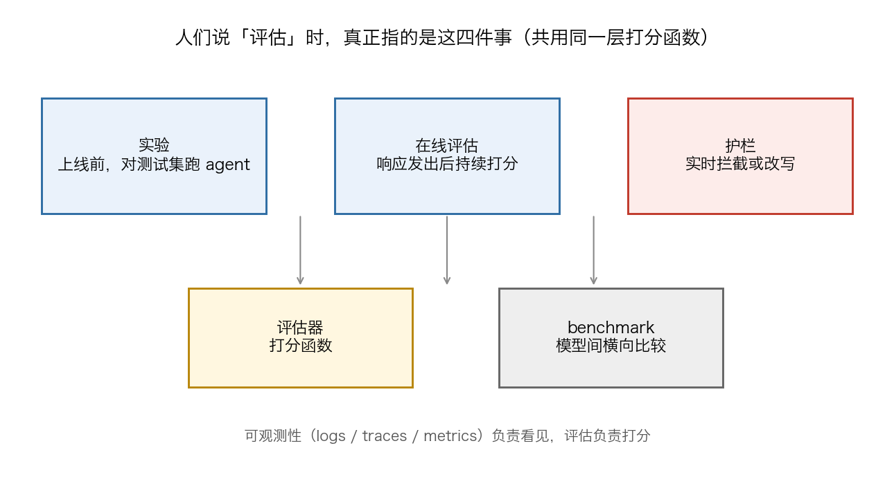

# Chapter 1 Why Shipping on Vibes Equals Shipping Blind

## 1. Why do failed AI products share the same root cause of having no evaluation system?

Failed AI products almost all share the same root cause — failing to build a robust evaluation system. 5 years of product retrospectives point to a companion conclusion: the ability to iterate fast equals success.

The usual definition of evals is "systematic measurement of application quality": it is not tied to any specific metric or method, need not be a single number, and need not be perfectly precise — it can be just an estimate; the key is to do it systematically rather than on a whim, that is, to check quality continuously and deliberately.

People who say "we don't do evals" are usually fooling themselves: every successful product does evaluation at some point in its lifecycle. Looking at outputs, noticing when something seems off, using the product yourself first, then making changes — that is evaluation, that is error analysis, and it happens continuously and systematically. Some products look like they succeeded without evaluation, but a closer look reveals two kinds of exceptions: one kind has tasks already well covered by post-training (for example coding agents, where upstream has effectively done most of the evaluation for you); the other has teams with enough domain expertise and taste who devoutly practice dogfooding and can steer by their own feel. Foundation model providers themselves pour enormous evaluation investment into new capability areas, because they know performance will not improve without systematic measurement; and companies dedicated to exactly this — Scale, Snorkel, Mercor, and others — have all reached valuations in the billions of dollars.

The harm of anti-evaluation sentiment lands precisely on new teams: most people in the community are new to AI application development, their tasks may not be covered by post-training, their teams may not have the experience and intuition to steer by dogfooding, and most lack a foundation in data analysis, error analysis, or continuous iteration processes. For these people, rejecting evals is harmful — it amounts to taking away the tools they need to understand what works, what doesn't, and how to move forward.

## 2. Why are most AI teams still evaluating models on vibes to this day?

The usual failure pattern goes like this: a team builds something that seems to work on a handful of examples, ships it, then spends 6 months making the changes they believe will improve it, while quality drifts in a random direction. The reason is that LLMs are weakly observable: changing the prompt, swapping the model, or tuning retrieval has no predictable second-order effects; code review won't catch a quality regression, latency monitoring won't catch a quality regression, and eyeballing 5 examples won't either — the only thing that catches quality regressions is automated evaluation on a held-out dataset. And so vibes-based development gets written down: "I feel this one is better." — Compared with what? Measured how?

In a Hacker News discussion on "how to do AI evals now," answers from front-line teams lined up with this. The prevailing front-line observation: the vast majority of AI companies evaluate models basically on vibes; the common spectrum runs — some teams have no evals at all, some have only integration tests without tooling, some mix observability tools like LangFuse into CI/CD, and for most teams evals are an afterthought. Others get by with promptfoo plus ad-hoc Python scripts, saying outright they are not satisfied, but that "everything is changing too fast — it doesn't feel worth the investment."

The reasons for not doing it are also out in the open: testing properly is quite expensive — to validate a single hypothesis you may need to run upward of 1,000 prompts to scrape together enough data to conclude anything. The asker himself admitted that for outputs that "are not simply right or wrong" — chatbots and coding agents being the two biggest categories — how to benchmark them "still feels like an unsolved problem"; and AI evaluation pipelines look far less standardized than traditional software monitoring.

Industry-side numbers point in the same direction: an annual report (1,340 practitioner responses) shows 29.5% of organizations do no evaluation at all; just over half (52.4%) run offline evaluation on test sets; online evaluation adoption is even lower, at only 37.3%. Organizations that have already put agents into production fare better — the "no evaluation" share drops from 29.5% to 22.8%, and the share running online evaluation rises to 44.8%. Among all organizations doing evaluation, nearly a quarter run both offline and online evaluation.

## 3. Why does a model at temperature 0 still fail to give the same answer twice?

Setting temperature to 0 means the model always picks the highest-probability word (greedy sampling), and sampling is thereby deterministic in theory. But when it comes to inference systems, the checklist you usually need to keep in mind is: in practice, LLM APIs still do not give deterministic results; even if you run open-source inference libraries like vLLM or SGLang on your own hardware, sampling remains non-deterministic.

The popular explanation is "concurrent execution plus floating-point arithmetic," but it misses the point: run the same matrix multiplication on the same batch of data a thousand times on a GPU and the results are bit-identical. The real mechanism has 2 layers: floating-point addition is not associative, so a different summation order can produce completely different results; and the inference server's forward pass lacks "batch invariance" — when the batch size changes, every element in the batch may get different values. The server's load at that moment determines how large the batch is, and load, from your perspective, is non-deterministic — so your output is non-deterministic too.

Just how concrete is this? The team demonstrated it with the open-source Qwen3-235B model: temperature 0, the same prompt sampled 1000 times, yielding 80 distinct completions, the most common of which appeared 78 times. The first 102 tokens were completely identical, and the first fork appeared at token 103 — 992 completions continued with "Queens, New York," 8 with "New York City." After switching to the team's reworked batch-invariant kernels, all 1000 outputs were completely identical.

In the Hacker News discussion, one camp held that determinism need not come from temperature 0 — fixing a random seed gives deterministic sampling, and greedy decoding itself degrades output; Gemini 2.5 Pro, for one, dislikes temperature 0. The other camp counted the uses: when the same string always produces the same wrong answer, debugging has a handle; for evals that chain 10 tool calls in a row, any reduction in unpredictable drift is welcome; and temperature 0 can be used to repeatedly cross-check results for the same prompt, to see whether a provider has quietly swapped the Pro model for a cheaper one behind the scenes.

## 4. How can one table sort out evals, benchmarks, observability, and guardrails?

Ask 5 people what "I want to add evaluation to my agent" means and you will get 5 completely different answers — confirming a change didn't break anything, catching a customer-service agent handing off to a human when it shouldn't, noticing that an agent doesn't know the answer, validating the prompt a domain expert edited in a UI, blocking a jailbreak attempt before it reaches the user. All are valid, all get called "evaluation," but each corresponds to different processes and tools. What people actually mean when they say "evaluation" breaks into 4 things: experiments, running the agent against a test dataset before launch; online evaluation, continuously scoring production behavior after responses go out; guardrails, evaluators that run synchronously and can block or rewrite a response before it reaches the user; and the evaluators themselves. All 4 share the same layer of scoring functions.

| What you want to do | What to use |
| --- | --- |
| Validate prompt changes before deployment | Experiments |
| Let domain experts test their own changes | Experiments (UI) |
| Run quality gates in CI/CD | Experiments (SDK) |
| Track human-handoff rate, resolution rate | Monitoring |
| Find knowledge base gaps | Monitoring ("I don't know" detection) |
| Alert on quality regressions | Monitoring |
| Block jailbreak attempts | Guardrails |
| Prevent PII leaks | Guardrails |
| Keep it from wandering off-topic | Guardrails |

2 boundary lines sit outside the table. One lies between guardrails and quality metrics: don't put guardrails on quality metrics — "block every response with faithfulness below 0.8" sounds reasonable, until you discover it blocks 20% of responses and users with perfectly normal questions receive "I cannot answer." The line drawn in the text: if it is merely suboptimal, monitor it; only if it is actively harmful or forbidden does it get a guardrail.

The other lies between observability and evaluation: generic benchmark scores (MMLU, HumanEval, and the like) can compare models or agent configurations, but they won't automatically tell you whether one specific agent did that one specific job well. Observability relies on logs, traces, and metrics for real-time operational monitoring, aimed at developer-facing technical performance; evaluation handles quality dimensions such as hallucination, factual accuracy, bias, and compliance. Latency budgets differ too: guardrails are inline safety checks embedded in the request/response path, typically with a budget of only a few milliseconds, and false positives are treated as production bugs; evaluators usually run asynchronously or in batches and can afford heavy computation like LLM-as-a-Judge.

## 5. How do you find out right away when a provider quietly updates its model?

Providers don't announce every update. The model under your feet can change, providers update versions, and behavior you validated last quarter is quietly different this quarter. The bill teams without evals pay looks like this: a regression can lie dormant for 4 to 6 weeks before anyone notices, and the one who notices is usually a customer. After this happens once, engineers no longer dare to touch the prompt, because they can't tell whether a change is a fix or a break; the agent freezes, and improvement stops out of fear.

To swap "the customer finds out first" for "the eval finds out first," the engineering documentation's approach is to put rollback triggers on production evaluation scores: when quality drops below a threshold, an alert or an automatic rollback fires. If a model provider pushes an update that changes output behavior, the monitoring eval catches the quality drop and either rolls the system back to the previous configuration or notifies the team to review.

Changes should go through evaluation, not wait until they are live. The same approach treats model and provider changes as configuration updates that require evaluation: when a provider releases a new model version, run the evaluation suite to assess its impact across all defined quality dimensions before migrating. Offline evaluation validates the change before deployment, and production monitoring runs a subset of the same evals on live traffic; both sides share the scoring logic and thresholds, so the definition of quality stays consistent from development to launch.

For example, a customer-service team moved to a new model, and the very first round of evaluation found the tone score had dropped from 0.85 to 0.72; after adjusting the system prompt to compensate and rerunning, tone returned to 0.88 while accuracy was unaffected — 20 minutes in total. The documentation adds one line: without evaluation infrastructure, this tone regression might have surfaced only 2 weeks later, through customer complaints.

## 6. How do you tell whether a 5-point gap between 2 runs is noise or real improvement?

An Anthropic article on the statistics of evaluation opens with exactly this question: when one model beats another on a benchmark, is the capability difference real, or did it just get lucky with the questions drawn? Evaluation scores mean nothing on their own; they mean something only in comparison. The first tool is the standard error of the mean (SEM): imagine the eval's questions as drawn from a "universe of questions" — the observed average score is only an estimate, and the 95% confidence interval is the mean score plus or minus 1.96 times the SEM. When 2 models are compared, what should be compared is this interval, not 2 bare numbers.

The second tool is rerunning. The paper's advice: when the eval uses chain-of-thought reasoning, resample answers from the same model multiple times, take the question-level average scores, and then run the statistics — the Inspect framework's epochs parameter computes the standard error exactly this way; for evals that don't use chain of thought, you can instead use the probability of the next word directly as the question score.

Beyond statistics, the environment itself is manufacturing noise. Anthropic's quantification of infrastructure noise: same model, same harness, same set of tasks — changing only the resource allocation from the tightest setting to unlimited, and the success rate on Terminal-Bench 2.0 swings by 6 percentage points (p<0.01); the naive binomial confidence interval itself spans 1–2 percentage points. The line of skepticism given: until evaluation configurations are written down clearly and aligned, leaderboard gaps under 3 percentage points should all be doubted — a lead of a few points may be nothing more than "a bigger virtual machine."

The power arithmetic goes like this: to separate a 3-point improvement from 82% to 85% out of the noise, at significance level 0.05 and 80% power, each group needs roughly 2400 labeled samples; a 100-example test set at 80% power has a minimum detectable effect of about 10–12 points, not 3. When 2 models run the same questions you can do a paired analysis, cutting the required sample roughly in half to about 1200 — still not 100.

| The score gap you see | How to read it | What to do |
| --- | --- | --- |
| 1–2 percentage points | Normal fluctuation within the naive confidence interval | Don't treat it as a real change |
| Below 3 percentage points | Time for skepticism | Rerun, enlarge the sample |
| To detect a 3-point improvement | About 2400 examples per group for statistical power | Back out the question count from a power analysis |
| Only 100 examples in hand | Minimum detectable effect 10–12 points | Use it only to catch big changes |

## 7. How do you troubleshoot leaderboard scores that don't match how the product feels?

The same frontier model scores 80% on SWE-bench Verified and 23% on SWE-bench Pro, which was purpose-built to resist contamination with long-horizon tasks on proprietary codebases; in METR's controlled experiment, 16 experienced developers completed 246 tasks with AI coding tools and their completion time rose 19% instead of falling — these numbers are not in conflict: there is a gap between what benchmarks measure and what production software engineering demands.

Task distribution is the first thing to check. The article cites Epoch AI's analysis: 87% of SWE-bench questions are bug fixes, more than 80% come from 5 Python repositories, half the issues predate 2020, and the median task is about an hour's work for a proficient engineer. One HN comment put it more bluntly: what you actually want to test in production is what the model can "see" — context shape, retrieval quality, tool use, state composition across turns — none of which is in SWE-bench; its shape is that of a one-shot problem set.

Contamination is the second thing to check. The questions are public and the solutions are on GitHub, so models trained on GitHub data after mid-2024 have very likely seen a large chunk of them; among the audited questions, at least 59% had flawed test cases that would reject functionally correct submissions; frontier models can reproduce the original human fixes verbatim. When OpenAI retired SWE-bench Verified, its stated reason was: score gains no longer reflect real software development capability, but how much of these problems the model saw during training. For example, evaluating new models on a private test set never shared externally, each update typically moves only 2–3 percentage points, while public leaderboards routinely announce 30–40% gains.

Scaffolding is the third thing to check. The same model scores 69% on its own, but 81% when attached to a complex agent harness that retries failures and iteratively edits files — model capability and systems engineering cannot be separated. Leaderboard integrity has drawn academic-side skepticism too: on Chatbot Arena, one vendor privately tested 27 model variants before release; Google and OpenAI were estimated to take 19.2% and 20.4% of all battle data respectively, and a small amount of extra data could buy relative gains of up to 112% — the platform, for its part, has issued point-by-point rebuttals to these accusations.

## 8. Why are evals the learning signal for the harness in agent development?

The cleanest way to describe a modern agent system is the equation Quotient AI offers: Agent = Model + Harness. The model brings capability; the harness turns capability into work with tools, state, memory, execution environments, constraints, and feedback. The least-discussed part is feedback: most harness discussions are about the parts that let the agent act — tools, filesystems, terminals, sandboxes — and these make the agent more capable, but they cannot tell you whether those capabilities are helping or just making things more complicated.

The article's core argument: evals should be treated as a first-class component of the harness. The analogy it gives: in classical machine learning, training data is the learning signal for the model; in agent development, evals are the learning signal for the harness — they tell you whether your changes to prompts, tools, memory, routing, permissions, and orchestration actually made the agent better.

A harness without strong evals can still let the agent do more things. But doing more is not the same as being better. The hard part is not deciding what the agent may touch; it is knowing whether these design choices actually improved the system: is the new tool useful, or just one more path to failure? Did the new memory rule reduce repeated mistakes, or introduce stale context? Did stricter guardrails make the agent safer, or the product more useless?

As a feedback signal, evals turn "the agent failed" into "we know why it failed and what to change next": it retrieved the wrong documents, so the harness may need better retrieval; it picked the wrong tool, so the harness may need clearer tool descriptions or better routing; it produced a plausible but unsupported answer, so the harness may need grounding checks. The core pattern, written out as a chain: agent behavior → traces → error analysis → evals → harness changes → regression checks → better agent behavior.

## 9. When is vibes-based evaluation a draft, and when is it a disaster?

The etymology is a single original tweet. Karpathy in February 2025: there is a new kind of coding I call "vibe coding" — fully give in to the vibes, embrace exponentials, and forget that the code even exists. I always click "Accept All" and I don't read the diffs anymore; when there's an error message I just paste it in with no comment and it usually goes away. Not too bad for throwaway weekend projects.

The term was later borrowed to describe evaluation. A practitioner's definition: when a developer runs a few inputs themselves and subjectively eyeballs the outputs, that is a vibe check; so-called human evals are vibe checks outsourced to a group of people and done at scale. The reason subjective judgment is unavoidable is that "success" criteria for LLM applications are often fuzzy — two things can both be called summarization, yet your application may emphasize only certain aspects of the input and constrain the length range; a CPU benchmark score converts objectively into transaction throughput, but LLM benchmark scores and real-world utility don't line up neatly.

Disaster strikes at the moment subjective evaluation is treated as the golden signal. For example, locking the leads in a room to walk through human judgments item by item — watching them disagree with each other and with the annotators, watching the naive idea that "human evals are the golden signal" burn up like the Hindenburg. The alternative path is to embrace the vibe check but structure it: curate a small set of representative inputs — a few dozen goes a long way; instead of writing golden answers, which are brittle and hard to adjust as things change, record the properties you want to see in the output.

The criteria for loosening versus tightening: where the task is already well covered by post-training (for example coding agents), or the team has enough domain expertise and taste and devoutly practices continuous dogfooding, those 2 situations allow loosening; where neither holds — exactly the case for most new teams — rejecting systematic evaluation takes away the tools they need to understand what works, what doesn't, and how to move forward. Academia has also folded the vibe check into a formal benchmark: Reka's Vibe-Eval uses 269 visual understanding prompts, 100 of them hard, and lists "vibe checking multimodal chat models" and "rigorously testing frontier models" as twin goals.

## 10. Why is every output different, and where does the randomness come from?

The first layer of randomness is by design: a language model produces its result through "sampling" — the model's output becomes a probability distribution, and a word is drawn according to those probabilities; at temperatures above 0 this randomness is a feature. The other layer is the one that troubles people: within inference systems you usually have to accept 4 statements at once — some GPU kernels are non-deterministic; the kernels used in a language model's forward pass are all deterministic; the forward pass of inference servers like vLLM can also claim to be deterministic; and yet from any user's perspective, the result is non-deterministic.

The original sin is that floating-point numbers are not associative: different addition orders can produce completely different results — summing an 8-element array can yield 102 different results depending on order. The key is why the kernel's addition order differs from run to run: when the batch shrinks, parallelism falls short, and kernel engineers switch reduction strategies, split matrix multiplications (Split-K), or switch to different tensor core instructions to preserve throughput — every one of these changes the summation order. Whose requests the server processes at the same time and how big the batch is are decided by the load at that moment, and load, from a single user's perspective, is a non-deterministic quantity.

How big is the impact? The team demonstrated it with the open-source Qwen3-235B model: temperature 0, the same prompt sampled 1000 times, yielding 80 distinct completions; the first 102 tokens were completely identical, and the first fork appeared at token 103. The fix was to make RMSNorm, matrix multiplication, and attention all batch-invariant kernels, after which all 1000 outputs were completely identical — at the cost of running about 20% slower than standard cuBLAS, and that is what home-built kernels bought.

Beyond the boundary lie places out of reach. There are cases outside the line too: even with a deterministic forward pass, different hardware uses different tile sizes and compilers may reorder operations behind the scenes, so this reproducibility holds only on the same machine; PyTorch's official route is to fix random seeds and turn on deterministic algorithm flags. Some draw the line even further out: deterministic reproduction and replicability are two different things — research shows that randomly changing letter casing alone can make a model give completely different responses, and that kind of fragility has nothing to do with deterministic reproduction.

## 11. Why might a pass rate rising from 70% to 90% be just noise?

That Anthropic paper on statistical methods opens with the question: when model A beats model B on a benchmark, is it a capability gap, or luck of the question draw? Evaluation scores mean nothing on their own; they mean something only in comparison — so the first step is to attach to every run a standard error of the mean (SEM) and a 95% confidence interval (mean ± 1.96×SEM). Evals with few questions naturally have wide confidence intervals; whether a gain deserves to be taken seriously must be judged against that eval's own confidence interval.

There is a commonly missed amplifier: question clustering. In reading-comprehension-style evals, several questions share the same passage, so questions are no longer independent, and naively applying the central limit theorem underestimates the standard error. The paper's measured result: on popular evals, the clustered standard error can reach more than 3 times the naive standard error; ignore question clustering, and researchers may detect differences where no capability difference exists.

When comparing 2 models there is also a free variance reduction: both models take the same set of questions, scores are paired question by question and differenced, eliminating the variance from question difficulty. The paper gives per-question score correlations between frontier models of 0.3 to 0.7 — they tend to get the same questions right together and wrong together — and the higher the correlation, the smaller the standard error of the difference. The paper recommends that when comparing 2 or more models, you report, pairwise, the mean score differences, standard errors, confidence intervals, and correlation coefficients.

The final step is power analysis: it answers "suppose A is 3 percentage points above B — how many questions must this eval have to distinguish that hypothesis from the alternative that the 2 are tied?" With too few questions, the confidence interval is wide, the models need a large underlying gap to reach significance, and small gaps are doomed to go undetected. The paper says explicitly that researchers can use power formulas to reach conclusions like this: an eval with a limited pool of usable questions is simply not worth running for a given pair of models.

## 12. Why does Anthropic define an eval as a test for an AI system?

Anthropic's engineering documentation defines evaluation very briefly: a test for an AI system — give it an input, then apply scoring logic to its output to measure success. Taken apart, it has several parts: a task is a single test with a clear input and success criteria; because model outputs vary from run to run, the same task is run for multiple trials; a grader is the logic that scores the agent's performance, and one task can carry multiple graders; an outcome is the final state of the environment at the end of a trial — a flight-booking agent can say "your flight is booked," but the outcome is whether that booking exists in the environment's database.

Every clause of this definition answers to some property of agents. The autonomy, intelligence, and flexibility that make agents useful also make them hard to evaluate: calling tools across multiple turns, modifying state, adjusting based on intermediate results — errors propagate and compound. Evaluation stops problems and behavior changes before they reach users — without it, teams easily fall into a reactive loop: catching problems only in production, fixing one failure and creating another; unable to separate real regressions from noise, unable to test changes automatically against hundreds of scenarios before release.

The "scoring logic" forces hard standards for writing tasks: a good task should be written so that 2 domain experts, judging independently, reach the same pass/fail conclusion; everything a grader needs to check should be readable from the task description — when a task asks the agent to write a script without specifying the file path while the test assumes some path, the agent fails unjustly; this is exactly what an audit of Terminal-Bench found. For frontier models, failing all trials (0% pass@100) usually means the task is broken, not that the model is bad.

The definition also determines usage: Anthropic recommends practicing eval-driven development — when the agent cannot do it yet, first build evals that define the planned capability, then iterate until it passes; when a new model is released, run the suite once and you know which bets paid off. It also sets a discipline for reading the numbers: until someone has dug into the evaluation details and read a number of transcripts, don't take scores at face value — unfair grading, ambiguous tasks, valid solutions wrongly rejected, a harness constraining the model — if any of these holds, fix the eval first.
