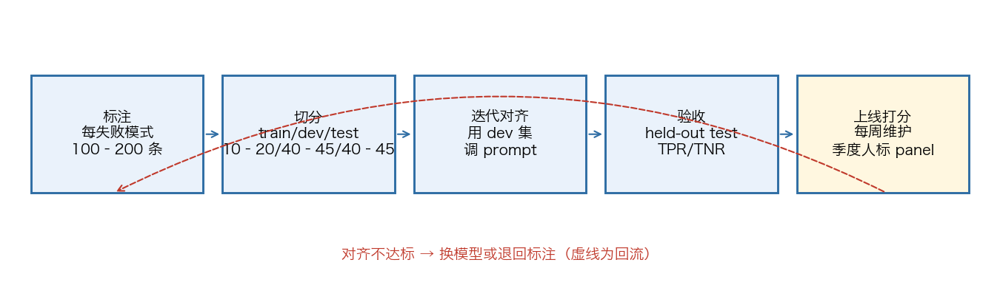

# Chapter 3 AI Judges Must Pass a License Exam


## 33. What qualifies a model to stand in as a judge and score outputs in place of humans?

A paper submitted in June 2023 provided the foundational systematic validation: LLM-based chat assistants cover such a broad range of capabilities that existing benchmarks cannot adequately measure human preference, so the authors instead used a strong LLM as a judge, evaluating these models on more open-ended questions. The paper examined the uses and limitations of LLM-as-a-judge — the three biases of position, verbosity, and self-enhancement, plus limited reasoning ability — and proposed mitigations for some of those biases. To verify agreement between the judge and human preference, the paper built two benchmarks of its own: MT-Bench, a multi-turn question set, and Chatbot Arena, a crowdsourced battle platform. The result: strong judges like GPT-4 could match both controlled and crowdsourced human preference, with over 80% agreement — the same level as agreement between humans themselves. Human preference being extremely expensive, the paper proposed LLM-as-a-judge as a scalable, interpretable way to approximate it.

G-Eval, a paper published more than two months earlier, turned this path into a framework: prior research had suggested using LLMs as reference-free metrics, with the benefit that they apply to new tasks lacking human reference answers, but these LLM evaluators correlated with humans worse than mid-sized neural evaluators did. G-Eval used LLMs with chain-of-thought (CoT) and a form-filling paradigm to evaluate the quality of NLG outputs; with GPT-4 as the backbone, it reached a Spearman correlation of 0.514 with humans on the summarization task, substantially outperforming all previous methods.

Both papers state their limitations in their abstracts. The MT-Bench paper lists the three biases — position, verbosity, self-enhancement — along with limited reasoning ability, with mitigations covering only part of them. The G-Eval paper offers a preliminary analysis of evaluator behavior, noting that LLM evaluators may favor LLM-generated text, and lists this as a potential problem rather than a settled conclusion.


## 34. Why align the judge against 100 human-labeled answers first?

When LLMs are used to evaluate AI outputs, teams keep falling into the same traps: they build too many metrics to manage; they score multiple dimensions with an uncalibrated scale (say, 1–5), where nobody can explain the difference between a 3 and a 4 and different raters interpret the same scale differently; they exclude the people who truly understand the business; and what they measure does not reflect what users or the business actually care about. The result is teams buried under a mountain of metrics they neither trust nor can use, progress stalled and everyone frustrated.

Code assertions suit objective rules; LLM judges suit failure modes that require human judgment. To align a judge with human judgment, treat human annotation as ground truth and pursue a high true positive rate (TPR) and a high true negative rate (TNR) on a held-out labeled test set. Handle the agreement metric with care: it is only valid when the dataset is roughly balanced (say, about half the samples are failures); under class imbalance, raw agreement misleads, and you should report TPR and TNR separately. The plan for annotating for the judge: label 100 to 200 samples per failure mode.

Alignment is achieved through iteration. For example, Honeycomb's judge exceeded 90% agreement with the domain expert Phillip after three rounds of iteration; along the way something unexpected happened — after reading the critiques the LLM wrote, the expert articulated his own internal scoring criteria more clearly than before. Only after the judge is built and passes acceptance can it be run on real or synthetic interaction data, and error rates should be computed only on unseen data to avoid biased results.

On model choice, using the same model as the judge is usually viable, because the judge performs a task different from the main pipeline's; what matters is how well it aligns with human judgment. Switch models only when alignment genuinely fails — introducing a new model vendor carries real overhead in many organizations, so switching models by default is not recommended. Start with the strongest model you can get to establish alignment, then optimize for cost.




## 35. How do you write the judge's prompt, from the role definition to the Unknown escape hatch?

In practice, the judge prompt starts from a role definition: the first line reads "You are a Honeycomb query evaluator, with advanced ability to judge whether a query is good or bad; you understand the nuances of the Honeycomb query language." Then come two blocks of context: background information on the query language, and evaluation guidelines. Next is the examples section, where each example has three parts — the natural language query, the generated query, and a critique carrying a verdict (good/bad). The requirement at the end of the prompt: first write a detailed critique explaining the reasoning, then give a pass/fail judgment in the same format. The iteration method: put the query, the generated result, the critique, and the verdict into a spreadsheet and send it to the domain expert; the expert fills in his own versions, and you revise the prompt accordingly, tracking agreement throughout.

Most of the judge-prompt mistakes already observed live in the examples: no critique at all; critiques written too tersely; no external context — examples should include the same information available at review time, such as user metadata and system information; and examples that are not diverse enough. Critiques should be detailed enough to serve directly as few-shot examples and be understandable by a new employee — writing them too briefly is a common mistake.

Give the LLM a way out: to guard against hallucination, the instructions allow it to return Unknown when it lacks sufficient information. The companion practice is to write clear, structured rubrics for each dimension of the task, then evaluate each dimension with isolated LLM-as-a-judge calls rather than one judge covering all dimensions; once the system is robust, human review only needs to happen occasionally.

You cannot write a good judge prompt before seeing the data: a paper on calibrating evaluators points out that people need to externalize and define their evaluation criteria before they can grade outputs, while the act of grading itself helps them define those criteria — the paper calls this criteria drift; evaluation criteria can never be fully determined before a human has reviewed LLM outputs.

```
# Role
You are a Honeycomb query evaluator, with advanced ability to judge
whether a query is good or bad; you understand the nuances of the
query language

# Context (include only what this failure mode needs; do not send the full trace)
- Background information on the query language
- Evaluation guidelines

# Examples section (each example has three parts)
- Natural language query
- Generated query
- Critique carrying a verdict (good/bad)

# Output requirements
1. First write a detailed critique explaining the reasoning
2. Then give a pass/fail judgment in the same format
3. Return Unknown when information is insufficient (guards against hallucinated verdicts)

# Maintenance
- Use the domain expert's corrected versions to iterate on the prompt, tracking agreement throughout
- One independent judge per dimension; do not let one judge evaluate all dimensions
```


## 36. How do you audit the three major biases cheaply, in just a few hundred calls?

For example, a team's LLM-as-judge score rose from 78% to 91% over six weeks of prompt iteration, so they shipped. Users did not buy it — the new prompt produced longer answers with more formatting and a more confident tone, and the judge accepted every single one. The team had not built a smarter prompt; they had reverse-engineered their own judge's biases.

The three major biases: length — longer answers score higher, regardless of quality; position — in pairwise comparisons, the option listed first wins more often than chance; format (familiarity) — outputs that resemble the judge's own training distribution score higher. A 2024 systematic study covering six LLM judges and 22 tasks found that position bias is most pronounced when the two candidates differ little in quality — precisely the range where evaluation needs the judge to discriminate.

The audit has three steps. Length pairing: generate a length-matched variant of the judge's chosen winner and rerun the judge; the flip rate is your length-bias rate, and anything above 10% means length is an effective confounder — the fix is a length-controlled rubric or AlpacaEval-style regression correction. Order swapping: run each pairwise prompt twice (A first then B, B first then A) and discard verdicts inconsistent across orders; the discard rate is your position-bias rate. Closely matched pairs commonly show 20–40% verdict flips after swapping — up to four in ten "wins" are order artifacts. Format stripping: pass the candidate responses through a Markdown-stripping normalizer (removing headings, lists, bold, tables) and rerun; the score gap between the formatted and stripped versions is the format bias's contribution. A large gap means the "gains" from adding lists and headings during prompt iteration never existed.

These three audits cost a few hundred extra judge calls and two to three hours each; together they give you the noise floor of your evaluator. Without them, every prompt-iteration gain below the bias floor is statistically meaningless.

| Bias | Symptom | Audit method | Threshold (practitioner rule of thumb) |
| --- | --- | --- | --- |
| Length bias | Longer answers score higher, regardless of quality | Generate a length-matched variant of the judge's chosen winner and re-evaluate | Flips > 10% mean significant confounding |
| Position bias | Pairwise results depend on presentation order | Re-evaluate with the order swapped | 20–40% verdict flips are common |
| Format / self-preference | Favors numbered headings, low perplexity, text that resembles itself | Sample and compare against human labels | — |

```
Three-step bias audit (a few hundred calls each; a few hours in total):
1. Position bias — swap the presentation order of the two candidates and rerun the judge
   Flips of 20–40% are common; one-directional pairwise scores are a rookie mistake in production-grade evaluation
2. Length bias — generate a length-matched variant of the judge's chosen winner and re-evaluate
   Flips > 10% mean length confounding is significant
3. Self-preference / format — sample and compare against human labels; report TPR/TNR
```

## 37. How do you verify a judge's self-preference — and is perplexity the root cause?

Self-preference bias in LLM judges poses a substantive risk, including propagating specific styles or strategies inherent to the LLM itself; the problem long lacked a quantitative measurement, and its causes were unclear. A 2024 study introduced a quantitative metric for measuring self-preference, and its experimental results showed that GPT-4 exhibits a significant degree of self-preference.

To probe the cause, the researchers hypothesized that an LLM may favor outputs it is more familiar with, with familiarity indexed by lower perplexity. After analyzing the relationship between LLM scores and output perplexity, the answer was yes: whether or not an output was generated by the model itself, LLMs score lower-perplexity outputs significantly higher than human evaluators do. The study's conclusion: the bias is fundamentally about perplexity — self-preference exists because LLMs favor text that is more familiar to them.

Practitioner-side audits line up with this: format bias (also called familiarity bias or self-preference bias) has been measured directly — GPT-4 systematically scores GPT-4's outputs higher than humans do, and the effect correlates with perplexity. In practice it shows up in three forms: markdown bias, where formatted bullet lists outscore equivalent prose; structure bias, where numbered headings outscore flowing argumentation; and style-family bias, where one vendor's judge quietly downgrades another vendor's outputs even when humans prefer the latter. Each bias looks small on its own; stacked into a six-week prompt-iteration loop, they become a Goodhart machine.

The corresponding check is to pass the candidate responses through a Markdown-stripping normalizer — removing headings, lists, bold, and tables, leaving plain prose only — and rerun the judge; the score gap between the formatted and stripped versions is the format bias's contribution. A large gap means the judge rewards presentation form more than substance, and every list or heading added during prompt iteration will show an "improvement" that does not exist.


## 38. When can a model from the same vendor serve as judge, and when does it backfire?

When choosing an LLM-as-judge, using the same model as the main pipeline is usually viable, because the judge performs a task different from the pipeline LLM's. Although research shows that models exhibit bias when evaluating their own outputs, what ultimately decides the matter is how well the judge aligns with human judgment. The recommended judge performs a narrowly scoped binary classification task, and on such a constrained task, iterative alignment with human labels is usually achievable.

The numbers to watch are the judge's true positive rate (TPR) and true negative rate (TNR) on a held-out labeled test set. Only when aligning with human scores proves difficult should you consider switching models; but introducing a new model vendor carries real overhead in some organizations, so switching by default is not recommended unless a concrete alignment problem appears. The order of operations for picking a judge model: first use the strongest model at hand to build strong alignment with human judgment; once reliable evaluation criteria are established, then optimize for cost.

When it backfires: use the very model that generated the outputs as the judge and it will systematically favor its own outputs — that is the sandbagging problem, and you need a model from a different family to do the evaluating. Reliability also has task boundaries: on subjective quality judgments ("Is this reply pleasant?"), LLM-judges perform roughly at chance, no better than the noise between human reviewers; subtle errors ("Did the model make a logical leap?") get missed; preferences over style, length, and formality skew evaluations, and left uncontrolled they introduce bias; reference-free comparative scoring ("Which of the two answers is better?") beats absolute scoring, but without anchors it remains noisy.

| Scenario | Verdict |
| --- | --- |
| The judge performs a task different from the main pipeline | Usually viable — watch TPR/TNR |
| The same model that generated the outputs serves as judge | Systematic bias risk: the judge favors its own style of output |
| Alignment never reaches the bar | Switch models (integrating a new vendor has costs; not a default move) |


## 39. How do you assemble a jury of judges — how many members, how are they chosen, and what about ties?

LLM-as-a-jury means using a group of language models — often smaller, more diverse, each with its own strengths — to evaluate or adjudicate the quality, safety, or correctness of another model's outputs; where a single judge relies on one heavyweight evaluator, a jury deploys multiple LLMs in exchange for gains in accuracy or alignment with humans, analogous to ensemble learning in classical ML. The research the piece cites converges on several findings: LLM evaluation panels can beat a single judge on both accuracy and cost; multi-agent debate frameworks can produce richer argumentation and improve alignment with human judgment; JudgeBench and Meta-Judge pipelines newly emerging in 2025 raised the bar for evaluation and delivered 8–15% reliability gains; a diverse pool of jurors covers blind spots through previously unrepresented perspectives; and self-consistency and self-improvement techniques remain strong baselines, delivering 10–20 point gains by aggregating reasoning paths.

How to pick the jurors: the example uses three cross-vendor judges — claude-3-5-sonnet-latest, gpt-3.5-turbo, and gpt-4o-mini — each given the same judge prompt template (task instructions, input, reference answer, output under evaluation; the verdict field has only two levels, correct/incorrect, plus a short explanation), run in parallel and independently, then aggregated.

What about ties: the aggregation function counts votes per label and returns a label only when the top-voted label is unique, or strictly leads the runner-up in votes; otherwise it returns tie. Each verdict is logged together with each juror's explanation.

Where to use it: offline and continuous benchmarks, with higher correlation with humans and cheaper nightly refreshes; guardrails and safety filtering, where a diverse jury catches edge-case harms a single judge misses; RAG and agent verification, where majority voting flags hallucinations before answers reach users; content moderation and policy enforcement, where a weighted jury reduces demographic bias; RLAIF, where jury scores replace or supplement expensive human preference labels; and A/B testing and model selection, for large-scale side-by-side comparisons.


## 40. Why does feeding the judge reference answers — letting it cheat — make it more accurate?

Using a grader LM to evaluate a candidate LM is a tempting way to speed up evaluation and cut its cost, but it presents a paradox: the grader is assumed to be weaker than the candidate — why trust it to grade questions beyond the capability boundaries of both (or either)? Today's language models, for instance, struggle with graduate-level physics and olympiad-level math, making them unreliable judges in those domains.

The paper's answer is right there in its title, "Graders should cheat": providing privileged information — such as ground-truth solutions or question-specific guidelines — improves automated evaluation on such frontier problems. This brings two key advantages. First, it expands the range of problems LM judges can handle: weak models can thereby score the predictions of strong models. Second, privileged information can be used to transform hard problems into easier variants, improving discriminability between LMs on tasks where all models perform poorly overall.

The track record, from the abstract: with this method, a general-purpose LM judge matched the state of the art on RewardBench, beating nearly all specially fine-tuned models; surpassed a single rater on Vibe-Eval; and approached human expert judges on olympiad-level math problems.


## 41. Why does a judge need weekly maintenance after deployment, and what does that maintenance cover?

The cost structure makes this a recurring expense: LLM-as-judge evaluators require 100+ labeled samples, ongoing weekly maintenance, and collaboration among developers, PMs, and domain experts — deploy expensive evaluators only on problems that will be iterated on repeatedly. A reference cadence: rerun error analysis on major changes — new features, prompt updates, model swaps, major bug fixes; review at least 100+ new traces per review cycle, with common cycles of 2–4 weeks; and between major analyses, look at 10–20 traces weekly, focusing on unusually long conversations, sessions with many retries, and traces flagged by automated monitoring.

The first object of maintenance is drift. Judges need periodic calibration against human scores; without calibration, scoring drift will inflate or deflate results over time, and eval scores quietly stop reflecting true quality. The practice: compare automated scores against periodic human labels and recalibrate whenever misalignment appears; without monitoring, eval scores gradually lose reliability even when thresholds appear to be met.

Drift comes from two places. One is the judge itself: vendor-side model updates change behavior — the same judge prompt run on the same eval set produces different scores on gpt-4o-2024-08-06 and gpt-4o-2024-11-20; pin the judge model and you accept obsolescence, let it float and you accept silent drift — either way, periodic calibration checks are required. The other is the task: the eval set written at launch reflects the failure modes known at the time; as the product matures, the distribution of real inputs shifts. Six months later, the judge may be perfectly calibrated against an eval set that no longer represents the actual workload. The discipline that catches both is a quarterly-refreshed held-out human preference panel.

What about after switching models: only walk the whole process again and re-measure the results. Nor can humans be removed entirely — you do not need a domain expert to label every single item, but you do need representative samples; an LLM always has to be aligned to something, and that something is usually a human.


## 42. How do you convert a judge's holistic score into atomic criteria?

On the usage circulating among LLM-as-judge users, the opening judgment is: the holistic judge score hides two things at once — the reasoning behind the score, and its ceiling effect.

BINEVAL's (arXiv ID to be verified) approach: decompose each evaluation criterion into atomic yes-or-no questions, answer each question independently for every output, then aggregate the per-question verdicts into calibrated multi-dimensional scores.

Inspectability is where this transformation lands: every per-question verdict is visible, so you can diagnose precisely why an output scored low; and the same verdicts flow back directly as targeted signals for prompt improvement.

On results, across the SummEval, Topical-Chat, and QAGS datasets, it matches or exceeds UniEval and G-Eval without any training, and it performs especially strongly on factual consistency.


## 43. Which is actually more reliable — pairwise comparison or pointwise scoring?

Where comparative judgment stands: reference-free comparative scoring — "Which of the two answers is better?" — beats absolute scoring, but without anchors it remains noisy. The problems with pointwise scoring are more fundamental: on a 1–5 Likert scale, the difference between adjacent levels (a 3 versus a 4, say) is subjective and interpreted inconsistently across annotators; detecting statistical differences requires larger sample sizes; and annotators default to the middle value to escape difficult decisions.

The resulting ranking puts binary first: binary evaluation forces clearer thinking and more consistent labeling; with a binary option, a person must make a decision rather than hide uncertainty in a middle value; and binary judgments also speed up error analysis — no time wasted arguing whether something is a 3 or a 4. To track incremental improvement, the path is not to add a scale but to give specific subcomponents their own binary checks: instead of scoring factual accuracy 1–5, decompose "contains 4 of 5 expected facts" into item-by-item binary checks — preserving the ability to measure progress while keeping the criteria clear and objective. Start with binary labels to understand what "bad" looks like; numeric labels are an advanced step, and usually unnecessary.

Even with a 1–5 scale you cannot escape the binary: the business will eventually have to ask "how good is good enough" and "what score should trigger intervention," forcing binary decisions all the same. The nuance is not lost — it moves into the qualitative critique that accompanies each judgment: the critique carries why it passed, why it did not, and where it can improve, while the binary decision delivers the clean verdict of whether improvement is needed.

```
Turn the scale into binary checks:
Before: score "factual accuracy" 1–5 (what separates a 3 from a 4? Nobody can say)
After: decompose "contains 4 of 5 expected facts" into item-by-item binary assertions, each pass/fail
To track incremental improvement, give specific subcomponents their own binary checks
```


## 44. Why can't one judge evaluate every dimension?

The division of labor: write a clear, structured rubric for each dimension of the task, then evaluate each dimension with isolated LLM-as-a-judge calls rather than one judge covering all dimensions; once the system is robust, human review only needs to happen occasionally. A supplement for research-type tasks: research quality is subjective — "comprehensive," "well-grounded," even "correct" all depend on context, so LLM-based rubrics should be calibrated frequently against expert human judgment.

Feed each judge only the part of the trace its failure mode needs; do not send the full trace to every judge by default: excess context causes context rot and makes the judge worse.

Which context helps usually takes experimentation: test it by comparing judge decisions against human labels, then examine the disagreements — did the judge lack necessary evidence, or was it misled by irrelevant information? When unsure whether a piece of information helps, run ablations: remove one item at a time and compare results against human labels; if performance is unchanged or improves, you can drop it. Long-running agents produce enormous traces that fill, or even exceed, the judge's context window; in that case consider giving the judge a tool to search for the needed parts — but do not add one unless absolutely necessary; such tools bring extra complexity, cost, and latency.


## 45. How do you write gradeable rubrics for tasks with no standard answer?

First establish gradeable criteria: a good eval question should lead two domain experts, each reading it independently, to the same pass/fail conclusion. Ambiguity in the task description becomes noise in the metric — and the same holds for a model grader's criteria: a vague rubric produces inconsistent judgments. The task should be passable by an agent that correctly follows instructions: a review of Terminal-Bench found that when a task tells the agent to write a script without specifying file paths while the tests assume particular paths, the agent fails for no good reason; everything the grader checks should be readable from the task description. On frontier models, a 0% pass rate across many trials (0% pass@100) is most likely a sign the task itself is broken.

Then pair it with a reference solution: build a reference solution for each question — a working output known to pass all graders; it both proves the task is solvable and verifies the grader is configured correctly.

How to score tasks with no standard answer: in research-type tasks, "comprehensive," "well-grounded," and "correct" depend on context. The approach is to combine multiple checks: groundedness checks verify that claims are supported by retrieved sources; coverage checks define the key facts an answer must cover; source quality checks confirm that the sources consulted are authoritative, rather than simply taking the first retrieved result. Tasks with an objectively correct answer ("What was Company X's Q3 revenue?") use exact match; the LLM is responsible for flagging unsupported claims and coverage gaps; LLM-based rubrics should be calibrated frequently against expert human judgment.

The reference paradigm from the literature is G-Eval: using LLMs with chain-of-thought (CoT) and a form-filling paradigm to evaluate the quality of NLG outputs; G-Eval with a GPT-4 backbone reached a Spearman correlation of 0.514 with humans on the summarization task, substantially outperforming all previous methods. The same paper self-reports: LLM evaluators may favor LLM-generated text.


## 46. How do you tell a judge's guardrail role apart from its evaluator role?

Guardrails are inline safety checks sitting directly in the request/response path, validating inputs or outputs before they reach the user. Typical shape: fast and deterministic — latency budgets are generally a few milliseconds; simple and explainable — regexes, keyword blocklists, schema or type validators, lightweight classifiers; aimed at clear, high-impact failures — PII leaks, profanity, disallowed instructions, SQL injection, malformed JSON. When a guardrail fires, the system can delete, redact, refuse, or regenerate. Because these checks are visible to users when they fire, false positives are treated as production bugs: rules are version-controlled, every firing is logged, and firing rates are monitored to stay conservative.

Evaluators usually run after a response has been produced, measuring properties simple rules cannot — factual correctness, completeness, and so on; their verdicts feed dashboards, regression tests, and the model-improvement loop, but they do not block the original answer. Evaluators typically run asynchronously or in batches to absorb heavy computation like LLM-as-a-judge; only when both the latency budget and reliability goals allow can LLM-as-a-judge be used inline, and a slow judge may be viable in a cascade that handles only a few edge cases.

The platform side gets more specific about misuse: do not use guardrails to block on quality metrics — "block every response with faithfulness < 0.8" sounds reasonable until you discover you have blocked 20% of responses and users asking perfectly normal questions receive "I cannot respond to that." Guardrails are for policy enforcement, not quality optimization: merely suboptimal — monitor it; actively harmful or forbidden — guardrail it. The reverse is just as deadly: putting something that deserves a guardrail on a dashboard only — "track PII exposure rate in the dashboard" means customer data was exposed 47 times last week, and you have a pretty chart of it. Performance problems have a standard fix: fire the guardrail checks in parallel with the LLM call and decide once both return; millisecond-level guardrails finish first, net latency impact zero.


## 47. How do you split a judge's calibration data, and how many samples go in each set?

First compute the total: use an LLM judge when failures require subjective or domain judgment; the plan is to label 100 to 200 samples per failure mode; traces already labeled during failure discovery that match the failure mode can be reused, topped up to this range if short. Labels should come from trusted domain experts and include enough Pass and Fail samples that both classes can be measured. Validating an automated judge takes more labels than the 30-example starting point for failure discovery: about 100 per failure mode, with both Pass and Fail classes represented; below 60 examples, confidence intervals are often too wide to support useful conclusions.

Then split three ways: 10%–20% as train, usable as few-shot examples in the judge prompt; 40%–45% as dev, where the judge-tuning loop runs — run the judge, compare against human labels, examine errors, revise the prompt; the remaining 40%–45% is held as test, run only once at the very end. Dev and test each contain 30–50 Pass and 30–50 Fail examples. Samples from dev and test never go into the judge prompt.

Test discipline and measurement: the test set stays hidden until the prompt is finalized — freeze the prompt, run on test exactly once, and treat the result as the final estimate of judge performance. Measure with TPR and TNR, because agreement misleads when failures are rare: if errors are only 5% of samples, a judge that always predicts Pass still scores 95% agreement while catching zero errors.

| Set | Share | Contents |
| --- | --- | --- |
| train | 10–20% | For tuning the judge prompt |
| dev | 40–45% | 30–50 passes + 30–50 failures, for iterative alignment |
| test | 40–45% | Keep hidden; final TPR/TNR reported only here |

```
Calibration data split (baseline: 100–200 labels per failure mode):
train  10%–20%   Tuning the judge prompt
dev    40%–45%   30–50 passes + 30–50 failures, used during iteration
test   40%–45%   Keep hidden; untouched until the prompt is finalized; TPR/TNR reported only here
```


## 48. Why doesn't 80% agreement make a judge reliable?

The origin of the "80% agreement" figure is a 2023 paper: using strong LLMs like GPT-4 as judges, it validated judge–human preference agreement with the self-built MT-Bench multi-turn question set and the crowdsourced Chatbot Arena battle platform, concluding that GPT-4 judges could match both controlled and crowdsourced human preference with over 80% agreement — the same level as agreement between humans themselves. That is a claim at the 2023 GPT-4 point in time.

Agreement by itself reads as neither good nor bad; compare it against human baselines for the task type (rough rules of thumb): human–human agreement is 70–85% on subjective tasks and 90–95% on factual tasks; LLM-judge–human agreement is 85–95% on factual tasks (near the ceiling) and 60–75% on subjective tasks (clearly below humans agreeing with each other). The same 80% is a high-water mark in the subjective band, and still below the human baseline in the factual band.

Calibration is not optional: run the judge on roughly 50 human-labeled samples and compute agreement; below inter-human agreement, the judge is below the noise; at or near human agreement, it is a useful judge. A worked example from the course: inter-human agreement of 88% is the ceiling — even humans cannot fully agree; a judge at 76% is noisier than humans but far above chance — a typical profile. Where it is usable: pulling the worst 10% out of 1,000 conversations for review, tracking quality trends week over week, coarse-grained A/B comparisons. Where it is not: ship decisions on small margins, customer-facing reliability claims, and choosing between systems whose metrics are close. The honest formulation: an LLM judge approximates human judgment with detectable noise — calibrate it against humans regularly, and be clear about where that noise level is acceptable.


## 49. Why is five-star scoring called the five-star lie?

The name comes from a widely circulated list of evals learning resources: the anti-scale piece on the list is titled "The 5-star lie you are doing AI evals," and its subject is the contest between binary evals and Likert scales. The argument for calling it a lie: engineers often believe 1–5 scores carry more information than binary evaluation and can track incremental improvement, but that extra complexity creates more problems than it solves in practice.

The Likert scale's three defects: the difference between adjacent levels (a 3 versus a 4) is subjective and inconsistent across annotators; detecting statistical differences requires larger sample sizes; annotators default to the middle value to escape difficult decisions. Binary evaluation forces clearer thinking and more consistent labeling: with a binary option, a person must make a decision rather than hide uncertainty in a middle value; and binary judgments also speed up error analysis — no time wasted arguing whether something is a 3 or a 4.

The practice of going binary: to track incremental improvement, give specific subcomponents their own binary checks instead of using a scale — for example, instead of scoring factual accuracy 1–5, decompose "contains 4 of 5 expected facts" into item-by-item binary checks; this preserves the ability to measure progress while keeping the criteria clear and objective. Start with binary labels to understand what "bad" looks like; numeric labels are an advanced step, and usually unnecessary. Even with a 1–5 scale, the business eventually has to ask "how good is good enough" and "what score should trigger intervention," collapsing back into binary decisions; the nuance is not lost — it moves into the qualitative critique that accompanies each judgment.


## 50. Why does a metric stop working once it becomes a target, and how do you guard against it in evaluation?

Goodhart's law comes from economics: "When a measure becomes a target, it ceases to be a good measure." Applied to AI model evaluation: once researchers and companies focus on beating a benchmark, the benchmark itself becomes misleading. The Chatbot Arena controversy is cited as the working example: model developers found ways to treat high Arena scores as a target to optimize for, ultimately distorting Arena's ability to measure true model quality.

A mechanisms paper dissects the leaderboard gaming: undisclosed private testing lets a few vendors test multiple variants before public release and withdraw scores at will; this ability to cherry-pick the best result produces biased Arena scores through selective disclosure; Meta, for example, tested 27 private LLM variants before the Llama-4 release. These dynamics lead to overfitting to Arena-specific dynamics rather than to general model quality. One comment in the discussion maps the affair onto academia: well-funded vendors can clearly submit dozens of model variants to a leaderboard and then selectively publish only the best performer — essentially the same as p-hacking in the social and biological sciences, relocated into machine learning.

Anti-gaming moves (from community discussion): transparency and public results — log and publish all evaluation runs, including rejected or unreported ones, making every model variant's full score trajectory visible and leaving no room for cherry-picking; a uniform testing policy — restrict private testing evenly across all vendors, avoiding undisclosed preview programs that only a few companies know about; diverse evaluation signals — use multiple benchmarks plus real-world tasks to avoid overfitting to any single metric; and community and adversarial review — encourage external researchers to audit and stress-test leaderboards, exposing integrity problems before they harden. One thread runs through all of it: no single evaluation metric should be trusted in isolation.


## 51. Why will a judge always give you a score?

A judge will always give you a score; the question is whether that score reflects your product's standards or the judge's own preferences. The context for this line is automated gates in harness engineering: once the labels of failure modes emerge, the temptation of automation follows — nobody wants to hand-label traces forever, and LLM-as-a-judge is often the only feasible way to scale evals beyond a small set of human-labeled samples; the danger lies in the unverified judge.

A judge can be part of an eval, but it is not itself an eval: until it has been verified against human labels and proven to catch the failures that matter, it is just another model output. The things easily mistaken for evals each measure their own thing: general benchmark scores (MMLU, HumanEval, Terminal-Bench) can compare models or agent configurations, but they say nothing automatic about whether a specific agent is good at a specific job; off-the-shelf quality metrics (helpfulness, coherence, faithfulness, hallucination rate) are usually too generic — every eval platform ships with them, and precisely for that reason they cannot say anything specific about your product; latency, cost, and token usage are observability signals that do not tell you whether the agent did the right thing.

So the LLM judge's first job is to earn the right to be trusted: treat it as a classifier — compare it against human labels, examine the disagreements, check whether it catches the failure modes you actually care about; when the judge is wrong, the harness optimizes toward the wrong behavior. Evaluation can scale, but only after humans have done the work of defining what "good" looks like. The whole method's ordering compressed into one line: behavior first, metrics after — start from behavior, find the failure modes, and let evals point to the next harness change.


## 52. What is the gold standard, really, when human reviewers cannot even agree with each other?

Advice from an engineering leader: if the company can afford periodic manual evaluation of a slice of traffic, pick a small set of human evaluation results with roughly a 50/50 split of positive and negative judgments, lock the team leads in a room, and go through them one by one. Watching them disagree with each other — and with the original reviewers — on nearly every judgment, the naive idea that "human evaluation is some kind of gold-standard signal" burns through like the Hindenburg.

The sources of subjectivity: not all ML models are like this — fraud detection or spam classification models, while probabilistic, still have objective success rates measured in false positives and true positives; LLM applications today are anchored in natural language understanding and interpretation, which inherently resist clear, objective measurement. Take summarization: a summary may be meant to emphasize only certain aspects of the input, or to fall within a certain length range — the success criteria themselves are fuzzy, so evaluation depends on human judgment, and human evals are just vibe checks outsourced to a group of people, done at scale.

The agreement arithmetic: for example, three annotators answer the same two-choice question; two pick A and one picks B, which looks like 66% agreement; but checking pairwise, 1 agrees with 2, 1 disagrees with 3, and 2 disagrees with 3 — only one of three pairs matches, a true agreement rate of 33%, lower than the 50% you would get from pure guessing. His conclusion: most people severely overestimate the reliability of human evaluation; to do human evaluation at all, the judgment criteria must be specified to extreme precision to guarantee inter-annotator agreement — otherwise it is a wasted effort.

How to establish criteria: embrace the vibe check, but do it with structure — develop a small set of representative inputs for the specific problems your application solves; it need not be large — a few dozen goes a long way. Instead of gold-standard answers (brittle, slow to adapt to change), document the properties you want the outputs to have. If traditional benchmarking does not work for LLM-driven applications, you have to rely on subjective evaluation — so make that subjective evaluation a bit more systematic.
