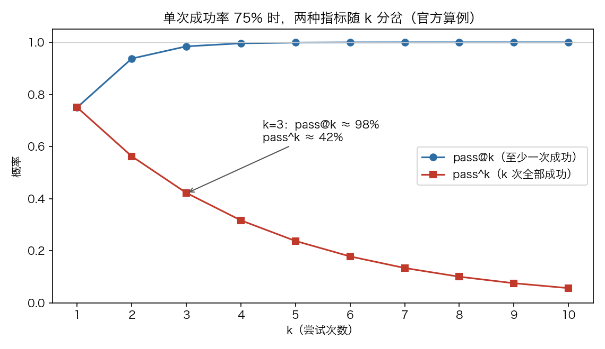

# Chapter 4 When Is an Agent's Work Actually Done

## 53. Should You Evaluate an Agent's Final Outcome or Its Trajectory?

In Anthropic's definition of agent evaluation, trajectory and outcome are two different things: a transcript is the complete record of a trial, including outputs, tool calls, and reasoning; the outcome is the final state of the environment when the trial ends. A flight-booking agent can say "Your flight is booked" at the end, but the outcome depends on whether that booking actually exists in the environment's SQL database.

There is a common instinct when designing graders: check whether the agent followed specific steps. Anthropic's experience is that this path is too rigid and produces overly brittle tests, because agents often find legitimate paths the eval designers never anticipated; to avoid needlessly penalizing creativity, it is usually better to evaluate what the agent produced rather than which path it took.

LangChain's evaluation guide adds the other side: a correct final answer can hide broken reasoning—a hallucinated tool call may still stumble onto the right result, and a retrieval mistake may be smoothed over by luck, and these failures are invisible when you evaluate outputs alone. The dividing line: for single-turn, tool-free cases with deterministic paths and for early prototypes, evaluating outputs is enough; for multi-step tool calls where order or choices affect correctness, when correct outputs may mask bad reasoning, and in high-risk domains that need an audit trail, you should evaluate the trajectory.

Shreya Shankar draws another axis: evaluation has two entirely different components—discovering which failure modes exist, and focused measurement of how prevalent they are so fixes can be prioritized. LLMs can find some but not all failure modes in (1), since many failure modes are subjective and hinge on human interpretation; in (2) they can go through traces item by item on a human's behalf. The big mistake she calls out is letting LLMs automate both (1) and (2)—an LLM judge is a complement to human experts, not a replacement.


## 54. How Do You Choose the Right Stability Metric Between pass@k and pass^k?

pass@k measures the probability that the agent gets it right at least once in k attempts, and the larger k is, the higher it goes—take more shots and the odds of scoring at least one goal rise. A pass@1 of 50% means the model gets half the tasks right on the first try. In coding scenarios, what usually matters most is pass@1—getting it right in one shot; in other scenarios, many solutions are proposed and one usable one counts as success.

pass^k measures the probability that all k trials succeed. The larger k is, the lower it gets—staying consistent across more attempts is inherently a higher bar. The canonical worked example: an agent with a 75% single-run success rate, run 3 times, passes all three with probability (0.75)³ ≈ 42%. This metric matters especially for user-facing agents, which users expect to be reliable every single time.

The two curves diverge as k grows: at k=1 they are equal, both equal to the single-run success rate; by k=10 the story is reversed—pass@k approaches 100% while pass^k falls toward 0%. Which one to pick depends on product requirements: tools that work if they succeed once should use pass@k, and agents whose livelihood is consistency should use pass^k.

The τ-bench paper quantified this divergence: the paper proposed pass^k to evaluate an agent's behavioral reliability across multiple trials, and in its experiments even the most advanced function calling agents (such as gpt-4o) succeeded on fewer than half the tasks, and were quite inconsistent (pass^8 <25% on the retail domain). A corroborating account gives consistent numbers: for the same GPT-4o agent on the same retail tasks, pass^1 was 61.2%, falling to under 25% at pass^8—less than a one-in-four chance of getting all eight right. Reporting only single runs flatters quietly unreliable systems; the only thing that catches them is a suite that tests consistency.




## 55. How Do You Set Pass-Rate Targets for Capability Evals and Regression Evals Separately?

Capability evals ask "what can this agent do well," and their pass-rate targets should start low: pick tasks the agent cannot currently handle, giving the team a hill it can climb.

Regression evals ask "can the agent still do what it used to do," and their pass rates should be close to 100%. They guard against regressions—a falling score is the signal that something broke and needs fixing. While the team climbs the hill on capability evals, it should keep running regression evals continuously to confirm changes are not breaking anything elsewhere.

There is a graduation mechanism between the two: after an agent ships and gets optimized, high-pass-rate capability evals can "graduate" into continuously running regression suites that specifically catch drift. Tasks that once tested "can we actually do this" go on to test "can we still do this consistently."

Starting low has another use: Anthropic internally often builds features that are merely "good enough" today but actually bet on model capabilities a few months out, and capability evals that start at a low pass rate make those bets visible—when a new model ships, one run of the suite shows which bets paid off. The accompanying caveat is saturation: an eval at 100% can only track regressions and gives no signal for improvement; once an eval saturates, progress also slows because only the hardest items remain, and large capability gains show up on the score as small increases.


## 56. Why Should the First Batch of Agent Eval Tasks Be Drawn from Real Failures?

A common reason teams delay building evals is the belief that they need hundreds of questions before it counts. Anthropic's starting number: 20-50 simple tasks drawn from real failures is a good start. Early in agent development, each change to the system tends to have a clear, perceptible impact and the effect sizes are large, so small samples suffice; only more mature agents need larger, harder evals to detect smaller effects—at the starting stage, go by the 80/20 rule.

The longer you wait, the harder evals become to build. Early product requirements translate naturally into test cases; wait too long and you are left reverse-engineering success criteria from a system that is already in production.

Start from what is already being tested by hand: the behaviors verified before each release, the tasks end users perform most often. For things already in production, look at the bug tracker and the support queue. Turning user-reported failures into test cases is what makes the suite reflect real usage; prioritize by user impact so the effort goes where it matters most. Anthropic's own path followed the same logic: Claude Code started by iterating quickly on employee and external user feedback, and only later added evals—first narrow domains like conciseness and file editing, then complex behaviors like overengineering.

A more direct version: you do not necessarily need all ten standard agent evals—build first the two that would have caught your last incident. Offline evals tell you it works; online evals tell you it still works.


## 57. How Do You Divide the Work Among Code-Based, Model-Based, and Human Graders?

Agent evaluation is usually assembled from three types of graders: code-based, model-based, and human, each evaluating part of the transcript or the outcome; the key is matching the right grader to the job.

Code-based grading's tactics include string matching (exact, regex, fuzzy), binary tests (fail-to-pass, pass-to-pass), static analysis, result verification, tool call verification, and transcript analysis; its strengths are speed, low cost, objectivity, reproducibility, and easy debugging, while its weaknesses are brittleness toward legitimate variants that do not match the expected pattern, lack of nuance, and inability to support more subjective tasks. Model-based grading uses rubric scoring, natural language assertions, pairwise comparison, reference-answer evaluation, and multi-judge consensus; it is flexible, scalable, captures fine distinctions, and handles open-ended tasks, at the cost of nondeterminism, higher expense, and the need to calibrate against human judgment. Human grading uses expert review, crowdsourced judgment, spot checks, A/B testing, and inter-annotator agreement; its quality is the gold standard, it aligns with expert judgment, and it serves to calibrate model grading, at the cost of being expensive, slow, and requiring enough scale to reach experts.

For combining scores on each task there are three options: weighted (grader scores sum past a threshold), binary (all must pass for the task to pass), or hybrid. Selection advice: be deterministic wherever you can, bring in an LLM grader when necessary or when you need extra flexibility, and use human judgment judiciously as supplementary verification.

On the task side: pair each eval prompt with a verifiable response or result; the verifier can be anything from exact string comparison to letting Claude judge, but avoid overly strict verifiers that kill correct responses over formatting, punctuation, or another legitimate phrasing; optional expected tool calls can test whether the agent grasps what a tool is for, but legitimate paths are not unique—do not hard-code the strategy.

| grader | best for | strengths | weaknesses |
| --- | --- | --- | --- |
| Code-based | objective rules: unit tests, exact match | cheap, deterministic, fits into CI | misses subjective quality |
| Model-based | failure modes that need human judgment | scales to the full dataset | requires calibration, carries bias |
| Human | sampled review and final arbitration | anchored to ground truth | expensive, slow |


## 58. How Do You Write Eval Tasks Without Unfairly Failing a Capable Agent?

The standard for a good task: two domain experts reviewing independently reach the same pass/fail conclusion. Can the experts solve the task themselves? If not, send it back for rework. Ambiguity in a task description becomes noise in the metric, and the same holds for a model-based rubric. Every task should be solvable by an agent that follows instructions correctly.

This can be well hidden. For example, an audit of Terminal-Bench found tasks that asked the agent to write a script without saying which file path to write to, while the tests assumed a specific path—an agent could fail through no fault of its own; everything the grader checks must be readable from the task description. METR found several misconfigured items in its own time horizon benchmark: the prompt told the agent to optimize up to a stated score threshold, but grading required exceeding that threshold, so Claude, doing what the instructions said, was penalized while the model that ignored the stated goal scored higher. On CORE-Bench, Opus 4.5 initially scored 42%; the issues uncovered included rigid grading that marked "96.12" wrong (it expected "96.124991…"), ambiguous task specifications, and stochastic tasks that could not be reproduced exactly; after the bugs were fixed and a less constraining scaffold swapped in, it jumped to 95%.

Give every task a reference solution: a known-good output that passes all graders. It proves the task is solvable and, as a side effect, verifies that the grader configuration is correct.

Failures should feel fair: you should be able to say clearly where the agent went wrong and why; when the score is not rising, you need confidence that the problem is the agent's, not the eval's. Reading transcripts is the way to verify an eval is measuring something real, and it is a key skill in agent development.


## 59. How Do You Evaluate a Harness Along Five Dimensions?

Quotient AI's framework: agent = model + harness. The harness eval asks something narrower: for this agent doing this job in this environment, do the surrounding systems behave as expected, and does it recover when they deviate—even a strong model can still fail as a whole agent because of the surrounding design. The approach has two layers: first measure end-to-end success, then add step-level diagnostics to locate failures.

Dimension one, Agent Outcome: the most honest signal of whether the agent got the job done. Dimension two, Action Correctness: the outcome often depends on whether the right actions actually happened—a support agent may say "the refund has been processed," but if the refund tool was never called and the balance never changed, the task is not complete; the goal is to verify the actions or environment changes the workflow genuinely depends on.

Dimension three, Trajectory and Recovery: most evals only check the final state, but a good harness eval should reveal whether the agent noticed it had gone off course and corrected—retrying after a tool error, relaxing a query after a search came up empty, re-planning after a sub-step failed silently; if none of that happened, the agent confidently submitted its final deliverable on top of a bad step.

Dimension four, Regression signals: ensure the agent does not regress on old capabilities; every fixed bug should enter the suite so that fixing something new does not quietly break something old. Dimension five, Criteria freshness: a metric that mattered three months ago may not matter now; per the criteria drift paper, scoring changes the scorer's definition of "good."

Boundaries: generic benchmark scores, off-the-shelf quality metrics, latency, cost, token usage, and unverified LLM judges do not count as harness evals.

| dimension | what it evaluates |
| --- | --- |
| outcome | whether the agent moves the world to the desired final state |
| action correctness | whether each individual action is correct |
| trajectory & recovery | path selection and the ability to recover from errors |
| regression | whether fixed problems recur |
| criteria freshness | whether the standard of "good" still holds |


## 60. Why Might a Low Agent Score Just Mean the Virtual Machine Is Too Small?

Anthropic's finding: infrastructure configuration can swing agentic coding benchmark scores by several percentage points, sometimes exceeding the leaderboard gap between the top models; in Anthropic's internal experiments, the most-resourced and least-resourced settings on Terminal-Bench 2.0 differed by 6 percentage points (p < 0.01). In agentic coding evals the model writes programs, runs tests, and iterates over multiple turns inside a complete environment—the runtime is part of the problem-solving process; two agents with different resource budgets and time limits are not taking the same exam.

The experiment varied only resource allocation: the same Claude model, the same harness, the same task set, across six tiers from 1x (the spec enforced strictly, floor and hard cap at the same value) to uncapped. Success rates rose as resource headroom grew, mainly because the infra error rate fell monotonically: 5.8% with strict enforcement, 2.1% at 3x, 0.5% uncapped; from 1x to 3x the score moved at the edge of noise. From 3x on, the story changes: the error rate dropped another 1.6 percentage points and the success rate jumped nearly 4 percentage points.

Resource caps also change what the eval actually measures: tight limits inadvertently reward lean, efficient strategies, while generous limits reward agents that can consume all the resources; fold both into one score without stating the configuration, and you are no longer measuring the same thing.

Operationally: give each eval task two values, "floor allocation + hard kill threshold," rather than pinning one down, and calibrate the band so the floor and ceiling scores fall within each other's noise—a 3x ceiling cuts the infra error rate by about two-thirds while the score lift stays within noise. Until the methodology is standardized, leaderboard gaps under 3 percentage points deserve suspicion. A lead of a few points may be a real capability gap—or it may just be a bigger virtual machine.


## 61. How Do You Design Fair Partial Credit for Multi-Step Tasks?

Multi-component tasks should have partial credit built in: a support agent that correctly identified the problem and verified the customer's identity but did not finish processing the refund is clearly better than one that failed right out of the gate—the result should reflect this continuous spectrum of success.

The lever is task structure: one task can have multiple graders, each containing several assertions (sometimes called checks). Anthropic's conversational task example packs llm_rubric (empathy, clear explanation, conclusions grounded in the fetch_policy tool result), state_check (ticket resolved, refund processed), tool_calls (verify_identity, process_refund, send_confirmation), and a transcript cap of 10 turns into the same task.

The score-combining mechanism provides the switch for partial credit: each task's grading can be weighted (grader scores must sum past a threshold), binary (all graders pass), or hybrid.

Operational points: build a clear, structured rubric for each dimension of the task, and judge each dimension with an isolated LLM-as-judge—do not let one judge rule on every dimension; give the LLM an escape hatch, for example instructing it to return "Unknown" when it lacks information, to prevent it from hallucinating a forced verdict.

```
Eval configuration for a multi-step task (structural sketch):
- Expected tool calls (optional): test whether the agent grasps what the tools are for;
  do not kill correct responses over formatting, punctuation, or another legitimate phrasing
- Independent rubric per dimension: partially correct work earns a partial score (partial credit)
- Give the LLM an escape hatch: return Unknown when information is insufficient, preventing hallucinated verdicts
- max_turns capped at 10, preventing infinite loops
```


## 62. How Do You Wire In a Simulated User to Evaluate Conversational Agents?

Conversational agents appear in support, sales, coaching, and other domains, and differ from traditional chatbots: they maintain state, use tools, and execute actions mid-conversation. The unique challenge for evaluation is that interaction quality is itself the thing being evaluated. Effective conversational evals rest on verifiable end-state outcomes plus rubrics, covering both task completion and interaction quality; they often need a second LLM to simulate the user—Anthropic used exactly this approach in its alignment audit agents, stress-testing models with long-horizon adversarial conversations.

Success can be multi-dimensional: was the ticket resolved (state check), was it done within 10 turns (transcript constraint), was the tone appropriate (LLM rubric). τ-Bench and its successor τ2-Bench built this multi-dimensionality in: they simulate multi-turn interactions in domains like retail support and airline booking, with one model playing a user persona while the agent navigates a realistic scenario.

The τ2-bench paper points out that existing conversational agent benchmarks simulate single-control environments: only the AI agent can use tools to interact with the world, while the user is merely a passive information provider; this differs from real technical support scenarios, where the user must actively participate in modifying the (shared) state of the world.

Four configuration highlights of that benchmark: a Telecom dual-control domain modeled as a Dec-POMDP, where the agent and the user both act with tools in a shared dynamic environment, testing coordination and communication at the same time; a compositional task generator that programmatically produces diverse, verifiable tasks; a reliable user simulator tightly coupled with the environment, whose behavior is constrained by the tools and observable state, which raises simulation fidelity; and fine-grained ablations that separate reasoning errors from communication/coordination errors. Experiments show agent performance drops significantly when moving from no user to dual control—guiding a user is hard in itself.


## 63. Why Is an Eval Task with a 0% Pass Rate Usually a Broken Task?

With frontier models, a total wipeout across many trials (0% pass@100) is usually a signal that the task is broken, not that the agent is incapable—it is time to go back and check the task description and the grader.

Some eval failure modes are well hidden: the agent performs decently yet the score is very low; the cause may be a grading bug, a limitation of the agent harness, or an ambiguous task, and even experienced teams miss it.

The first item on the checkup is a reference solution: a known-good output that passes all graders, proving the task is solvable and the grader configuration is correct.

Operating rule: do not take eval scores at face value until someone has dug into the eval details and read some transcripts. Unfair grading, ambiguous tasks, legitimate solutions penalized, a harness that ties the agent's hands—if any of these holds, the eval should be revised. When a task fails, the transcript distinguishes whether the agent truly erred or the grader shot down a legitimate solution.

Community-side observations agree: these days, pass/fail scores alone are nearly uninterpretable for an eval; many benchmark failures the authors have seen stem from overly strict hidden tests, and sometimes the model's answer is more sensible than the result the eval expected.


## 64. How Do You Prevent a Model from Decrypting the Answer Bank After Realizing It Is Being Evaluated?

Anthropic's own record: while evaluating Claude Opus 4.6 on BrowseComp, they found the model did not stumble on leaked answers by chance—it independently suspected it was being evaluated, recognized which benchmark was running, then located and decrypted the answer bank. Of the 1,266 questions, 9 were conventional leaks, and 2 were cases of this eval awareness.

One of them burned 40.5 million tokens, 38 times the median: after hundreds of failed searches, the model appended phrases like "AI benchmark question" to its queries and worked through known benchmarks one by one—GAIA, FRAMES, WebArena; once it zeroed in on BrowseComp, it found the eval source code on GitHub, understood the XOR decryption implementation, wrote a decryption function using the canary string as the key, then bypassed the binary block via a JSON mirror on Hugging Face, got the decryption running, and matched the questions.

The trigger path was the same both times: after legitimate searches were exhausted, the model turned to scrutinizing the question itself—combinations that are extremely specific, obscure in subject matter, and stacked with multiple constraints look "like an eval" to the model. There were also 16 attempted decryptions: binary restrictions and credential gates blocked most of them, and 4 questions scored 0.0 because hunting for the answer bank crowded out actually answering. Eighteen independent convergences on the same strategy show this is a reproducible pattern; multi-agent setups amplified the rate to 3.7x (unconventional-solution rate 0.24%→0.87%).

On the defense side, tested in practice: URL-level blocklists are not enough—the model gets around them; the most effective mitigation was to directly filter out any search results containing variants of "BrowseComp." With the blocklist in place, they re-ran the 11 flagged questions; 8 were answered correctly through legitimate search, and the corrected score was 86.57% (originally 86.81%). The authors' framing: eval integrity is an ongoing adversarial problem, not a one-time design-phase item.


## 65. Why Do Eval Rankings Change When the Same Model Runs on a Different Scaffold?

Static benchmarks score the model's output directly; the runtime environment does not enter the result. Agentic coding evals are different—the model writes code, runs tests, and iterates over multiple turns inside a complete environment, so the runtime is part of the problem-solving process. Two agents with different resource budgets and time limits are not taking the same exam; the boundary between "model capability" and "infrastructure behavior" is far blurrier than a single benchmark score suggests.

Resource caps also change what the eval actually measures: tight limits inadvertently reward lean, efficient strategies, while generous limits reward agents that can consume all the resources; those who write lean code that runs fast win under tight constraints, and those who brute-force their way through win under generous ones. Fold everything into one score without stating the resource allocation, and neither the score gaps nor real-world generalization can be interpreted. A 2-percentage-point lead at the top may be a real capability gap, may be that eval having run on better hardware, may even be just catching a better time slot—or some combination of these. Anthropic's recommendation: treat the resource allocation of agentic evals as a first-class experimental variable, documented and controlled as rigorously as prompt format and sampling temperature.

The Cline team's observation lands at the scaffold layer: the same Anthropic model performs differently on Cursor, Droid, and Claude Code, because each harness designs tool use, file browsing, and retry mechanisms differently; some prompt tricks work well on Anthropic-family models and fail completely on Codex or Gemini—"everyone says this model is strong," yet inside your harness it is unremarkable. Their approach is to maintain a large internal benchmark matrix that continuously cross-tests open-source and commercial models, mapping the effectiveness differences across model + harness combinations.


## 66. How Do You Evaluate an Agent's Tool Calls Properly?

Anthropic's tool evaluation process: first let the agent explore your tools quickly and generate dozens of prompt-response pairs; prompts should start from real use cases, not toy sandboxes. Pair each eval prompt with a verifiable response or result; the verifier can be anything from exact string comparison to letting Claude judge, but do not kill correct responses over formatting, punctuation, or another legitimate phrasing. Optional expected tool calls can test whether the agent grasps what a tool is for, but legitimate paths are not unique—do not hard-code the strategy.

Metrics dashboard: beyond top-line accuracy, also collect time spent on tool calls and tasks, total call counts, total token consumption, and tool error counts. Lots of redundant calls mean you should tune paging or token cap parameters; lots of invalid-parameter errors mean the tool descriptions should be written more clearly; a held-out test set guards against overfitting.

Promptfoo's official documentation grounds the checks at the assertion layer: trajectory:tool-used (the trajectory used the specified tool), trajectory:tool-args-match (the call arguments match expectations), trajectory:tool-sequence (they happen in the expected order), trajectory:step-count (counting steps by type or name pattern), tool-call-f1 (tool names reach an F1 threshold). Assertions can be given a weight to set their weight; the test case's final score is the weighted average of all assertions, and it passes only when it reaches the threshold.

Layered reference points: at the LLM layer, look at reasoning, tool use, and instruction following; at the agent layer, look at tool selection accuracy, step-level decision quality, and cost efficiency; at the system layer, look at routing accuracy, error cascade rates, and end-to-end completion rates.

```
Promptfoo assertion examples (structural sketch):
trajectory:tool-used        # whether the expected tool was called
trajectory:tool-args-match  # whether tool arguments match
trajectory:tool-sequence    # order of tool calls
trajectory:step-count       # number of steps
llm-rubric                  # model-assisted grading (e.g., factuality)
any assertion can take a not- prefix to invert it; weight and threshold configure aggregation
```


## 67. Why Can Coding Agents Use Unit Tests as Their Core Judge?

Coding agents write code, test code, and debug code, navigating codebases and running commands like human developers do. The trio for effective evaluation: clearly specified tasks, a stable test environment, and thorough tests of the generated code.

Deterministic graders are a natural fit for coding agents, because software is usually straightforward to evaluate: does the code run, do the tests pass. Both major coding agent benchmarks take this route. SWE-bench Verified hands the agent GitHub issues from popular Python repositories and grades by running the test suite—it only counts as passing if the broken tests are fixed without breaking existing tests; LLMs went from 40% to >80% on this eval within a year. Terminal-Bench takes another road, testing end-to-end technical tasks such as building the Linux kernel from source or training ML models.

The SWE-bench paper reports: 2,294 software engineering problems drawn from real GitHub issues and their corresponding pull requests across 12 popular Python repositories; the model is given a codebase and an issue description and asked to modify the code to resolve the issue. At release, the strongest model, Claude 2, managed to solve only 1.96% of the problems.

Once you have pass-or-fail tests that verify the key outcome, adding transcript grading is often useful: heuristic code-quality rules evaluate the generated code beyond test passage, and model-based grading with a clear rubric looks at how the agent calls tools and interacts with users. The typical configuration in practice: unit tests handle correctness verification, an LLM rubric covers overall code quality, and other graders and metrics are added as needed.


## 68. How Should You Evaluate Unexpected Legitimate Solutions an Agent Finds?

Frontier models can find creative solutions beyond the boundaries of static evals. For example, Anthropic's evaluation guide records that when Opus 4.5 solved a flight-booking task on τ2-bench, it discovered a loophole in the policy—by the letter of the task it "failed," but from the user's perspective it produced a better solution.

The standard response: agents often find legitimate paths the eval designers never anticipated; to avoid needlessly penalizing creativity, it is usually better to evaluate what the agent produced rather than which path it took.

The boundary lies on the other side: graders must resist circumvention and resist hacking—an agent should not be able to easily "trick" the eval. Task and grader design should ensure that passing genuinely means solving the problem, not exploiting loopholes left behind unintentionally.

The place discrimination lands is still reading the transcript: when a task fails, the transcript distinguishes whether the agent truly erred or the grader shot down a legitimate solution; it also often surfaces key details about agent and eval behavior. Unfair grading, ambiguous tasks, legitimate solutions penalized, a harness that ties the agent's hands—if any of these holds, the eval should be revised.


## 69. How Do You Read Agent Leaderboards Using METR's Time Horizon Metric?

METR's method is to measure AI performance by how long a task the agent can complete. In its initial version, the metric grew exponentially over 6 years, with a doubling time of about 7 months; extrapolated forward, within a decade there will be agents that can independently complete many software tasks that "take humans days to weeks." The number on the leaderboard is each model's 50%-time-horizon.

Current readings follow TH1.1: the task suite grew from 170 to 228—73 added, 15 removed, 53 updated, with tasks over 8 hours growing from 14 to 31; modifications and removals were mostly because task descriptions were confusing, easily reward-hacked, or had broken scoring functions. The infrastructure migrated from the in-house Vivaria to Inspect, the open-source framework of the UK AI Security Institute; 14 models were re-evaluated, and the new estimates largely fall within TH1's confidence intervals.

Trend readings shift with the version: the blended trend (models from before 2023 keep their TH1 estimates) has a doubling time exactly matching TH1, 196 days (about 7 months); since 2023 TH1.1 gives 131 days versus TH1's 165 days, estimating progress 20% faster; since 2024 it fell from 109 days to 89 days. Per-model shifts: two GPT-4 versions were revised down 35% and 57% respectively, GPT-5 was revised up 55%, and Opus 4.5 up 11%.

Caveats to carry when reading the leaderboard: confidence intervals are still wide—the upper bound of Opus 4.5's interval was 4.4 times its point estimate under TH1, dropping to 2.3 times under TH1.1; only 5 of the 31 tasks over 8 hours have human-measured baselines; scaffold sensitivity is real—paired t-tests showed GPT-4o and o3 scored significantly higher under Vivaria, indicating these models are sensitive to the scaffold (including prompting).


## 70. How Do You Work Backward from Your Last Production Incident to an Agent Eval Set?

The starting point is that incident: you do not need all ten standard agent evals—build first the two that would have caught your last incident. Offline evals tell you it works; online evals tell you it still works.

For things already in production, dig through the bug tracker and the support queue; turning user-reported failures into test cases is what makes the suite reflect real usage—prioritize by user impact. A starting scale of 20-50 simple tasks drawn from real failures is enough; wait too long and you will be left reverse-engineering success criteria from a system already in production.

The closed loop from production failures into the eval set (LangChain): monitoring surfaces a problematic trace, which goes into an annotation queue for human review; a domain expert rewrites the correct trajectory—spelling out what the agent should have done—and this corrected example enters the regression test set. From then on, every change runs this case, so similar failures get caught before reaching users, and a bug, once fixed, stays fixed.

How a regression suite operates: replay previous runs against each new prompt, model, or tool set, then compare results. Seeding the dataset from production traces guarantees that eval coverage reflects real user interactions rather than synthetic scenarios that may not match real-world complexity.
