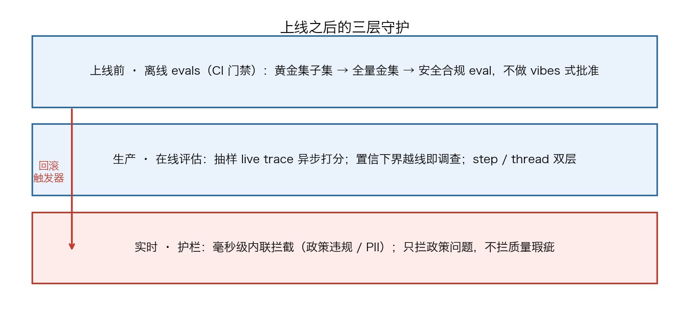

# Chapter 5 Don't Walk Away After Launch

## 71. Why do pre-launch evals and post-launch evaluation follow two different sets of logic?

Ask five people what "I want to add evaluations to my agent" means, and you will get five completely different answers: they changed the prompt and want to confirm nothing broke; they want to know whether the customer service agent is escalating to a human when it shouldn't; they want to detect when the agent doesn't know the answer; a domain expert tunes prompts in a UI and needs a way to verify those changes; they want to block jailbreak requests before they reach users. All of these needs are legitimate, and all of them are called "evaluation," but each corresponds to different workflows and tools.

Under this division of labor, experiments run the agent on datasets of test cases before deployment: verifying that a changed system prompt didn't break anything, validating an upgrade before adopting a vendor's new version, testing a domain expert's instruction edits before publishing, and quality gates in CI/CD that block prompt changes. Online evaluation continuously scores agent behavior in production after responses go out: tracking whether the customer service agent is solving problems or escalating to humans unnecessarily, detecting "I don't know" style answers to uncover documentation gaps, and measuring user satisfaction and frustration signals. Guardrails are evaluators that run synchronously and can block or modify a response before it reaches the user: blocking jailbreaks, preventing PII leaks, and keeping the agent from going off topic.

They also run differently: offline means batch-testing against datasets before deployment, under controlled conditions, comparing prompt and model variants; online means scoring production traffic on responses that have already been sent, facing real users and real edge cases, processed asynchronously so it doesn't slow the agent down.

Production monitoring of an agent has to watch two layers at once: step-level metrics catch problems like tool-call failures and retrieval-quality degradation that never surface in the final output; thread-level outcomes measure whether a complete conversation achieves the user's goal across multiple turns. Monitoring routes problem traces into a human review queue, domain experts supply the trajectory that should have been, and the corrected samples enter a regression test set — from then on, every change passes through it first, so the same failure never reaches users again.

## 72. Which signals can substitute for ground truth and hold up online evaluation?

When you evaluate production traffic, you usually can't get reference outputs for your production data, so you lean more heavily on reference-free evaluators, such as the more expensive reference-free evaluation of LLM-as-judge. This is the first crutch when there is no ground truth.

The second crutch is uncertainty signals that require no labels. AWS's open source example uses conformal prediction to turn a single LLM prediction into a calibrated prediction set, where the set size quantifies the uncertainty of each question: a set size of 1 is a confident prediction, returned directly to the user; greater than 1 is an uncertain prediction, routed to human review. The distribution of prediction set sizes is a label-free monitoring signal — if it drifts upward over time, model uncertainty is rising, which is a direct trigger to recalibrate or expand the scope of human review. In settings like financial services, ground truth labels arrive weeks or months after the prediction, so standard accuracy can't be computed in real time, yet this signal is available on every production request.

The demo numbers that repo reports: confident predictions achieve 91–94% accuracy, while uncertain predictions drop to 41–60%, which validates that routing uncertain predictions to humans is justified; inference latency is about 250ms per request. The repo also states that this is example code for demonstration and teaching purposes, not designed for production use.

User feedback is another signal channel: selecting traces by negative feedback is a common sampling method, but it misses problems users don't report; generic metrics, while not directly measuring quality, can serve as exploration signals to surface traces worth reviewing.

## 73. How do you define a sampling strategy for online evaluation — how much to sample, and by what?

First separate two things: CI evals prevent known regressions before deployment, while online monitoring finds failures in production traffic and estimates how often they occur. The way to evaluate production traffic is to sample live traces and run evaluators asynchronously.

What to look at after sampling: track confidence intervals for production metrics, and if the lower bound of the confidence interval crosses your threshold, investigate further.

What to sample by — five common methods, arranged from exploratory to targeted: random — select traces with equal probability; small batches will miss rare cases; clustering — group by content and sample from each group; results depend on feature and cluster selection; data analysis — look at extreme values like latency or tool-call counts; extremes aren't necessarily related to quality; classification — use an evaluator or another model to flag suspected failures; it biases toward the problems the classifier already knows how to find; feedback — select traces with negative user feedback; it misses problems users don't report. When starting out, prioritize exploring the data; the more you learn, the more you can lean on signals; keep some random traces in every batch so that failure modes your current signals can't describe have a chance to surface. To find rare failures, use targeted sampling: search for failure-related signals, such as specific tool sequences, unusually long traces, retries, or known input patterns.

Sampling must balance coverage against evaluation cost; dashboards present evaluation results aggregated over time, grouped by metadata such as model, input, and user segment; alerts fire when metrics deviate from baselines; automation routes anomalous traces into the human review queue.

## 74. How do you divide the work between evals and A/B testing — and who gets the final say?

OpenAI's position: for external deployments, evals do not replace traditional A/B testing and product experimentation; they complement traditional experimentation, and the two guide each other, letting you see how your changes affect real-world performance.

Evals can help you judge when a system is ready to launch, but they don't stop at launch: you should continuously measure the quality of real outputs generated from real inputs, and signals from end users (external or internal) are especially important and should be built directly into the eval.

On the A/B side, ByteDance treats it as a foundational tool: 1,500+ new experiments added per day, serving more than 400 business lines, over 700,000 cumulative runs, used for everything from product naming to interaction design to recommendation algorithms. ByteDance VP Yang Zhenyuan also lists its limitations: independence — when a ride-hailing service splits users into two groups, users in both groups may hail the same driver, so order volumes contaminate each other; confidence — in 100 random tests where 22 improve and 20 get worse, the P value is 0.75, and such an experiment says nothing at all about A being better than B; short term versus long term — penalizing poorly rated products makes transaction volume drop in the short term, and volume only improves when you stretch the window out to a month, while A/B tests usually don't run that long.

Douyin's name is the result of adding the two methods together: the test ranked second, but people felt it better matched intuition and better reflected the product's form, so it was ultimately chosen. Yang Zhenyuan's formulation: A/B testing isn't necessarily the best evaluation method and isn't omnipotent, but not knowing how to run A/B tests is definitely not okay; the testing process generates insight and corrects experiential bias, yet its conclusions need not be adopted wholesale — they need to be supplemented with other methods used together.

| Question | Who answers it |
| --- | --- |
| Did this change improve the eval metrics | Offline evals |
| How does the change perform with real users | A/B testing |
| Long-term effects (e.g., transaction volume only improves after a month) | Extend the A/B testing window, with evals supplementing short-term signals |
| Can the conclusions be fully trusted | Use both: evals carry experiential bias, and so does A/B testing; they need to complement each other |

## 75. How do you set thresholds for CI regression gates without stalling iteration?

First split evaluation into two layers: unit tests evaluate specific components — the retrieval step is evaluated separately on context precision and recall, and if tools are used, tool-selection accuracy is evaluated; regression tests are end-to-end evaluations run on a curated golden set, executed every time you change a prompt, swap a model, or adjust the agent architecture, to confirm overall performance hasn't degraded. Start the dataset at roughly 100 golden examples — every test run costs money and waits for an LLM to evaluate an LLM, so you can't test everything.

The gates come in three tiers: during development, run only a small subset of the evaluation suite in exchange for faster iteration; promotion to staging requires running the full evaluation suite on the complete golden set; before reaching production, safety or compliance evaluations are added on top of the regression suite. If any metric falls below threshold at any gate, the CI pipeline automatically blocks the change — no vibes-based approvals.

The threshold itself is defined as the acceptable score delta between the current production baseline and a candidate update: a prompt change that improves tone by 5% while dropping accuracy by 2% can pass within the configured thresholds, while a larger accuracy drop blocks the deployment.

In terms of tool behavior: set thresholds on evaluation metrics and let the pipeline fail automatically when scores drop — bringing the discipline of deterministic unit testing into the AI development workflow.

| Tier | What runs | What it blocks |
| --- | --- | --- |
| Local development | A subset of the ~100-example golden set | Obvious regressions |
| Promotion to staging | The full golden set | Promote only if thresholds are met |
| Pre-launch | Additional safety and compliance evals | Hard-block high-severity issues |
| Production | Continuous monitoring + rollback trigger | Roll back or alert when scores fall below threshold |



```
CI regression gate (structural sketch):
- Run the evaluation suite: unit tests at the component level + regression tests on the end-to-end golden set
- Threshold: a +5% tone gain can trade for an accuracy drop within -2% → pass
- A larger accuracy drop → block the deployment
- No vibes-based approvals
```

## 76. How do you decide between pinning model versions and chasing your vendor's latest?

First, lay out the dilemma: vendor-side model updates change behavior — the same judge prompt and the same evaluation set won't produce the same scores on model versions snapshotted on different dates. Pin the model and you accept obsolescence; let it float and you accept silent drift. Whichever side you choose, you need periodic calibration checks.

Teams that don't build evals have no choice in the matter: after one regression discovered first by a customer, engineers stop daring to change prompts, because they can't tell whether a change is a fix or a break; the agent freezes and stops improving out of fear. Vendors will update versions, and behavior that was validated last quarter quietly differs this quarter — this is exactly the layer AI debt adds on top of technical debt: it drifts.

The way to chase new releases when you have eval infrastructure: treat model and vendor changes as a configuration update that needs evaluating — when a vendor releases a new version, first let the evaluation suite assess its impact across all established quality dimensions, then decide whether to migrate; version-pin the datasets, prompt templates, model identifiers, judge configurations, and scoring rubrics, so that if a regression appears later you can rerun the very same evaluation that originally approved this change and determine what changed.

The safety net for chasing new releases is the rollback trigger: when production evaluation scores fall below threshold, an alert fires or a rollback happens automatically; when a vendor-pushed update changes output behavior, monitoring evals detect the quality drop, and the system is rolled back to the previous configuration or the team is notified to review.

## 77. Why does eval debt compound faster than technical debt?

Technical debt is the implicit cost of choosing the quick fix now and paying for it later. AI debt is the same bargain, except the subject becomes a probabilistic, non-deterministic system that changes as it is used. It takes several recognizable forms: cost debt — running every step on an expensive model and never looking back; eval debt — launching with no means of measuring whether the agent is right; prompt debt — fragile instructions becoming load-bearing walls nobody dares touch; integration and governance debt — an agent wired in with no audit trail and no clear boundaries; model-lock-in debt — betting the whole stack on one model in a market that ships a new model every few weeks. While the demo runs, none of these debts show up; afterward, all of them do, usually picking the worst possible moment.

Three reasons it compounds faster: it has no compiler — traditional code has types, tests, and builds that fail loudly; prompts by default have none of these, so destructive changes ship silently, looking fine until something breaks; it drifts — the underlying model changes, vendors update versions, and behavior validated last quarter quietly differs this quarter; it is non-deterministic — the same input can take different paths across two runs, and unreproducible bugs are not the exception but the norm.

The eval debt cell compounds like this: "We'll add evals later" — solutions teams hear customers say this every day, and it almost always means evals will never be added. Without evaluation, a regression can lurk unnoticed for 4–6 weeks, and the one who notices is usually a customer; after it happens once, engineers stop changing prompts, the agent freezes — the opposite of the original intent of building a self-improving system.

This debt is cheap to avoid and expensive to repay: a 20-example golden set that takes a single day to build would have caught that break on the spot; retrofitting evaluations onto an agent that has already frozen and grown brittle months later is a serious engineering project. In the debt table, the repayment plan for eval debt reads: build a 20-example golden set from day one.

## 78. Which online failures belong in the eval set, and which belong in fine-tuning data?

Triage goes by node type first: nodes where the LLM acts as a classifier (intent recognition, routing) watch decision correctness — accuracy, precision, recall, F1, plus rule-based checks; when a user mentions "bill" or "payment," the expected intent should be a billing issue, and a mismatch flags the conversation for human review and possibly updates few-shot examples and training data; nodes where the LLM acts as a writer are evaluated on quality, coherence, and brand-voice fit; nodes where the LLM acts as a code generator are validated with static analysis, linters, and test suites, and for text-to-SQL you actually execute the generated SQL to verify the output.

Label each validator's output and compute per-step accuracy, and you can track how error compounds along the pipeline. Then take the active learning approach: route low-scoring traces to human review and repair first — identify where the original output went wrong, rewrite it into a correct version, and record the change and the reasoning; the repaired trace is stored in a database, retrieved by similarity at runtime, and inserted into the prompt as a few-shot example.

The entry criterion for the fine-tuning side: tests the model struggles to pass — their failure modes are the kind of problems that techniques like fine-tuning can solve later; fine-tuning is best at learning grammar, style, and rules, while context and new facts are left to RAG.

99% of fine-tuning labor is assembling high-quality data that covers the product's surface area, and having a solid evaluation system is equivalent to having a data generation and curation engine: the exercise of building fine-tuning data for a home-search feature is nearly identical to building test cases — after generation, Level 1 and Level 2 tests filter out data whose assertions fail or that the evaluation model considers wrong, and off-the-shelf human evaluation tools are then used to go through traces and curate the fine-tuning set.

## 79. Which evals are must-pass gates before a version ships?

The first is the regression gate: evaluation scores serve as promotion criteria between environments; as changes move from development to staging to production, a prompt change whose accuracy on the golden set falls below the established threshold is automatically kept out of staging and production. Two layers of evaluation sit under the gate: unit tests evaluate specific components, and regression tests run end-to-end evaluations on a curated golden set, rerun every time a prompt is changed, a model is swapped, or the agent architecture is adjusted.

The promotion ladder is: during development, run a small subset of the evaluation suite in exchange for speed; promotion to staging runs the full evaluation suite on the complete golden set; before reaching production, safety or compliance evaluations are added on top of the regression suite; if any metric falls below threshold at any gate, the CI pipeline blocks it automatically — no vibes-based approvals.

Safety items are non-negotiable: prompt injection, toxicity, PII leaks, jailbreaks — if the agent isn't safe, nothing else matters. Functional items are task completion, tool-call accuracy, and factual correctness (hallucinations).

Clearing the gates isn't the end — keep records: every evaluation run, score update, and promotion decision is logged with a timestamp and the reviewer's identity; role-based access control governs who can change evaluation criteria, approve promotions, and override the regression gate.

## 80. When should you build evaluation scripts yourself, and when should you buy a platform?

Start with the seller's side of the market. An HN discussion on "why eval startups fail" offers a structural reason: eval startups struggle to find customers, because the customer would have to be a technical developer who wants to build via API, yet not technical enough to run evals themselves — and they would also have to not already be on a full observability suite, since adding eval features to an existing observability setup is fairly straightforward and keeping everything in one place is also cheaper (per the HN community discussion).

From the same discussion: "evals are glorified integration tests — would you invest in an integration testing startup? Absolutely not." And: no matter what tools you have, evals won't write themselves (per the HN community discussion).

The buyer's scale line: the thin layer of custom harness that many teams build on pytest or notebooks works surprisingly well for the first six months; the value of an off-the-shelf platform only kicks in once the eval set grows past about 500 examples and dataset management and comparison UIs start to hurt. One way to write the decision: start with Promptfoo or a homegrown harness, and migrate to something like Braintrust or LangSmith once you pass about 500 examples.

For example, a 50-year-old developer with a three-person team built the evaluation SaaS EvalsOne; when the project started, there were only a handful of evaluation frameworks on the market, but by the time the product entered public beta, comparable products were already numerous; a small team could not invest enough resources in market cultivation and education or in building a sales force, and lacked the real-world case studies needed to form a convincing solution; in the end, the Playground built as a side feature of the product outgrew the evaluation product itself in popularity and was spun out as the main business.

## 81. Why was AgentKit shut down just 8 months after launch?

On 2025-10-06, OpenAI released AgentKit, positioned as a complete toolkit for developers and enterprises to build, deploy, and optimize agents, targeting the pain that building agents previously meant juggling fragmented tools: complex orchestration without versioning, wiring up various connectors yourself, hand-building eval pipelines, tuning prompts, plus weeks of frontend work before launch. Components included: Agent Builder (a visual canvas for assembling multi-agent workflows, with preview runs, inline eval configuration, and full versioning), Connector Registry, and ChatKit, along with expanded Evals capabilities — datasets, trace grading, automatic prompt optimization, and third-party model support. Numbers customers gave at launch: Ramp said the visual canvas cut iteration cycles by 70%; LY Corporation built and ran its first multi-agent workflow in under two hours; Carlyle said the eval platform cut development time for its multi-agent due diligence framework by more than 50% and raised agent accuracy by 30%.

The update at the top of the page: as of 2026-06-03, OpenAI is winding down the Agent Builder and Evals products; from 2026-11-30 onward, they will no longer be available on the OpenAI platform; workflows that should continue in code are recommended to migrate to the Agents SDK, and scenarios better suited to natural language prompting are directed to Workspace Agents in ChatGPT (as of the 2026-09-18 snapshot).

The timeline on the platform documentation side matches: the Evals platform has entered its deprecation process, with existing content remaining available during the transition window; it becomes read-only for existing users on 2026-10-31, and the platform is scheduled to shut down on 2026-11-30 (as of the 2026-09-18 snapshot).

## 82. Why does a 95% success rate still mean 250 failures a day?

Pre-launch offline evals give you the confidence that "the system works on the examples you anticipated." Then real users show up: your reference examples didn't cover what users actually ask — you assumed they were asking about return policies and shipping times, but they ask "can I still return it if my dog chewed up the box," and they cram several things into a single message; users find the scenarios you missed — the refund flow works fine, but a partial refund on a bundled product stumps the model; user behavior drifts over time, and month-one questions are not month-six questions.

Then there is the scale layer. The worked example from the text: if you process 5,000 conversations a day at a 95% success rate, that is still 250 failures a day — you cannot manually review everything.

This is the gap between offline quality and online quality. Two lessons: no matter how hard you try, production will surprise you — it is nearly impossible to think through every situation in advance; and metrics need updating — pre-launch metrics may not cover every problem, so rely on online implicit and explicit signals: whether users show frustration, whether they hang up mid-conversation, whether they click thumbs-down. These signals help you sample bad experiences for repair, and when needed, build new metrics for the new dimensions.

How to monitor: since watching everything is impossible, sample smartly — flag conversations that look unusual: overly long interactions, repeated questions, user frustration signals, low confidence scores; these are the interactions worth human eyes. When review uncovers a new failure mode, turn it into a new measurement target and add examples to the reference dataset; fix, ship, keep monitoring, and the loop keeps turning.

## 83. Why does launching first and adding evals later almost always mean never adding them?

Technical debt is the implicit cost of choosing the quick fix now and paying for it later. AI debt is the same bargain, except the subject becomes a probabilistic, non-deterministic system that changes as it is used. "We'll add evals later" is one of those debts; solutions teams hear customers say it every day, and it almost always means evals will never be added.

This is how the debt compounds: without evaluation, a regression can lurk unnoticed for 4–6 weeks, and the one who notices is usually a customer. After this happens once, engineers stop daring to change prompts, because they can't tell whether a change is a fix or a break. The agent freezes and stops improving out of fear — the exact opposite of the point of building a self-improving system. And every prompt change made without daring to test it lets the debt keep compounding.

The uncomfortable part: this debt is cheap to avoid and expensive to repay. A 20-example golden set that takes a single day to build would have caught that break on the spot; retrofitting evaluations onto an agent that has already frozen and grown brittle months later is a serious engineering project.

In that debt table, the repayment plan for eval debt is written concretely: build a 20-example golden set from day one.

## 84. How do you use eval quality scores as a signal for canary releases?

After a change clears staging, route a portion of live traffic to the new version and score both the old and new versions with the same evaluation criteria. Canary releases no longer rely only on operational metrics like latency and error rates; they measure output quality directly on real user interactions: accuracy, tone, completeness, safety.

Keep the signal comparable end to end: offline evals validate the change before deployment, and production monitoring runs a subset of the same evals on live traffic — both sides share the scoring logic and thresholds, so the definition of quality stays consistent from development to production; the production side runs scoring at a configurable sampling rate, dashboards track quality metrics over time, and scores crossing a threshold trigger alerts.

The accompanying canary dataset: in the five-layer dataset model that most production teams converge on, one layer is dedicated to the canary set — a small set of about 20 examples, continuously sampled and monitored in production to detect drift; next to it sits the regression set, where every fixed bug becomes an entry, rerun on every change to keep old bugs from recurring; and at the bottom there is a layer of random production sampling plus periodic human review, serving as the ground truth source that all the other layers approximate.

## 85. How do you set a rollback trigger — how much quality drop before you act?

The trigger's definition: when production evaluation scores fall below threshold, fire an alert or execute an automatic rollback. The typical scenario is a vendor pushing an update that changes output behavior — monitoring evals detect the quality drop, and then either the system is rolled back to the previous configuration or the team is notified to review.

"How much of a drop" is answered by the regression threshold: it defines the acceptable score delta between the current production baseline and a candidate update. A reference magnitude: a prompt change that improves tone by 5% while dropping accuracy by 2% can pass within the configured thresholds, while a larger accuracy drop blocks the deployment.

For the trigger to act precisely, it relies on two pieces of supporting infrastructure. First, reproducible reruns: version-pin the datasets, prompt templates, model identifiers, judge configurations, and scoring rubrics, so when a regression appears you can rerun the very same evaluation that originally approved this change and determine what changed. Second, judge drift monitoring: compare automated scores against periodic human labels, and recalibrate when they diverge — without it, evaluation scores can slowly lose fidelity even when thresholds appear to be met.

One reference for magnitude: a customer service agent team switched to a newer model, and the first round of evaluation found tone had dropped from 0.85 to 0.72 — a clear regression; they adjusted the system prompt to compensate, and after rerunning, tone returned to 0.88 with accuracy unaffected, all in 20 minutes. Without evaluation infrastructure, the same tone regression might not have surfaced for two weeks, and then in the form of customer complaints.

```
Rollback trigger (structural sketch):
Monitoring evals continuously score production behavior
  → Quality falls below threshold: fire an alert, or automatically roll back to the previous configuration
  → Vendor pushes a behavior-changing update: evals detect the drop, roll back or notify the team to review
Calibration reminder: judges need periodic recalibration — without it, scores can slowly lose fidelity even when thresholds appear to be met
```

## 86. Why can't you measure quality even with observability in place?

Observability rests on three components: logs, traces, and metrics, providing fine-grained but developer-oriented technical performance insight — real-time monitoring of latency, throughput, error rates, and resource usage; drift detection for model outputs deviating from baselines; user usage analytics; and real-time alerts when the system misbehaves.

Evaluation is a different set of dimensions: quality assessment — hallucinations, factual accuracy, response relevance; safety analysis — scanning for vulnerabilities like prompt injection, hallucinations, and harmful content generation; bias detection — systematic unfairness across user groups or scenarios; compliance verification — whether outputs meet regulatory and ethical standards. Observability tools provide technical traces that help developers locate underperforming components, but they can obscure the layer of impact that is more qualitative and matters to end users.

The industry gap has numbers: per LangChain's annual report, 89% of teams have adopted observability, but only 52.4% run offline evals and only 37.3% do online evaluation.

The market is stitching the two layers back together: ClickHouse acquired the open source LLM observability platform Langfuse, whose CEO said "LLM observability and evaluation are fundamentally a data problem"; ClickHouse also extended its product into LLM observability, letting AI application builders evaluate the quality and behavior of AI outputs as they enter production. The Langfuse open source project had over 20K GitHub stars and 26M+ SDK installs per month as of the end of 2025 (as of the 2026-09-18 snapshot).

Where the two layers divide the work: first use comprehensive evaluation to establish baselines and find weaknesses, then continuous evaluation plus observability — evaluation holds the baseline so it doesn't break, and observability handles performance monitoring and rapid incident response.

## 87. Why is user feedback the strongest signal and yet the hardest to use?

Real user feedback (thumbs-up/thumbs-down) is the ultimate yardstick in production, but it is fairly noisy, and it is a lagging indicator.

It is hard to use for three reasons: it is extremely sparse — most people never bother to click that thumbs-up or thumbs-down at all; it is not a strong signal — what does a single thumbs-up or thumbs-down actually tell you?; it is costly — hiring human annotators takes money. The benefit is exactly one: it connects directly to end users.

Using it also requires guarding against blind spots: selecting traces by negative feedback is the most targeted of the five sampling methods, at the cost of missing problems users don't report — so keep random traces in every batch as a backstop; when random sampling turns up nothing, escalate to stress testing, crafting queries that deliberately stress the prompt's constraints to see whether the AI holds the line; more advanced high-efficiency sampling tactics include clustering, ranking by user feedback, and ranking by high-probability failure modes.

Work it into a rhythm: between the big analyses, review 10–20 traces per week, focusing on anomalies — unusually long conversations, sessions with multiple retries, traces flagged by automated monitoring; and always analyze when incidents occur, when user complaints surge, and when metrics drift. New systems get weekly analysis until failure patterns stabilize; mature systems can drop to monthly, ramping frequency back up when usage growth brings new edge cases.

## 88. How do you get eval infrastructure to produce fine-tuning data along the way?

99% of fine-tuning labor is assembling high-quality data that covers the product's surface area. With a solid evaluation system like Rechat's, you already have a robust data generation and curation engine — this is where eval infrastructure's second output comes from.

On the synthetic side: the exercise of building fine-tuning data for a home-search feature is nearly identical to the exercise of building test cases — have an LLM generate 50 ways a user might phrase a home search; after generation, filter with Level 1 and Level 2 tests, discarding anything whose assertions fail or that the evaluation model considers wrong; keep using off-the-shelf human evaluation tools to go through traces and curate the fine-tuning set. Critiques written by evaluator models can also be used to curate high-quality synthetic data. Rechat's approach also included making final outputs editable, so humans can correct formatting and content errors and the results are kept as fine-tuning data.

On the production side, review low-scoring outputs daily or weekly, with a three-step repair process: identify where the original output went wrong, rewrite it into a correct version, and record the change and the reasoning for the rest of the team to learn from.

These traces, carrying scores and human repairs, are stored in a database, with low scorers prioritized for human review and repair; at application runtime, the most similar "repaired" traces are retrieved for the current query and inserted into the prompt as few-shot examples — retrieval strategies worth trying: fetching both the most similar traces and the most similar repaired traces, weighting by recency, and adding diversity constraints to guarantee coverage across example types.
