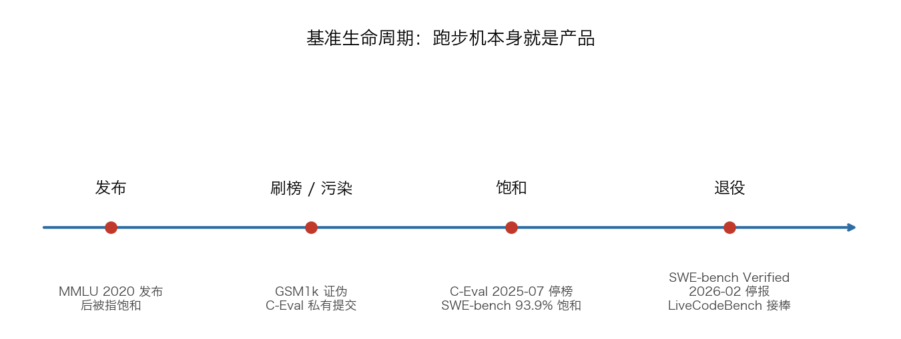

# Chapter 6 Leaderboards, Moats, and the New Job on the Block

## 89. Why is the credibility of model leaderboards collapsing?

The paper *The Leaderboard Illusion*, signed by authors from Cohere Labs, AI2, Princeton, Stanford, the University of Waterloo, and the University of Washington, spends 68 pages dissecting how Chatbot Arena operates. The problems listed in its abstract: undisclosed private-testing practices let a handful of providers test multiple variants before public release and retract scores on demand; these providers' ability to cherry-pick their best results biases Arena scores through selective disclosure; for example, Meta tested 27 private LLM variants during the run-up to the Llama-4 release. On data share, Google and OpenAI are estimated to have received 19.2% and 20.4% of all Arena data respectively, while 83 open-weight models combined received only about 29.7%; the paper also cites that "205 of the 243 publicly available models were silently deprecated." The estimated payoff: even a limited increase in data can deliver up to a 112% relative performance gain within the Arena distribution (the paper's conservative estimate). Earlier, the Llama 4 model that topped the leaderboard was revealed not to be the publicly released version, and Arena issued a quasi-apology over it.

The Arena team responded point by point: official statistics show Open Models account for 40.9%, and the paper's 8.8% calculation misses open-weight models (such as Llama and Gemma); pre-release testing barely moves scores — analysis shows roughly +11 Elo after 50 tests and 3,000 votes, trending toward zero as fresh evaluation data accumulates; as for the 112%, that experiment was run on "Arena-Hard," a static benchmark with 500 data points that uses an LLM judge and no human annotation, and it cannot represent Chatbot Arena.

Arena also laid out its own policies: the policy is designed precisely to prevent providers from reporting only the highest score they obtained during testing, and the platform publishes only results for publicly released models; any provider may submit as many public or private variants as it likes, so long as there is capacity; large labs naturally submit more models because they develop more models, but everyone has access — Arena also helped Cohere evaluate 9 pre-release models, two to three times as many as xAI/OpenAI.

Simon Willison called the response disappointing because it skipped the paper's most crucial point: if commercial providers can submit dozens of models, quietly retract the rest, and release only the top scorer, the leaderboard is actively incentivizing gaming. What he wants is transparency: a footnote next to the top-ranked model stating how many variants that provider tested and what the unreleased ones scored.

## 90. Why is a 2-point gap on the leaderboard usually just luck?

Anthropic published a paper to address a question that is "surprisingly understudied": when one model beats another on a benchmark, is the gap a real difference in capability, or just a lucky draw of this particular batch of questions? The paper argues that what you actually care about is not the observed average score but the theoretical mean across the entire population of questions, and it recommends reporting the standard error of the mean (SEM), derived from the central limit theorem, alongside every eval score; a 95% confidence interval equals the score plus or minus 1.96 × SEM. Eval scores mean nothing on their own; they mean something only in comparison with one another.

In many evals the questions are not drawn independently but come in clusters around the same piece of text, and naively applying the central limit theorem understates the standard error. The practical numbers the paper gives: on popular evals, clustered standard errors can run more than three times the naive ones; ignoring question clustering can lead researchers to falsely report a difference in model capability that does not exist. When comparing two models, because the question list is shared, a paired-difference test cancels out the variance from question difficulty; frontier models' per-question scores on popular evals correlate between 0.3 and 0.7 — on the whole they tend to get the same questions right and the same questions wrong. The paper also recommends using power analysis to work backward to the question count: first write down the hypothesis (say, model A beats model B by 3 percentage points), then compute how many questions the eval needs to test it.

Anthropic's engineering team then pushed the question down to the infrastructure layer: in agentic coding evals, resource configuration alone can swing the scores. On Terminal-Bench 2.0, the most generous and the most constrained configurations differ by 6 percentage points (p < 0.01); on SWE-bench, raising RAM to 5x the baseline and running 10 samples on each of 227 tasks, scores rose monotonically with RAM, with 5x beating 1x by 1.54 percentage points. At the two extremes of resource allocation, the gap reaches 6 percentage points.

Their conclusion: until eval configurations are disclosed and aligned, any gap under 3 percentage points on a leaderboard deserves suspicion — the naive binomial confidence interval is itself 1–2 percentage points wide, and the infrastructure confounders they documented stack on top of it rather than being contained within it. The paper's closing line: a lead of a few points may signal a real capability gap, or it may just be a bigger virtual machine.

## 91. Who declares a benchmark dead, and how is the funeral handled?

On February 23, 2026, OpenAI published a post announcing it would no longer report SWE-bench Verified scores. They audited the 138 tasks that OpenAI o3 failed to solve consistently across 64 independent runs — 27.6% of the dataset — with each task independently reviewed by at least six experienced software engineers. The result: at least 59.4% of the test cases in these 138 audited tasks were flawed in ways that would falsely fail functionally correct submissions; 35.5% of them were overly narrow tests that force particular implementation details; 18.8% were overly broad tests that check for extra functionality not described in the task statement; and the remaining 5.1% were miscellaneous issues.

The second problem is training data contamination. SWE-bench's tasks are drawn from open-source repositories, and every frontier model OpenAI tested could reproduce the original human fix that serves as the gold patch, or recite verbatim some tasks' problem-statement details, indicating that they had all seen at least some of the questions and answers in training; there is also evidence that models that saw the tasks during training pass those under-specified tests more easily. The article's concluding sentence: improvements on SWE-bench Verified increasingly reflect how much a model was exposed to the benchmark during training rather than genuine improvement in real-world software development ability; until a new evaluation is built, OpenAI recommends reporting SWE-bench Pro.

Earlier independent research pointed in the same direction: one diagnostic experiment showed that when SOTA models are given only the issue description, with no repository structure, their accuracy at identifying the file paths of bugs reaches at most 76% on SWE-bench but only 53% on repository tasks not in SWE-bench, pointing to possible contamination or memorization. LiveCodeBench's approach is to continuously collect new problems from three competitive programming platforms — LeetCode, AtCoder, and CodeForces — to maintain a contamination-free evaluation.

The other side of the funeral was filled in by the community: in an HN discussion, someone likened the script to old history in the benchmarking industry — the CPU performance benchmarks SPECint and SPECfp went through exactly the same cycle: benchmark, saturation, retirement, replacement, repeat; the treadmill itself is the product. A co-author of SWE-bench replied in the same thread: SWE-bench Verified is already 93.9% saturated, all benchmarks and benchmark paradigms eventually saturate, and that is exactly why the team keeps shipping the next generation of benchmarks.

## 92. How do you spot a benchmark's conflict of interest?

Epoch AI, the organization behind FrontierMath, issued a clarification on January 23, 2025. The fact sheet: OpenAI commissioned Epoch AI to create 300 advanced mathematics problems for FrontierMath, which form the core of the benchmark; as is customary for commissioned work, these problems belong to OpenAI, and OpenAI can access the questions and answers, the sole exception being a holdout set.

The remaining items in the clarification: Epoch AI is free to use the problems to evaluate any model and publish the results, but it may not share the questions and answers with other parties without OpenAI's written permission; the team is finalizing a 50-problem set that OpenAI will receive only as problem statements, without the answers, to be used for independently testing OpenAI's and other models — the problems still belong to OpenAI; Epoch AI just has no access to the solutions. The clarification also acknowledged: the agreement did not forbid disclosing to problem writers that "this work is sponsored by an AI company," yet many of the problem writers did not know, and communication should have been more systematic and more transparent; under the agreement, publicly disclosing OpenAI's involvement required obtaining OpenAI's permission first, and the team obtained that permission before o3's release and announced the partnership, but at the time did not explain the data access and ownership arrangements.

The same page states: OpenAI has continued to commission Epoch AI to extend FrontierMath to mathematics problems of even higher difficulty; going forward it will ensure that all problem writers can see the information about industry sponsorship and data access agreements before they take part, and it will proactively publish the benchmark's sponsorship and data access agreements.

On the Chinese leaderboard side there is a different structure: since its release in 2023, C-Eval has kept its test set confidential to avoid leakage — users had to upload their prediction results to obtain test scores; an update on July 26, 2025 announced that the leaderboard would stop being maintained and the test set would be made public, downloadable and usable directly on Huggingface. The two leaderboards kept on the page are split into "publicly accessible models" and "restricted-access models": in the public column GPT-4 averages 68.7, while in the restricted column Hisense Xinghai averages 92.3 — the scores of these private submissions cannot be verified by third parties, and the page only notes that starred results were tested by the C-Eval team, while the rest are computed from model predictions submitted by users.

## 93. Should evals be treated as a moat, or as a scam?

The case for: Garry Tan of Y Combinator said on a podcast that the models themselves are not the moat — evals are the moat; a good prompt engineer will have better golden evals. He also relayed Sam Altman's advice to founders: count on the models getting better — an advantage that survives this year may not survive next year.

The case against: the author of "Evals Are a Scam" says he raised VC money selling evals: the evals discourse is wrong and distracting, most AI products don't need evals, and vendors selling evals are not actually selling evals. His distinction: foundation model evals are not the same as product evals — unless you work at OpenAI, Anthropic, or Meta, you don't need model evals; product evals are extremely subjective and extremely specific to your market segment, and what vendors want to sell is the one thing they can never provide: expert judgment about your own product. The AI voice company he quotes takes the stance of buying evals from no one; evals are too central to their product experience to be outsourced to a vendor. His closing: the best evals are always built yourself, what vendors sell is dashboard theater, and taste cannot be outsourced; what these companies are really selling is logging, and observability eats roughly 10–30% of cloud spend.

The middle ground and the boundary-setters each have their say: a piece on O'Reilly Radar is titled "Evals Are Not All You Need"; its authors have started to genuinely hate the word — it creates more confusion than clarity, evals matter only in the context of product quality, and product quality is a process. Why eval startups are rare has its own dedicated analysis: people who know how to do evals earn more and have more direct impact in post-training and application development, so the talent drains away; the intersection of the two circles — "building on model APIs" and "unable to evaluate their own models" — has negligible area; and with Goodhart pressure hanging over the big labs, safety evals are the sole exception.

Chinese business contexts offer varying takes on the moat: an industry interview says the real moat is a structured, reusable body of know-how — models will keep eating away at general capabilities, while experience, rules, and tacit knowledge deeply bound to the business keep accumulating; a translated article's screening criterion is whether something is "hard to do" or "hard to get," with the latter satisfied by continuously accumulating proprietary data, network effects, regulatory licenses, large-scale capital, and physical infrastructure; and a report from an investor's perspective: anything you can put on a leaderboard is something you can train against — whatever is measurable is already on its way to commoditization, and value slides toward the few places models cannot reach.

## 94. How should you read Chinese LLM leaderboards without falling into the traps?

C-Eval's leaderboard update announcement of July 26, 2025: since its release in 2023, the team has kept the test set confidential to avoid leakage, and users needed to upload prediction results to obtain test scores; it has now decided to stop maintaining the leaderboard and to make the test set public, downloadable and usable directly on Huggingface, and the leaderboard section will also be removed from the website in the future. The two leaderboards kept on the page are split into "publicly accessible models" and "restricted-access models": in the public column GPT-4 averages 68.7, in the restricted column Hisense Xinghai averages 92.3 — private submission scores cannot be independently verified.

SuperCLUE's official site states its Intelligence Index ranking rules, quoted verbatim: to reduce score fluctuation, models whose scores differ by less than 1 point are treated as tied in the ranking; international models and some domestic models do not participate in the ranking and are shown for reference only. The evaluation covers 507 tasks across six dimensions: Agentic Coding (95), mathematical reasoning (57), scientific reasoning (57), precise instruction following (105), hallucination control (88), and Agentic task planning (105).

A report titled "Can You Trust LLM Leaderboards?" likens offline testing to the gaokao and online Arenas to talent shows, and lists three categories of leaderboard distortion: score inflation — GSM8K was still an important yardstick of reasoning ability two or three years ago, but now almost every mainstream model scores high on it, and top models' MMLU accuracy long ago broke 90% and is tending toward saturation; benchmark gaming has become an industry open secret — training on the original questions or close adaptations, or breaking down the test points and synthesizing similar data to "grind through mock exams"; and questions disconnected from real usage scenarios — high scores do not mean the model can actually do the job. The interviewees Li Yan and Chen Chu in the article are pseudonyms; the report also mentions that SuperCLUE's May 2023 leaderboard ranked iFlytek Spark fourth, and netizens later discovered that the number-one advisor on its official website was a researcher from the HIT-iFlytek Joint Laboratory, casting doubt on the objectivity of the leaderboard's results.

Zhu Lei, co-founder of SuperCLUE, has described to the media the dilemma of evaluation: open questions face the possibility of test-takers training on them in advance to game their way up the leaderboard, while closed questions invite accusations of black-box operations and even pay-to-rank schemes; SuperCLUE chose the closed route — "We haven't yet found a compromise, so we decided to 'keep things confidential' for now: if LLM vendors don't know what questions I've written, it's naturally hard to game the scores"; the evaluation is updated and iterated monthly in the form of a "monthly exam," and it may consider releasing the questions after results are published, so outsiders can reproduce the results from them.

## 95. Should you write the eval before you start building the feature?

A widely circulated evals FAQ answers the question "should you practice eval-driven development (EDD)" with: Generally no. The reasoning: in traditional software the failure modes are predictable, whereas LLMs have an unboundedly large potential failure surface — you cannot foresee what will break. The better path is to start from error analysis: write evaluators for the errors you discover, not for the errors you imagine — this keeps you from getting stuck on "what to evaluate" and from spending effort on metrics that have no impact on system quality. Before implementing any eval, do a cost-benefit analysis and ask whether this failure mode deserves the investment; error analysis reveals which failures actually matter to users.

The same FAQ leaves an exception: when you know exactly what success looks like and you face a specific constraint, EDD may be feasible — for example, to add the constraint "never mention competitors," writing that evaluator up front might be acceptable.

Anthropic's guide to evaluating agents gives the opposite recommendation: we recommend practicing eval-driven development — before the agent can do it, build evals that define the planned capability, then iterate until the agent performs well. Capabilities the team builds internally may be "good enough" today, but they are a bet on model capabilities months from now; capability evals with low initial pass rates make those bets visible, and when a new model ships, running the suite shows which bets paid off. An eval suite also eliminates specification ambiguity: two engineers reading the same initial spec may arrive at different understandings of how edge cases should be handled.

The platform side describes EDD as a set of release discipline: evals as specification — the eval suite defines what the application should do, and changes in product requirements flow into the evaluation criteria first; regression gates — changes that fall below threshold are automatically blocked from staging and production, no vibes-based approvals; and canary deployments scored by evals, not just latency and error rates. The framework side has its own starter recipe: assemble roughly 100 goldens, define 3–5 metrics correlated with agent performance, and iterate until all metrics pass; it also warns that using EDD exactly like TDD will burn through your API budget and teach you the wrong lessons.

## 96. How should you interpret the big labs' contradictory moves on evals?

On November 19, 2025, OpenAI published an evals primer aimed at business leaders: evals turn vague goals and abstract ideas into something concrete and explicit, like a product requirements document; models are their product, researchers use rigorous frontier evals, and internal teams have also built dozens of context evals to evaluate specific products and workflows. The piece's landing point: in a world where information flows freely and expertise is democratized, your advantage depends on whether your system can execute in your context; robust evals deliver compounding advantage and institutional know-how.

The product line has its own timeline: AgentKit launched on October 6, 2025, describing itself as a complete toolkit for building, deploying, and optimizing agents, with evaluation capabilities adding datasets, trace grading, automatic prompt optimization, and third-party model support, and citing feedback from Carlyle — the evals platform cut the development time of a multi-agent due diligence framework by more than half and raised agent accuracy by 30%. The top of the launch page carries an update dated June 3, 2026: OpenAI is sunsetting the Agent Builder and Evals products, which will no longer be available starting November 30, 2026; workflows best continued in code should move to the Agents SDK, and scenarios suited to natural language prompts should move to ChatGPT's Workspace Agents. The developer documentation states in step: the Evals platform is deprecated, read-only for existing users starting October 31, 2026, with the platform scheduled to shut down on November 30, 2026.

Another set of moves in the same period was M&A: Braintrust announced an $80M Series B in February 2026, positioning itself as "the observability layer for production AI," with a customer list including Notion, Replit, Cloudflare, Ramp, and Dropbox; ClickHouse announced a $400M Series D in January 2026 and acquired the open-source LLM observability platform Langfuse, whose CEO said LLM observability and evaluation are "fundamentally a data problem"; CoreWeave completed its acquisition of Weights & Biases in May 2025, saying the unified platform would extend efficiency and performance gains from compute and model training to the evaluation and monitoring of AI agents and applications.

## 97. Should you set up a dedicated evals team, and how should it be staffed?

Anthropic's organizational conclusion in its long-term maintenance section: having tried every way of maintaining evals, they found the most effective approach is to set up a dedicated evals team responsible for the core infrastructure, while domain experts and product teams contribute most of the eval tasks and run the evaluations themselves. For AI product teams, owning and iterating on evals should become routine, like maintaining unit tests; defining eval tasks is one of the best ways to test whether product requirements are concrete enough to start building. The people closest to the product requirements and the users are best positioned to define success — product managers, customer success managers, and even sales can contribute eval tasks as PRs using Claude Code; let them do it, or better yet, proactively hand them the tools and permissions.

After open-sourcing Inspect, the UK AI Security Institute (AISI) published an Engineering Playbook that breaks evaluation infrastructure into five layers: Evaluate, the evaluation framework, making evals reproducible, comparable across providers, and capable of carrying agentic tasks; Isolate, how evaluations run safely, matching the isolation level to the risk of the work; Connect, sitting between researchers and the model providers they call, giving organizations auditability and cost control without slowing research; Run, the platform where researchers work — machines, data, compute, and a path to deployed applications; and Scale, bringing supercomputer-grade inference within reach, for hosting and studying the largest open-weight models. Users can start from any layer, and together the five layers form a complete platform for building and running evaluations; organizations can treat the five layers as a reference architecture — building their own AISI.

A 2026 hiring guide splits the evals engineer into at least four types: the research eval engineer, inventing new ways to measure capability and safety, usually resident in lab safety organizations; the platform eval engineer, building the distributed infrastructure that reliably runs thousands of evaluations during training, with on-call duty; the product/applied eval engineer, making sure shipped LLM features actually work, the most common type outside the labs; and the safety and red-team eval engineer, probing for adversarial and harmful behavior. The guide cites OpenAI's job family as evidence — Post-Training Evals Research Engineer, Frontier Evals and Environments Research Engineer, Evals API Engineering Manager, Evals Backend Software Engineer; and it relays that Anthropic's "Research Engineer, Model Evaluations" role carries a salary range of $500k–$850k, and that 39.6% of AI-first roles already list evaluation-related skills as a requirement.

| Team | Setup |
| --- | --- |
| Frontier labs | A dedicated evals team owns the core infrastructure; domain experts and product teams submit eval tasks as PRs and run the evaluations themselves |
| Evaluation infrastructure organizations | Build along AISI's five layers: Evaluate (framework) / Isolate (sandboxing) / Connect (audit and cost) / Run (execution) / Scale (scaling up) |
| Small and mid-sized teams | Start from the minimum viable eval: spend 30 minutes reviewing 20–50 outputs on every significant change, with one domain expert as the final arbiter |

## 98. How do you map out the eval engineer's skill tree and growth path?

A thread on X lays out the craft's key points: evals tell you what broke, systematic error analysis tells you why it broke and what to fix next; writing tests is easy — figuring out what a failure actually means is where eval engineering starts to get interesting; being able to diagnose why an eval failed is what turns reliability engineering into a real engineering discipline; model migration is the moment evals stop living on paper — per-case diffs and variance baselines tell you what is actually broken, not just that the aggregate score moved; scores without uncertainty manufacture false confidence, and error bars should be standard equipment on any eval dashboard; production failures are essentially free test cases, and the best reliability loop is failure → regression test → CI → repeat. He says himself that he has built some of these but never carried all 12 stages through end to end — the deeper you dig, the more there is to learn.

The 2026 hiring guide lists eval design among its ten must-have skills, quoting The AI Career Lab: eval literacy — knowing how to design, run, and reason about model evaluations — is the single strongest signal separating "this person has actually built something with LLMs" from "they only watch YouTube videos"; it recommends asking candidates at every level to walk through one evaluation they designed: what the metrics were, what the dataset was, how it stayed fresh, and what it caught.

The hiring guide's interview filters: the first probe asks candidates to describe the last time they read their own model's outputs — how many they read and how they categorized them; strong candidates can report a failure taxonomy and stopping heuristics, weak ones only talk about aggregate dashboards. The second discriminator is LLM-as-judge calibration reasoning. Statistical literacy is a hard gate — A scores 71% on 200 questions and B scores 69%; asked whether A is better, the rigorous answer is to compute the paired standard error and ask about the eval's size and power, not to declare a winner.

Textbooks and courses have taken shape: Chip Huyen's *AI Engineering* (O'Reilly, 2025) covers the end-to-end process of adapting foundation models to real problems — its list of questions includes "how should I evaluate my application, and can AI evaluate AI outputs" — and has been translated into more than 13 languages; Hamel Husain and Shreya Shankar's *Evals for AI Engineers* is scheduled by O'Reilly for publication in October 2026, 236 pages, covering error analysis, automated LLM-as-a-judge, production monitoring, and data flywheels; the two authors' Maven course, *AI Evals For Engineers & PMs*, is priced at $4,200 and rated 4.7 (901 ratings), with materials refined alongside more than 5,000 engineers and PMs from teams including OpenAI, Google, Meta, Amazon, and Microsoft, comprising 15 live sessions and a course reader of over 200 pages.

## 99. How do you lay out a 30-day plan for a team's evaluation system starting from zero?

The minimum viable eval starting point: begin with error analysis, not infrastructure — spend 30 minutes manually reviewing 20–50 LLM outputs every time you make a major change; use a domain expert who understands your users as the quality arbiter, the so-called "benevolent dictator." You can use a notebook to review traces and analyze data, or build your own labeling interface with AI coding assistants like Claude or Codex.

The first half of Anthropic's zero-to-one roadmap: Step 0, start early — 20–50 simple tasks drawn from real failures are a great starting point; early on, the effect of every change is obvious, so small samples suffice; the longer you put off building evals, the harder they are to build, early product requirements convert naturally into test cases, and waiting too long means reverse-engineering success criteria from a living system. Step 1, start from what you are already testing manually — dig through bug trackers and support queues, turn the failures users have reported into test cases, and prioritize by user impact. Step 2, write unambiguous tasks with reference solutions — the standard for a good task is that two domain experts, working independently, reach the same pass/fail verdict; a frontier model at 0% pass^100 usually means the task is broken, not the model. Step 3, build a balanced question set — test both scenarios where the behavior should happen and scenarios where it should not; one-sided evaluation produces one-sided optimization.

The second half: Step 4, build an eval harness with a stable environment, and start every trial from a clean environment — Anthropic observed that Claude once gained an edge in some internal evals by inspecting git history left over from a previous trial. Step 5, design graders carefully: use deterministic graders where you can be certain; grade the output, not the path; give partial credit on multi-component tasks; and leave LLM judges an "Unknown" exit. Step 6, read transcripts: failures should look fair; until someone has dug into the eval's details and read the transcripts, treat no eval score as fact. Step 7, monitor capability eval saturation: an eval at 100% can only track regressions and no longer gives a signal for improvement. Step 8, keep the suite healthy with open contributions and long-term maintenance.

A weekly rhythm can run off a reference schedule: Monday, go through production transcripts and flag 20 problematic AI outputs; Tuesday, pick out the 5 most typical and add them to the dataset; Wednesday, run the updated eval on the current setup and on a candidate improvement, and compare; Thursday, read the results and decide whether to ship — which dimensions went up, which regressed; Friday, the flywheel has turned one more revolution.

## 100. How do you turn evaluation assets into a barrier no one can copy?

Garry Tan of Y Combinator offers this judgment: evals are an AI startup's real moat, arising from hard-won insight about your customers that competitors cannot simply buy.

OpenAI's primer for business leaders writes the accumulable path as a flywheel: log inputs, outputs, and outcomes; sample the logs on a schedule, automatically routing ambiguous or high-cost cases to experts for review; fold the expert judgments into evals and error analysis, then use them to update prompts, tools, or models. Deploying this process at scale produces a large, differentiated dataset tightly fitted to your specific context, and it is very hard to replicate — an asset the organization can draw on while building the best product or process on the market. The same piece adds two lines: the reason evals are hard is the same reason building great products is hard — they require rigor, vision, and taste, and done well, evals become differentiation nobody else has; if your system cannot define what "great" means for your use case, you will most likely never reach it.

A dedicated piece puts the compounding and non-replicability of these assets like this: the first eval is just a test; the hundredth is an asset. A suite grows through error analysis: every production failure you catch becomes a new check the next change must pass, so the same mistake can never ship twice. The deeper reason is the criteria drift documented by researchers at UC Berkeley: people do not fully know what they want until they have scored system outputs with their own hands, and the act of scoring itself changes the criteria — the team behind EvalGen watched users start from a rough rubric, look at real outputs, and revise the definition of "good" on the spot. So a good eval suite cannot be written once and frozen; it is a living record of judgment that gets sharper the more it is used. A team entering today can get your model, but not these accumulated judgments: to replicate them, it would have to reproduce every failure you have seen and rerun every argument your experts had while scoring. Models reset to zero at every release; judgment does not.
