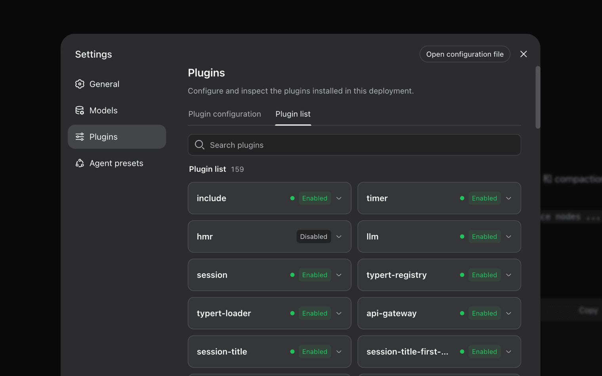

# Chapter 3 - Open the Case and Find Plugins

Once DSH runs, look inside. Its slogan is "Everything is a plugin": models, tools, sandboxes, sessions, and even the interface are assembled as plugins. Under the slogan are three concrete ideas: a plugin runtime, layered composition, and shipped presets.

## 29. What does "everything is a plugin" actually mean?

It means there is no privileged core. In DSH, the model, tools, session, sandbox, storage, loop, and UI can all be replaced or extended beside the existing component. You do not have to edit the original implementation to add behavior.

The important part is reversibility. Registrations are side effects that are undone when the plugin unloads. Install, test, remove, and return to the previous state. That is not a convenience feature; it is the engineering discipline that makes a composable runtime usable.

Even the agent loop is described as a default driver implementing an interface. The interface stays stable while the implementation can change. That is why people debate whether DSH is an unfinished house or an empty plot: it is a rough experience if you want a finished product, but valuable if you want to build the house yourself.

1) Official architecture documentation https://github.com/deepseek-ai/deepseek-harness/blob/master/docs/architecture.md

2) Official product page https://deepseek.com/harness/en/

## 30. How does Cordis keep so many plugins under control?

Cordis is the plugin manager and meta-framework. Each plugin contributes services, typed events, and reversible side effects to a shared context. Cordis resolves dependencies and load order.

The five concepts are worth remembering: a plugin implements a service; a context is the service container; `inject` declares dependencies; typed events provide communication through `emit`, `waterfall`, `parallel`, and `serial`; and every registration is reversible. Use events for interception and policy, and service methods for direct capability calls.

The design comes from work on spatiotemporal composability: plugins should work together in one runtime and still be able to leave cleanly. The official primer is a better starting point than trying to infer the model from a failing plugin.

1) Cordis primer https://github.com/deepseek-ai/deepseek-harness/blob/master/docs/cordis-primer.md

2) Cordis paper repository https://github.com/cordiverse/paper

## 31. What does the DSH architecture look like?

One dsh run is a plugin tree assembled in layers. Remember three building blocks: `profile`, `bundle`, and `patch`.

A profile is a named recipe stored in the Harness home. A bundle is a prebuilt package of components and configuration: `dsh-base` supplies core infrastructure, `dsh-web-app` adds the browser UI, and `dsh-headless` adds a one-shot runner. A patch changes a selected configuration entry by ID or inserts a new one.

To inspect the actual tree on your machine, run `dsh --profile web --dump-config`. The final configuration is visible, and every printed entry is intended to be replaceable by your own patch. Visibility plus replaceability is the practical meaning of an open runtime.

1) Official architecture documentation https://github.com/deepseek-ai/deepseek-harness/blob/master/docs/architecture.md

## 32. Are the four modes built from the same code?

Yes. They are four pruned views of the same plugin tree: profiles layer different bundles and patches.

Standard is the full preset. Code exposes tools through an SDK. Minimal removes everything except two tools. Creator adds runtime inspection and preset-building support. This is configuration composition, not four unrelated cores.

The architecture document describes Web and headless as shipped templates rather than treating "four modes" as a core architectural concept. That means you can build a fifth mode of your own. A profile also records externally installed plugins, so configuration can become a portable asset rather than a list of one-off clicks.

Ask which capabilities the task needs, not which preset is universally best.

1) Official architecture documentation https://github.com/deepseek-ai/deepseek-harness/blob/master/docs/architecture.md

## 33. What is the difference between Standard and Code mode?

Standard calls tools one step at a time: call a tool, inspect the result, then choose the next call. Code mode asks the model to generate a TypeScript program that orchestrates multiple tool calls and runs them together.

That can reduce round trips and token overhead, make the plan easier to audit as code, and make sequencing, conditions, and loops explicit. The community label PTC is not the official product name; use Code when referring to the DSH mode.

Take a recent task that needed many turns and run it again in Code mode. Compare turns, tokens, and failure modes instead of relying on the label.

1) Official mode overview https://deepseek.com/harness/en/

## 34. Who is Creator mode for?

Creator is for people building tools, changing runtime behavior, or creating custom agent presets. It provides runtime inspection, an in-memory plugin workbench, and guidance for turning an experiment into a preset.

The architecture documentation maps common changes to extension points: model providers register through `ctx.llm`, user commands through `ctx.commands`, and session branching has an API. Read that map before inventing a new integration point.

Most users should arrive at Creator gradually: use Standard, identify a repeated need, try profile configuration, and write a plugin only when configuration is no longer enough.

1) Official product page https://deepseek.com/harness/en/

## 35. Where do plugins come from?

There are three useful entry points: the community `awesome-deepseek-harness` list, the dshplugin.online directory, and GitHub's `dsh-plugin` topic. The ecosystem is growing quickly, but the counts vary by date and by whether a list includes every tagged repository or only reviewed entries.

Start with one plugin for one current problem. Install it, run the known-file test, keep it if it works, and remove it if it does not. A large list is a discovery tool, not a quality guarantee.

1) awesome-deepseek-harness https://github.com/0xsline/awesome-deepseek-harness

2) dsh-plugin topic https://github.com/topics/dsh-plugin

## 36. Is installing a plugin as easy as installing an app?

Not yet. You may need to declare dependencies, edit YAML, understand which services it mounts, and restart the runtime. The practical shortcut is to start from a preset rather than a raw plugin. A preset is a tested combination with someone else's configuration work already done.

If you are unfamiliar with Cordis, use Creator to inspect the runtime and temporarily load a plugin before committing it to a profile. Seeing where a plugin sits in the tree is faster than installing first and guessing afterward.

Change one variable at a time. Install one plugin, run one test, and only then add the next. That rule saves more debugging time than any clever configuration trick.

1) Community FAQ https://www.aixq.cc/62316.html

2) GitHub Discussions https://github.com/deepseek-ai/deepseek-harness/discussions

## 37. Can the plugin ecosystem be over-designed?

Yes. Community discussions already raise governance, npm supply-chain security, and the absence of a centralized review directory. Until that governance exists, the user is the gatekeeper.

Before installing a third-party plugin, ask three questions: Is the source public and the author identifiable? What permissions and directories does it need? Has anyone maintained it and answered issues recently? One unanswered question is enough to stop.

```text
# Three questions before installing a plugin
1. Source      Is there a public repository? Who maintains it?
2. Permissions What can it access, and what does the sandbox permit?
3. Maintenance Were there commits and issue responses in the last 30 days?
```

1) Plugin governance discussion https://github.com/deepseek-ai/deepseek-harness/discussions/670

## 38. What if my plugin conflicts with the official configuration?

DSH configuration is layered. Later patches override earlier ones, and a patch either replaces a matching ID or inserts a new entry. The effective order is:

| Layer | Meaning |
|---|---|
| Bundles | Bundles listed by the profile, in order |
| Profile patch | The profile's `cordis.patch.yml` |
| Home patch | Harness-home configuration |
| CLI overlay | Temporary `--patch`, with the highest priority |

Most "conflicts" are therefore precedence questions. Run `dump-config` and inspect the effective result instead of guessing. The generated configuration catalog is another useful reference because it is built from source and checked against runtime schemas. Its `Requires` entries show which services a plugin expects.

1) Official architecture documentation https://github.com/deepseek-ai/deepseek-harness/blob/master/docs/architecture.md

2) Configuration catalog https://github.com/deepseek-ai/deepseek-harness/blob/master/docs/config-catalog.md

## 39. How can I see which plugins are mounted?

Open Settings. The installed-plugin list and runtime status are the first place to check after every installation.



Some capabilities live in the skills layer rather than the plugin layer. Skills are optional instruction packages loaded through a `skill` tool, and their registries are layered by host and scope. If a session appears to use a different skill than the one you installed, check the nearest registry layer first.

1) Official product page https://deepseek.com/harness/en/

2) Skills subsystem documentation https://github.com/deepseek-ai/deepseek-harness/blob/master/docs/subsystems/skills.md

## 40. How do I triage a broken plugin?

Start with three common causes: a misspelled event name, an undeclared dependency, or an invalid input schema. A misspelled typed event can fail silently. A missing dependency usually prevents loading. An invalid schema may fail loudly with `Invalid schema`.

Reduce the plugin to one service and one event, verify that it loads, then add pieces back one by one. Always test a new plugin in a disposable session rather than in an important long-lived conversation.

1) Plugin development basics https://github.com/deepseek-ai/deepseek-harness/blob/master/docs/user/develop/basic/index.md

2) Dependency declaration example https://github.com/deepseek-ai/deepseek-harness/discussions/14

## 41. What is the Session Log for?

It is DSH's black box: an append-only event stream containing the system prompt, model outputs, tool calls and returns, sub-agent dispatch, and the context injected into each turn.

The session log is the single source of truth. Message history is derived from it rather than stored separately, and replay derives the run again from the same events. Raw output chunks are retained for token-level fidelity. The runtime invariant is simple: everything visible to the model must be reconstructable from the log.

This is why observability in DSH is a data-structure property rather than a decorative UI feature. Once the event stream is complete, resume, fork, search, replay, telemetry, and persistence can all build on it.

1) Session subsystem documentation https://github.com/deepseek-ai/deepseek-harness/blob/master/docs/subsystems/session.md

2) Official product page https://deepseek.com/harness/en/

3) Official architecture documentation https://github.com/deepseek-ai/deepseek-harness/blob/master/docs/architecture.md

## 42. What makes the Trajectory view useful?

It turns the black box into four practical actions: `resume`, `fork`, `search`, and `replay`. All four operate on the same event stream.

`resume` continues a prior session. `fork` creates a new trajectory from a chosen point while preserving the original. `search` finds tool calls, parameters, and errors. `replay` reconstructs the run from start to finish. The same events therefore support debugging, experiments, and audits instead of each feature maintaining its own history.


Try all four once. After that, a product that cannot show its own execution history feels opaque.

1) Session subsystem documentation https://github.com/deepseek-ai/deepseek-harness/blob/master/docs/subsystems/session.md

2) Hacker News launch discussion https://news.ycombinator.com/item?id=49285244
