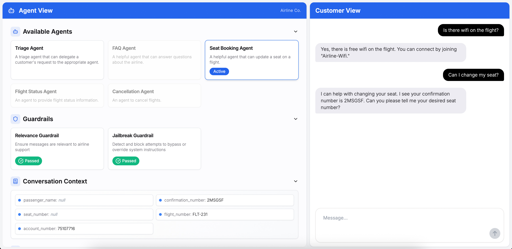

# Chapter 5 - Real Scenarios and Reusable Wheels

Now use the tool. Coding, weekly reports, research, customer service, browser automation, memory, and evaluation already have working examples. The point is not to copy a popular repository blindly, but to copy the smallest proven shape and add the right guardrails.

## 59. Where is DSH stronger than Claude Code for coding?

Two places: customizability and auditability. Claude Code is a finished, opinionated product. DSH is an open foundation where even the default agent loop is replaceable, and the append-only session log supports replay and branching.

Claude Code's documentation describes it as the agentic harness around Claude, so the comparison is about product boundaries rather than whether one side has a harness. Choose the finished product for immediate standard work; choose DSH when you need to change the workflow or inspect the full trajectory.

| Dimension | Claude Code | DeepSeek Harness |
|---|---|---|
| Positioning | Integrated product | Open, plugin-based foundation |
| Onboarding | Fastest path to work | More configuration up front |
| Customization | Opinionated internals | Even the default loop can be replaced |
| Traceability | Standard session history | Append-only log with replay and fork |
| Best fit | Standard tasks and speed | Custom workflows and auditability |

1) Claude Code architecture https://code.claude.com/docs/en/how-claude-code-works

2) DSH repository https://github.com/deepseek-ai/deepseek-harness

3) Model versus harness discussion https://www.zhihu.com/question/2071014727606703118

## 60. Can an Agent write my weekly report?

Yes, as a verifiable draft, not as an unattended final document. Pull facts from fixed sources such as commits, calendar events, and task lists; apply your template; then keep a human check for numbers and omissions.

The main risk is a long run with no completion alert. Write the acceptance checklist first: what work must be covered, where every number comes from, and what format the report needs. Treat the output as a draft until that checklist passes.

1) awesome-claude-code https://github.com/hesreallyhim/awesome-claude-code

2) Dify https://github.com/langgenius/dify

## 61. How can an Agent help me read research papers?

Choose a system that makes sources visible. A research agent should produce a source list before it produces a conclusion.

GPT Researcher aggregates many sources per research pass. STORM asks multiple expert perspectives before retrieval and drafting, while DeerFlow is worth trying for Chinese-language research. None should be treated as a publish-ready author by default. Ask for ten source titles and links first, check their quality, then request the synthesis.

| Tool | Approach | Best fit |
|---|---|---|
| GPT Researcher | Planning and execution layers | Fast cited research reports |
| STORM | Multi-perspective questions followed by retrieval | Structured literature-style overviews |
| DeerFlow | Deep-research framework | Chinese-language workflows |

1) GPT Researcher https://github.com/assafelovic/gpt-researcher

2) STORM https://github.com/stanford-oval/storm

3) DeerFlow https://github.com/bytedance/deer-flow

## 62. Can I use an Agent directly for customer service?

You can start from an official reference implementation, but not from an unguarded deployment. OpenAI's `openai-cs-agents-demo` provides a Python orchestration backend, a Next.js and ChatKit front end, and a visible orchestration flow.



Before a customer sees it, add a tool allowlist, a human route for sensitive actions such as large refunds, and output compliance checks. The smallest useful version is a knowledge-base retriever, a read-only order lookup, and a human handoff trigger. Prove that internally before adding write operations.

1) OpenAI customer-service demo https://github.com/openai/openai-cs-agents-demo

2) Dify https://github.com/langgenius/dify

3) Guardrails AI https://github.com/guardrails-ai/guardrails

## 63. Which open-source harness should I copy?

Start with curated lists instead of searching the entire ecosystem. `awesome-agent-harness` groups hundreds of projects by capability, and `awesome-harness-engineering` offers another active collection.

Copy by pain point, not by star count. If observability is the problem, choose one small observability project, read its README, and write three notes: the problem it solves, how it solves it, and what you can reuse. A curated list is a directory, not a security or maintenance guarantee.

1) awesome-agent-harness https://github.com/Picrew/awesome-agent-harness

2) awesome-harness-engineering https://github.com/ai-boost/awesome-harness-engineering

## 64. Is there a ready-made harness for browser automation?

Yes. OpenHands provides a broader agent and browser operation stack with sandboxing; BrowserGym focuses on evaluating browser agents. One is for doing, the other is for measuring.

Start with public pages and no saved login state. Use a separate browser profile, isolate the browser process, define download boundaries, and run a BrowserGym task set after the first demo works. A browser agent that can click once is not yet a reliable browser automation system.

1) OpenHands https://github.com/OpenHands/OpenHands

2) BrowserGym https://github.com/ServiceNow/BrowserGym

## 65. How should I add long-term memory?

The ecosystem has three broad approaches: layered memory, automatic write-back, and retrieval-backed memory.

| Approach | Examples | Idea | Best fit |
|---|---|---|---|
| Layered memory | dsh-tdai-memory, sage-mem | Store and retrieve different memory layers | People building a deliberate memory system |
| Automatic write-back | dsh-goodmemory | Summarize each conversation into memory files and recall them later | Low-maintenance use |
| Retrieval-backed | dsh-persist | Keep local plaintext memory and retrieve it when needed | Privacy-sensitive users who want file control |

Choose by privacy, language segmentation quality, and maintenance tolerance. These plugins are early and change quickly, so test file reading before and after installation and record the choice in your own failure log.

1) Memory discussion https://github.com/deepseek-ai/deepseek-harness/discussions/14

## 66. I am afraid the Agent will delete files. What should I do?

Use two fences: the sandbox controls where the process can go, and a permission preset controls what actions are allowed. Start read-only, move to workspace-write only when needed, and reserve full access for disposable environments.

| Preset | Capability | Typical approval |
|---|---|---|
| `read-only` | Read only; writes are rejected | None |
| `workspace-write` | Write workspace and temporary directories | Ask each time |
| `danger-full-access` | No sandbox boundary | Usually no prompts |

The system should report partial enforcement honestly when the platform cannot provide a complete boundary. Verify both sides of the fence with a real task: it must block an unauthorized write without blocking the authorized one.

1) Sandbox documentation https://github.com/deepseek-ai/deepseek-harness/blob/master/docs/subsystems/sandbox.md

2) Permission presets https://github.com/deepseek-ai/deepseek-harness/blob/master/docs/subsystems/permission-presets.md

## 67. How should I build multi-agent collaboration?

Choose the coordination shape first. AutoGen uses conversation-like collaboration; LangGraph uses an explicit state-machine workflow; DSH provides native sub-agent dispatch and records it in the session log.

| Shape | Example | Best fit |
|---|---|---|
| Conversation | AutoGen | Exploratory work with an unknown path |
| Workflow graph | LangGraph | Known steps with explicit review and rollback |

Start with two agents: one does the work and one checks it. Define what each consumes and produces as an interface contract. Every extra agent adds coordination cost, so do not add one until the simple design is insufficient.

1) AutoGen https://github.com/microsoft/autogen

2) LangGraph https://github.com/langchain-ai/langgraph

3) DSH architecture https://github.com/deepseek-ai/deepseek-harness/blob/master/docs/architecture.md

## 68. Which harness should I use for evaluation?

Match the benchmark to the task. Use SWE-bench for real GitHub issue repair, tau-bench for dialogue plus tool execution, and Terminal-Bench 2.0 for terminal tasks. Use Langfuse for traces and evaluation infrastructure.

Build a private benchmark too. Ten recurring tasks with fixed acceptance checks tell you more about your deployment than a public leaderboard whose task distribution is different.

```text
# A small private benchmark
1. Select 10 recurring tasks and make them repeatable.
2. Define acceptance checks for each task.
3. Run before and after every configuration change and record pass rate.
```

1) SWE-bench https://github.com/SWE-bench/SWE-bench

2) tau-bench paper https://arxiv.org/abs/2406.12045

3) Langfuse https://github.com/langfuse/langfuse

## 69. Can I combine coding and office work in one setup?

Use a profile composition rather than installing everything into one undifferentiated environment. Start with `dsh-base`, add verified coding plugins, then add only the office components you actually need.

Keep each layer independently upgradeable and apply the same source, permission, and maintenance checks to every plugin. Put the profile in version control: configuration is an asset, not disposable UI state.

1) DSH architecture https://github.com/deepseek-ai/deepseek-harness/blob/master/docs/architecture.md

## 70. Can I copy commands from a scenario tutorial directly?

Copy them only after checking the version. A tutorial records the author's environment, while DSH's release candidates can change within days. Run `--version`, compare the tutorial's version, and check the current documentation if they differ.

Parameter renames, profile changes, and plugin-interface changes can produce misleading errors. When a command fails, the official documentation for the installed version is the shortest path back to facts.

1) Official English documentation https://deepseek-harness.github.io/deepseek-harness/en/guide/quickstart

2) npm versions https://www.npmjs.com/package/@deepseek-ai/dsh

## 71. Is there a collection I can clone and run tomorrow?

Yes, choose by the work you need this week: GPT Researcher, STORM, or DeerFlow for research; the OpenAI customer-service demo, Dify, or Chatwoot for service; MaxKB, RAGFlow, or Obsidian plugins for knowledge work; and OpenManus as a general assembly base.

Filter by scenario first, then run a maintenance check, then look at stars. A highly starred project can still shut down. For tomorrow's test, clone the closest project, follow its quick start, and discard it if it cannot run within a few minutes.

1) MaxKB https://github.com/1Panel-dev/MaxKB

2) RAGFlow https://github.com/infiniflow/ragflow

3) Obsidian Copilot https://github.com/logancyang/obsidian-copilot

4) Smart Connections https://github.com/brianpetro/obsidian-smart-connections

5) awesome-claude-code https://github.com/hesreallyhim/awesome-claude-code

## 72. What if my scenario is too niche to have a template?

Decompose it into tools multiplied by a workflow. Write atomic actions such as read email, query a table, generate a document, and send a notification. Find existing tools for each action; build only the small amount of orchestration that is unique to your process.

Atomic actions are more reusable than complete scenarios. A PDF-to-Markdown tool can serve research, support, and a niche internal workflow. Write the action list tonight and count how many pieces already exist. The two or three missing pieces are the real custom work.

1) MCP servers https://github.com/modelcontextprotocol/servers

2) OpenManus https://github.com/FoundationAgents/OpenManus
