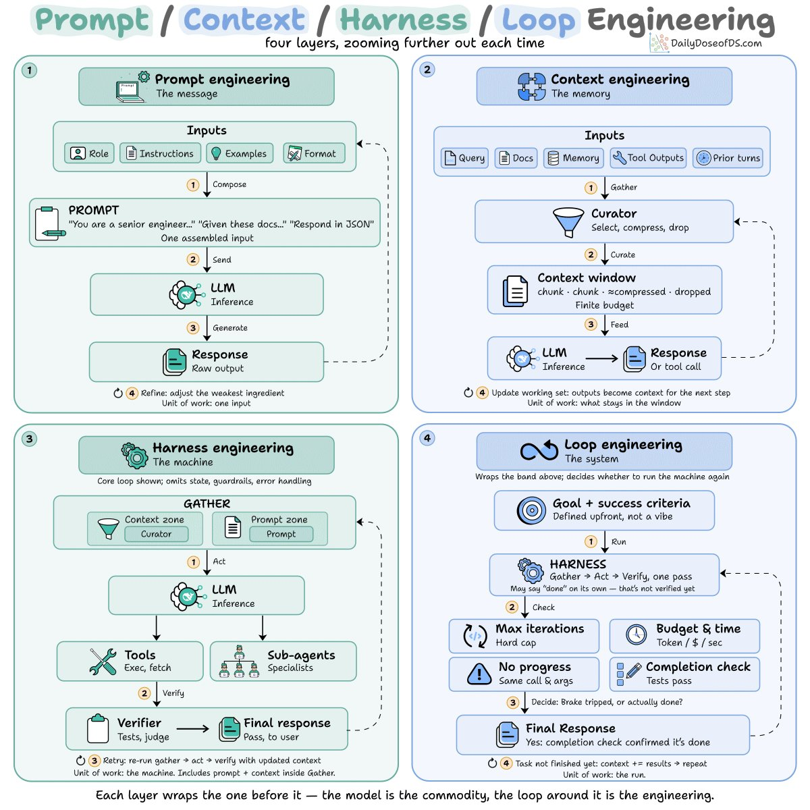
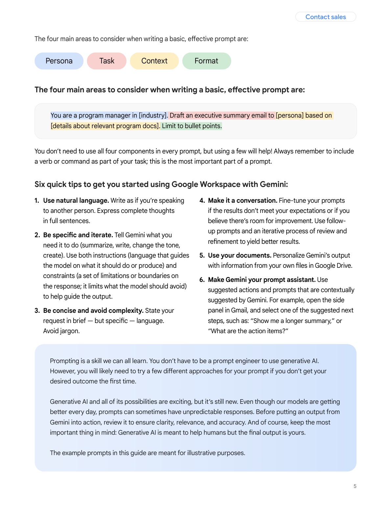

# Chapter 1 - Is Prompt Engineering Still Worth Learning?

The job title is evaporating, the models keep getting smarter, and the internet declares this skill dead every few months. This chapter settles the question first: what exactly died, what survived, and how much an ordinary working person actually needs to learn. The short answer is that the title died, not the craft - and the depth you need depends on your situation, not on the hype cycle.

## 1. Prompt engineer job postings dropped seventy percent in two years. Should ordinary people still learn this?

Yes - but learn it as a working language, not as a profession.

Three numbers nail this down. Searches for "prompt engineer" on job platforms fell from a 2023 peak of 144 per million users to 20-30 today, a drop of more than eighty percent. Job postings in China are down roughly seventy percent from 2023. And a Microsoft survey of 31,000 employees listed it among the roles companies are least willing to add in the next 12 to 18 months. In 2023 this was being called "the sexiest job of the future"; two years later, the bootcamp gold rush feels like a different era.

But the same body of research contains a more important judgment. A Tsinghua AI report puts it plainly: prompt skills are becoming a **required capability for practitioners in every industry, not a standalone profession**.

These two things are not in conflict. What died is a job title; what survived is an underlying craft. The "typist" job disappeared, but nobody tells you not to learn typing. Models can write prompts for you and tools can store your templates, but "turning something vague into something clearly specified" is the one thing a machine cannot do for you: it does not know what you want. The surviving high-paying roles prove the point - seventy percent of the remaining postings sit in verticals like healthcare, government, and finance, and the requirements read "one to three years of domain experience plus basic programming." They are not buying prompt tricks. They are buying the combination of prompts plus domain judgment.

How deep to go depends on where you stand:

| Your situation | Recommended depth | Reasoning |
|---|---|---|
| You occasionally use AI to write things at work | The six-part skeleton is enough (see Q15) | Good enough - don't sink time into it |
| You collaborate with AI over an hour a day | Work through the three templates and the debugging chapter | Output quality directly affects your deliverables |
| Your team is building a prompt library | Add the engineering practices from Q88 | Others will run your prompts; their failure is the team's failure |
| You want to move into an AI-related role | Prompts are just the entry ticket; climb the skills map | Employers hire the combo: prompts plus domain experience |

1) Why the "prompt engineer" boom cooled off Chsi https://xz.chsi.com.cn/xz/zyts/202505/20250514/2293380910.html

## 2. Models keep getting smarter. Is writing prompts about to become useless?

What smarter models killed is the entry barrier, not the craft.

The core argument of the "prompt engineering is dead" camp: today's models understand plain language, and even if you ramble, they can mostly guess what you mean. That is half true. The accurate half is that reasoning and intent recognition genuinely improved. The inaccurate half: when the model cannot guess, it does not stop and ask - it decides for you, hands you something plausible that is not what you wanted, and states it with such confidence that your guard drops.

Anthropic's official guide offers a positioning metaphor:

> Treat Claude like a smart new employee who lacks your team's context - the more precisely you explain, the better the result.

The smarter the new hire, the less you teach them basics - and the more you must spell out goals, boundaries, and acceptance criteria. Skip that, and they work faster in the wrong direction. Andrew Ng's 2026 prompting course opens with the same point; translated, he says: it is 2026, and prompting AI models looks very different from the early ChatGPT era of 2022 - but getting good at using AI "remains one of the most impactful skills you can build."

So the accurate statement is: **the cost of a bad prompt went down, and the value of a good prompt went up**. Good prompts used to rescue bad models; the bad models are gone now, but only you know what you actually need. Whether a prompt deserves more polishing - run it through four gates:

- [ ] If I read my request to a smart colleague with zero context, could they nail it in one pass?
- [ ] Did I define what "done" looks like?
- [ ] Did I mark the boundaries it must not cross?
- [ ] Did I specify the output format, or am I letting it improvise?

Pass all four and the prompt is ready. Fail any of them, and a smarter model merely executes your ambiguity more fluently.

1) Prompt engineering overview Anthropic https://docs.anthropic.com/en/docs/build-with-claude/prompt-engineering/overview

2) Full AI Prompting Course with Andrew Ng https://www.youtube.com/watch?v=8ib4Qnh2HFE

## 3. Everyone shouts that prompts are dead. What exactly died?

The incantations died. The structuring survived.

The two sides of this argument are not even arguing about the same thing. The "dead" camp means: the 2023-era spells - "take a deep breath," "think step by step," "you are a world-class expert" - have been absorbed by the models, so chanting them does nothing. This is not rhetoric; there is a mechanism. Reinforcement learning training consumed every prompt-tips article on the internet into its training distribution, so the spells went from "triggers beyond expectation" to "routine input within expectation" - no more excess return. "Take a deep breath and go step by step" once produced measurable accuracy gains in its golden age; by 2026 the same spell earns you a politely trained shrug. The autopsy report for that generation of spells is in Q48.

The "not dead" camp is talking about something else: the structured work of decomposing the task, stating constraints explicitly, and locking the output format matters more than ever. Reddit supplied a ready-made piece of performance art: a viral post titled "Prompt Engineering is Dead in 2026." In the comments, someone asked what prompt wrote the post. The author published the full transcript: round one, "write an article arguing prompt engineering is dead"; round two, "make it read like a smart college student"; round three, "shift the emphasis to prompts mattering less than before." The viral eulogy for prompting was itself the product of multi-round structured steering.

| What actually died | What is alive and well |
|---|---|
| Spell-style tricks (deep breath, tipping, play an expert) | Decomposing vague needs into explicit tasks |
| Hoarding templates as collectibles | Giving examples, locking formats, setting boundaries |
| Expecting one magic sentence to save the output | Iterating toward the target across turns |
| Treating prompts as superstition | Treating prompts as communication with a coworker |

The test is a single line: **a technique that depends on the model's "superstitious response" is dying; a technique that depends on you thinking the task through will live forever.**

1) Prompt Engineering Is Mostly Dead in 2026 dev.to https://dev.to/gabrielanhaia/prompt-engineering-is-mostly-dead-in-2026-heres-what-replaced-it-433b

2) Prompt Engineering is Dead in 2026 Reddit https://www.reddit.com/r/PromptEngineering/comments/1rci46t/prompt_engineering_is_dead_in_2026/

## 4. A colleague ships several skills into the repo every day. Is my experience still worth anything?

Your judgment is what is worth money. What is not worth money is any process that can be packaged.

One veteran - six years at an electronics manufacturer, fifteen programmers under him - was told to package his whole team's experience into skills. His words: "It's like the department hired a fresh graduate who picks up my curated skill, uses AI, and produces exactly what I produce. So what is my value?" A harsher case surfaced in the same discussion: a programmer shared a skill he had built, his manager handed it to a younger teammate, the younger teammate's output beat the original author's, and the author quit in anger.

The anxiety is real. Purely procedural experience is being packaged and cheaply copied. Companies have started tracking token spend and efficiency gains per department; rumors that "30 to 40 percent of people may be optimized away" spread internally; departments put on "performative skill deposits" - engineering files a development-plan skill, product files a competitive-analysis skill, operations files a campaign skill. The skill pile swells past a thousand, many of them existing so a manager can see "we are using AI."

But look at the boundary of what packaging can do: a skill can package steps, not judgment. Which step to skip, which exception must be escalated, what this client's words imply versus that client's - that judgment lives where packaging cannot reach. When the packaging wave hits you, stand on three legs:

- [ ] Inventory your work: purely procedural tasks (repetitive, with standard answers) - package them proactively and bank the time
- [ ] Circle the judgment-dense parts (decisions you own, tradeoffs you answer for) and throw your energy there
- [ ] Move yourself to the side of "the person who writes the skills" - the ability to describe a process clearly is itself the new moat

As for quietly sabotaging the skills by feeding them garbage - do not. You would be damaging the department's position, and if the department's position disappears, you are inside that department.

1) The viral "colleague.skill" and workplace anxiety Beijing News https://m.bjnews.com.cn/detail/1776214564168480.html

## 5. I just learned prompting and now everyone says "context engineering." Do ordinary people need to chase every new concept?

No - but you should know which layer each concept governs, or the jargon will spook you.

"I finally understood prompt engineering, and now the whole internet is talking about harness engineering" - that fatigue is everywhere on social media in 2026. The four buzzwords are actually nested layers. Unwrap them and they stop being scary: an AI application is essentially a while loop with the model in the middle, wrapped in four layers of engineering. Prompt engineering decides how to write the input for a single model call. Context engineering decides what information to feed it and when to clear the slate. Further out, harness engineering builds the skeleton of tools and guardrails, and loop engineering governs how multi-turn loops self-correct. The four layers do not replace one another; each one scales up a level.



Figure 1-1: An agent is a while loop, wrapped in four layers - prompt, context, harness, and loop engineering (Source: https://x.com/_avichawla/status/2072980277870383366, snapshot 2026-08-24)

Ordinary people only need the first two layers, and the first one is the root:

| Concept | What it governs | Do you need it? |
|---|---|---|
| Prompt engineering | Stating the need clearly within one conversation | Yes - this book's core |
| Context engineering | What to feed, how many windows to open, when to clear | Learn the core habits (Q43) |
| Harness engineering | Tools, guardrails, the system skeleton | For developers |
| Loop engineering | How multi-turn loops self-correct | For developers |

To judge whether a new concept is worth chasing, ask one question: how close is it to "stating my needs clearly"? Close - like context engineering, which for ordinary users boils down to three moves: have the model extract the relevant passages from a long document before analyzing, start a fresh window for a new task, and put standing rules into the system slot. Ten minutes to learn (Q43, Q44). Far - like agent loop architecture or harness toolchains: know the names, learn them when your work actually grows to that scale. The real hazard is old courses wrapped in new nouns: the newer the course title, the sooner you should ask which layer it actually teaches (Q8).

1) Prompt, context, harness & loop engineering, clearly explained X https://x.com/_avichawla/status/2072980277870383366

## 6. It is my first day with zero background. Which free official guide should I start from?

Start from the official ones, not secondhand summaries - order beats effort.

Every major vendor updated their official prompting guides in 2026, and all of them are free. The most efficient route for a beginner is "one official guide for foundations, one video course for practice":

- [ ] Stop one: IBM's 2026 prompt engineering guide (Chinese edition) - zero barrier, load the full landscape into your head first
- [ ] Stop two: OpenAI's official prompting guide - the six strategies (write clear instructions, provide reference texts, split complex tasks, give the model time to think, use external tools, test systematically) are the industry-wide base layer
- [ ] Stop three: Google's Gemini prompt design strategies - the "context injection" and "task decomposition" sections have the most intuitive worked examples
- [ ] Stop four: Anthropic's prompting best practices - the deep water of structured prompting; tackle it once you have some feel
- [ ] Practice track: Andrew Ng's full prompting course (video) - reproduce each technique on your own real tasks as you watch

Why this order: Chinese first to build vocabulary, English official docs second for precision, video to prevent "watching without doing." Do not read any of them cover to cover - browse with intent. In OpenAI's guide, focus on "give the model time to think" and "split complex tasks"; the examples there convert directly into work templates. In Google's guide, focus on "add context": the same troubleshooting question, asked empty-handed versus pasted with the manual, gets you one generic answer and one bull's-eye. That single contrast will permanently change how you think about context (the full mechanism is in Q80).

Skim one "core example" page from each guide and you can assemble your first collector's card:

```
My task: [what you are handing to AI - e.g., weekly report / meeting minutes]
Official page to read: [the stop above matching your model]
While reading, hunt for three things:
1. What their example prompts look like
2. Which rules they keep repeating
3. Which paragraph I can lift and use directly
```

One caution: official guides occasionally disagree - most famously on tone. Newer guides recommend calm, plain statements, because newer models follow instructions so well that shouting "CRITICAL" or "YOU MUST" now causes over-triggering (Q51 covers this). When guides conflict, defer to the docs of the model you actually use. Do not blend four vendors' rules: a prompt is written for a specific model, not for the abstraction called "AI."

1) 2026 Prompt Engineering Guide IBM https://www.ibm.com/cn-zh/think/prompt-engineering

2) Prompt engineering OpenAI https://platform.openai.com/docs/guides/prompt-engineering

3) Prompt design strategies Google https://ai.google.dev/gemini-api/docs/prompting-strategies

4) Prompting best practices Anthropic https://docs.anthropic.com/en/docs/build-with-claude/prompt-engineering/claude-prompting-best-practices

## 7. What separates people who can write prompts from people who cannot?

Not writing skill. Decomposition - the ability to turn a fog bank into a checklist.

Hand the same task to both. The beginner types "help me do a competitive analysis." The practiced one produces a structured paragraph with goal, dimensions, format, and examples: "Compare these three products on pricing, distribution, and retention. Output a comparison table; in the conclusions column, use our industry's definitions." The information gap is an order of magnitude. The first forces the model to guess; the second hands it a blueprint. Guessed output smells like a generic encyclopedia entry; blueprint output is submittable after light edits. There is a blunt listening test for the gap: someone who can decompose sounds like a manager briefing a report when they describe a task to AI. Someone who cannot sounds like they are making a wish.

There is a clumsy method you can practice daily, five minutes a round:

```
Grab any vague task on today's plate and decompose it into four lines:
1. Goal: what does success look like [one sentence, verifiable]
2. Input: what do I have [materials, data, background]
3. Constraints: what lines must not be crossed [length, definitions, taboos]
4. Output: what form do I need back [table / checklist / copy]
Feed it to AI, then compare against the one-liner version
```

Decomposition pays beyond prompting: weekly reports, delegating to reports, briefing your boss - all decomposition underneath. One daily user's forum self-reflection nails it, translated: **"Sometimes AI gives me great results, sometimes mediocre. I realized it depends far more on how you use the tool - people who understand these patterns simply get better results."** The top reply sharpened it: half of that learning curve is context optimization, not prompts at all. The "patterns" are the ability to think the problem through - the prompt is just the transcription of what you already figured out.

## 8. A three-day bootcamp versus free official guides - is money the only difference?

The difference is whether you qualify to be sold anxiety.

The full playbook of the expensive prompt course: repackage what is free, stamp it "proprietary methodology," bundle it into lectures and a community, charge hundreds to thousands. It precisely targets three kinds of people - newcomers with zero idea where to start; office workers spooked by a manager's "use more AI to improve efficiency"; and bandwagoners convinced everyone else has the secret weapon. If you match two of three, cool off before paying.

Why it is structurally not worth it: the same templates are sold to a hundred people, every sales page says "customized for you," but to the model those are a hundred highly homogeneous inputs. The original essay's verdict stings: **what you think you bought is an "edge"; what you actually bought is "averaging."** Open those premium templates and the shared traits jump out: tone full of perfectionist adjectives like "professional, systematic, deep, logical, actionable"; scenarios described as abstractly as "write me an operations plan / marketing copy"; almost none of your business details, team habits, or quality bars. They solve "I look prepared," not "this actually works better in my situation."

- [ ] Does it teach anything the free official guides do not? (Eight times out of ten, no)
- [ ] Do its templates contain the layer of "my business details"? (Eight times out of ten, no)
- [ ] Beyond mutual cheerleading in the group, is there a segment that runs your real tasks?
- [ ] Price divided by hours - does it exceed the normal rate for paid knowledge content?

There is exactly one way to become immune: finish the four free official guides from Q6 first, then reread any paid course outline. Once you can trace every page to its free source, you can never pay this tax again.

1) Paid a premium for prompt templates? Sorry, 90% are a novice tax Zhihu https://zhuanlan.zhihu.com/p/1987941344203789588

## 9. AI can write prompts itself now. What value is left for humans?

The machine took over "how to phrase it." What is left for you is "what to ask for."

Two VMware engineers ran a systematic experiment: an algorithm optimizing prompts automatically, versus human experts iterating by hand. The result was one-sided - auto-generated prompts won in almost every case, in hours instead of the humans' days. IEEE's headline for the story: "AI Prompt Engineering Is Dead." Even more unsettling was what the winning prompts looked like: the algorithm's outputs were so weird no human would have conceived them. One was composed entirely of Star Trek dialogue - "Commander, we need you to chart a course through this turbulence and locate the anomaly source" - putting the model in the captain's chair and improving its grade-school math. Engineer Rick Battle's own words: **"Many people anthropomorphize the model because it 'speaks English.' No, it doesn't do that. It's doing a huge amount of math."** His conclusion was crisp: humans should stop hand-optimizing prompts and instead define a scoring function, then let the system optimize itself.

But automatic tuning has an unavoidable precondition: you must first supply a batch of examples and a quantified definition of success - what "good" means. Where do examples come from? Your real business. Where does the standard come from? Your definition of "done." The machine cannot provide either for itself. The division of labor fits in one table:

| Dimension | Automatic tuning | Humans |
|---|---|---|
| Phrasing quality | Wins nearly everywhere, with bizarre tricks | Steadily behind, but explainable |
| Speed | Results in hours | Days of trial and error |
| Examples and standards | Cannot self-supply | The only source |
| Defining the need | Cannot do it | Home turf |

So human value converges on two things: **define the problem, judge the result**. Spend less effort on wording and more on "did I make clear what I want" - which is exactly where the decomposition drill from Q7 earns its keep.

1) AI Prompt Engineering Is Dead IEEE Spectrum https://spectrum.ieee.org/prompt-engineering-is-dead

## 10. What is the minimum set of things to learn about prompting?

The six-part skeleton plus three templates. Everything beyond that is bonus.

The minimal loop is two groups. Group one is the "six-part skeleton": role, task, constraints, output format, examples, current input - every decent prompt is a permutation of these six. Each missing part fails differently: no task, and it answers the wrong question; no output format, the most common failure (right content, unusable shape); no constraints, and it drifts; no examples, and the style never lands; no role, and the tone misses; no current input, and it pads with generic filler (Q15 has the first-aid table). Group two is the "three templates": the decomposition template against rambling - force it to break out sub-questions and reasoning before results, reclaiming the thinking from its free association; the constraint template against wordiness - content, form, and quality constraints plus a self-check switch, "regenerate if generic"; the iterative template against one-shot failure - do not demand perfection in one pass, converge over three rounds (Q22-Q24 give full texts, targeting the three most common complaints: "it improvises," "many words, little information," "one round never lands").



Figure 1-2: The official minimal prompt model - four cards: persona, task, context, format, with one example that hits all four (Source: https://services.google.com/fh/files/misc/workspace_with_gemini_prompting_guide.pdf, page 5, snapshot 2026-08-25)

The official guide compresses the minimum into four cards: persona, task, context, format - and its example sentence hits all four at once: "You are a program manager in [industry]. Draft an executive summary email to [persona] based on [details]. Limit to bullet points." The six-part skeleton is exactly these four cards expanded: constraints, examples, and current input are the line items unbundled from the "context" card.

Then nail the three rescue habits somewhere you will see them daily:

- [ ] Six parts: role / task / constraints / output format / examples / current input
- [ ] Three templates: decomposition for rambling / constraints for wordiness / iteration for one-shot failure
- [ ] Three rescue habits: key instructions at the start and end (Q30) / new task, new window (Q43) / changed instructions, recheck examples (Q38)

Of the dozens of "advanced techniques" out there, nearly all are fancy applications of these six parts or features newer models now have built in. Run this minimal loop for two weeks and it beats bookmarking a hundred technique posts. This is the only list in the book worth memorizing.

## 11. I use AI an hour a day and still use it badly. Which step am I missing?

The missing step is review - the difference between using it ten times and practicing once is whether you look back.

Volume is not skill. A body only responds to "correct stimulus plus correction," and AI is the same: it hands you instant feedback every single time, but you have to stop and read it, or ten uses are just ten repetitions - with the same errors repeating. The engineering community has a consensus observation: the AI learning curve is "half context, half prompts." Where ordinary users get stuck is a third place - they never review.

Three minutes at the end of each workday, run this review:

```
Which AI output disappointed me today?
1. What did I say: [paste your exact words]
2. What did it give me: [paste the disappointing part]
3. Was the problem mine or its:
   - Which part did I leave unclear? (goal / constraints / format / examples - pick one)
   - Or should this never have been asked in one go? (split it in two)
4. The one sentence I will add tomorrow for this task type: [write it down]
```

The soul is question three: translate "the AI is bad" into "what did I fail to specify." Translate enough times and the six parts move from knowledge into muscle memory. The real asset is question four - the one extra sentence per day becomes, after a month, a stack of corrections that belong to no one else, each tied to a real failure, closer to your work than any course. There is an advanced version too: spread the week's stack of "extra sentences" out and categorize them. All "didn't specify format" means you keep skipping the fourth part of the skeleton; all "didn't give background" means you assume AI knows your business. The category counts are your personal weak-spot list - more on-target than any generic tutorial. Using AI ten times without review loses to using it three times with review. That habit is the watershed between "someone who uses AI" and "someone who is good with AI."

## 12. Should I go deep on prompting? Which three signals decide?

Task frequency, cost of errors, and team position - all three need to be red before a heavy investment pays off.

Not everyone needs to reach Chapter 5. Self-test first:

| Signal | Green light | Red light |
|---|---|---|
| Task frequency | Fewer than three AI touches a week | Daily use; prompt quality = daily efficiency |
| Cost of errors | Mistakes are cheap to fix | Wrong output flows to your boss, clients, or production |
| Team position | Only you run your own prompts | Others run what you write, or you lead the library build |

The most underrated signal is "cost of errors": the test is not how important the task is but where the output flows. Into your own drafts - fix errors casually. Into your boss's inbox, a client's chat, or a production system - one fabricated number is an incident. Three greens: master the minimal loop from Q10 and stop investing. Two greens and a red: work through the debugging chapter and patch what is missing. Three reds: finishing this book is only the start - move on to the engineering practices of Q88 and the skills map of Q99. You are no longer "learning prompts"; you are on the path toward owning AI collaboration for a team.

One corroborating detail is worth chewing on: Andrew Ng's 2026 engineering skills map - built from analysis of over ten thousand job postings plus interviews with dozens of AI experts - lists four skill areas: building and deploying AI applications, software engineering fundamentals, using coding agents, and shaping what gets built. Prompting does not even get its own line; it dissolves into "managing an agent's context" and "writing clear specs." The fact that the skills map no longer lists it separately is precisely the point: it has stopped being a bonus and become a default. The redder your three signals, the more you should build on top of that default.

1) The AI Engineering Skills Map Andrew Ng https://x.com/AndrewYNg/status/2088302050706686198
