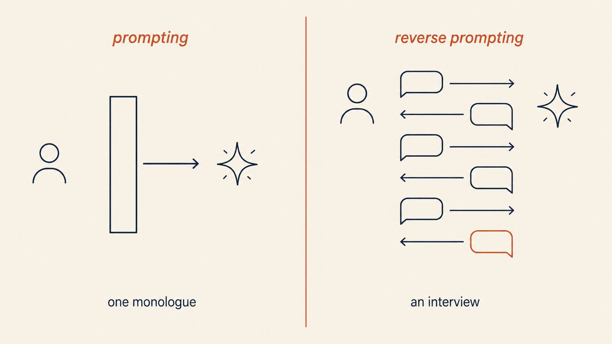

# Chapter 2 - From a One-Liner to a Structure

Most people's prompts fail not because the model is weak but because a one-sentence wish is not a task specification. This chapter builds the upgrade path: from keyword-style requests to the six-part skeleton, the right order for the parts, examples that actually teach, three templates that cure the three classic failures, and the habits that keep a long prompt from drowning in its own length.

## 13. Why does using a prompt like a search keyword always fail?

Keywords trigger retrieval; they cannot convey task structure - the AI has no idea what you will do with the result.

The measured gap between two versions of the same need is ready-made. Weak version: "How do I add numbers in Excel?" - that is search-box language, and the AI can only return a generic tutorial. Strong version: "How do I total a row of dollar amounts? I want to auto-sum every row in the sheet and put each total in a column called Total on the right." Goal (auto-sum the column), location (a Total column on the right), scope (the whole sheet) - all present, and the AI returns an operation you can follow directly.

The root disease of a weak prompt is a "boot error": insufficient information forces the AI to guess what you want. And it guesses in a different direction each time - a formula today, a menu path tomorrow, a VBA tutorial the day after. You blame instability; in reality your input keeps inviting different interpretations.

To upgrade from keyword to task description, add three things:

- [ ] Upgrade the verb: turn "sum" into "generate a Total column on the right for me"
- [ ] Pin down scope: which rows, which sheet, what format, one-off or recurring
- [ ] Deliverable shape: a formula, step-by-step instructions, or the finished result

Keyword-style input has one hidden cost: it supplies no identity or context. The same "how do I do a competitive analysis" should produce completely different outputs depending on whether you are a product manager briefing the boss or a salesperson presenting to a client. The keyword carries none of that, so the AI hands you a generic version - usable by anyone, fitting no one. That is the dividing line: keywords describe a topic; task descriptions convey intent plus deliverable.

A self-test mantra: if what you typed would work equally well in a search engine and in an AI chat, it is not qualified input for the AI - search engines want clues; AI wants a task.

## 14. "Write my weekly report" versus a three-element instruction - where does the output differ?

In how much the AI invents for you - without material and structure, it can only fill the page with filler.

The side-by-side test is stark. Saying only "write my weekly report" gets you "This week I completed various tasks, steadily advanced key projects, and achieved phased results" - correct nonsense, every word true and useless. Swap in a three-element instruction (identity, material, structure) and the same model's output is submittable after light edits:

```
I am a [role, e.g., online operations manager]. Based on the keywords below,
expand them into this week's report with four modules:
accomplishments, data analysis, problems & reflections, next week's plan.
Keywords: [fragments are fine, e.g., published 3 Xiaohongshu posts /
one post below average CTR so I rewrote the title / aligned topics in a meeting]
Requirements: every accomplishment must carry a result or a number
(mark [TO FILL] if missing). Do not invent numbers. Reflections must name
concrete actions - no "keep pushing harder" filler. Total length under 400 words.
```

Each element has a job. Identity sets tone and default perspective (an operations report and an engineering report emphasize entirely different things). Material is your fragment list; the AI's job is to string them into a causal narrative. Structure locks the four modules so it cannot wander into lyrical prose.

The granularity of your material determines the grade of the finished product. "Published a few posts" expands into actions. "Published a few posts, one below average CTR so I rewrote the title" expands into a review with cause and effect. However strong the AI's expansion ability, it can only amplify the signal you give it - it cannot generate the facts of your work from thin air. One technique for feeding fragments: attach an outcome word to each item (improved, below, stuck, aligned). Those words are the hooks that expand into "accomplishment + reflection" structure.

The lifesaver is the closing line: "do not invent numbers; mark missing material as TO FILL." Without it, the AI will cheerfully supply "up 25% month over month" - a number precise to the ones digit, delivered with enough confidence that you might actually paste it into your boss's report. Which numbers must be checked by hand: Q61 has the four-category checklist.

## 15. Which missing piece of the six-part skeleton breaks first?

A missing task gives you an answer to the wrong question; a missing output format is the most common failure - match symptoms to parts and patch one at a time.

The six parts are role, task, constraints, output format, examples, current input. They are not parallel decorations; each fails in its own way. No task: the model takes the broadest literal reading - you ask about the mountain, it answers about the temple. No output format: the content may be right, but you get an unusable blob. No constraints: it improvises, and the more capable the model, the farther it drifts. No examples: the style is forever slightly off - you cannot name what is wrong, but it is not you. No role: random register - academic today, marketing-speak tomorrow. No current input: it pads with generic material from training.

| Missing part | Symptom | First-aid fix |
|---|---|---|
| Task | Answers the wrong question; delivers a primer | First line: "Your task is..." |
| Output format | Right content, unusable blob | Lock the shape: table / three bullets / JSON |
| Constraints | Drifts, crosses lines, pads | List 1-3 "must" and 1-3 "must not" |
| Examples | Style never lands | Paste 2-3 samples of what you want |
| Role | Unprofessional or overly academic tone | One line: identity and audience |
| Current input | Mixes up your material | Material goes last, fenced by tags |

The full skeleton looks like this (why this order: Q16):

```
# Role
You are [identity], serving [audience]
# Task
[clearly describe what to do this time]
# Constraints
- Must [...]; must not [...]
# Output format
[explicit format - ideally a schema or an example]
# Examples
Input: ... Output: ...
# Current input
[your real material]
```

Building from scratch, fill in this order: task first (one sentence on what it should do), then output format (what form you will actually use), then constraints (which lines it cannot cross). Add examples and role as needed - examples pay most on style-sensitive tasks, role most on tone-sensitive tasks, and material always goes last. Patching has a priority too: fix task and format first (the "fails without them" pair), then constraints and examples (the "discounted without them" pair).

The six-part skeleton is not fancy, but it separates six concerns cleanly - an order of magnitude more stable than smearing everything into one paragraph.

## 16. In what order should role, task, constraints, format, examples, and input go?

Stable parts first, variable parts last - the official recommendation is identity, instructions, and examples up front, material at the bottom.

OpenAI's official structure has four sections: Identity (purpose and style), Instructions (rules and boundaries), Examples (input-output pairs), Context (your documents and material) - with a note that contextual material usually goes last because it changes every time. There is also an economic layer: API prompt caching bills by "matching prefix." Put the stable parts first, and a repeatedly used prompt earns the cache discount - cheaper and faster. OpenAI and Anthropic automatic caching both work this way; heavy content up front is a hard requirement.

```
[Stable zone - front]
Role: You are [identity]
Task: [goal + definition of done]
Constraints: must [...] / must not [...]
Format: [output shape]
Examples: [2-3 input-output pairs]
[Variable zone - back]
Material: [the real input for this run]
```

Typical symptoms of wrong ordering: material pasted first, requirements written last - the model spends its attention on the material and arrives at your requirements already fatigued, executing at a discount. Or examples sandwiched between two blocks of material, absorbed as material and ignored. The caching economics are worth memorizing too: OpenAI's automatic cache matches prefixes for a 10-50% input discount, and every prefix change resets the meter - putting per-run material up front means buying full-price tickets every time.

One commonly confused exception: "key instructions at the start or end" inside a long prompt refers to information position - the middle is an attention valley (Q30). The section ordering here is a structural habit. The two rules govern different things and do not conflict: order sections by "stable first," then place key sentences within sections by "edges first."

## 17. Why should you explain reasons to the AI instead of just giving orders?

With a why, the model calibrates toward your goal on its own; with orders only, it answers to the letter.

Anthropic's official guide, translated: **providing background or motivation for your instructions - explaining why the behavior matters - helps the model better understand your goal**, and the model is smart enough to generalize from your explanation.

A controlled experiment shows the gap best. Ask it to "stay under 280 characters" and the model counts its way to 279 and stops - not one character more. Tell it "this text goes straight into a tweet, and anything over 280 gets truncated mid-sentence," and the behavior changes instantly: it compresses redundancies, rebalances sentence lengths, and moves the most important information forward - because it now knows the constraint's purpose is "do not get truncated," not the number 280. The first is employee-clocking-in compliance; the second is understanding-the-assignment cooperation.

```
Rule: [your constraint]
Reason: [why it exists, e.g., this text pastes into a spreadsheet cell;
overruns break the layout]
```

Rules without reasons produce a signature "literal compliance" behavior: say "no more than three paragraphs" and you get three paragraphs of two hundred words each; say "no colloquialisms" and you get bureaucratic prose that politely loses all warmth. Every rule obeyed, every purpose lost - because it never knew the purpose. A rule with a reason behaves differently: a model that knows "overruns break the table" will distill the content on its own rather than force it in.

One line of reason after each important constraint costs ten words. Which constraints deserve reasons most: length and format rules (against mechanical compliance), industry taboos (against accidental violations), and priority rules ("speed over perfection" - without a reason it cannot know when to sacrifice which).

## 18. A prompt written in ten seconds is probably not good enough - why?

Because ten seconds buys a wish, not a task.

One heavy user's personal bar, translated: **"My current personal test is: if I wrote the prompt in under ten seconds, it's probably not specific enough."**

The ten-second classic is "polish this a bit for me." Polished to what degree? For whom? Keep what, cut what, and by what standard is "good"? All unstated. The model receives an open-ended question and can only process it as "average goodness" - and average goodness is mediocrity. To write a passing prompt, run four questions first:

- [ ] Who uses the result, and where (the boss's inbox or your own drafts)
- [ ] What counts as done (is there a verifiable bar)
- [ ] What must not be touched (facts, numbers, titles, taboos)
- [ ] What deliverable shape (rewrite, annotations, restart, or three candidate versions)

Answering the four takes two or three minutes. What the extra hundred seconds buy: roughly double the odds that draft one is usable, and half the rework - saving not just a hundred seconds but the patience burned in back-and-forth. Ten-second prompts are not forbidden; just do not send them raw - run the four questions first.

Why these four, specifically: question one fixes the audience, and audience fixes depth and tone - the variable the model guesses worst. Question two fixes the acceptance bar; without one, "good" defaults to average good. Question three draws the forbidden zone; the model does not know your factual boundaries and assumes it may fill in "reasonable" content. Question four fixes the shape - the same content as a table, a paragraph, or three candidates differs threefold in usefulness.

Ten-second prompts are not always wrong - for brainstorming, naming, or casual chats, speed beats polish. The deciding rule stays the same: the higher the cost of the output, the more seconds the prompt deserves.

## 19. How many examples should you give the AI, and what happens with too many?

Three to five, and make them varied; beyond that, the model starts learning your examples' bad habits.

Anthropic's official advice is three to five, with three requirements. Relevant - close to your real use cases, not idealized invented samples. Diverse - cover edge cases and differ from each other, so it does not learn a false pattern from near-duplicates. Structured - separate examples from instructions with tags, so the model knows what is rule and what is demonstration. Google's guide adds the other half of the warning: too many examples and the model overfits - its responses to new inputs stiffen, it can only stamp out the example mold, and anything shaped differently exposes it.

A quality self-check for examples:

- [ ] Every example is structurally identical to the real task (not a hand-crafted perfect sample)
- [ ] Examples differ: one normal input, one edge input, one hard case
- [ ] Formatting is exactly uniform: tags, blank lines, separators identical - models are more sensitive to format than to content (Q20 covers this counterintuitive fact)

Where examples come from matters more than how many. The best source is your own historical best output: the email your boss praised, the proposal that passed on the first try - they carry your style and your bar, which no "excellent example template" can replace. Second best is a colleague's good draft; inventing examples comes last - invented examples skew idealized, the model learns "how the ideal case should be handled," and then mismatches your real input.

One more pitfall to note early: examples and instructions fight, and when they fight the model usually sides with the examples (Q38). So every time you change an instruction, glance back at whether the examples still match the new rule. That habit is worth a lot.

## 20. I heard that wrong labels on examples don't matter. True?

True, with a paper behind it - the model reads format and distribution, not label-by-label correctness.

This is few-shot's most counterintuitive finding, from Min et al., 2022. The core conclusion, translated:

> The label space and the distribution of the input text both matter - "regardless of whether the labels are correct for individual inputs."

Examples with randomly assigned labels beat no labels at all; labels drawn randomly from the true distribution beat uniformly random ones.

In plain language: show the model five input-output pairs, and even if several output labels are wrong, as long as the label set is right (those classes), the inputs look right (same kind as your real task), and the format is right (consistent layout), the model still answers new samples correctly. What it learns from examples is "what kind of task this is and what answers look like" - not memorization of each row.

So redirect the effort you spend checking label correctness into three checks:

- [ ] The layout of every input-output pair is identical (same tags, same blank-line rhythm)
- [ ] Separators are uniform - not half colons, half arrows
- [ ] The label set is closed - those classes only, no stray new categories

This finding changes how you prepare examples. Step one: fix the label set (these classes, written down). Step two: make the input-output format perfectly uniform - this step is worth the most. Step three: proofread labels - and if you cannot finish, let it go; it matters less than you think. Doing the three steps in reverse order (agonizing over correctness before format) spends the effort in the wrong place.

## 21. When does few-shot fail, and what should you switch to?

It fails once the reasoning chain gets long - the upgrade path is chain-of-thought on standard models, then fine-tuning.

The authoritative tutorial page is blunt: standard few-shot works well on routine tasks, but on problems requiring multi-step reasoning (math, commonsense, symbolic manipulation), adding examples will not save it. The cause is not example quality; the model lacks not "a demonstration to watch" but the ability to decompose the problem into steps - however well the examples teach, it still tries to answer in one leap.

One prerequisite concept: chain of thought means having a standard model "write out its reasoning before the final answer" - "please think step by step, then answer" is the minimal version. The gains are measurable: explicit chain-of-thought significantly improves complex reasoning on standard models. The failure signature is also consistent: the output looks plausible, one middle step quietly goes wrong, and the conclusion follows. That is not "not enough examples" - the task's demand for steps exceeds what imitation covers. Make the steps explicit, or split the task into a chain (Q24).

| Task type | First choice | Failure signal | Next step |
|---|---|---|---|
| Classification, format conversion, style mimicry | few-shot (3-5 examples) | Edge samples answered wrong | Add edge examples, not more examples |
| Multi-step reasoning, math, logic | Chain-of-thought (standard models) | Right steps, wrong result | Inspect step design; split finer |
| Domain-knowledge dense | few-shot + domain material injection | Repeatedly taught, still wrong | Fine-tune or switch models |

Two forks to remember: chain-of-thought is for standard models only - reasoning models already reason, and adding it backfires (Q52). And if chain-of-thought still fails, the task is beyond "what prompting can teach" - that is when fine-tuning deserves serious thought; whether it is worth it, Q100 has three signals.

## 22. The AI keeps drifting. Which template cures that?

The decomposition template: think first, then act - pulling the thinking out of its improvisation and back into your design.

Drift happens because the prompt gives a goal without a path, and the model picks the cheapest path it can find. The cure forces it to "think it through before starting." Full template:

```
Your task: [precise goal]

Before you begin, complete these thinking steps:
1. Decompose the key sub-questions of this task
2. For each sub-question, state your approach
3. Only then, generate the final result based on the above

Output requirements:
- Language style: [style]
- Audience: [who]
- Format: [structure]
```

The mechanism deserves a full explanation. An ordinary prompt outsources "how to think" entirely to the model's improvisation; drift is improvisation heading somewhere you did not want. This template breaks thinking into three explicit steps - decompose, approach, then result - which means you designed the thinking process and it only fills in content. You reclaim the thinking from the model's randomness.

The applicability boundary is clear: open-ended production tasks benefit most - proposals, analyses, copywriting, anything with "many paths, easy to skew." Format-conversion tasks barely need it; input and output are fixed, nothing to decompose. Highly constrained form-filling becomes verbose with it. One line of judgment: the more "free-form" the deliverable, the more it needs decompose-then-act.

When the cure fails, nine times out of ten step one was never made explicit: the decomposition happened only "in its head," so you cannot see how it understood the task or correct it before it drifts. With explicit thinking steps you can also intervene mid-flight - "step two's approach is wrong, use X instead" costs half the effort of reworking the finished product.

## 23. The AI pads everything. What brake do I add to the prompt?

The constraint-driven template: content, form, and quality constraints together - and the self-check line at the end is the brake on the brake.

AI verbosity is not a personality issue; it is a missing braking system. The model's default strategy is "say everything that can be said," because that is hardest to fault. Full template:

```
Complete the task under the following strict constraints:

Content constraints:
- Must not contain: [what you don't want, e.g., empty summary sentences,
  "In today's fast-paced era"]
- Must include: [core points]

Form constraints:
- Total length: [range, e.g., under 300 words]
- Use: [list / table / paragraphs]

Quality bar:
- If the content is generic, regenerate before showing me
```

The three layers divide the work. Content constraints remove the hiding places for filler ("in conclusion" and "it is worth noting" lose their footing). Form constraints install hard gates on length and structure - word count is the most verifiable constraint, and the model counts before it outputs. The quality line - "regenerate if generic" - is the soul of the template: it tells the model "a draft does not count; I want the version that survives review," and the model raises its own bar before handing in.

When constraints get ignored, escalate in order: first check whether too many constraints diluted the weight - beyond three they start stepping on each other, beyond eight something always falls (Q39). Then promote the single most critical rule into an example - examples enforce an order of magnitude harder than rules (Q20). Only then add tone - and the right way to add tone is explaining the reason, not stacking exclamation marks.

Pair it with positive phrasing for double effect: write "use only verified data," not "don't make up data" - a negated instruction plants a pink elephant in the model's head; it must process "fake data" before it can detour around it (Q50 has the full rewrite table).

## 24. One-shot output never satisfies. How do I design a multi-turn path?

The iterative template: give up on one-shot perfection - experts design a three-round converging path instead of demanding a flawless first draft.

Trying to nail it in one generation is an anti-human expectation. The practitioners' consensus, translated: **"Stop trying to write the perfect prompt. Draft, give feedback, revise - three short feedback rounds beat one giant all-inclusive prompt."** Cramming every requirement into a single prompt makes the model juggle dozens of demands and drop several; three rounds with one problem class per round concentrate attention and converge fast.

```
Round 1: direction, not polish
"Give me a first draft of [task]. Don't polish it -
I want to check whether the structure and thinking are right."

Round 2: specific changes, no evaluations
"The argument in section two doesn't hold; replace it with [specific requirement].
Keep the structure; touch nothing else."

Round 3: lock the format, deliver
"Apply the above and output the final version. Format: [shape]."
```

Do not skip the acceptance check at each round's end. After round one, read the structure and answer two questions - is the direction right, and what big blocks are missing? Wrong direction: tear it up. Right: proceed. After round two, read once through to confirm the edits introduced no new problems - a model doing "local edits" occasionally rewrites passages you never touched. After round three, run the final fact check (Q46). If three rounds are still not enough, returns diminish - suspect the task itself needs splitting or the material is thin; grinding on wastes ammunition.

Two disciplines decide success. Feedback must be specific down to "change what, and how" - "make it better" is a riddle, and a riddle starts a new round of drift. And each round fixes one class of problems - round one structure, round two content, round three format - converging separately, never all at once. Most people fail at iteration not from too few rounds but because each round's feedback changed direction, and the model spins in circles with you.

## 25. Are XML tags Claude-only? Do they work on other models?

Not exclusive - they are a general structuring tool. All three vendors endorse them; Claude just digests them deepest.

On the facts, all three are in: OpenAI's official guide explicitly recommends Markdown plus XML tags to mark prompt section boundaries; Google's strategies page teaches structured delimiters the same way; Anthropic treats XML as house style, and its stated reason is practical - tags disambiguate instructions, context, examples, and variable inputs. Mixed together, the model has to guess where each part ends, and a wrong guess is a misreading. The reasoning-model usage guide goes further and suggests XML as the default structure, because output format mirrors input format - organize your input with tags and the odds rise that it answers in tags.

```
<instructions>Summarize the risk section; ignore the financial forecast</instructions>
<context>[paste the document]</context>
<output_format>Three bullets, each under 15 words</output_format>
```

| Scenario | Use tags? |
|---|---|
| Prompt over three sections, material mixed with instructions | Yes - tags are more reliable than blank lines |
| Comparing multiple documents | Absolutely: one numbered tag per document, fewer misattributions |
| A one-line short prompt | No - do not add tags for ritual |

Two usage details: tag names should be descriptive and consistent throughout - `<instructions>` beats `<a>`, `<good_example>` beats `<example1>`; the model reads tag names semantically. And input format is contagious - feed it Markdown and it tends to answer in Markdown; feed it tags and it learns to section its answer with tags. For structured output work, that is a free bonus.

Where tags pay most: material-heavy prompts. If the instruction says "compare document one and document two," wrap them as `<document index="1">` and `<document index="2">`, and misattributed citations drop visibly.

## 26. Which one-line prompts deserve promotion to structured templates?

Any task repeated three or more times; for one-offs, writing a template is waste.

Two criteria: frequency and reuse surface. The daily report, the weekly minutes, the recurring class of email - once you have typed the same sentence three times, freeze it into a template. Conversely, one-off tasks: write fresh, skip the ceremony. The structured skeleton, from the most systematic version in the Chinese community:

```
# Role: [role name]
## Profile
- version / language / one-line capability description
## Goal
- Deliverable: [what it produces]
- Definition of done: [what counts as good]
- Non-goals: [explicit exclusions]
## Rules
1. Never fabricate facts under any circumstances
2. [your hard rules]
## Workflow
1. Analyze the input; identify the intent
2. Execute per the rules
3. Output the structured result
```

The trigger point for templatizing is precise: on the third use of the same task, note what you repeatedly re-edited the first two times. Always re-emphasizing "include data" means a Rule is missing; always pasting the same background means Context should be frozen - those repeated edits are the fields your template should lock. In other words, templates are not designed; they grow out of your repeated labor. Once finalized, give the template a version number and bump it on every major revision - the day it suddenly stops working (Q35), you can roll back to the last good version and debug.

The real payoff of templatizing is not "looking professional"; it is maintainability. A one-liner prompt that breaks leaves no trail; a sectioned template lets you fix the broken section and leave the rest untouched - which becomes essential once your prompt collection grows, and doubly so the moment a second person starts using your template. The sections become your shared language.

## 27. Why do "definition of done" and "non-goals" matter more than role-play?

Because "who you are" the model can perform, but "what counts as done" only you know.

The most overlooked and most valuable fields in a structured template are the two in Goal: definition of done and non-goals. One-line principle: role is a personality hint and shapes tone; criteria are acceptance conditions and decide whether the result is usable. Write "you are a senior product consultant" and the model performs senior convincingly - but "senior" in its training data is average senior. Write "the boss can understand and decide within five minutes," and that bar grew out of your business; the model cannot guess it, only follow it.

```
Definition of done:
- [verifiable condition, e.g., the boss can read and decide in 5 minutes]
Non-goals:
- [explicit exclusions, e.g., no competitor financial estimates;
  no expansion to overseas markets]
```

Three easy shapes for a definition of done: audience shape - "the boss understands it in five minutes and can act"; acceptance-action shape - "I can send it without further edits"; comparison shape - "matches the quality of the sample I pasted." Any one works. What never works: "high quality, professional" - adjectives with no acceptance action. Keep non-goals to three to five - too few fails to restrain its enthusiasm, too many becomes the rule-stacking of Q39.

Non-goals' value is routinely underestimated: they guard not against laziness but against overzealousness. Given no exclusions, the model habitually "helps along" - drafts a proposal and tosses in a free competitive analysis; edits an email and adds a promise you never made. One line of "no overseas expansion" beats ten corrections after the fact.

## 28. How do I make the AI ask about requirements before starting?

Add one block before the task: have it interview you first.

The operation is dead simple - prepend this to the task:

```
Before you start:
Ask me 3-5 questions you need answered to complete this task. List them all at once.
Wait for all my answers before producing anything.
Make each question concrete enough to answer directly
(e.g., who is the audience / length limits / must-include material).
Do not ask vague questions like "what kind of effect do you want?"
```

The technique has academic roots: Vanderbilt published a set of sixteen prompt patterns in 2023, one named "Flipped Interaction" - flip the direction of the conversation so the model asks and you answer; the researchers call it "inversion of control." Why it works: the information gap runs both ways. You know the goals and constraints but not which details change the output; the model knows which details matter but you never supplied them. Letting it ask beats you guessing what to add - you save the mental labor of "what else should I mention," and it receives the variables that actually move the output.

Do not skip the follow-up: keep your answers together with its questions and have it work from the full Q&A - that exchange is the requirement document for this task, and a model remembers the questions it asked better than the paragraph of background you typed.



Figure 2-1: The mechanism of reverse prompting - on the left, a monologue said once; on the right, an interview of ask-then-answer (Source: https://x.com/alex_prompter/status/2086807496942068197, snapshot 2026-08-24)

A common follow-up question checklist is worth keeping: who is the audience, usage scenario, length limit, must-includes, any taboos, and what success looks like - six questions down, and the fuzzy zone of most tasks is cleared.

After the answers, one more template note: the line "no vague questions" is a patch born of experience. Without it, the model's first question is often "what effect would you like to achieve?" - asked and worthless. Pin the granularity at "directly answerable," or the interview never starts. For when this technique pays off, Q29 draws the boundary.

## 29. Which tasks deserve letting the AI interview you?

The vaguer the requirement and the higher the stakes, the better it fits; clear requirements and harmless errors make it a waste of time.

| Task trait | Use reverse prompting? |
|---|---|
| You have not figured out what you want yet (titles, strategy direction) | Yes - its questions become your thinking outline |
| High-stakes deliverables (for the boss, for clients) | Yes - one interview saves three reworks |
| Highly repetitive tasks with an existing template | No - just run the template |
| Drafts where errors are cheap | No - draft first, iterate after |

An advanced version comes from the programmer community: open a fresh session, have the AI write a prompt for your scenario first, then use that prompt for the real work - one reverse-prompting round traded for a more professional prompt. Some people fix it into a standing "question optimizer" role: analyze the initial question, identify ambiguities, probe actively, then output an optimized problem statement - under one iron rule: it only clarifies the question and is strictly forbidden from answering it.

The cost arithmetic is simple: reverse prompting costs one extra round, about a minute; an unclear requirement costs three rounds of rework at minimum, each a full rewrite. Whenever "redo" costs more than "one more question," the technique is net positive - the higher the stakes, the bigger the payoff. Anything for the boss, for a client, or that cannot be unsent once sent deserves an interview first. Conversely, drafts for yourself, things you would throw away if wrong - interviewing is procrastination.

The judgment mantra: if there is a lot you cannot articulate, let it ask; if you can articulate it and are just too lazy to type, do not - in the second case reverse prompting is ceremony, not productivity. When unsure, run the arithmetic: an extra round costs a minute; a rework costs the whole rewrite.

## 30. Should key instructions go at the start or the end of a prompt?

Either the start or the end - never the middle. This is a repeatedly validated U-shaped curve.

A Stanford team's study, published in TACL 2024, concluded, translated: **"Performance is highest when relevant information appears at the beginning or end of the input. Performance degrades significantly when the model must retrieve relevant information from the middle of long contexts - even for models billed as long-context."** The drop exceeds thirty percent. This is "lost in the middle": attention is most sensitive at the edges, the middle is a valley - no matter the advertised context window.

Turned into operating rules:

- [ ] The most important instruction goes in the first paragraph or the last
- [ ] Long material in the middle is fine, but "based on the material above, answer X" must come after the material - landing in the ending's golden zone
- [ ] Key rules set during a conversation should be restated periodically - do not expect a rule set in message three to still bind at message thirty (Q42 expands)

The conversation corollary is even more practical: a rule you set in message three is, by message thirty, lying in the weakest attention band - the model did not turn on you; the physics of position did. So key rules belong in standing slots like "custom instructions" or the system position; whatever cannot go there, restate every stretch of conversation to pull it from the middle back to the end.

The official companion advice points the same way: material first, question after. "Based on the following material ... [material] ... Question: X" - that order walks your question straight into the high-attention end zone. Both edges work; which to choose? One rule of thumb: standing rules (long-lived) at the start, this run's specifics at the end - rules up front, requests at the back, one high ground each.

## 31. How long should a prompt be, and why do longer prompts get dumber?

150 to 300 words is the sweet spot; the official data says deleting words raises scores.


Figure 2-2: The Model guidance entry in OpenAI's developer docs - the official source of the GPT-5.6 migration guide (Source: https://x.com/Xudong07452910/status/2077246527756775933, snapshot 2026-08-24)

Three sets of hard numbers. Research side: model reasoning performance starts declining around three thousand tokens, and the practical sweet spot for most tasks is 150 to 300 words - not a technical limit but an attention-economics limit; every added paragraph dilutes the weight of everything before it. Official side, harder still: in the GPT-5.6 migration guide, OpenAI published internal evaluations - **trimmed system prompts scored 10% to 15% higher on evals, cut total token consumption by 41% to 66%, and reduced cost by 33% to 67%** - three numbers pointing the same way: deleting words does not hurt quality; it is a quality lever. Mechanism side: attention dilutes with the square of length, stacked with middle-forgetting (Q30) - a long prompt manufactures noise against its own key instructions.

Three cuts for slimming a prompt:

- [ ] Say each instruction exactly once - repetition is not emphasis; it makes the model guess which copy is serious
- [ ] Delete all ceremonial wrappers: "please," "it is worth noting," "if convenient"
- [ ] Cut examples from five to three, starting with the similar ones

There are times it should be long: genuinely rule-heavy tasks - do not gut them. Merge duplicates (two rules about one thing become one), demote detail rules into examples (examples carry detail, rules carry principles - Q40). If it is still long after compression, split it into a prompt chain (Q24) with each segment short. Slimming cuts filler and repetition, not capability.

## 32. I need ten runs to produce the same output. Is prompt tweaking enough?

No - prompts cap out at roughly 80-95% format correctness; above that you need different weapons.

This is a reliability ladder, and the engineering consensus has three rungs. Rung one: describe the format in the prompt ("return JSON with name and score fields") - correctness lands around 80-95%, and the failures are silent: you may not even notice as the data quietly rots. Rung two: function calling or tool mode, handing the model a JSON Schema - reliability reaches 95-99.9%, and the residual failures are mostly semantic: right types, wrong values. Rung three: native structured output (constrained decoding), which forbids illegal tokens at the generation level - when a left brace is due, every other token's probability is pressed to zero. The model physically cannot emit an illegal format: a mathematical guarantee, not a statistical likelihood.

| Your scenario | Which rung |
|---|---|
| You just want a table in daily chat | Rung one: pin the format in the prompt |
| Results feed a workflow; rework is costly | Rung two: function calling with a Schema |
| Output goes straight into production | Rung three: structured output + semantic validation |

Rung three comes with the engineering world's key reminder, translated: **"Treat the LLM's output as input from an untrusted external API"** - the structure can be right while the values are wrong, so semantic validation (field ranges, enum legality) is never optional. The path to rungs two and three is closer than ordinary users think: mainstream AI apps carry a "structured output / JSON mode" switch, and office plugins' "field extraction" is Schema constraint underneath - you do not need to write code, only to know which level of problem that switch solves.

## 33. How do I get the AI to actually grade its own draft instead of going through the motions?

Hand it a ruler - rubric self-grading: score first, revise against the scores, deliver only the revision.

"Please check this for me" is a null instruction; the model returns "overall solid, a few small suggestions" theater. The effective version gives it a concrete scoring rubric. A field-tested version, translated:

```
Grade your draft 1-10 on each of these three dimensions:
1. Is it technically accurate?
2. Can a beginner follow it?
3. Does it read like a human wrote it?
After scoring, revise against your own scores. Output only the revised version.
```

Three design details keep it honest: the rubric must be concrete enough to score - "is it good" cannot be scored, "can a beginner follow it" can. Scoring and revision are bound in one round - having given itself a 6, it cannot comfortably submit unchanged; the score becomes a self-commitment. And only the revision ships - skipping the "here is my analysis, here is what I changed" boilerplate and delivering the result.

The most common failure is people-pleasing grades: straight 8s with a paragraph of harmless suggestions. The counter is constraining the scores - "anything below 7 must cite the specific location and reason for the deduction; anything 8 or above must point out one thing that could still improve." Scores must be explainable, or self-grading will inflate. Three principles for rubric design: dimensions must be judgeable ("novel" is hard, "beginner-followable" is easy); three to five dimensions (more dilutes); and weights where needed ("accuracy outweighs flourish"). Once a rubric works, freeze it into the template - scoring standards are reusable across tasks of a kind: write once, self-grade forever.

## 34. Should well-performing prompts be stored and managed? How?

Yes - one criterion: you would type this prompt a second time. Storage runs from light to heavy in four tiers; do not jump straight to tooling.

| Your scale | Approach | How |
|---|---|---|
| Under 10 prompts | One cloud note | One section per prompt, scenario in the heading |
| 10-30 prompts | Notes with a table of contents or tags | Group by scenario: reports / emails / analyses |
| 30+ prompts, used daily | Agents/assistants in an AI client | One assistant per prompt, with model and presets |
| Team-shared | Code repo or shared docs | Add version history and change reasons (Q90) |

The programmer community's consensus is "manage them like code snippets," but ordinary users need not copy engineering practice - just climb tiers as you grow. Two field notes: do not chase perfect classification - one person stores prompts in a private Telegram channel, links and screenshots included, and swears it beats every system; at a few dozen prompts, taxonomy is burden, not help. And when saving, add one line: "applicable scenario + last verified date." Old prompts die when models upgrade (Q35); that line is your warranty label - when something breaks, check first whether it simply expired.

Two usage habits decide the library's value once it exists. First, retrieval runs on titles - name them "scenario + action" ("weekly report - fragment expansion," "email - business polish - facts locked") so keyword intuition hits; do not count on a folder tree. Second, divide labor with your standing rules file (Q79): one-off task templates go in the library; daily writing rules go in the rules file - one governs "what to do," the other "how to do it." Prune on a schedule too: quarterly, delete or archive anything untouched - a library is a workbench, not a warehouse. Fewer entries are easier to find and easier to trust.

1) How do fellow V2EXers manage and use their prompts? V2EX https://www.v2ex.com/t/1129755
