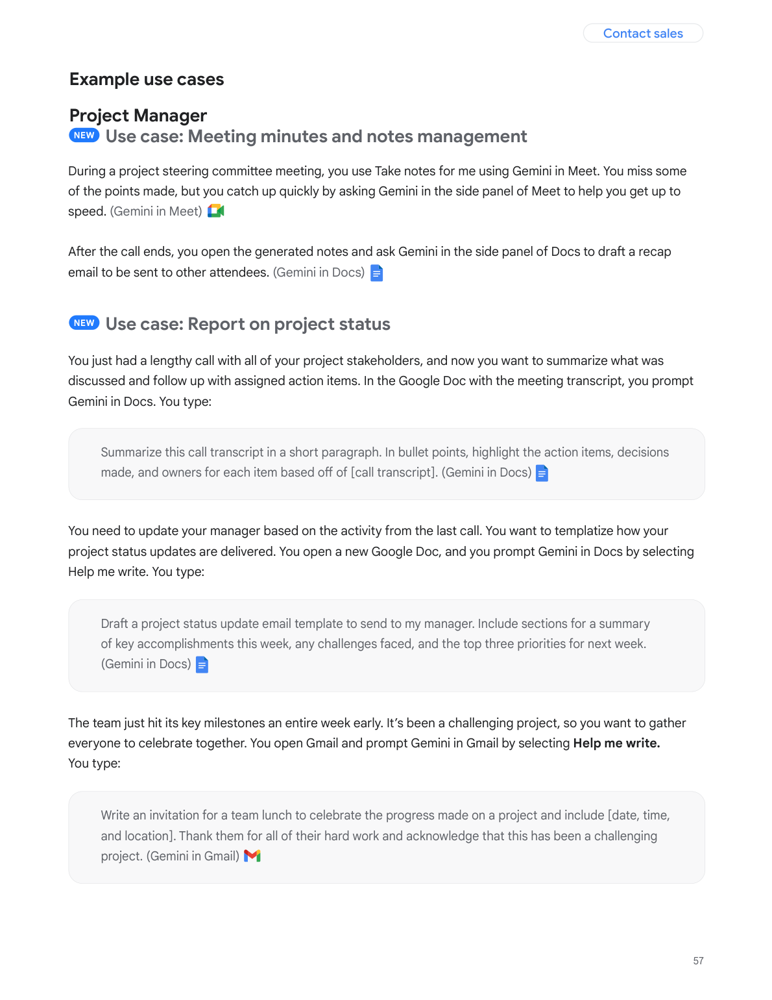
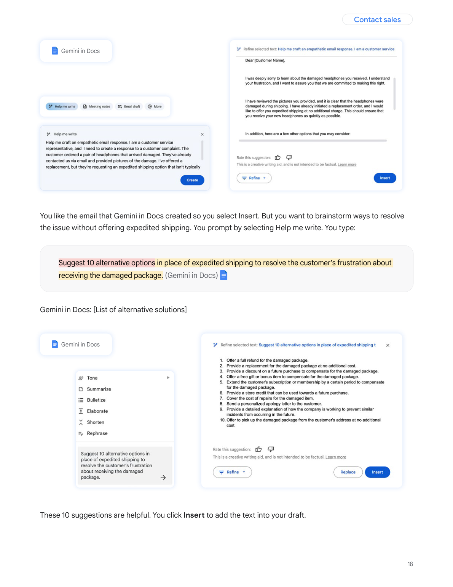

# Chapter 4 - Playbooks for Daily Work

This chapter is the copy-and-use section: the recurring jobs - weekly reports, meeting minutes, business email, slides, proposals, data cleanup, study notes, translation - each with a field-tested prompt, the failure it prevents, and the maintenance habit that keeps it working. Everything here is designed to be lifted directly and adjusted to your own context.

## 59. My weekly report is a log of raw events. How do I get AI to expand it into a structured review?

The keyword-expansion method: you supply fragments, AI expands them into four modules, every accomplishment carries a result - its job is expansion, not remembering for you.

```
I'm writing the weekly report for [role]. Expand the keywords I provide
into a professional report with four modules:
accomplishments, data analysis, problems & reflections, next week's plan.
Keywords: [fragments are fine, e.g., published 3 posts /
one post below average CTR so I rewrote the title / aligned topics in a meeting]
Requirements:
- Every accomplishment must carry a result or a number (mark [TO FILL] if missing)
- No invented numbers
- Reflections name concrete actions - no "keep pushing harder" filler
- Total length under 400 words
```

The four modules divide the labor: accomplishments hold "what I did plus how it landed"; data analysis holds "what moved and why"; reflections hold "which action to adjust"; the plan holds "next week's verifiable actions." Most people's report disease is module one only - and what the boss actually reads is the other three. This template forces all four into place.

How you feed the fragments decides the grade: "published a few posts" expands into actions; "published a few, one below average CTR so I rewrote the title" expands into a review with cause and effect. Attach an outcome word to every item - improved, below, stuck, aligned - those words are the hooks AI uses to unfold "accomplishment + reflection" structure. It amplifies the signal you give; it cannot generate the facts of your work.

Fix the rhythm as a Friday fifteen-minute routine: ten minutes skimming your work log and tossing in fragments (whatever comes to mind, no organizing), then generate, then five minutes checking numbers against the Q61 checklist. Rename the modules to match your company's format - if yours wants a "risks and asks" module, swap it in for "data analysis." The template follows the institution; never the reverse.

1) Your essential guide to AI weekly reports and decks cnblogs https://www.cnblogs.com/hogwarts/p/19806811

## 60. Have AI play my boss and pick the report apart - and next week's material writes itself?

Yes - the "nitpicker template" has AI, from the boss's chair, raise three sharp follow-up questions about the report; the questions are next week's data-collection list.

```
Assume you are my boss, having just read the report above:
1. Raise the three sharpest follow-up questions for me
   (target data gaps and logical leaps specifically)
2. Tell me which data you want to see in next Monday's report
Only ask and point. Do not answer for me.
```

This upgrades the report from one-way filing to a rehearsed defense: the questions the boss would really ask surface in advance, and AI nitpicks harder than a real boss - it has no relationship to protect, and it goes straight for the three soft spots: data gaps, strained causation, vague plans. The answers to the three questions need not be invented on the spot - write them down as next week's collection list: what to record, what evidence to keep, and next Friday's report arrives with ammunition.

The advanced play is dual perspective: first the "harsh boss" raises three attacks, then the "generous boss" names one thing done right this week - harsh and generous together tell you both what to patch next week and what behavior to repeat. The general form of reverse prompting is Q28; this is its landing in the weekly-report scenario.

Two boundaries: reports whose data is already complete do not need nitpicking (questions without gaps are theater). And do not force answers on the spot - copy the questions into next week's collection list and let next week's report answer last week's challenges. Once that loop runs, your report graduates from record to management tool.

Rotate the weekly focus: data gaps this week, strained causation next, vague plans the week after - cover all three of the boss's concern areas in rehearsal, and the defense never surprises you.

## 61. Which numbers in an AI-written report must be checked by hand?

Amounts, quantities, progress, and dates - all four, always. Even the vendor selling AI weekly-report tools writes in its own docs: the output is a draft, not a final.

The vendor's own words are worth pinning up:

> An AI-generated weekly report is by nature a draft, not a final version - key data such as amounts, quantities, and progress percentages must be verified one by one.

If the seller says that, the buyer should do at least as much. The checklist:

- [ ] Amounts and costs: one zero wrong is an incident, and AI states invented amounts most confidently of all
- [ ] Quantities and percentages: "up 25%" figures are most likely its supplement - your fragments never contained them
- [ ] Progress statements: check "80% complete" against reality; AI's sense of progress is fabricated
- [ ] Dates and names: which deadline, who attended which meeting - the misattribution high-incidence zone
- [ ] Work that leaves no numeric trace: verbal coordination and offline handling AI cannot see - add those by hand

Why AI loves inventing specific numbers: in training data, specific numbers travel with credible content - it learned "specific looks credible," not "specific must be true." The "mark [TO FILL] if missing" line in the Q59 template is the first gate; this checklist is the second. Past both, the report can be submitted.

Budget your checking effort too: only check "what gets sent" - numbers in your own drafts can slide; anything forwarded to the boss gets checked item by item. And keep a personal high-risk list of your historical mistakes (estimated written as actual, month-over-month written as year-over-year) and scan those first. The generic four checks are the floor; the personal list is the talisman.

One psychological gate to pass: checking is not distrust of AI - it is ownership. The report carries your name; wrong numbers are your wrong numbers, and AI does not take the blame. Once that lands, checking stops being a chore and becomes self-protection.

## 62. Weekly reports - plain prompts, or a dedicated AI reporting tool?

It depends where your work leaves traces: traces in systems (calendar, code, project management) - use a tool; traces in your head - use prompts.

Auto-collection tools (reading Git commits or calendars) suit people whose traces live entirely in systems - engineers' commit logs, managers' meeting schedules; the tool aggregates automatically, no fragments needed. Office-suite built-ins suit most people already in that ecosystem, seamless with document workflows. Conversational input (general AI plus a prompt) suits people whose work spans platforms and whose material lives in their heads - the Q59 template was designed for exactly that.

Four selection questions, in order:

- [ ] Does the data source match: can the tool actually collect your report material?
- [ ] Any sensitive data: if yes, choose local or enterprise editions (Q55)
- [ ] Does it fit your existing toolchain: the switching cost of one more app is chronically underestimated
- [ ] Can the output format be customized: if your company has a fixed report template, this is a veto vote

One common denominator must not be skipped: whichever tool, manual checking is never optional (Q61), and templates and instructions need periodic tuning - the tool assembles for you; it does not answer for you. Trial the free version for two weeks and verify fit before paying.

A hybrid play is worth knowing: the tool collects, the prompt reflects - an auto-tool pulls your commits, calendar, and tasks into a list; you feed that list as "fragments" into the Q59 template, and the output carries both data and narrative. Tool and prompt are not either-or; they are upstream and downstream of one pipeline: upstream solves "remembering," downstream solves "telling it well."

One invisible dimension deserves attention: whether the tool's "auto-collection" actually matches your "actual work" - wherever it cannot collect is exactly where you patch by hand. The clearer the boundary between the two systems, the less effort the report costs.

## 63. Meeting minutes - how do I keep AI from dropping owners and action items?

The five-element fill-in method: attendees, topics, decisions, action items, open questions - it fills by element, no improvisation allowed.

```
From the meeting record below, produce structured minutes with five parts:
1. Attendees (identify from the record; mark [UNCONFIRMED] if unclear)
2. Topics (in order of discussion)
3. Decisions reached (item by item; label each "decision" or "leaning")
4. Action items (verb-first; each with owner + deadline, or [UNASSIGNED])
5. Open questions
Source: [paste the transcript or notes]
Requirement: add no information absent from the source.
```

Owners and deadlines are the lifeblood of minutes. Better to have the template return [UNASSIGNED] and ask you than to have it guess a name. The closing line - "add no information absent from the source" - is the anti-hallucination gate; filling in names and topics is the model's habitual enthusiasm.



Figure 4-1: The official guide's meeting use case - a 30-minute supplier meeting, the full chain of prompts from agenda prep to minutes management (Source: https://services.google.com/fh/files/misc/workspace_with_gemini_prompting_guide.pdf, page 57, snapshot 2026-08-25)

The official guide's meeting use case runs the same chain: prep the agenda first, then manage the minutes - one meeting split into two requests. Never make one prompt schedule the agenda and write the minutes; mixed together, neither gets done well.

For an hour-long recording's transcript, do not go one-shot - run a two-step chain. Step one, denoise: "strip greetings, tangents, and repeated remarks; segment by topic; keep every sentence containing numbers, dates, names, or decisions." Step two, compose: the five-element template takes over. Each step exercises one ability; with the noise gone, the composing step has attention left for owners and action items. For poor transcripts (colloquial, dialect, crosstalk), insert a middle step: "merge synonymous sentences."

Two field reminders. Real-time and archival minutes have different needs - for in-meeting use, cut the template to just "decisions + action items," accuracy first; the full five elements are for the archive. And never skip the "decision versus leaning" distinction: if "we'll decide tomorrow" gets recorded as a decision, the next meeting makes you the incident owner. Wording in the gray zone is precisely where minutes take skill.

## 64. My own prompt is stuck. Can AI coach me?

Yes - meta-prompt diagnosis: paste your prompt and its output back in, and have it find the disease and rewrite.

When one prompt keeps producing mediocre results, your own edits often spin in place - you cannot see your blind spots: while writing, your head held the full context, and you cannot tell which sentence was clear in your mind but vague on paper. A field-tested diagnostic template, translated:

```
Here is the prompt I've been using: [paste]
Here is the output it produces: [paste]
What is wrong with this prompt? Point out the problems one by one, then rewrite it.
```

Why it works - the original author's observation is needle-sharp, translated: **"It flagged vague instructions I couldn't see myself - mostly because when I wrote them, I obviously knew what I meant."** Your blind spot is exactly its vantage: it sees only the paper, none of your mental completion, so what is missing on paper is vivid to it.

Add two requirements for better results: have it point out problems "one by one" (against the one-line "overall, could be clearer" brush-off), and after the rewrite, have it explain which problem each change fixes - explained changes are changes you learn from. After the coaching, run the revised prompt on your baseline tasks (Q57): the coach's verdict does not count; the output does.

Frequency matters: use the coach once when a prompt is being finalized, not as a daily crutch - outsourcing every dissatisfaction to an AI rewrite leaves you with "prompts AI thinks are good" rather than "prompts you work well with." The coach's value is exposing blind spots; the decision stays with you. Run its rewrite and your original against the baseline - sometimes the original just needs one missing line of background, cheaper than a teardown.

## 65. Business emails - how do I get AI to polish without losing the tune?

Preservation-first polishing: lock the "do not touch" parts before opening the "may adjust" parts - reversed, it improvises.

```
Rewrite the text below as a formal business email:
- Must preserve: all core information, specific numbers and dates,
  salutation and signature structure
- May adjust: word order, redundant phrasing, tone (more professional,
  neither servile nor aggressive)
- Not allowed: adding any fact, changing any number,
  adding any commitment absent from the original
Source text: [paste]
Output: subject line + body, total under [N] words.
```

The three-line permission list is the template's spine: preserve first (information and numbers), then permit (order and tone), then forbid (additions and commitments). The "no new commitments" line is the lifeline - the most common AI-polish failure is enthusiastically upgrading your promises: "we will provide a full report going forward," "looking forward to partnering again soon." It thinks it is helping; it is actually signing checks you never wrote.



Figure 4-2: The official guide's email revision use case - "continue refining this email: keep a professional tone throughout, use appropriate salutations and openings, and make sure no commitments are made without approval." The official example writes the commitment ban in (Source: https://services.google.com/fh/files/misc/workspace_with_gemini_prompting_guide.pdf, page 18, snapshot 2026-08-25)

The official example, translated, is worth copying verbatim: "Continue to refine this email - maintain a professional tone throughout, use appropriate salutations and openings, and make sure no commitments are made without approval." Tone, salutation, commitments - three things said up front, and the revision has a boundary.

Granularity comes in two grades: the daily version above, and for important emails a "two versions" tier - formal and concise, with differences marked; choosing between two beats letting AI guess today's mood. An extra note for Chinese email: salutations, honorifics, and closing formulas are format parts - have AI keep your company's conventions, pasted in as a one-line example, which beats any adjective.

For important mail, add the dual-version tier: formal and concise side by side, each with differences marked - you pick which to send, which beats AI guessing your mood. Hierarchy titles and ceremonial openers and closings vary enormously by region and company; lock these "format parts" with your company's real samples always, and never trust its default etiquette.

## 66. Why must English email templates state a word-count ceiling?

Because word count is the most verifiable hard constraint - written into the template, the model counts before outputting. "Concise" it cannot count.

Mature English business-email templates carry hard numbers on every line: under 150 words, capped at 120. Copy the habit:

```
Write a follow-up email (max 130 words) to [recipient]
about [topic]. Mention [key points]. Tone: professional but warm.
End with [action item, e.g., a brief call invite].
```

The hidden value of a ceiling: a business email's persuasiveness is inversely proportional to its length. State the cap and you pre-cut AI's natural padding - facing a 130-word ceiling, it protects the points and drops the courtesies, which is exactly the trade you want. Conversely, "keep it concise" is nearly a null instruction: its standard for concise differs from yours, and there is no number to verify.

Three sibling "verifiable constraints" worth hard-coding alongside: paragraph count (at most two), sentence length (average under 15 words), and required elements (one value proposition, one clear action item) - anything countable enforces far harder than any adjective.

Chinese works the same: "total under 200 characters" is exactly as hard as the English 130 words. For calibrating the numbers: cold outreach around 100 words, follow-ups 80, internal 150 - over the limit, cut courtesies first, details second. And the "verifiable constraint" idea transfers: cap the modules in reports, the paragraphs in proposals, the characters per item in minutes - give every deliverable a ruler that can count.

1) Best ChatGPT Email Prompts Clay https://www.clay.com/blog/chatgpt-email-prompts

## 67. Cold outreach, follow-up, referral requests - where do the three prompts differ?

In the goal and the closing action - cold outreach gives value, follow-up gives a step down, referrals give a template; each closes with its own action.

| Type | Core goal | Must include | Closing action |
|---|---|---|---|
| Cold outreach | "Why this matters to you" in three seconds | Their pain, what you offer, one proof point | Propose a 15-minute call |
| Follow-up | Offer a step down, no pressure | What we discussed, one new value point | A either-or time slot |
| Referral ask | Drop the forwarding cost to zero | Who you want (one-line profile), why worth introducing | Ready-to-forward copy |

The type most often written wrong is the follow-up - written as a second cold email (repeating the value pitch), and read-but-no-reply rates climb back up. The follow-up psychology is "I am not chasing you; I am giving you a new reason": last time's conclusion plus one new piece of information, plus an either-or time (Thursday afternoon or Friday morning), and the step down is complete. The referral endgame sits in the last cell: attach "a version he can forward as-is," so the introducer finishes with copy-paste. Referral completion rates bottleneck on forwarding cost, not on sincerity.

Each type has its own length ceiling too: cold outreach shortest (they owe you no reading), follow-ups shorter still (the second email is always shorter than the first), and the referral's forwardable version short enough to paste into a chat window.

The classic beginner error is correct format, displaced soul: three versions written, all saying "our product is great." Cold outreach centers their pain, not your product; follow-up centers new value, not repeated value; referrals center lowering their action cost, not expressing sincerity. One self-check after writing: delete your company's name - does the email still work with another company's name in? If yes, you wrote a template, not you.

## 68. The email screams AI-written. What do I change before sending?

Run the banned-words list and the structural reflexes - two word groups, three reflexes, and five minutes removes eighty percent of the AI smell.

```
Pre-send sweep:
- [ ] Delete words: leverage, in today's fast-paced world,
  "I noticed that," "it is worth noting," "in summary," empower, leverage (biz-speak)
- [ ] Delete structural reflexes: opening "I hope this email finds you well";
  the full closing courtesy suite "looking forward to your reply, best wishes"
- [ ] Ask of every sentence: does deleting it lose information? If not, delete
- [ ] Concretize numbers: replace "significant improvement" with the actual
  figure, or drop it
- [ ] Read it aloud: is this how you normally talk?
```

The AI smell does not come from vocabulary but from "uniformity": every paragraph nearly the same length, every point riding a subordinate clause, not one colloquial loosening anywhere - human email has stress and release; AI writes everything at constant tempo. So beyond the sweep, there is a manual move to "manufacture unevenness": set your single most important sentence alone in its own paragraph (just that one), and let the rest vary - once the isolated peak of emphasis appears, the human feel arrives.

Keep the banned-words list as a living document: every time you receive an obviously AI-written email, copy its signature phrasing into your list - two months on, your list beats any tutorial's vocabulary, because AI-speak also evolves and last year's list expires. Q79's rules file is its home: mount the list in your standing rules, AI dodges these traps in the first draft, and humans only catch the leaks.

The final insurance is the pre-send "cold read": silently read the whole email once; any sentence you would never say yourself - cut it. The banned list defends against AI boilerplate; the cold read defends against "boilerplate that slipped past the list."

The permanent fix is Q79: write the banned list into your standing rules file so AI avoids these from the first draft - far cheaper than editing five minutes per email. Keep updating it - every newly spotted AI-ism goes in - and after a month the list is your private style passport.

## 69. What five elements must a slide-deck instruction carry?

Identity, audience, topic structure, page count, style - all five and you get a usable outline in thirty seconds; missing any, you get water.

The wrong-versus-right contrast is ready-made. Wrong: "Make me a PPT about AI." - so vague you will weep at the result. Right: "I'm a product manager at an internet company, presenting to our internal engineering team, on the topic 'LLM application scenarios in B2B products.' Include: industry pain points, a brief technical primer (not too deep), our three deployment scenarios, competitor comparison, roadmap. 8-12 pages. Style: tech-forward, dark background, data visualization."

```
I am [identity]; the audience is [who]; the occasion is [internal/external/update].
Topic: "[title]"
Structure: [list 4-6 sections]
Length: [N] pages, each page: page theme + key points
Style: [visual requirements]
```

Set your expectation after the first draft: what you want was never its words but its layout and imagery - even if every generated sentence is filler, the layout and images already saved you two hours; your job is "revising text," not "making slides." Keep the page structure, reduce each page's text to one claim, and fill the rest with your real material and data. Any generator works (Gamma and peers; regionally, iFlytek, AiPPT) - the five-element template is universal because the tool is only a renderer; instruction quality decides everything.

The most frequently dropped element is audience: the same topic wants architecture and boundary conditions for engineers, conclusions and ROI for the boss, scenarios and cases for customers. Skip the audience and AI can only face the "average listener" with an average deck. And note the inverse relation between pages and depth: making 8 pages land beats stuffing 20, and is worth more - daring to set a low page count is the mark of content that has been thought through.

## 70. A decision is hard to call. Can I make AI argue with itself?

Multi-role debate: let the optimist, the skeptic, and the end user each state their case, then cross-examine, and only then synthesize - conclusions from a real fight have edges.

Ask plainly "give me a recommendation" and the model lands on the safest, offend-no-one answer - that is its default persona. A practitioner's observation, translated: **"A single 'give me your recommendation' gets you the most pleasant-sounding answer; make it argue with itself first, and the output has real edges."** The play also ranks among the high-leverage items on the 30-technique lists - low investment, high return.

```
I need to decide: [one sentence, e.g., ship plan A now,
or wait two weeks for plan B]

Argue three positions, cross-examine one round, then synthesize:
1. The optimist (act fast): the three strongest arguments
2. The skeptic (hold and watch): the three harshest objections
3. The end user (cares only about their own convenience):
   the three things they actually care about

In synthesis: give a recommendation + each position's single most
valuable insight + do not resurrect points that lost the cross-examination.
```

The template's soul is the last line: without "do not resurrect refuted points," the losing opinions sneak back into the synthesis reworded - the model is a born peacemaker. The boundary is clear too: decisions with genuine tradeoffs (fast versus stable, cost versus quality, now versus later) gain most. Factual questions (which model, which command) do not need a debate; they need evidence.

Swap in your business's real three parties: product, sales, support; HQ, region, front line; even "the budget department, the deadline department, and the blame department" - the closer the positions to your actual game, the more useful the fight. One manual step after the debate: copy out "each position's most valuable insight" and read it alone - those two or three lines are often worth more than the conclusion itself.

## 71. Can AI write the whole speech script?

It can draft - but the opening and the closing line must stay yours. The template handles structure and interaction; your real examples are its ceiling.

```
Based on this slide outline: [paste]
Write a word-for-word script for an [N]-minute talk:
- Conversational language, short sentences - spoken, not recited
- Opening 30 seconds: enter through self-deprecation or a concrete scene
  (material: [give one real detail, e.g., the moment the project failed])
- Insert [2] audience questions at section transitions
- Close with one memorable line (give me 3 candidates)
- One paragraph per slide, marked [Slide X]
```

The bracketed "give a real detail" is the whole template's hinge: without material, AI's opening is an invented joke or "Hello everyone, so happy to be here" - audiences detect it in three seconds. Given material - even one sentence - it weaves your real story into the narrative, which no template replaces. Three candidate closing lines for the same reason: its aphorisms come with fortune-cookie accent; pick the one that sounds most like you and change two words to make it yours.

The script's correct use is a rehearsal scaffold: read it aloud three times, discard it on the third - the rhythm and interaction design are its contribution; your voice and your examples are its boundary. Never memorize the script; a memorized speech is stiffer than reading slides.

A rough conversion to remember: spoken Chinese runs about 180-220 characters per minute, so a 15-minute script lands around 3,000 characters - stating total duration in the template beats stating "3,000 characters" and matches your real need. One interaction-design trick: never ask "any thoughts?" (the silence king) - ask multiple choice: "Is your team A or B here? Hands up." Interaction with concrete options actually moves.

Do not let the three closing candidates go to waste: after picking the most-you line, follow up with "give me three variants of this line - one tighter, one bolder." Nine to choose from, and you will land one that is both you and slightly better than you.

## 72. Zero ideas for a proposal. How do I get AI to build the skeleton?

Ask for the empty skeleton first, then fill the flesh - only subheadings and guiding questions, no body text, so padding cannot smother your thinking.

```
I'm drafting a [type: product requirement / project proposal / event plan].
Generate a skeleton with this structure - each section gives only a
subheading and 2-3 guiding questions (no body text):
1. Background: why do this (current pain)
2. Goals: what done looks like (quantifiable)
3. Users/stakeholders: who participates, who benefits
4. Core content: feature list / execution steps
5. Non-goals and risks: what we explicitly won't do; where this could fail
My topic: [one sentence]
```

"Guiding questions only, no body text" is the anti-smother key: an empty skeleton forces you to think. Once AI writes body text, the wall of even-handed prose quietly makes all your decisions for you - you think you are writing the proposal; you are transcribing it. With the skeleton in hand, each section's questions become your fill-in-the-blanks: answer in order, then feed the finished flesh back for polish - two stages, each doing what it is best at.

Do not skip section five, "non-goals," for being a downer: proposals killed in review mostly die of "trying to do everything" - write down what you will not do, and the center of gravity holds (Q27's Non-Goals is the same move at template level).

The difference between an empty and a filled skeleton is your thinking rights: the filled version looks easier, but every cell is pre-occupied by its "reasonable default" and you are left polishing; in the empty skeleton every cell is vacant - you fill it, you think it. The pre-review self-check is simple: read the five headings in sequence; if the chain runs (why → what → who → how → what not), the proposal is eighty percent standing.

One cheap outside help at skeleton stage: send the empty skeleton back to AI playing "hostile reviewer," asking only each section's guiding questions - whatever it cannot knock over is solid; whatever it can, you patch before writing.

## 73. Competitive analysis via AI - how do I stop the amateur-speak?

Feed it your industry's framework and definitions instead of asking for "a competitive analysis" - the amateur-speak comes from it having only generic frameworks.

```
Analyze these competitors: [list]
Using this industry's framework: [paste yours, e.g.,
channels - conversion - retention - repeat purchase]
Industry definitions: [key metric definitions, e.g., how DAU is counted,
how average order value is computed]
Output dimensions: [one per framework element: conclusion + evidence +
confidence (high/medium/low)]
Data rule: use only data I provide or that carries a public source;
mark [DATA MISSING] otherwise
```

Without your framework, AI uses business-school generics (SWOT, Porter) - valid in any industry, sufficient in none, least of all yours. Where does your framework come from: past reports' tables of contents, the dimensions your boss recites from memory, the fixed sections of industry research - find the "implicit framework everyone in your company already uses" and make it explicit. That step alone outvalues everything after it.

The "confidence" label is the template's second mechanism: every conclusion carries high/medium/low confidence, which prices AI's guesses openly - high-confidence items cite directly; low-confidence items need your own evidence. Generic prompts get generic answers; the industry framework is the wall between "amateur" and "one of us."

A shortcut to the framework: your company's or industry's past report tables of contents - the TOC is the sedimented framework, closer to your reality than any methodology book. Confidence usage made explicit: high - use; medium - spot-check the evidence; low - treat as a lead, not a conclusion. That grading splits "what AI said" from "what is usable," and only the second pile ever gets copied into your deck.

## 74. A messy spreadsheet - how do I get AI to clean it in one pass?

Define "clean" as checkable rules and have it deliver a cleaning report before the file - with a vague standard it will only surface-tidy.

```
Process this spreadsheet: [upload/paste]
Cleaning rules:
1. Deduplicate: by [unique key, e.g., order number], keep the newest
2. Normalize formats: dates → YYYY-MM-DD; strip spaces from phone numbers;
   amounts to two decimals
3. Empty cells: numeric columns fill 0 plus a note column "originally empty";
   text columns fill [UNKNOWN]
4. Add a summary row at the bottom (numeric columns only)
Deliver the cleaning report first (what changed, what was deleted,
what is anomalous), then the file.
```

Report before file is the safety valve: the report shows at a glance what it touched - rows deleted, formats changed, anomalies flagged - so problems surface now, not when downstream data explodes. Stating the fate of empty cells explicitly (numeric fills 0 with a note) is the same logic: by default, AI may simply drop rows with blanks, silently shrinking your sample.

For big sheets (several hundred rows and up), batch: have it process 50 rows first to validate its reading of the rules; once the output shape is right, release the full set - when rules run crooked, 50 rows of tuition cost a hundredth of 5,000.

After the clean, one closing move: randomly spot-check ten rows by eye - concentrate on rows it flagged "anomalous" and rows with many blanks; those two zones are accident-prone. Never overwrite the original file with the cleaned one: save as new (name + cleaned) and keep the original forever - if the cleaning logic gets overruled later, you still have raw data to return to. The two habits cost ten seconds total and buy "data accidents always have a way back."

The most-forgotten rule is "unit unification": amounts in yuan versus ten-thousands, counts in pieces versus sets - mixed units make the summary row wrong, and wrong without a trace. Writing units into the format rules is the highest-value line in the cleaning template.

## 75. How do I compress dozens of pages of study material into review notes?

Three passes: skeleton, key points, cards - a straight "summarize this" yields a summary, not notes you can take into an exam.

```
Pass one: read this material: [upload]
Output the knowledge skeleton: a chapter tree + one-sentence thesis
per section (no elaboration)
Pass two: only for [the parts that will be tested/used, e.g., chapters 2-3]
Output point notes: 3-5 per section, formulas/definitions verbatim,
examples swapped for short ones
Pass three: take the 10 points I'm most likely to forget
and turn them into question→answer cards, question first, answer after
```

Each pass does one job: the skeleton is the map (know where everything is), the points are the content (definitions and formulas verbatim, because AI paraphrase loses precision), the cards are memory (question first - self-testing only works that way). A one-shot "summarize everything" produces something nice for other people, not for the you who must pass an exam - exams test retrieval, not reading.

Need a mind map? After pass one, add a step: "convert the skeleton into a map outline, at most three levels, six branches per level, eight characters per node, indentation as hierarchy" - node length and level caps are the two critical limits; let nodes grow long and the map turns back into prose. Pass three's cards can go one step further: the Q76 self-quiz template upgrades cards into a full mock set.

Store the three products separately: the skeleton pasted on page one as your table of contents, the points as the body, the cards as a single pre-exam speed-review sheet. Before the exam you read only cards; two weeks out, the points; a month out, the skeleton - three products, three review radii. "Verbatim formulas and definitions" bears repeating: paraphrased definitions lose precision, and what you memorize on exam day is AI's paraphrase - one dropped qualifier is a whole question gone.

## 76. AI-generated self-quiz questions - how do I keep it on-syllabus and correct?

Three safeguards: scope locked, mixed question types, answers bound to sources - all written into the prompt itself.

```
Based on this material, generate 10 self-quiz questions: [upload]
- Scope: only material content; no outside knowledge
- Types: 4 single-choice + 3 multi-choice + 3 short-answer
- Each question notes its source chapter
- Reference answers collected at the end; each gives
  "answer + one line of verbatim support from the material"
- Short-answer answers under 80 words
```

"Answer + verbatim support" is the anti-wrong-answer key: any question whose support does not match the material, delete - a wrong question is survivable; a wrong question with a confidently wrong answer wrecks a review rhythm. "No outside knowledge" guards the other failure: AI wanders off-syllabus into "related things it knows," and you review half a day for what will not be tested. Source chapters have a hidden use: when checking answers, wrong questions route straight back to their chapters - the review path generates itself.

The advanced version is difficulty layering: 4 easy (recall), 4 medium (understanding), 2 hard (application) - the results tell you which layer you are stuck at, more diagnostic than a raw error count.

Coverage versus quantity: ten questions cannot cover dozens of pages - do not be greedy. Go chapter by chapter, one round of ten per chapter, extra rounds where errors cluster. The wrong-question loop is ready-made: the "source chapter" line in this template exists exactly for routing back - rereading the source chapter beats re-grinding the whole pack by an order of magnitude.

One more marking move for sticky questions: anything you hesitated over five seconds before answering correctly, mark "half-known" - that batch is precisely what collapses in the exam hall, and they deserve another pass more than the openly wrong ones do.

## 77. Translating foreign material - how do I preserve terminology and paragraph structure?

Glossary first, then translate, with structure locked in the instructions - the glossary is the single biggest lever on translation quality.

```
Translate the following into fluent Chinese:
- Glossary (must be consistent; mark the original on first occurrence):
  [term 1] → [rendering]; [term 2] → [rendering]
- Preserve the original paragraph structure and numbering;
  no merging, no splitting
- Technical precision over literary flair
- Where unsure, keep the original word and mark it with 【】
Source: [paste]
```

Where the glossary comes from, in two steps: first have AI read the whole text and "extract 10 key terms with suggested renderings"; you make the final call (this step must be yours - one wrong term poisons the whole document); then translate with the settled glossary. Two steps beat one-shot translation by a wide margin and cost only one extra round. The "preserve paragraph structure and numbering" line defends against AI's tidying instinct: it will merge your five paragraphs into three, and you will lose your mind trying to align with the original afterward.

Domestic models' official prompt libraries carry a ready "CN-EN translation expert" skeleton with the same core fields - role, rules, format. For long documents translated in batches, attach the same glossary to every batch; it is the only guarantee of cross-batch consistency.

The human sign-off on terms is not skippable: AI's suggested renderings make two classic errors - treating common words as terms (unifying what should not be unified) and terms as common words (missing what should be). Ten minutes of review guards against document-level error. Post-translation QC has a quick move too: pick three paragraphs and have a separate session back-translate into the source language, then compare meaning drift - back-translation is the old craft of translation QC, still fully alive in the AI era. It catches not word errors but meaning drift: every word right, the whole paragraph subtly wrong - the sneakiest failure in translation.

## 78. Want a sturdier plan - have AI imagine ten ways it fails first?

Yes - reverse brainstorming: list ten failure paths first, then invert each into a countermeasure. Blind spots surface faster than in forward planning.

```
I'm about to push this forward: [one sentence, e.g.,
new feature ships in two weeks]

Step 1: list 10 specific ways this could fail (the more concrete the better;
no "poor execution" boilerplate)
Step 2: invert each failure into "one specific action we could have taken"
Step 3: mark the 3 least obvious inversions - those are this
discussion's real output
```

Why reverse beats forward - a practitioner's observation, translated: **"It exposes blind spots that a straightforward 'give me a strategy' prompt can't reach."** In forward brainstorming, the model follows your plan's grain and finds supporting reasons - you have decided, so it argues for success. Attacking from the reverse forces the perspective to flip, and the unseen pits come to light. It looks like a gimmick at first (the original author's own words) and becomes a fixture after one use.

Where it fits: pre-launch readiness reviews, pre-review self-checks, interview rehearsals - any occasion defined by "afraid we missed something." It complements Q70's debate: debate handles interest-tradeoff decisions, reverse brainstorming handles risk-sweeping decisions - one argues positions horizontally, one digs pits vertically.

The ten failures often hide "correct boilerplate" (poor execution, poor communication). The fix is forcing specificity: every failure must carry a trigger condition - "on launch day, ops is absent and nobody executes the rollback" is a failure; "inadequate management" is not. The real payload usually sits in the three "least obvious inversions" - pits neither you nor the team had seen before this discussion. Schedule those first.

## 79. Daily repeated tasks - how do I freeze them into my own standing prompt?

Build a rules file: write your preferences once, and have AI read them at the start of every session - widely rated the highest-leverage single move of the year by practitioners.

```
[My rules file · kept in my notes]
# Writing rules
- Tone: direct; no courtesies, no summary sentences
- Audience: [your readers / your boss]
- Banned words: empower, leverage, closed-loop, [your landmines]
- Must: a concrete example in every paragraph; sources for every number
- Format: short paragraphs, at most 3 sentences each

[First line of every session]
Read the rules above in full before starting. When you are about to
violate any of them, stop and tell me - do not quietly adapt.
```

The principle in one line: turn "re-explaining the background every time" into "configure once, effective always" - the act of writing a prompt upgrades into configuring your personal assistant. The rules file compounds with usage: Q68's banned list, Q17's constraint reasons, your format preferences - all sediment into one file, and every line saves you words in every future conversation.

Two usage details: keep the file short - a dozen-plus lines; longer, and it starts dropping rules itself (Q39's stacking law applies to rules files too). And the line "when about to violate any, stop and tell me" is the quality gate - it makes AI surface conflicts instead of quietly working around them. Maintenance rhythm: monthly review - delete what no longer applies, add what you newly discovered. Like the prompt library, a rules file is a living document.

The rules file also compounds with scenario templates: the report template's "no invented numbers" and the email template's "banned words" both move up into the rules file for unified maintenance - templates keep only task-specific parts, and every rule is stated exactly once in the file (Q31's "each instruction once" holds here too). Once that layering is done, you change one banned word and every scenario updates.

## 80. Assigning a new task - background first or goal first?

Material first, question after - let the model finish reading everything before it sees your question. This rides the attention curve and matches the official ordering advice.

A ready-made controlled pair: ask "the wifi dropped, what do I do" empty-handed and you get a generic troubleshooting tutorial - restart the router, check the cable; true in every home, useful in none. Paste the router manual's indicator-light meanings and ask the same question, and the answer lands on "slow-blinking yellow means network error; check the cable and both endpoints" - the material changed the answer's nature. That is the minimal hand-made RAG: context first, then the question has something to stand on.

```
[Material zone] relevant material: [paste documents/data/context]
[Question zone] based on the material above:
[your specific question + output requirements]
```

The cost of reversed order is attention: with the question first, the model reads the material already itching to answer, biased toward whatever it noticed first; putting the material first drops your question into the strongest attention zone at the end (Q30's U-curve). Two exceptions: pure chat needs no material; material containing sensitive content gets anonymized before pasting (Q55) - ordering serves attention, but safety always precedes ordering.

With several documents, order inside the material zone too: the most relevant goes last, pressed against the question zone - riding the tail of the attention curve. Mid-conversation additions work the same: after pasting new material, immediately add "based on the newly added material, re-answer the previous question," pushing the question back into the end golden zone. This little "material-append procedure" is the most neglected piece of attention management in long task conversations.

## 81. Of seventeen everyday scenarios, which three go into my favorites first?

Weekly report, meeting minutes, business email - highest frequency, most fixed structure, over ten minutes each time. All three boxes ticked.

Run the seventeen scenarios through the filter "high frequency × fixed structure × over ten minutes each time": tier one is report expansion (Q59), five-element minutes (Q63), preservation-first email polish (Q65) - nearly everyone touches all three weekly, and AI's efficiency gain is the highest. Tier two by role: heavy presenters add the five-element deck prompt (Q69), project owners add the PRD empty skeleton (Q72), exam-takers add the three-pass notes method (Q75), decision owners add the multi-role debate (Q70).

Two disciplines for maintaining the favorites:

- [ ] Store each as "template + my edited real case" - that case is your personal example (Q19), worth more than the template itself
- [ ] Quarterly, delete untouched entries - favorites are a workbench, not a warehouse; fewer entries, braver usage

A counterintuitive suggestion: install only three and run them for two weeks before adding more - installing seventeen at once ends with none of them familiar and a return to working bare within two weeks. Prompt fluency differs from tool fluency: every template must be worn in by your real tasks before it is yours (Q83).

The tier-two selection logic, made explicit: choose by "what you produce," not by "what looks advanced" - whatever your work submits weekly goes in first. And the tier-one polishing order matters: report first (weekly use, fastest feedback), minutes second, email last - fluency is fed, so start where the feeding frequency is highest.

## 82. AI's proposals are always slightly off. How do I feed it industry background?

Feed three layers: terminology definitions, judgment standards, industry taboos - what AI lacks is not prose but the "common sense" of your industry.

```
When handling this task, use the following industry background:
1. Terminology definitions: [how key metrics are defined and computed]
2. Judgment standards: [what counts as good/risky, e.g., conversion
   below 2% is treated as anomalous]
3. Industry taboos: [content that must not appear, e.g., never imply
   guaranteed returns to clients]
4. Reference framework: [the analysis/report structure you habitually use]
Task: [your task]
```

Each layer treats one kind of "slightly off": terminology treats "amateur-speak" - it does not know how your DAU is counted or whether average order value includes shipping; standards treat "no sense of weight" - it does not know whether 2% conversion is a red line or normal in your industry; taboos treat "stepping on mines" - generic advice laced with phrasing your industry forbids. Healthcare has a ready demonstration: from "write a report" to "analyze in SOAP note format, flag ACE-inhibitor contraindications from the lab values, and output a summary suitable for insurance pre-authorization" - three sentences, one gear change in professionalism.

Where the background accumulates from: the jargon table in your docs, the "amateur points" your boss has criticized, regulatory red lines - build them into your own industry-background block, used alongside the rules file (Q79): one governs style, one governs domain. With both in place, AI has genuinely onboarded into your industry.

The background block has a compounding use: new colleagues onboarding, switching AI tools, cross-department collaboration - paste the block over; nothing verbal transfers this standardly. The sufficiency self-test is simple: have AI produce a proposal and count "industry errors needing verbal correction" - more than two, expand the block; zero, you have trimmed everything trimmable.

## 83. How do I adapt someone else's good template into mine?

Three rounds: localize, error-log, patch - skip any round and the template stays at "looks fine," never reaching "works well."

- [ ] Round one · localize: replace every abstract placeholder with your real elements - your role, your audience, your output habits; delete whole modules unrelated to your work
- [ ] Round two · error-log: run it on real tasks three to five times, logging errors only, not feelings - verbose, invented data, wrong format: one tally per class
- [ ] Round three · patch: reconcile item by item - verbose errors get a word cap, fabrication errors get "mark TO FILL," format errors get one of your examples

The order cannot shuffle: skip round two and you patch imagined problems; skip round three and the error-logging was for nothing. Using it as-is is the free version of "buying the average" (Q8) - one template, a hundred users, a hundred homogeneous inputs.

The completion signal: three consecutive tasks without you editing the template. Short of that, you are still circling rounds two and three - and circling is no disgrace; templates are grown, not copied. A template that finishes the three rounds carries your fingerprints - what others cannot copy is not the template but the judgment from those real failed runs. And store your edited real case next to the template (Q81): it is the next person's example, and your own, three months later.

A time budget for the three rounds: round one, half an hour; round two is just normal work with logging added; round three, twenty minutes - under an hour total, buying a template that fits every future use. Most people stall in round two: two runs feel "fine" and they stop - between "fine" and "three consecutive unedited runs" sit one or two critical trials. Do not pack up early.

## 84. Twenty AI tasks a day - what's the least-effort prompt-library setup?

Three pieces: a sorting rule, an agent collection, and expiry-warning lines - the lighter the tooling the better; structure beats software.

| Component | Practice | Why |
|---|---|---|
| Sorting rule | By task scenario (write/analyze/translate/calculate), not by technique | When searching, you think "what am I doing" |
| Carrier | The AI client's agents/assistants feature, one per template | Tap to use, parameters preset |
| Expiry warning | Each entry stores "applicable scenario + last verified date" | Model upgrades break prompts (Q35) |

The truth of the twenty-task scale: five or six templates carry almost everything - polish those to the extreme and let the rest be throwaway. Two things not to copy: fine-grained tagging (at a few dozen entries, taxonomy is burden) and multi-platform hoarding (bookmarked here today, there tomorrow - which equals no library).

The library/rules-file split (Q79): one-off task templates live in the library; daily writing rules live in the rules file - one governs "what to do," the other "how to do it." Retrieval runs on titles: name by "scenario + action" ("report - fragment expansion," "email - business polish - facts locked"), and keyword intuition hits. Quarterly, prune untouched entries - a library is a workbench, not a warehouse; fewer items, easier to find, easier to trust.

To close the scenario chapter: the library (Q84) governs what to do, the rules file (Q79) governs how, and the test set (Q57) governs whether changes help - with all three in place, your AI usage upgrades from "improvising every time" to "reusing assets." Which is exactly Chapter 5's subject: above templates sit methods - methods travel; templates belong only to the current task.

1) How do fellow V2EXers manage and use their prompts? V2EX https://www.v2ex.com/t/1129755
