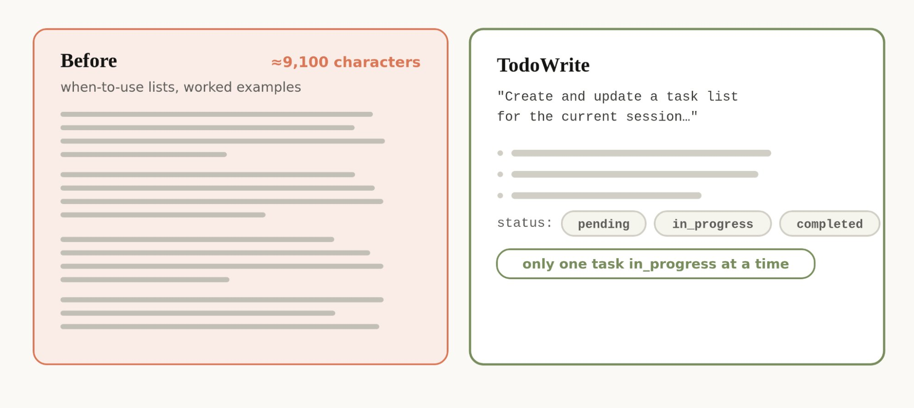
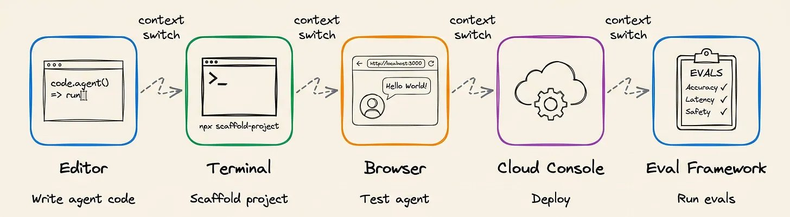
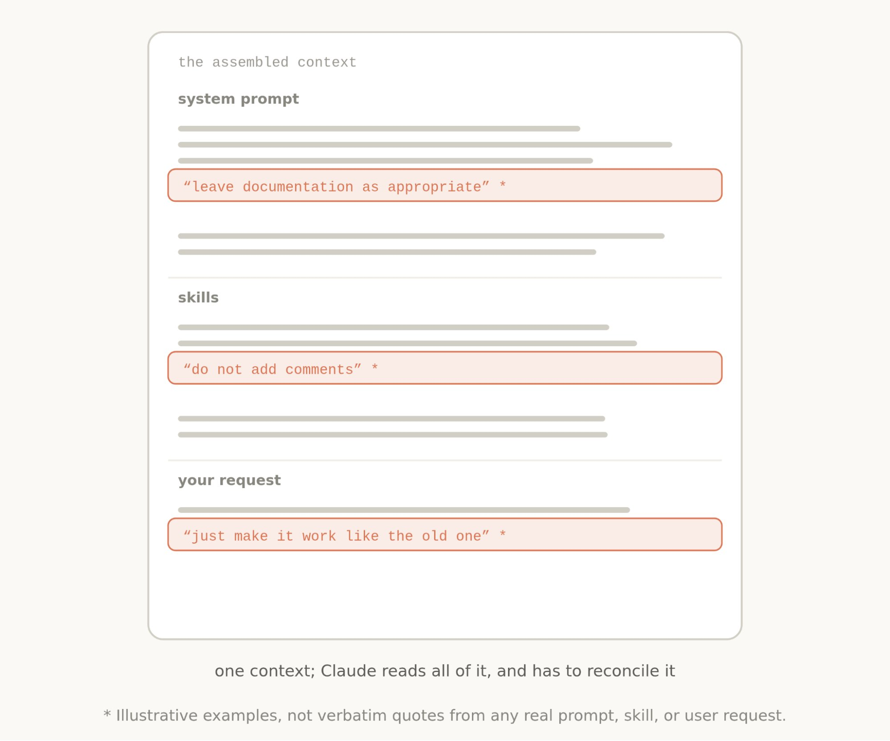
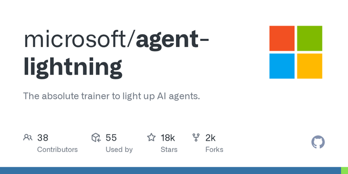
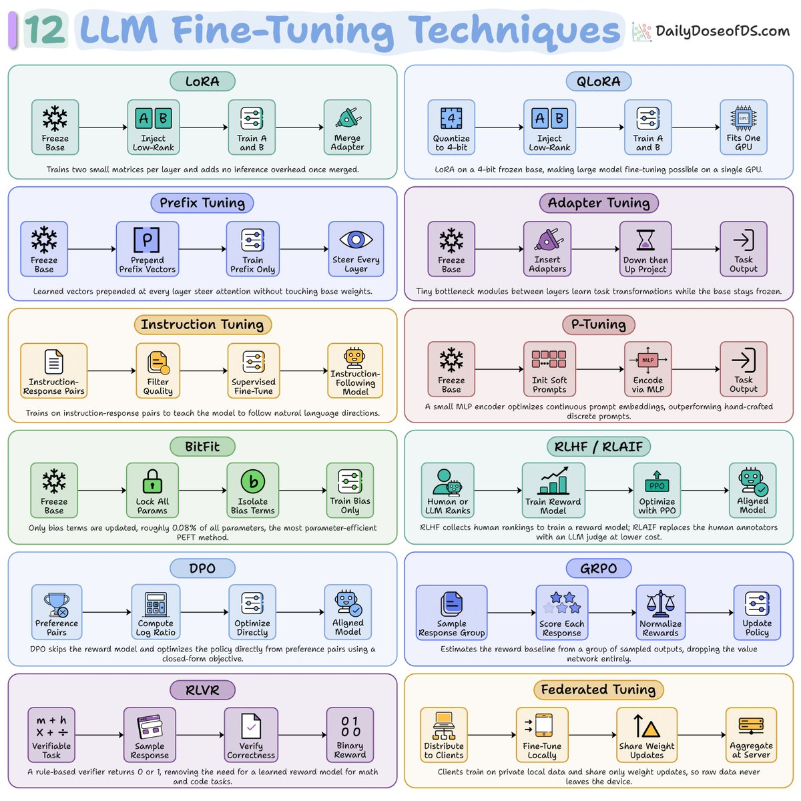

# Chapter 5 - Beyond Templates, What Comes Next

Templates solve today. This chapter is about what lasts: the three capabilities that make prompts work, the engineering habits - versioning, testing, evaluation - that turn prompting into a manageable asset, and the honest map of where this skill lands in 2026: context engineering, evaluation, and knowing when to stop prompting and fine-tune instead.

## 85. I've collected a hundred templates and still use AI badly. What am I missing?

The three-piece set: scenario decomposition, model boundary sense, and the iteration habit - templates are the output of these three, not their source.

Lay the logic out: generic templates produce "the safest average answer," and seventy percent of the content needs rework (Q8 ran that ledger). What actually makes prompts work are three things - the ability to decompose a scenario (turning a vague task into explicit input), boundary sense about what models can and cannot do, and the habit of iterating prompts in real use. One template sold to a hundred people is a hundred homogeneous inputs; your three-piece set is the only differentiating variable.

Self-diagnose by symptom:

| Symptom | What's missing | The fix |
|---|---|---|
| Given a task, I don't know what to put in the prompt | Decomposition | Q7's four-line drill, one task daily |
| I can't tell what AI should do versus me, one round or three | Boundary sense | Q12's three signals + a failure ledger |
| A template feels off once, so I hop to the next | Iteration habit | Q11's three-question review |

The essence of the set: decomposition sets input quality, boundary sense sets task allocation, the iteration habit sets evolution speed - all three grow on you, and none depreciates with a model upgrade. Every model bump forces a re-verification of your template library (Q35); the three-piece set only appreciates with use. That is the watershed between "collecting templates" and "mastering method" - and the answer to this book's running thread.

The three interlock: decomposition is the entrance (say it wrong, do it wrong), iteration is the engine (every use recalibrates), boundary sense is the guardrail (knowing where not to push). Training only one produces deformity: decomposition-only people produce beautiful plans and limp execution; iteration-only people diligently repeat their errors; boundary-only people become too timid to use AI at all. The three mesh or nothing turns. One blunt but sound investment thesis: templates depreciate with models; the three-piece set appreciates with them - the stronger models get, the more input-decomposition quality becomes the bottleneck, and the less replaceable your judgment of results becomes.

1) Paid a premium for prompt templates? Sorry, 90% are a novice tax Zhihu https://zhuanlan.zhihu.com/p/1987941344203789588

## 86. How do I actually train decomposition, boundary sense, and the iteration habit?

One daily drill per piece, all in minutes - you are training habit density, not knowledge volume.

| Piece | Daily drill | Dose |
|---|---|---|
| Decomposition | On receiving a task, write four lines first: goal/input/constraints/output | 1 task a day |
| Boundary sense | Log each failure in one line: "AI can't do this / does it badly; next time do X directly" | Log whenever it happens |
| Iteration habit | Three-question review at day's end: what I said / what it gave / where it fell short | 3 minutes daily |

Boundary sense has no shortcut - only the failure ledger accumulates it. Over the same stretch of time, everyone's failures look strikingly alike: submitting key numbers unchecked, chatting a session into amnesia, dumping a vague task on AI in one pass. A month of ledger entries, and your failures concentrate into two or three classes - those classes are exactly where your boundary lines go. The format does not matter (one line in your notes app is enough); what matters is the act of logging every failure - unlogged tuition is tuition wasted.

Decomposition and review link up at the advanced level: collect a week of Q11's fourth-question answers ("the one sentence I'll add tomorrow") and categorize once - the categories tell you directly which part your decomposition keeps dropping. The three train as one: decomposition decides how you speak, review decides how you speak better next time, boundary sense decides which things deserve speaking at all.

Progress markers for the set: one week - the four-line decomposition comes out without thinking. One month - the failure ledger has yielded your personal "two or three high-frequency failure classes"; draw the boundaries there. One quarter - the accumulated "extra sentences" flow back into your rules file and templates; the set's output starts feeding your toolchain. At that point, the gap between you and the template collectors shows up all at once on the next major model upgrade: their libraries fail wholesale, your method keeps running.

## 87. From "works" to "works well" - which three rounds must a prompt pass through?

Localize, field-test, targeted repair - skip a round and the prompt stays at "looks fine," never reaching "works well."

The rounds' division of labor and order cannot shuffle. Round one, localize, settles "whose prompt is this": role, audience, and real material all replaced; no abstract placeholder may survive. Round two, field-test, settles "where does it err": three to five runs on real tasks, logging errors only, never feelings - verbose, invented data, wrong format: one tally per class. Round three, targeted repair, settles "fix on evidence": whichever constraint gets violated repeatedly gets hard-coded; whichever output keeps gilding the lily gets a banned word. Skip round two and you repair imagined problems; skip round three and the testing was theater.

- [ ] Round one: not one abstract placeholder left in the template
- [ ] Round two: at least three real-use error logs accumulated
- [ ] Round three: every change maps to a logged error; re-run and compare after fixing

The completion signal: three consecutive tasks without you editing it. Short of that, you are still circling rounds two and three - and circling is no disgrace; most "works well" prompts were grown over two or three months. Conversely, a prompt still being edited after three months suggests the problem is not the template but a task too vague - go back to Q7 and decompose the task first.

This and Q83's adaptation method are a pair with clean division: Q83 handles "someone else's template" (outside-in blood replacement); this handles "your own prompt" (inside-out growth). Both roads converge on the same acceptance test: three consecutive unedited uses. Time budget as reference: round one, half an hour; round two is normal work; round three, twenty minutes. Most prompts finish naturally in two or three months - deliberate compression is unnecessary, because round two's samples must come from real tasks, and until the tasks arrive, the rounds cannot run.

## 88. Managing prompts like code - what four things exactly?

Versioning, testing, cache structure, storage location - OpenAI already made the call with a product decision: prompts belong in code.

At the end of November 2026, OpenAI shut down the "reusable prompt object" in the API and officially recommended managing prompts inside application code - typed inputs, code review, tests, deployment pipeline. Translate the judgment behind that decision: prompts are production assets, not chat history, and deserve code-grade treatment.

| What to manage | How code does it | Your lightweight version |
|---|---|---|
| Versioning | git, every change recorded | File archive, one version per change |
| Testing | Golden-set regression (Q89) | Ten baseline inputs, re-run |
| Structure | Static prefix up front to hit cache | Stable content first, variable material after |
| Review | PR review of every change | One line of "why changed" at each edit |

The cache ledger deserves its own entry: a stable prefix up front earns the prompt-cache discount - up to ninety percent off input cost and eighty-five percent off latency. Structure is not just habit; it is money. Match management intensity to impact: a weekly-report template is fine archived in your notes; prompts running business processes belong in a repo under version control. The test is one line: if this prompt breaks, who is affected, and how much.

The cache case expanded: your report template has a fixed three-hundred-character opening (role plus rules), and only the material tail changes - fixed segment as prefix, and on repeated same-day calls the second run onward pays cache price; material first instead, and every call is full-price fresh input. For an individual this optimization saves a coffee a month; for a team it is a real budget line - that is what "management intensity matched to impact" means in practice. Final word on storage: do not leave prompts scattered in chat history - chat history is the worst version-control system in the world: nothing recoverable, nothing comparable, nothing transferable.

## 89. How do I build a golden test set, and how many entries are enough?

There is no magic number - the principle is covering your input-type distribution: ten to start, edge samples at thirty percent minimum, full re-run on every prompt change.

Three build steps. Collect: pick inputs from real tasks - sixty-seventy percent typical, thirty percent hard and edge (long texts, empty data, mixed language - the types that actually bite you must hold seats). Annotate: three to five expected points per input, not full answers - points hit means passing. Use: on every prompt change, run the whole set and score by points hit; the average rising counts as improvement, and any "inspiration" that scores lower gets rolled back without sentiment.

- [ ] At least three of the ten inputs are edge or hostile
- [ ] Expected points: three to five, keyword granularity only
- [ ] Build the set during the prompt's "good days" - use golden-version outputs as reference
- [ ] New failure cases enter the set as they occur; after major model updates, run the set before working

The engineering world has ready tools (open-source prompt-testing frameworks, A/B release management); individuals do not need that weight - but the discipline "every change runs the regression" executes fine on a ten-item handmade set. The test set's essence: your smoke alarm, catching problems earlier than vibes do. Without it, every "optimization" you make is a new drug that skipped the blind trial.

How to grow past ten: failure cases take priority seats - every "it did WHAT" output becomes a new input; then new task types - work changes, the set changes. Fix the three maintenance moments: before changing a prompt (run the baseline first), after major model updates (verify, then work), at quarterly review (retire inputs that no longer represent). And the relation to Q57, once more: Q57 is the idea "replace feel with evaluation"; this question is its sustainable vehicle - the idea everyone can understand; the vehicle is what separates people.

## 90. A team-shared prompt library - how do I stop it rotting as everyone edits?

Three gates: traceable changes, evaluation as guard, periodic slimming - a rotten personal prompt costs you rework; a rotten team prompt costs the whole group rework.

Team libraries rot faster than personal ones, and the mechanism is clear: everyone adds rules for their own case, each defensible, stacking into mutual contradiction; Q39's stacking law accelerates at team scale - git archaeology past three authors and ten edits means already rotten (Q56). Install the three gates:

- [ ] Gate one · traceable changes: every edit must carry one line of reason plus the triggering case; unexplained edits get reverted
- [ ] Gate two · evaluation guard: library entries ship with a test set; changes that fail the score do not merge (Q89)
- [ ] Gate three · periodic slimming: quarterly, one cluster-compression pass per Q40; rules may only shrink, never grow

Add one human rule: the library needs a single owner. Everyone in charge means no one in charge - one company rolled out experience packaging, departments performed "deposit theater," and the skill pile swelled past a thousand, most of it existing so managers could see "we're using AI." A team library without an owner ends as that garbage mountain. The owner's job is not approving every change - it is holding the gates: periodic archaeology, running the slimming rounds, rejecting unexplained merges.

One admission standard to make the gatekeeper real: entries come with three things - the template itself, an applicability statement, and an initial test set; whatever arrives without a test set enters the "trial zone" and graduates only after two good weeks. Review cadence follows change frequency: quiet libraries quarterly, hot ones monthly, and the review checks exactly one thing - whether the gates were bypassed. It sounds heavy, but it all stands on two tables - the intake register and the change log, ten columns combined - two orders of magnitude cheaper than the post-incident retrospective meeting.

## 91. Letting AI optimize prompts itself - how reliable is that?

At the phrasing level, quite reliable; at the requirements level, not involved at all - the experiment in Q9 already produced the data: auto-generated prompts beat manual tuning almost across the board, but it always needs you to supply examples and a scoring standard first.

The industrialized version is frameworks like DSPy: give it samples and a quantified success metric, and the algorithm searches for the optimal prompt - results in hours, replacing days of human trial and error. Even the "so weird no human would think of it" Star Trek prompt was its work (Q9). The boundary is crisp: it optimizes "how to phrase this"; you own "what counts as success" - the business judgment inside the scoring function and the real inputs inside the examples are beyond the machine's reach.

Two lightweight plays within everyone's reach:

- [ ] Self-check (Q64): paste the prompt and its output back in, have it find faults item by item and rewrite
- [ ] Adversarial: open another session, have it play a hostile user attacking the output, and feed the findings back into the prompt

So the accurate answer to "will AI replace prompt writers": it replaces the "phrasing" trade; it cannot replace the "setting standards" duty - the clearer your standards, the more you gain from automatic optimization.

One concrete example per play: self-check follow-up - "you said point 2 was vague; which specific word creates the ambiguity?" (forcing an actionable fix, not a generic "clearer"); adversarial opener - "you are a veteran of twenty years with this workflow; find everything in this output you would send back." As for the engineering version (automatic search frameworks), the entry barrier is writing the scoring function - the moment you can translate "what good means" into code, automatic optimization truly works for you.

## 92. Autofocus didn't kill photographers. What about prompting?

The analogy gives a direction, not a guarantee - it is one engineer's comment, one opinion, and its preconditions are yours to watch.

The original comes from the comment section of the IEEE story, written by an engineer: **"It's easy to optimize something when you know what you're optimizing and what the end state is; the bigger challenge of prompt engineering is knowing what questions to ask, what matters, what the right end state looks like - math problems are easy, the real world is hard. Autofocus came along, and photographers didn't lose their jobs."**

The analogy's precondition deserves stating: photographers survived because people pay for "framing and timing" - the abilities above focus found buyers. Likewise, automatic tools taking over the "phrasing" layer (Q91) protects no one who only phrases; it protects those with a clear payer for what sits above focus: sharper requirement definitions, more reliable evaluation, deeper business judgment. This is a judgment, not a promise - if the precondition fails (your work is all "focusing"), the analogy cannot protect you. Use it as a mirror for your work's composition, not as a talisman.

Three mirror questions, monthly:

- [ ] What share of my work is "focus-type" (clearly right or wrong, automatable) - above seventy percent, beware
- [ ] Do I have showcase cases of "framing-type" work (judging what is worth doing)? If none, build them
- [ ] Which layer is my buyer actually paying for? That answer is the layer to go deep on

The answers shift with career stage - which is exactly why the mirror needs regular cleaning: a talisman works for life after one glance; a mirror only works if you keep looking.

## 93. Is context engineering where prompt engineering ends?

Directionally yes, but pace yourself - "PE is being replaced by CE" is the 2026 mainstream narrative, yet for users, CE is just a handful of concrete habits.

The technical narrative is crisp: the replacement argument puts context engineering at the core - everything the model sees is context, and the prompt is only the small handwritten slice. Anthropic engineers published a set of Claude-5-era context practices in mid-2026 pointing the same way: the rules of context management are being rewritten for the new model generation, and the first recommendation is "simplify" - the fuller the window, the faster the decay (Q41). The Chinese community has a popular echo: the engineering evolution chain told as a four-layer onion - prompts → context → harness → loop, each wrapping outward (Q5).



Figure 5-1: Context rules of the Claude 4 era versus the Claude 5 era - old rules "keep and reuse," new rules take only what is needed (Source: https://x.com/trq212/status/2080710971228918066, snapshot 2026-08-24)

The user-level translation (no new engineering degree required):

- [ ] Design "what to feed" as part of the prompt (Q44's retrieve-then-reason)
- [ ] Manage session lifecycles (Q43's fresh-window habit)
- [ ] Standing rules into the system slot, session material into the conversation (Q42)

Do these three and you are already doing user-level context engineering - whether or not the name changes, the work is the same.

Why "simplify" ranks as rule one deserves a second thought: intuition says more context is safer; measurement says fuller is duller (Q41) - so the new rule is counterintuitive but hard-core: give only what is needed, give the most relevant, and clear the field every few rounds. And map the three habits to the jargon: feeding = information-source design; fresh windows = lifecycle management; rules in the system slot = resident context - you have been speaking this dialect all along, just without its vocabulary.

## 94. Prompt engineering versus context engineering - which three things differ?

Scope, dynamism, and information sources - the relationship of a subset to a system.

The three distinctions in plain words. Scope: prompt engineering governs the input you hand-write; context engineering governs everything in the window - prompts, retrieved documents, tool returns, memory, history; one manages a part, the other the whole machine. Dynamism: a prompt is static, written once and reused; context is dynamic, assembled in real time as execution unfolds - what this round searches changes what next round's context contains. Information sources: prompt engineering's raw material is your own instructions and examples; context engineering orchestrates ten-plus sources - retrieval snippets, search results, tool descriptions, call histories, long- and short-term memory, program traces, error messages, human feedback - a deployment of forces.

One sentence anchors the relationship: prompt engineering is a subset of context engineering. The industry's extreme slogan says exactly this:

> Everything is Context Engineering! For you the point is not a career change but a dimension shift: you thought you were writing prompts, but you were assembling a small block of the window - the ceiling is set by your understanding of the whole window. Note the dividing line too: single-turn, fully yours, a few fixed inputs - prompt engineering suffices; multi-turn, with tools, information streaming in - that is context engineering's problem.



Figure 5-2: The full agent loop - prompt engineering is just one input feeding the loop, with tools and context riding in the same cabin (Source: https://x.com/akshay_pachaar/status/2070860837448040832, snapshot 2026-08-24)

Why ordinary users should still learn the distinction language: it is the lingua franca for talking to tools and developers - reporting "the context is contaminated" beats "the AI got dumb" tenfold in effectiveness, and asking a product "how do you manage memory" exposes quality gaps instantly. Everyday discrimination: asking AI to summarize a document (single-turn, all yours) is a prompt problem; having AI revise a proposal across three rounds with mid-flight searches (multi-turn, dynamic) is a context problem. Confuse the two and you will treat context diseases with prompt medicine, and nothing will ever tune right.

## 95. The context I control is only a small slice of the model's window?

In tool-using, web-connected scenarios, yes - the split is called deterministic versus probabilistic context.

The dividing standard is who controls the content. Instructions, rules, and documents you write in directly are deterministic context - precisely controllable; what you write is what enters. Once the model starts browsing and calling tools, the incoming search results and tool returns are probabilistic context - you can influence them only indirectly and cannot control what it actually sees. The latter often dominates the window: in deep-research tasks, the controllable part is a rounding error.



Figure 5-3: The new context-management rules of the Claude 5 era (Source: https://x.com/trq212/status/2080710971228918066, snapshot 2026-08-24)

More counterintuitive is a Google paper's finding: with sufficient context the model may still hallucinate; with insufficient context it sometimes answers right. Translated, the gist: **there is no switch relationship between "sufficient context" and "correct output"** - context management is a probability game; piling on material guarantees nothing, and lacking it does not doom you.

Three things you can do:

- [ ] On high-stakes tasks, turn off unneeded tools and web access - shrink the probabilistic share
- [ ] For key tool-returned content, have the model restate it for confirmation before use (restated information shows its errors)
- [ ] Treat "found it and used it" conclusions one trust level down, per the Q46 checklist

"Restate to confirm," expanded: after the model researches, do not ask for the conclusion yet - have it say "I am answering based on the following three pieces of information" and list them. The listed items are spot-checkable, and a bad source exposes itself on the spot; skip this step and wrong information walks invisibly into the conclusion. The dichotomy has an everyday use too: a writing assistant (fully yours, mostly deterministic) can be fed long background safely; a web-research assistant (probabilistically dominated) produces output that is, by nature, second-hand material. Tools have no rank - trust comes in two tiers: deterministic gets fed freely; probabilistic gets reviewed like second-hand sources.

## 96. Why is evaluation the new prompting?

Because whether a prompt improved is decided only by evaluation - the eval set is the prompt's specification sheet.

The argument chain in one pass: prompt "quality" has no objective definition, only the definition "on which inputs, producing what outputs" - so evaluation is specification. Without evaluation, every change is blind, and what you are judging is "do I like it" (Q57). With evaluation, prompt optimization moves from craft to engineering: change, run, compare, decide - a number at every step.

The official push points the same way: Anthropic's prompting guide puts "define success criteria and build evaluations" before all techniques - without those two, you cannot even attribute the problem to the prompt (why Q35's first check is the model version - same logic). The user-level evaluation mindset in one line: **stop asking "is AI capable"; ask "is it capable on my ten tasks."** To write a task spec, use this three-line card:

```
Task: [one sentence]
Pass criteria: [2-3 verifiable points]
If it fails: [retry / switch model / human fallback]
```

Evaluation has a hidden identity too: the contract between you and AI - a contract stating inputs and expected points gives delivery disputes an arbitration standard; collaboration without a contract renegotiates everything, every time.

## 97. Agents go haywire after a dozen rounds - is that related to the person who wrote the prompt?

Yes - the chaos mostly stems from improper context assembly, which is exactly the core problem of that discipline from the last question.

Frontline engineers' numbers are hard: a tool-calling loop run for ten to twenty consecutive rounds generally enters an unrecoverable confused state; even tuned to ninety-percent correctness, it falls far short of deliverable - one user in ten hitting a breakdown is unacceptable to anyone. The leading cause is not a weak model but wrong context delivered to it: missing information or messy format. Engineers who build agents have shifted their center of gravity accordingly - memory systems and context assembly have become their core engineering.

Quantified failure attribution sharpens the ledger: context-length management done right cuts failure rates by forty-five percent; spec quality written clearly cuts another quarter - the two heaviest factors are both outside the model.



Figure 5-4: Quantified attribution of multi-agent system failure rates - context length and spec quality are the two heaviest factors (Source: https://x.com/akshay_pachaar/status/2017216707228848390, snapshot 2026-08-24)

This explains two everyday phenomena: your long-conversation failures (Q41) are its miniature - same window, same decay, same accumulating chaos; and it explains why the prompt worker's next station is systems engineering - assembling the right information into the window in the right format at the right time.

The takeaway for ordinary users: for loop-type tasks (chaining a dozen-plus steps through AI), never expect one prompt to carry the whole run. Segment, save intermediate conclusions, continue in a fresh window - these manual actions are the bare-hand version of context engineering. Each model generation adds a few more sustainable rounds, but "segment plus sediment" never goes out of date.

The bare-hand rhythm: force a stop every five to eight consecutive rounds and save a progress snapshot:

```
[Progress snapshot]
Completed: [conclusions, bullet points]
Decided: [items no longer open for discussion]
To verify: [what the next round must confirm]
Current task: [what happens next]
```

On resume, snapshot first, task after (Q80's ordering). Three signals that it is time to split: the AI starts repeating earlier attempts, circles without advancing, or cites long-rejected approaches - any one appears, do not force the continuation; split. Tedious? Yes. But versus everything crashing together at round fifteen, five minutes of segmentation is the insurance premium.

## 98. What is a prompt engineer actually doing in 2026?

A "prompt-plus" composite job: running evaluations, writing tool descriptions, building context pipelines - the title is disappearing while the task list lengthens.

The new task list looks like this: designing structured-output schemas, writing tool descriptions (the API documentation written for models to read), building evaluation loops, assembling context pipelines - four of the five items have nothing to do with "a single prompt." The hiring-side data matches: pure "can write prompts" roles evaporated; the surviving high-paying posts concentrate seventy percent in verticals like healthcare, government, and finance, demanding "one to three years of domain experience plus programming basics"; the job-market vocabulary has moved to LLMOps and AI agent engineer - the natural extension of the ops lineage (DevOps → MLOps → LLMOps). Tooling points the same direction: from patterned open-source harness practices to a full toolchain for prompt work - the trade is being tooled, not killed.

Climbing from where you stand:

| Where you are now | Next step |
|---|---|
| Can write a single prompt | Manage a portfolio of prompts (Q88) |
| Manage a portfolio | Manage evaluation and pipelines (Q89, Q96) |
| Manage evaluation and pipelines | Add domain depth or engineering capability (Q99) |

Picture this role's ordinary 2026 day: morning, run the eval set comparing two system prompts; afternoon, write three tools' description documents (for the model to read); evening, align with the business side on "what counts as a successful reply." Not one incantation-style prompt all day - all specs, evals, and alignment. The picture's use is calibration: those heading toward evaluation, specification, and domain depth are in demand; those heading toward spell-collecting are out.

## 99. After mastering prompting, which skill should I add next?

Go deep on "managing an agent's context," or go broad on "defining what to build" - the skills map's four pillars leave prompting as the internal strength inside one corner.

That engineering skills map - built from over ten thousand job postings and dozens of structured interviews - lists four skills: building and deploying AI applications, software engineering fundamentals, using coding agents, and shaping what gets built. Prompting is not listed separately - it dissolves into "managing an agent's context" and "writing clear specs." The map's most chew-worthy judgment is the last pillar: given clear specifications, coding agents increasingly deliver directly - so engineers' work is shifting to "deciding what belongs in the spec," meaning product sense and business judgment.

Your takeaways by direction. Technical: embed prompts into pipelines - tool descriptions, evaluation loops, context management; that is the skill face of Q98's path. Business: practice "writing specs" - deciding what to do, what not to do, and what done looks like - and the underlying ability for defining specs is precisely the decomposition you have drilled since Q7. One glimpse further out: knowledge-structure skills (methods for organizing information, knowledge-graph style) wait on the map's upper layer - no need to learn now; knowing the direction exists is enough.

| Direction | What to add | How to verify you have it |
|---|---|---|
| Technical | Tool descriptions, evaluation loops, context management | You can build a prompt → eval → improve pipeline |
| Business | Writing specs: what to do / not do / acceptance line | A one-page spec anyone can execute as-is |

For choosing, return to Q12's three signals: people with high error costs and heavy team positions add both; personal-use players who can write specs good enough for themselves already outperform eighty percent of peers.

1) The AI Engineering Skills Map Andrew Ng https://x.com/AndrewYNg/status/2088302050706686198

## 100. When should I give up on prompting and fine-tune?

When prompts and examples are exhausted and the volume justifies the investment - fine-tuning solves "can't teach" and "can't afford to teach," not "didn't tune well."

The upgrade path's order cannot shuffle: zero-shot → few-shot (Q19) → structured template (Q26) → retrieval for knowledge (Q44) → fine-tuning. Each step solves what the previous one could not; skipping ahead means paying fine-tuning prices for prompt-level diseases. The three signals for fine-tuning:

| Signal | Meaning |
|---|---|
| Can't teach | Same-class errors persist despite repeated examples - style, format, domain conventions never land |
| Can't afford to teach | The prompt has grown to hundreds of pasted lines per call; token costs runaway |
| Volume is there | The same task class repeats at high frequency, amortizing the one-time cost |



Figure 5-5: The full landscape of two years of fine-tuning practice - most tasks never need to leave the prompt layer (Source: https://x.com/_avichawla/status/2090732012005200135, snapshot 2026-08-24)

Wanting to fine-tune with the three signals unmet is, nine times out of ten, an unfinished prompt - go back to Q87 and complete the three rounds, then to Q89 to build a test set and quantify "how far off it really is." Fine-tuning has its own boundaries too: it shifts behavioral tendencies, fills no knowledge gaps (that is retrieval's job) and substitutes for no task decomposition (that is yours).

The book closes here: from Q1's "should I learn" to this question's "when to stop," the answer was the same all along - **only those who know the boundaries can claim mastery.** You felt the prompt's boundaries in Chapters 2 and 3; Chapters 4 and 5 pocketed the methods. One final alignment before closing: after these five chapters you hold three layers - ready-to-use templates and checklists (Chapters 2 and 4), the mechanisms of judgment and debugging (Chapter 3), and the methodology above (this chapter). Templates solve today; mechanisms solve this month; methodology solves every model generation to come.

The rest - go fail in your real tasks. Every fall you take is raw material for Q11's review template.
